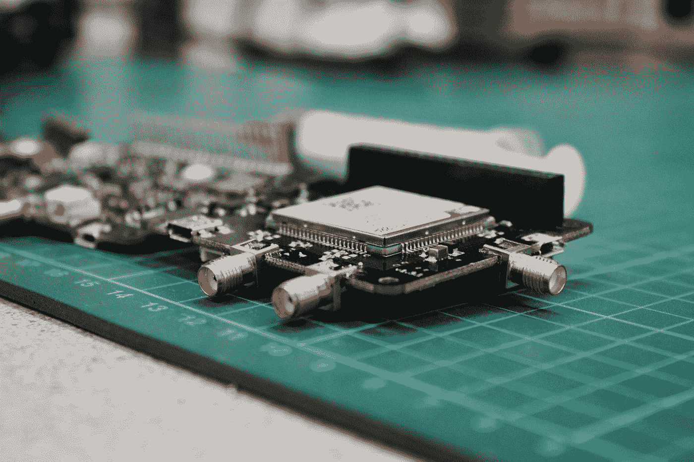

# 我们能用 JavaScript 构建什么？

> 原文：<https://levelup.gitconnected.com/what-can-we-build-with-javascript-d8cb53c60871>

照片由 [Josue Isai Ramos Figueroa](https://unsplash.com/@jramos10?utm_source=medium&utm_medium=referral) 在 [Unsplash](https://unsplash.com?utm_source=medium&utm_medium=referral) 上拍摄

从最初作为一种简单的语言来编写浏览器端脚本开始，JavaScript 已经从语言的第一个版本发展了很多。现在我们可以用 JavaScript 做很多以前做不到的事情。这里有一些我们今天可以用 JavaScript 构建的东西。

# 客户端应用程序

JavaScript 仍然是浏览器端 web 应用的唯一语言。像 React、Angular 和 Vue 这样的应用框架的激增让事情变得无比简单。同样有了 ES6+，用 JavaScript 构建客户端应用比以前愉快多了。像 TypeScript 这样的任何其他语言都必须转换成普通的 JavaScript 才能在浏览器中运行。所有现代浏览器只支持 JavaScript，所以它是客户端应用程序的唯一语言。

# 服务器端 Web 应用

有了 Node.js，JavaScript 已经到达了服务器端。我们可以用 Node.js 做很多事情，比如构建一个后端应用程序。有各种后端框架，如 Express、Nest.js 和许多其他框架，让我们可以轻松地编写后端应用程序。它非常受欢迎，以至于像亚马逊 Web 服务这样的流行主机都为 Node.js 提供了 SDK，所以我们可以毫不费力地与他们的服务集成。用它构建后端应用程序也非常快速简单。

有用于与最流行的数据库系统如 MySQL 和 Postgres 交互的库，所以我们可以很容易地将其用于后端应用程序。如果我们需要 NoSQL，那么 MongoDB 也可以与 Mongoose 等库紧密集成，这让我们可以与 MongoDB 进行交互，并提供一个模式来保存动态数据。

# 报告

有了 Reveal.js 和 Eagle.js，我们可以轻松地用它来构建 HTML、CSS 和 JavaScript 的演示。它提供了和 PowerPoint 一样多的灵活性，但是它们没有成本。这很棒，因为在这些库存在之前，用代码构建演示文稿并不容易。

# 剧本

Node.js 再次为运行脚本提供了一个很好的运行时环境。使用`fs`模块，我们可以进行许多常见的文件和文件夹操作，如添加、更改、重命名和删除文件。此外，更改权限也很容易。它还有一个`child_process`模块，可以在脚本运行的任何计算机上运行进程。

此外，Node.js 知道 Windows 和类似 Unix 的系统(如 Linux 和 Mac OS)之间的差异，因此在任何计算机上运行脚本时，兼容性问题都是最小的。

# 比赛

使用 HTML5，向网页添加交互性比以往任何时候都更容易。这与 JavaScript 的强大功能相结合，使得一切都是动态的。Canvas API 有很多方法来绘制我们想要的任何东西，并使它们具有动画效果。

还有像 Phaser 这样的游戏框架，它通过将事物抽象到一个框架中，抽象出一些更乏味的部分，如处理输入和形状的动画。

# 移动应用

有两种方法可以用 JavaScript 构建移动应用。一个是用 React Native 这样的框架写一个原生 app，一个是用 Ionic 这样的框架写一个混合。

React Native 允许我们用 JavaScript 编写应用程序代码，然后通过将 JavaScript React 组件转换为目标平台的本地组件，将其编译为本地移动应用程序。由于框架将代码构建到本地应用中，访问硬件更容易以本地方式进行。例如，它为相机和加速度计提供内置支持。

像 Ionic 这样的混合应用程序框架让我们用 HTML、CSS 和 JavaScript 编写应用程序，然后在移动设备上的浏览器 web 视图中显示代码。访问硬件需要本地插件，这使得开发和测试更加困难。原生插件也是有限的或有缺陷的，如果我们试图构建需要用它访问硬件的应用程序，这是另一个问题。

它们都是跨平台的框架，允许我们编写一次代码，然后为不同的平台构建代码。

在 [Unsplash](https://unsplash.com?utm_source=medium&utm_medium=referral) 上由[路易斯·里德](https://unsplash.com/@_louisreed?utm_source=medium&utm_medium=referral)拍摄的照片

# 物联网计划

我们可以使用 JavaScript 来构建程序，通过像 Johnny-Five 框架这样的框架来控制嵌入式硬件。它支持 Arduino 单板机，我们通常用它加载 C 程序。

有了 Johnny-Five，我们可以使用 JavaScript 编写程序，这使得编写有用的程序变得更加容易。它支持完整的硬件访问，如 led、计时器、GPS、电机、按钮和开关、指南针等。当然，这也要感谢 Node.js 的存在，因为它允许我们在浏览器之外运行 JavaScript 程序。

# 桌面应用

有了 Electron，我们可以轻松地用 JavaScript 编写桌面应用。我们可以通过这些框架的电子库将 React、Angular 或 Vue 应用转换为 Windows、Linux 或 Mac OS 应用。

我们也可以只用电子框架编写应用程序。它可以访问像我们计算机的文件系统这样的东西，所以它可以做普通桌面程序做的事情。然而，缺乏对专用硬件的访问，因此它更多地用于一般的商业应用程序。许多程序都是用 Electron 构建的，最大的例子是 Slack、Visual Studio 代码和 Atom 文本编辑器。

我们可以用 JavaScript 做很多事情。多亏了 Node.js，JavaScript 可以离开浏览器，让我们为物联网设备、后端应用、桌面应用等构建应用。在浏览器方面，我们可以用它来构建像游戏和丰富的商业应用这样的交互式应用。我们也可以用它做很棒的演示。