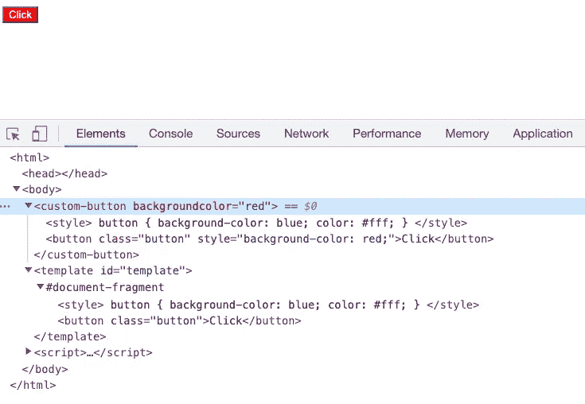
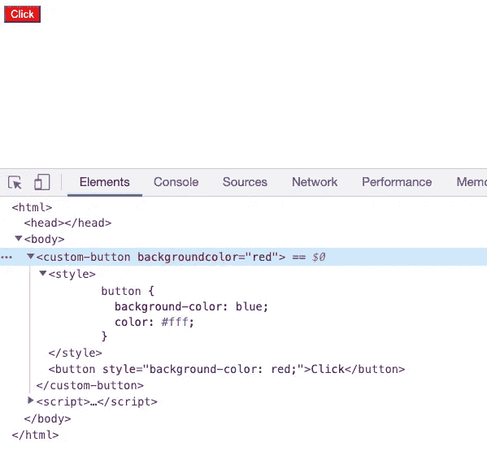
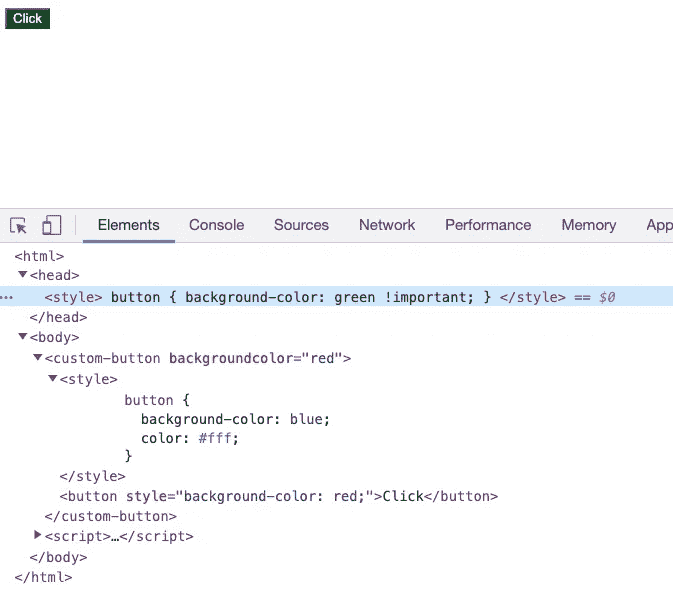
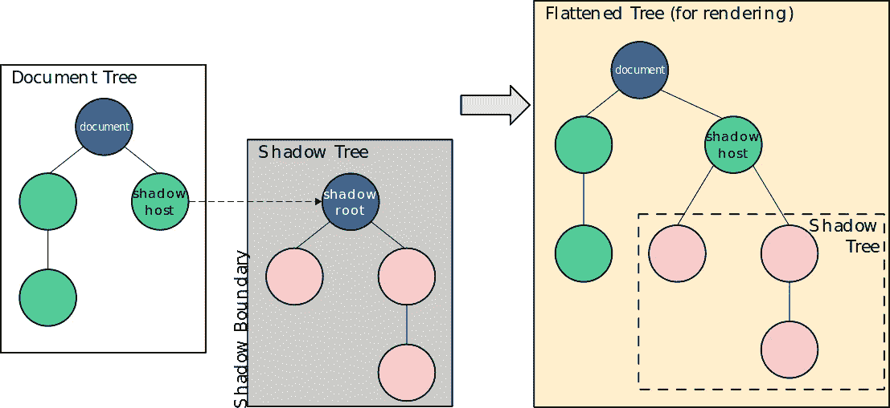

# 我们能用 Web 组件做什么

> 原文：<https://levelup.gitconnected.com/what-can-we-do-with-web-components-997ed097aa4b>

## 不需要框架的本地 web 组件的优势是什么


照片由[路易斯·里德](https://unsplash.com/@_louisreed?utm_source=medium&utm_medium=referral)在 [Unsplash](https://unsplash.com?utm_source=medium&utm_medium=referral) 上拍摄

近年来，Web 开发的趋势是组件化。web 前端架构最大的挑战是如何复用更多的组件。目前流行的 JavaScript 框架如 React、Vue、Angular 大多使用 [DSL(特定领域语言)](https://en.wikipedia.org/wiki/Domain-specific_language)编写组件，并转换成框架内部的原生 HTML 元素。谷歌一直在推进新技术，即浏览器的原生网络组件。与这些框架相比，本机组件更简单，不需要额外的运行时，并且需要的代码更少。它仍在开发中，但可以在大多数浏览器中运行。

本文将带您创建一个简单的 web 组件，并解释它的优点。让我们把手弄脏:

让我们制作一个简单的自定义`button`组件，只需将其插入 HTML:

```
<custom-button></custom-button>
```

正如您所看到的，这个定制 HTML 标记被称为定制元素。根据规范，自定义元素的名称必须包含一个连字符，以区别于本机 HTML 元素。因此，`<custom-button>`不能写成`<customButton>`。

所以我们来看看怎么定义。我们需要使用`[window.customElements.define()](https://developer.mozilla.org/en-US/docs/Web/API/CustomElementRegistry/define)` API。像下面这样:

```
window.customElements.define('custom-button', CustomButton);
```

这样做的效果是定义了一个`custom-button`，当我们在 HTML 中使用它时，浏览器会使用我们写的`CustomButton`:

```
class CustomButton extends HTMLElement {
  constructor() {
    super();
  }
}
```

我们只需要从`[HTMLElement](https://developer.mozilla.org/en-US/docs/Web/API/HTMLElement)`扩展过来，也赋予了它很多 HTML 元素的属性。

接下来，让我们给它添加内容，完整的代码如下:

但是如果有很多内部元素，我们都需要用 JavaScript 来创建，那就麻烦了，容易出错。所以 Web 组件 API 提供了`<template>`标签，我们可以在这里定义 DOM:

```
<body>
  <custom-button></custom-button>
  <template id="template">
    <button class="button">Click</button>
  </template>
</body><script>
  class CustomButton extends HTMLElement {
    constructor() {
      super(); const templateElem = document.getElementById('template');
      const content = templateElem.content.cloneNode(true);
      this.appendChild(content);
    }
  } window.customElements.define('custom-button', CustomButton);
</script>
```

通过`document.getElementById`得到`template`元素后，我们称之为`cloneNode`。这是因为该模板可能被多个实例使用，因此需要克隆。

接下来，我们来添加样式。我们可以直接在`template`元素中编写样式，这样就不会影响外部样式:

```
<template id="template">
  <style>
    button {
      background-color: blue;
      color: #fff;
    }
  </style>
  <button>Click</button>
</template>
```

那么作为一个自定义组件，另外很重要的一点就是可以传递不同的参数来改变不同的状态。您可以像这样传递参数:

我们可以通过类中的`this.getAttribute(key)`得到`key`的属性值。让我们来看看 DOM 结构:



HTML 中的`template`是*【丑】*，我们用 JavaScript 中的模板字符串来代替它吧:

这里我们使用`str2DOM`将模板字符串转换成 DOM 元素，当然你也可以直接使用`this.innerHTML = template`。这里我总结了 4 种实现`str2DOM`的方法:

最后，最重要的一步是封装。查看我们当前的 DOM 结构:



如果我们将`style`标签添加到最外层，您可以看到我们编写的组件与普通的 DOM 没有什么不同:



你可以看到它起作用了。所以我们需要一种机制来封装 web 组件— `[Shadow DOM](https://developer.mozilla.org/en-US/docs/Web/Web_Components/Using_shadow_DOM)`:它允许我们编写与其他代码隔离的 web 组件，这样就不会有冲突。



图片来自 [MDN](https://developer.mozilla.org/en-US/docs/Web/Web_Components/Using_shadow_DOM)

同样如图所示，从一个阴影根开始，你可以在它下面附加任何元素。最后，将影子主机添加到 DOM 树。值得一提的是，浏览器中的`video`元素可以看作是一个影子 DOM，虽然你在 DOM 中看到的只是`video`元素，但它包含了一系列按钮和其他控件。

它的 API 是:`[Element.attachShadow()](https://developer.mozilla.org/en-US/docs/Web/API/Element/attachShadow)`，我们来补充一下:

```
this.attachShadow({ mode: 'open' });this.shadowRoot.appendChild(str2DOM(template));
this.shadowRoot.querySelector('button').style.backgroundColor =
this.getAttribute('backgroundColor');
```

当`mode: 'open'`时，我们可以访问实例上的`shadowRoot`。而当`mode: 'closed'`时，我们无法访问实例上的`shadowRoot`:

```
this.attachShadow({ mode: 'closed' });
// null
console.log(this.shadowRoot);
```

这意味着如果访问最外层 JavaScript 中的实例，`open`的`mode`可以得到`shadowRoot`，而`closed`的`mode`不能得到`shadowRoot`。用`shadowRoot`我们可以修改它的内部:

虽然当`mode`为`closed`时我们无法获取默认的`shadowRoot`，但是实例上的公共属性是可访问的，也就是说如果你做了:`this._shadowRoot = this .attachShadow({ mode: 'closed' });`，那么外部也可以通过`this._shadowRoot`访问。

除此之外，如果页面提前注入脚本，改变原来的方法:

```
Element.prototype._attachShadow = Element.prototype.attachShadow;
Element.prototype.attachShadow = function () {
    return this._attachShadow( { mode: "open" } );
};
```

然后就一直“开着”。所以还是很容易破解，完全隐藏它们的努力通常是不值得的。

到此为止，整个组件是完整的，它有很多高级用法，比如[生命周期](https://developer.mozilla.org/en-US/docs/Web/Web_Components/Using_custom_elements#using_the_lifecycle_callbacks)、[槽](https://developer.mozilla.org/en-US/docs/Web/Web_Components/Using_templates_and_slots)、`[:host](https://developer.mozilla.org/en-US/docs/Web/CSS/:host)` [CSS 伪类](https://developer.mozilla.org/en-US/docs/Web/CSS/:host)等。查看 [MDN](https://developer.mozilla.org/en-US/docs/Web/Web_Components) 来更详细地了解 API。

# 结论

与 DOM 的直接操作相比，web 组件具有一定的抽象性，并且具有允许我们封装灵活组件的基本能力。但是支持三方扩展库的很少，所以不能广泛使用。但是如果您正在编写轻量级的 web 应用程序，那么 web 组件是一个不错的选择。例如，它在 [Vite](https://github.com/vitejs/vite) 中用于为客户端错误生成`[ErrorOverlay](https://github.com/vitejs/vite/blob/main/packages/vite/src/client/overlay.ts)`。

Vue.js 的语法参考了一些 web 组件规范，所以如果你是 Vue 开发者，可能会比较容易上手。

最后是浏览器兼容性:

 [## “Web 组件”|我可以使用吗...HTML5、CSS3 等的支持表

### 建立和维护 DOM 树之间的功能边界的方法以及这些树如何相互作用…

caniuse.com](https://caniuse.com/?search=Web%20Components) 

可以看到很多浏览器已经开始支持了。期待它变好。

*感谢阅读。如果你喜欢这样的故事，想支持我，请考虑成为* [*中等会员*](https://medium.com/@islizeqiang/membership) *。每月 5 美元，你可以无限制地访问媒体内容。如果你通过* [*我的链接*](https://medium.com/@islizeqiang/membership) *报名，我会得到一点佣金。*

你的支持对我来说非常重要——谢谢。

# 分级编码

感谢您成为我们社区的一员！在你离开之前:

*   👏为故事鼓掌，跟着作者走👉
*   📰查看[升级编码出版物](https://levelup.gitconnected.com/?utm_source=pub&utm_medium=post)中的更多内容
*   🔔关注我们:[Twitter](https://twitter.com/gitconnected)|[LinkedIn](https://www.linkedin.com/company/gitconnected)|[时事通讯](https://newsletter.levelup.dev)

🚀👉 [**加入升级人才集体，找到一份惊艳的工作**](https://jobs.levelup.dev/talent/welcome?referral=true)