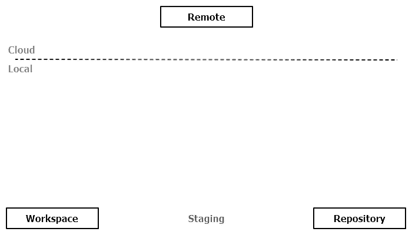
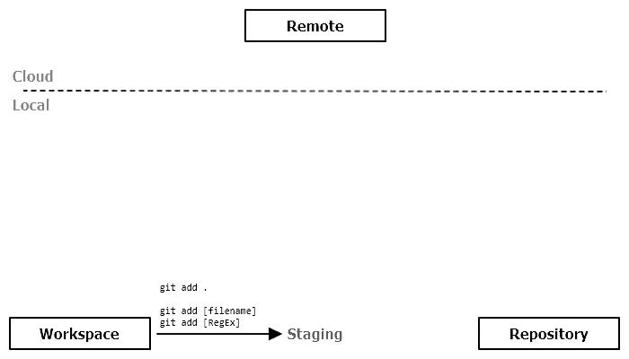
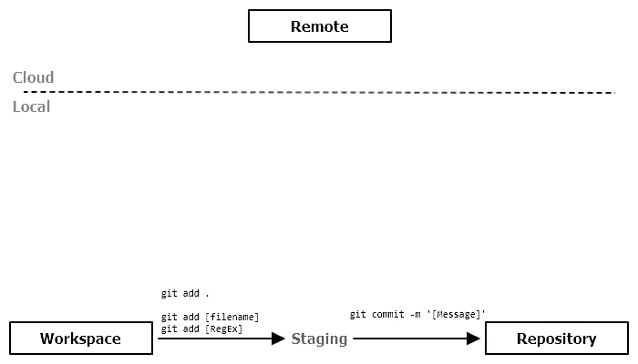
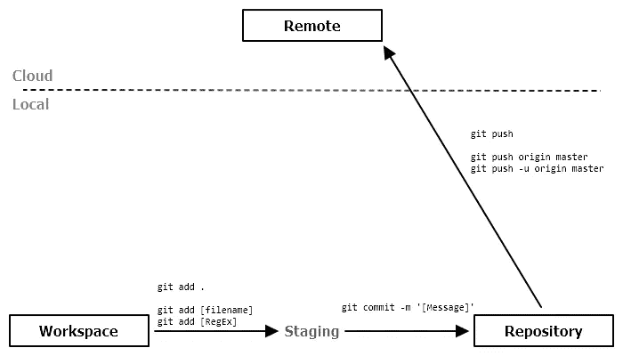
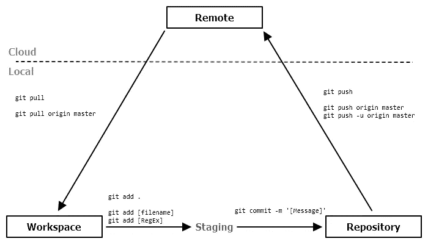
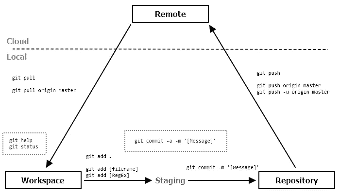

# 关于 Git，大学生应该学些什么

> 原文：<https://levelup.gitconnected.com/what-college-students-should-learn-about-git-6bbf6eaac39c>

现在就开始使用 git，这样有一天你会成为 git 魔术师。


由[米米蒂安](https://unsplash.com/@mimithian?utm_source=medium&utm_medium=referral)上[的 Unsplash](https://unsplash.com?utm_source=medium&utm_medium=referral)

[Git](https://git-scm.com/downloads) 是宇宙中最流行的[源代码控制](https://en.wikipedia.org/wiki/Version_control)工具之一(？).它允许通过一些简单的命令进行大规模协作。下面这篇文章将分享最基本的 git 命令: **add** ， **commit** ， **push** ，和 **pull** ，开始成为 git 专家的旅程。

一旦你对下面的命令驾轻就熟，我强烈建议你深入研究。我们开始吧！

# 工作区、[暂存]、存储库和远程



Git 把变化组织成三个(四个？)不同的 *** 地点；工作区、本地存储库和远程存储库。理解这些 *** 位置对于理解 git 命令是必要的。

*** ***地点*** *不是技术术语。我不知道该用什么词来归类。*

## 工作空间

工作区是与本地存储库相关联的本地文件夹和文件。Git 将自动识别您在这里所做的更改。

## [本地]存储库

使用 git 命令将工作区更改保存到本地存储库中。重要的是要注意，改变工作区中的文件夹和文件不会改变本地存储库的任何内容。只有 git 命令会改变本地存储库。

## 远程[存储库]

这是位于云中的存储库。尽管它是本地存储库的副本，但也与本地存储库分开。在执行正确的 git 命令之前，本地存储库的更改不会显示在远程存储库中。

同样，更改工作区不会更改本地或远程存储库。Git 命令将协调这些变化。

## [暂存]

暂存就像工作区和存储库之间的大厅区域。只有发送到大厅的文件才会进入存储库。所以，知道这种状态的存在很重要，但是不要想太多。

# 工作区→[本地]存储库

工作区中的变更最终会在本地存储库中结束。这被称为**提交**更改，但它是作为一个两步过程来完成的。

## 工作区→[暂存]



```
1: git add .
2: 
3: git add [filename]
4: git add [regular expression]
```

第 1 行可能是最常用的命令，因为它将中的所有已更改的文件存放在工作区中。第 3 行将存放一个特定的文件，第 4 行将存放与正则表达式匹配的文件。为方便起见，从`git add .`开始。

请注意，只有暂存文件可以**提交** ted(保存到本地存储库)。事情就是这样的。因此，不要忘记暂存您想要**提交**的文件(保存到本地存储库)。

## [暂存]→[本地]存储库



```
1: git commit -m '[Your Message Here]'
```

第 1 行将获取暂存文件并**将它们提交**到本地存储库。`-m '[Your Message Here]'`表示附加到提交的消息。

帮自己一个忙，写一条五个月后有意义的信息。从技术上来说，消息是什么并不重要，但写得好的消息会使搜索特定的变化变得更容易。

## 一步提交

```
1: git commit -a -m '[Your Message Here]'
```

第 1 行将把 staging 和 **commit** ting 作为一个命令。这相当于以下内容:

```
1: git add .
2: git commit -m '[Your Message Here]'
```

# [本地]存储库→远程[存储库]



```
1: git push
2:
3: git push origin master
4: git push -u origin master
```

要与外界共享本地存储库，请将它们放在远程存储库中。为此，**将提交从本地存储库推送到远程存储库。**

从技术上讲，第 3 行是第 1 行中执行的内容。这意味着第 1 行隐式地将`origin master`添加到执行中。如果由于某种原因执行第 1 行不起作用，尝试第 4 行，然后第 1 行应该可以工作。在这一点上没有必要进一步解释。

# 远程[存储库] →工作区



```
1: git pull
2: 
3: git pull origin master
```

源代码控制不仅用于保存信息，还允许协同工作。其他开发人员将能够**派生**您的远程存储库，在他们的本地存储库中进行更改，**将这些更改**推送到他们的远程存储库，然后发送一个**拉请求**到原始的远程存储库。这可能听起来像很多胡言乱语，所以我会得到要点。

其他人可以更改您的远程存储库(在您允许的情况下),您可以**将这些更改拉入您的本地存储库和工作区。第一行，`git pull`，是你如何做到这一点。**

这就是公司的工作方式。每个人都在他们自己的本地工作区和本地存储库中工作，当他们准备好与公司的其他人共享代码时，他们就会将这些提交推送到远程存储库。到那时，在开发人员方便的时候，就可以得到**拉** ed 了。

# 一些需要考虑的事情…

## 冲突

如何才能在相同的文件上协作，而不会在合并这些更改时出现任何问题？嗯，你可能会遇到所谓的合并冲突。当您将代码从远程存储库**拉**到您的工作空间时，就会发生这种情况。

这里有一个例子来说明这是如何发生的。假设我们有一个“README.md”文件，Amy 和 Frank 在同一行上做了修改；比如说 5 号线。Frank **首先将这些更改推送到远程存储库，然后 Amy **将这些更改拉回到她的工作区。Amy 将得到一个合并冲突，因为 git 不知道是否接受 Frank 的更改而不是 Amy 的。此时，Amy 可以决定第 5 行要说什么。可以是 Frank 的改动，Amy 的改动，两者的改动，也可以是 Amy 完全重写第 5 行。****

如果当冲突发生时，你不确定应该保留什么样的改变，那么和你的团队谈谈是很重要的。

## 分支

git 最强大的特性之一是它如何处理分支。这是一个我不打算在本文中讨论的话题，但是在学习了基础知识之后，这是一个需要解决的重要话题。真的是那么多人用 git 的原因。所以，尽管我没有涉及到它，这里是你应该知道的。

单词`master`是默认分支，在我们学习的 git 命令中被隐式引用。我们可以改变工作的分支，但我建议只在掌握基本知识之前工作。分支将是下一个需要解决的话题。

## 状态

```
1: git status
```

没有 UI 来显示工作区和存储库中所有这些文件夹和文件的状态。为了了解我们已经讨论过的所有东西的状态，使用`git status`。我强烈建议经常执行这个命令。

## 帮助

```
1: git help
2: git help [command]
```

**帮助**命令给出了所有可能命令的简要描述。再次强调一下我们已经讨论过的命令(**添加**、**提交**、**推送**和**拉取**)，但是当你忘记的时候可以使用`git help`来引用这些命令。这将是更容易和更快地查找像这样的一篇文章。

# 概观



开始使用 git 并关注以下命令。这些将允许您有效地工作，而无需深入 git 的内部工作。

## 有用的命令

```
git help
git status
```

## 工作区→[本地]存储库

```
git commit -a -m 'Your message here'
```

## [本地]存储库→远程[存储库]

```
git push
```

## 远程[存储库] →工作区

```
git pull
```

*睁大眼睛寻找创建 GitHub 库的教程，并通过以上所有步骤和更多图片。*

[](https://skilled.dev) [## 编写面试问题

### 一个完整的平台，在这里我会教你找到下一份工作所需的一切，以及…

技术开发](https://skilled.dev)