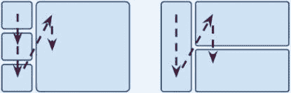

# 关于 UX，开发者应该知道什么

> 原文：<https://levelup.gitconnected.com/what-developers-need-to-know-about-ux-974b99d61d05>

## 随着 UX 实践作为有效的人机交流的支柱的兴起，许多开发人员仍然没有意识到它的重要性。让我们来看一些指南。

# 1.原型和迭代

伟大的 ui 并不容易实现，可能需要多次迭代，直到设计出理想的解决方案——一个不太复杂但提供所有功能的解决方案。用户界面的纸上原型是一种让你快速而廉价地迭代的技术。它生产**低保真度** (lo-fi) **原型**(一次性原型、实体模型或线框)。

*低 fi 原型(纸质)*

这项技术**应该在任何 GUI 实现**之前，因为它:

*   预测产品将如何发展；
*   提供测试几个用户界面备选方案的机会；
*   相关成本非常低(简单快速，只需要笔和纸)；
*   充当参与者之间的通信和同步手段；
*   可以作为需求规格说明技术；
*   允许您从用户(和其他人)那里获得持续的反馈，并在早期阶段发现错误；
*   涉及并激励项目的利益相关者。

低保真原型(电子)

它最有用的阶段是在项目开始时和创建/更改新的 UI 特性(屏幕、窗口、页面等)之前。

# 2.视觉隐喻和启示

在界面设计中，**视觉隐喻**(或[界面隐喻](https://en.wikipedia.org/wiki/Interface_metaphor))是在已知系统和待开发界面之间建立的类比。回想一下 [10 个尼尔森试探法](https://www.nngroup.com/articles/ten-usability-heuristics/)中的一个为**“系统与现实世界的匹配”**辩护。

就像我们求助于实际例子来解释日常生活中的事情一样，视觉隐喻解释 ui(或它的一部分)。例如，使用'❤️' →'收藏'，'邮件'→'电子邮件'，'表格'→'网络表格'，'档案'→'基于标签的界面'，'烤面包机中的烤面包'→'烤面包通知'。一个更复杂的例子是 Google Maps，它继承了物理地图的大部分概念。还有比喻用法不好(比如[汉堡](https://www.magnani.com/ideas/ux2))。

*实体音乐播放器 vs PC 音乐播放器*

文件柜与 Mac OS Finder

灯开关与切换按钮

一个界面隐喻的特征是一个或多个(感知的)**。启示是对象传达其动作的能力(例如，门把手告诉我们它将开门)。**

**使用这些隐喻的动机是**显著加速用户头脑**中 [**心智模型**](https://en.wikipedia.org/wiki/Mental_model) **的创建(即他们对应用程序的[概念模型](https://en.wikipedia.org/wiki/Conceptual_model)的理解)。
因为我们**利用了用户已经从现实世界中获得的知识**，他们更容易理解应用程序固有的概念。****

**选择正确的隐喻必须先于任何界面的创建或新功能的添加。然而，选择隐喻和启示并不是一件容易的事情。黄金法则之一是不要强迫它:如果它需要许多调整，我们就在错误的轨道上。**

> **隐喻只是思想之间交流思想的管道。(*蒂姆·罗勒)***

# **3.现有系统和设计模式**

**正如 Jakob Nielsen 所说，应用程序必须考虑“一致性和标准”。从现有系统(如 Windows、Gmail、谷歌地图、iPhone)中寻找**的灵感至关重要。除了提供积极的证据之外，他们还为目标群体所知，从而 [**减少用户头脑中的问题**](https://www.goodreads.com/book/show/18197267-don-t-make-me-think-revisited) 并利用他们从其他系统获得的现有知识。然后，正在讨论的应用程序的学习曲线得到了改善。****

**你应该阅读你正在开发的系统的 UI 指南(例如[苹果人机界面指南](https://developer.apple.com/design/human-interface-guidelines/)、[安卓设计](https://developer.android.com/design/)、 [Windows 设计](https://developer.microsoft.com/en-us/windows/apps/design))。Android 中的一个例子是将“向下滑动”与“内容更新”相关联，而从不与其他操作相关联。让我们看看更具体的例子:**

****

**在通常预期的地方(Windows 和维基百科)有一个搜索框**

****

**省略号表示需要用户输入的打开对话框(Excel 和 Google Docs)**

**这些取自现有系统的例子实际上是**模式**——就像代码开发应该依赖[设计模式](https://en.wikipedia.org/wiki/Software_design_pattern)(例如封装、代理、抽象)一样，交互设计应该依赖[交互设计模式](https://en.wikipedia.org/wiki/Interaction_design_pattern)。只有研究了它们，你才能开始认识/使用它们。这些模式是典型交互设计问题的测试和可重用解决方案。它们不应该与视觉隐喻混淆，尽管概念是相似的。让我们看两个例子:**

****

**面包屑允许用户轻松快速地导航到更高的级别，并显示用户在应用程序/站点(网站、Mac OS、Windows)中的位置**

****

**向导引导用户完成一项跨越多个功能领域的任务 *(Windows)***

**在没有首先**阐明问题**之前，我们不应该使用模式。只有这样，我们才能寻找模式，并在必要时使其适应应用程序。这些模式通常**被组织成模式库**。一些公司甚至有自己的标准库。还有在线库(如 [GoodUI](https://goodui.org/) 、 [UI 设计模式](http://ui-patterns.com)、 [Welie](http://www.welie.com) )。**

# **4.自主和独立**

**一个“独立自主的界面”不依赖于动画、声音、颜色(即可以黑白使用)、快捷方式和帮助(即解释和说明)来理解和使用。这并不意味着你不应该拥有它们——你只是不应该依赖它们。当然，有时上下文(内联)帮助会有很大的价值，但至少你应该试着不依赖它来设计 UI。**

# **5.任务流**

**人们通常按顺序执行程序。他们每天执行的任务遵循一个逻辑顺序。在应用程序或网站中，这也必须得到尊重。比如，在卖家网站上搜车的时候，先问车型再做，没有意义；在一个应用程序对话框中，把“确定”/“取消”放在顶部是不符合逻辑的；也不要让用户承认他/她已经阅读了下面的内容。**

****

***用户将有额外的工作来发现交互流***

**在西方文化中，阅读的自然顺序是从上到下**，从左到右**。这有几个含义。一是**右边的东西很容易被忽略**。例如，在右侧有重要内容的表单上，一些用户可能根本看不到它。**

****

***用户扫描布局的顺序***

**此外，还要考虑项目的自然顺序。例如，决定下拉框中项目的显示顺序——注意字母顺序并不总是最佳选择。**

****

**错误的项目排列**

**在更宏观的层面上([信息架构](https://en.wikipedia.org/wiki/Information_architecture))，使用[故事板](https://en.wikipedia.org/wiki/Storyboard)来定义应用程序支持的任务工作流是至关重要的。它的目标是试图以漫画的方式展示执行任务所需的屏幕序列。**

****

**故事板**

**简而言之，试着设身处地为用户着想，尊重他们完成任务的自然顺序，并期待项目的安排。当然，使用低级原型测试各种提议。**

# **6.语境和封装**

**上下文是用户界面在用户需要的时间/地点提供用户需要的东西的能力。人们不应该去搜索按钮、菜单、选项、帮助等；一个界面应该是简单的，以这样一种方式构建，用户只需要花一点时间去寻找他/她需要的东西。**

**另一方面，我们不应该在用户不需要的时候提供选项。例如，**上下文菜单应该只包含上下文项目**。这似乎是显而易见的，但将项目置于上下文之外是一个常见的错误(例如，不影响所选文件的选项)。**

****

***上下文菜单(窗口/脸书)——包含与所述项目直接相关的动作***

**另外，避免在界面上散布相关的选项。例如，每当我看到我的购物车时，我都希望相关选项(如查看、结账)放在附近并组合在一起。这可以称为相关功能的封装。**

**一般来说，如果我需要上下文帮助，我希望看到的是最上下文相关的页面，而不是强迫我搜索主题的普通页面。**

**操作(如删除、编辑、复制等。)应该放在面板内的工具栏**上，这样它们才有意义**:**

****

***放置在其上下文中的按钮***

**滚动条应该放在它们影响的组件上(例如树)，而不是滚动浏览器视窗。**

**还有很多例子可以给出，但简而言之:**在用户需要的时间、地点给他们需要的东西——不多也不少**。**

**最后，它**必须**强调**必须不惜一切代价保持上下文**:需要改变屏幕的操作(通常很耗时)让用户很容易失去上下文。也就是说，在使用向导和跨屏幕划分任务时要小心。在 web 应用中，考虑实现[单页界面](https://en.wikipedia.org/wiki/Single-page_application)。**

# **7.一致性**

**界面设计的一致性是**通过尽可能重用界面概念，给用户他们正在等待的东西**。这里我们不是在讨论(与其他系统的)内部一致性，而是内部一致性。**

**对于相同的概念，我们应该总是使用相同的表示。**概念与其表示之间的关系必须是一一对应的**。例如，如果一张卡片被用来代表一顿饭(在一个用餐应用程序中)，我希望同样的卡片被用在同样的概念的其他地方。**

> **永远不要增加解释任何事情所需要的实体的数量。(奥卡姆的威廉)**

**换句话说，应该使用相同的表示来传达始终相同的消息/动作，而不是多个不同的动作。例如，这适用于**图像**(图标、徽标和其他视觉工件)**文本**(例如反馈消息)——它们应该在语法和术语上保持一致，**位置**，**大小和形状** ( [完形法则](http://blog.usabilla.com/gestalt-laws-start-with-thinking-basic/))，**布局**(例如使用模板)，**样式**(例如粗体可以代表一个概念)，**

****对用户来说，这样做的好处是他们可以更快地学习软件的概念，因为他们可以很容易地知道会发生什么，并且有更少的工件需要处理和学习。概念越多越难。****

> ****一致性创造了认知杠杆:一旦你学会了在一个地方做某事的方式，你就可以用这种知识去理解使用同样方法的其他地方[……]基于相似情景的假设将是安全的。(约翰·奥斯特胡特，软件设计哲学)****

# ****8.简单性和视觉负荷****

******简单不是小事，要做到**。当你添加功能时，很容易得到一个混乱的、不太有用的界面。对于每个添加的功能，我们应该质疑所有的用户界面。它必须被视为完美:我们必须向它走去，即使我们知道它是不可企及的。****

> ****当没有什么可以增加，但也没有什么可以拿走的时候，完美就实现了。(安托万·德圣埃克苏佩里)****

****这是尼尔森最重要的[启发之一](https://www.nngroup.com/articles/ten-usability-heuristics/):“美学和极简设计”。****

****当我们向 GUI 添加工件(图标、按钮、表格等)时。)，我们必须考虑**它的附加值是否配得上它的重量**。一个“屏幕”的理想用户界面是一个用更少的视觉负载浓缩了更多功能的界面(正如理想的句子是最小的，但是传递了更多的信息)。****

****一个功能，如果经常使用，应该更“接近”用户:更少的点击/步骤/屏幕等。它用得越多，你就必须赋予它越多的视觉重要性。不太常见的功能应该更“隐蔽”。****

********

*****Gmail 中的更多动作*收集较少使用的动作****

****每次我们在屏幕上添加功能时，我们必须分析整个视觉负载，如果必要的话，重新设计它。特征不能被孤立地设计。****

****一个很好的练习是去除你认为不必要的视觉伪像，然后测试没有它们的界面行为。例如:****

*   ****移除一切分散用户注意力、不能带来附加值的东西(如不必要的动画)；****
*   ****尝试删除内嵌指令(您可以稍后再添加它们；这只是为了测试你是否可以重新设计来避免它们)；****
*   ****将用户最常做的事情放在前台，将用户最少使用的事情放在后台([渐进式显示](https://www.nngroup.com/articles/progressive-disclosure/))；****
*   ****使用[视觉层次](https://www.canva.com/learn/visual-hierarchy/):事物的重要性必须与其视觉负载成比例(如文本大小)；****
*   ****考虑减少视觉重量的交互模式(如标签、过滤器、下拉菜单、可折叠窗格等)。).****

********

****但是请记住，一些简化的决定(例如选择性别、向导、选项卡的下拉菜单)也可能是一个糟糕的选择，因为它们隐藏了可用的选项并增加了额外的点击。****

****拥有极简 UI 的一个限制是当你不得不处理遗留应用时:我们应该尊重历史原因并知道如何管理变化:例如，通过制作理想的原型，但通过分阶段推出它。****

****只有经验和迭代才能帮助实现简单的目标。好消息是，低级原型的成本很低。****

# ****TL；速度三角形定位法(dead reckoning)****

*   ******原型化和迭代**:先用低级原型迭代，变得更接近理想解；****
*   ******视觉隐喻和启示**:在物理(或至少是已知的)系统中使用隐喻，使学习更快更熟悉；****
*   ******现有系统和设计模式**:利用用户对其他系统的了解，尊重底层平台；****
*   ******自主独立**:不要让你的 UI 依赖于解释、声音、颜色、动画、快捷方式，去理解和使用；****
*   ******任务流程**:尊重用户完成任务的自然顺序；****
*   ******上下文和封装**:在需要的时候提供选项(例如内联)；将相似的项目分组；避免丢失/切换上下文；****
*   ******一致性**:不要为每个概念提供一个以上的表示；****
*   ******简单性和视觉负荷**:保持用户界面的整洁，确保项目的视觉权重符合它们的重要性。****

****当然，还会有更多的技巧需要讨论，但我试图总结一些我认为是基本的，但有时会被开发人员遗忘或忽略的主题。****

# ****进一步阅读****

**** [## 面向非设计师的产品设计

### 关于数码产品设计，你最起码应该知道什么，为什么要关注它？

medium.com](https://medium.com/codex/product-design-for-non-designers-7f3e22f4aefa)**** 

****[*葡萄牙文原文。*](http://luissoares.com/8-dicas-para-interfaces-user-friendly/)****