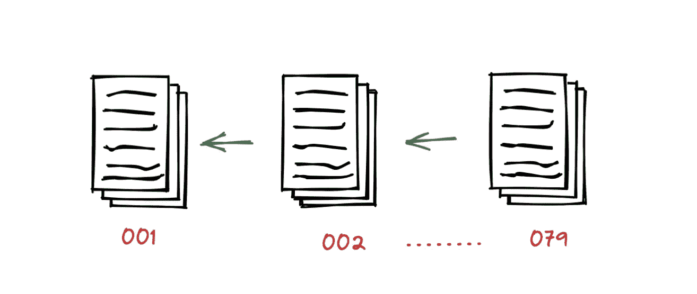
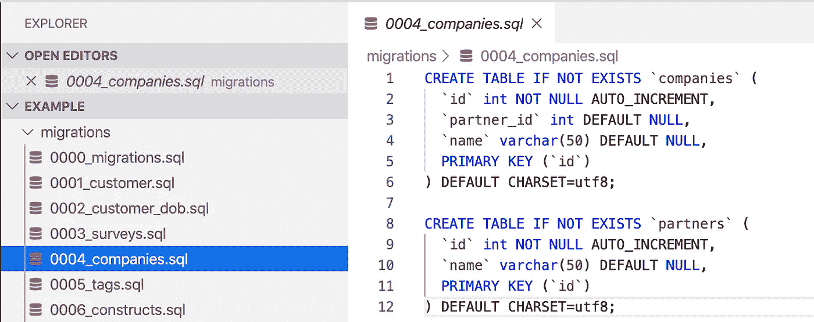

# 在数据库上运行错误的迁移集后，我学到了什么

> 原文：<https://levelup.gitconnected.com/what-did-i-learn-after-running-the-wrong-set-of-migrations-on-the-database-5126e5d4236e>

## 你打破东西，你学到更多！

在 [Unsplash](https://unsplash.com?utm_source=medium&utm_medium=referral) 上由 [Moritz Mentges](https://unsplash.com/@mphotographym?utm_source=medium&utm_medium=referral) 拍摄的照片

最近在工作中，我在数据库中应用了一组错误的迁移。它最终打破了东西，没有人可以进入系统。我慌了，但我更专注于学习新的东西！

这篇博客将深入探讨数据库迁移，什么是数据库模式迁移，为什么我们需要它们以及不同的实现策略。稍后，我们将查看由于在数据库上应用错误的迁移集而出错的场景，以及如何避免这种情况。

# 数据库迁移

在开发应用程序时，您可能需要在某个时候存储一种新的信息。也许您需要添加一个新字段。此时，您必须更改数据库的结构。关系数据库结构的增量变化过程称为 ***数据库模式迁移。***

迁移有助于将数据库模式从其当前状态转换到新的期望状态。它可以包括删除特定的行和列、添加一组新的行、修改约束类型等。

简而言之，我们可以说什么是 [Git](https://git-scm.com/) 管理源代码的变更；类似地，迁移到数据库。

移植:数据库模式的版本控制

## 什么是迁移脚本？

迁移脚本或“更改”脚本会改变数据库。它通过将每个更改捕获为迁移脚本来对数据库更改进行版本控制。我们将状态转换保存在迁移文件中，这些文件描述了如何到达新的状态，并在需要时将更改恢复到旧的状态。

在下图中，每个迁移脚本都有一个唯一的序列号，以便您知道应用迁移的顺序。

图片来源:[https://cloud . Google . com/architecture/devo PS/devo PS-tech-database-change-management](https://cloud.google.com/architecture/devops/devops-tech-database-change-management)

# 我们为什么需要它？

数据库迁移很有帮助，因为随着需求的变化，它们有助于简化数据库的变化过程。它最终允许开发人员安全地执行数据库模式更改。关键思想是:既然开发人员可以使用 Git 进行易于回滚的代码更改，为什么开发人员不能在模式更改时做同样的事情呢？

# 您如何执行数据库迁移？

如何执行数据库迁移在很大程度上取决于您用于该任务的工具。

## 框架/语言相关库

一些框架(像 Django，Spring 等。)提供记录良好的数据库迁移库。框架选择的大多数库会为您完成迁移。像 Django、Alembic 或 Liquibase 这样的库有助于将迁移定义为代码，我们在其中描述数据库的期望状态。该库负责生成适当的 DDL 并执行它们。这种方法的主要优点是，它有助于将迁移代码与使用中的数据库分开。然而，它也将我们限制在 SQL 特性的公共子集上。

有些库提供自动生成功能。他们检查数据库模型中所做的更改，并生成迁移代码。一些库，如 play evolutions 和 Flyway，要求我们在迁移中定义原始 DDL。这使我们能够充分利用我们正在使用的数据库，但也意味着我们将不得不自己定义迁移，并变得依赖于数据库。

## 独立的数据库迁移软件

在某些情况下，您可以使用像 Flyway 这样的软件作为数据库的源代码控制。它们也提供了生成迁移的命令行方式，并允许定制编码来捕获数据库模式迁移。

# 迁移是如何进行的？

1.  每当我们运行迁移时，它首先从模式历史表中检查最后一次应用的迁移。该表是特定于工具的。
2.  迁移工具扫描文件系统以寻找新的迁移。
3.  对于它发现的每个新迁移，它创建一个事务，应用 DDL，并向模式历史表添加一个新条目。
4.  在回滚的情况下，它识别需要取消应用的迁移，执行相应的 DDL 并从模式历史表中删除条目。

这是一个简单的迁移工具示例:

 [## migrations/migration . py at master Nancy-Chauhan/migrations

### 此文件包含双向 Unicode 文本，其解释或编译可能与下面显示的不同…

github.com](https://github.com/Nancy-Chauhan/migrations/blob/master/migration.py) 

# 我是如何破坏系统的，发生了什么？

我将一个不同的游戏项目连接到了一个不同的数据库。Play framework 发现了一组不同于架构历史记录表中记录的迁移。它错误地确定迁移已被更改，并且未应用现有的迁移集。数据库最终处于不一致的状态。

Play framework 比传统的迁移工具更进了一步，它将迁移脚本的散列和“应用/不应用”DDL 一起存储在模式历史表中。这样，即使原始迁移脚本不可用或已更改，it 部门也可以回滚迁移。

# 我是如何解决的，我学到了什么？

解决这个问题的通常方法是恢复整个数据库的快照，这可能是一个非常漫长的过程。但是如果您检查缺失的迁移，您可能会发现并非所有的迁移都会彻底改变数据库。通过比较模式历史表，您将找到缺失的迁移并手动运行它们。这在您运行错误迁移的情况下也会有所帮助。

在我的例子中，我很幸运，并不是所有的迁移都因为迁移的“down”脚本中的一个 bug 而没有被应用。玩应用程序，直到错误的迁移。迁移后的更改并不多，我可以手动运行迁移，并更改一些数据以使数据库恢复一致性。

我学到了什么？

*   在生产环境中，永远不要让迁移工具自动取消应用迁移。
*   在进行任何迁移之前，请务必备份数据库。
*   如果迁移出了问题，检查模式历史表，看看是否可以执行一些手动纠正，以使服务快速启动和运行。

这帮助我了解了数据库迁移的内部原理，并意识到打破常规可以让你学到更多！

坚持学习！💜