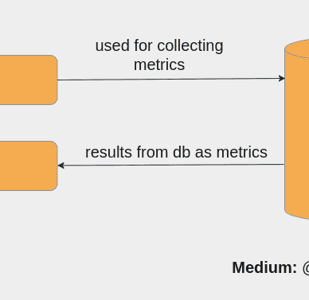

# 我从 Docker 网络中学到了什么？

> 原文：<https://levelup.gitconnected.com/what-did-i-learn-from-docker-networking-5d11407fe8e5>

## [编程](https://medium.com/@anasanjaria/list/programming-c490480e617e)

## 关于进出港交通的思考。


Docker 容器通信—由作者使用[https://app.diagrams.net/](https://app.diagrams.net/)创建

在这篇文章中，我解释了多个 docker 容器如何相互通信的基本概念。

利用这个概念，我解释了我使用 docker networking 对入站和出站流量的看法。

如果 Docker 容器共享同一个网络，它们可以相互通信。

# 用例—单个 docker-compose 文件中的多个服务

当我们编写一个包含多个服务的 docker-compose 文件时，它们共享同一个网络。因此，服务可以相互通信。

例如，在下面的 YAML 文件中，服务`kibana`和`elasticsearch`使用服务名或容器名相互通信。

```
version: '3.8'
services:
  elasticsearch:
    image: 'docker.elastic.co/elasticsearch/elasticsearch:7.17.1'
    container_name: elasticsearch-1
    ports:
    - '9200:9200'
    - '9300:9300'
    environment:
    - "discovery.type=single-node"
  kibana:
    container_name: kibana
    image: 'docker.elastic.co/kibana/kibana:7.17.1'
    environment:
    - 'ELASTICSEARCH_HOSTS=http://elasticsearch:9200'
    depends_on:
    - elasticsearch
    ports:
    - '5601:5601'
```

默认情况下，docker-compose 会创建一个名为`YOUR-FOLDER-NAME_default`的网络。

# 用例—多个 docker-compose 文件中的多个服务

在不同的 docker-compose 文件中分离服务可能有几个原因。

但是这样做并不能使服务之间的通信开箱即用。因此，我们需要确保它们都在同一个网络中。

让我们用单独的 docker-compose 文件来考虑同一个例子。

```
-- docker-compose-a.yamlversion: '3.8'
services:
  elasticsearch:
    image: 'docker.elastic.co/elasticsearch/elasticsearch:7.17.1'
    container_name: elasticsearch
    ports:
      - '9200:9200'
      - '9300:9300'
    environment:
      - "discovery.type=single-node"
 **networks:
      - demo**

networks:
  demo:
    name: 'demo'-- docker-compose-a.yamlversion: '3.8'
services:
  kibana:
    container_name: kibana
    image: 'docker.elastic.co/kibana/kibana:7.17.1'
    environment:
      - 'ELASTICSEARCH_HOSTS=http://elasticsearch:9200'
    depends_on:
      - elasticsearch
    **networks:
      - demo**
    ports:
      - '5601:5601'

networks:
  demo:
    name: 'demo'
```

如果你仔细观察，我已经在每个服务中明确指定了一个名为 *demo* 的网络。这样，它们共享同一个网络，因此也可以相互通信。

您可以使用以下命令运行这些服务。

```
docker-compose -f docker-compose-a.yaml \
 -f docker-compose-b.yaml \
 up -d
```

# 我从 docker 网络中学到的

在本练习中，您是否密切关注了入站和出站流量？

如果仔细观察，您会发现出站流量没有任何限制。这意味着容器可以很容易地与外界(或互联网)通信。


出站流量始终开放。然而，限制总是在入站流量上——由作者使用[https://app.diagrams.net/](https://app.diagrams.net/)创建

但是，对入站流量总是有限制。每个人都关心传入流量和保护他们的网络。

记住同样的原则，你现在能够理解为什么*网络 A* 不允许来自*网络 B* 的流量。我们不能相信其他网络，只能相信我们自己的。


Docker 容器通信—由作者使用[https://app.diagrams.net/](https://app.diagrams.net/)创建

如果我们向外部世界(或互联网)公开我们的服务，我们需要一个安全层来保护我们的网络。

感谢阅读。

如果你喜欢这篇文章，你可能也会喜欢我接下来的系列文章。


[阿纳斯·安贾里亚](https://medium.com/@anasanjaria?source=post_page-----5d11407fe8e5--------------------------------)

## 编程；编排

[View list](https://medium.com/@anasanjaria/list/programming-c490480e617e?source=post_page-----5d11407fe8e5--------------------------------)7 stories

[阿纳斯·安贾里亚](https://medium.com/@anasanjaria?source=post_page-----5d11407fe8e5--------------------------------)

## 现场可靠性工程

[View list](https://medium.com/@anasanjaria/list/site-reliability-engineering-fd4dc0eabf12?source=post_page-----5d11407fe8e5--------------------------------)6 stories

```
**Want to connect?** [Facebook](https://www.facebook.com/anas.anjaria.kh) | [LinkedIn](https://www.linkedin.com/in/anasanjaria/) | [Twitter](https://twitter.com/anasanjaria)**Subscribe to get my work directly into your inbox.** [https://medium.com/subscribe/@anasanjaria](https://medium.com/subscribe/@anasanjaria)
```