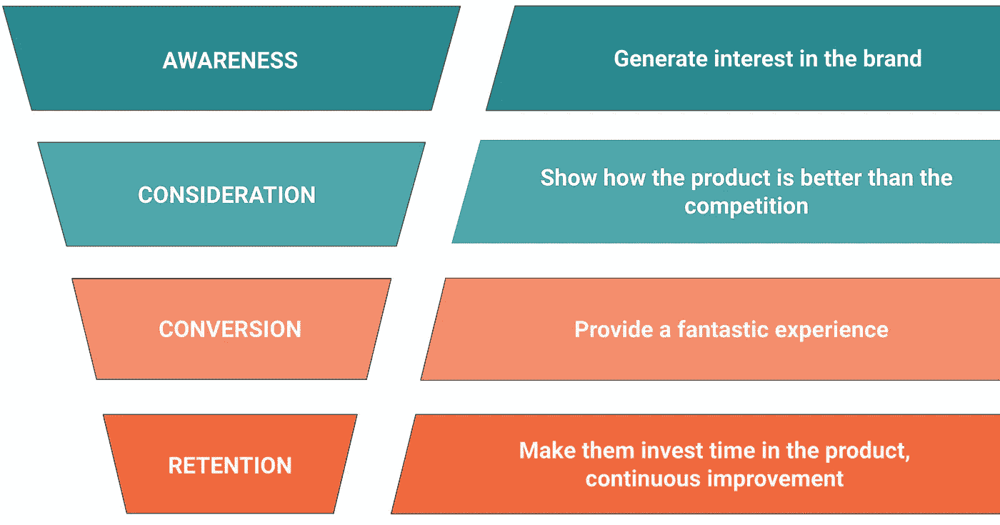

# 成长工程师是做什么的？

> 原文：<https://levelup.gitconnected.com/what-does-a-growth-engineer-do-8ee5445d4d87>

像 Gilfoyle 和他的团队一样，增长工程师每天花 2 个小时头脑风暴如何增加数字。玩笑归玩笑，成长工程师确实在不断思考提高转化率和用户体验的想法。我们接受失败的实验，并从中改进。我们是高度数据驱动的；一切都被追踪，以区分什么有用，什么没用。我将首先简要解释为什么存在增长工程，然后是增长工程的定义，然后是增长工程的框架，最后是一些增长工程项目的例子。

增长工程是一个相对较新的技术领域，大约十年前，脸书开创了这个领域。这个想法是要有一个跨职能团队(没有产品、工程和营销团队之间的分离),可以应用科学的方法来实现增长，而不是古老的肠道驱动的过程。每种类型的企业都可能需要定制的增长解决方案，这些解决方案应该从快速度量驱动的实验开始。

> “事实证明，如果你建造了它，他们可能不会来。更好的产品和更多的功能并不一定意味着增长”——陈楚翔

推荐项目是成长工程项目的一个很好的例子，它可能会根据行业或商业模式带来不同的结果。在 ROSS Intelligence，尽管 14%的线索来自口口相传，但与其他企业对消费者(b2c)推荐计划相比，我们将很难达到同样的效果，这些计划来自像 [Wise](https://wise.com/) 这样的公司，这是一个向国外汇款的廉价平台。明智的客户推荐是一个双赢的条件；引荐人和推荐人都有折扣，都从中受益。然而，在 ROSS，即使我们为推荐人和推荐人都提供了好处，我们的工具也被视为一种竞争优势，可以推动推荐人(见下面的引用)。这不是一个双赢的局面，除非他们确信他们的同事不会加入任何反对的律师事务所。因此，我们必须发挥创意，投资其他渠道。

> “嗯，我可能正在和一个案子的对手谈话。至于他们，我不想了解或使用这个工具。”—罗斯客户

本能和想法需要物化到工作中；这是增长工程师的工作。它的范围可以从微小的用户体验改进到构建独立的工具、附加组件和新功能来提升核心产品。一个简单的例子是我为本文运行的当前 A/B 测试(我希望 Medium 也有这个特性🤔).变体 A 有一个非技术性的吸引人的标题图像，而变体 B(你现在正在阅读的那个)有一个利基工程标题图像。除了标题图像和略有不同的第一段，其他一切都是完全一样的。我的假设是特定于字段的标题图像限制了视图的数量。如果证实了这一点，我将在我的下一篇文章中使用更通用的图片标题。看看纽约时报是如何测试他们的标题的。

> “本能是实验。数据就是证明。”阿利斯泰尔·克罗尔

## 剖析成长工程师

通常有两种类型的成长型工程师:开始学习编程的营销人员或销售人员(又名[成长型黑客](https://qr.ae/pN0l4l))和拥有技术学位的人，他们希望拓宽自己的技术技能，并在简历中加入一些商业技能。虽然成长型黑客可以通过 [Zapier](https://zapier.com/) 和 [Autopilot](https://www.autopilothq.com/) 执行自动化流程等任务，并使用 [Unbounce](https://unbounce.com/) 等工具建立网站，但成长型工程师从事更复杂的工程项目，这可能需要各种技能，如后端、前端、基础设施、数据管道，甚至人工智能。成长工程师是全栈++工程师。

> “增长工程是一种可重复的、系统的增长方法。增长黑客是为给定的问题寻找捷径。它们相辅相成。增长黑客可以成为增长工程的一部分”——蒂姆·戴尔斯

成长工程师参与构思、评估和确定想法的优先顺序。而且，让增长工程学成为工程师们难以置信的领域的是尝试新技术、新工具、进行实验和快速迭代的机会。产品的其他部分可能已经固定不变，对变化的灵活性很低，甚至为零。一个成长工程师可能需要从头开始构建一个 chrome 插件、一个移动应用、一个通知系统、一个电子邮件摘要管道等等。这些都是很好的例子，在这些例子中，我们可以发挥创造力，并从中学到很多东西。我将提供几个项目的例子，在罗斯智能增长团队工作。

> “比起完美，我们更喜欢进步。随着时间的推移，成长团队交付复合改进。”—安德鲁·哈蒙德

## 增长工程框架

你会经常在我的文章中看到类似于**豆腐**(漏斗顶端)**蘑菇**(漏斗中间)**富博**(漏斗底端)这样的术语。我们一直使用这个漏斗作为增长工程框架。每个组织都有自己的用户漏斗，每个阶段都有自己的名字。为了简化我的解释，我决定只利用四个步骤，但是下面是一个列表，其中包含您可能在其他来源上找到的其他同义词。

1.  **认知:**发现
2.  **考虑:**评价、探索、兴趣、欲望
3.  **转化:**决策、购买、行动
4.  **保留:**参与度、忠诚度、支持度

下图给出了每个漏斗阶段目标的大致思路。成长工程师在某些步骤上会比其他人做得更多，这取决于你的公司所处的位置。在一家公司的早期阶段，成长工程师可能会把大部分时间花在意识、想法和实验上。在公司的后期，他们会花更多的时间来留住人才。看看约翰·埃根(Pinterest 的成长工程师)的这篇优秀文章，名为[管理你的成长团队的投资组合:一步一步的指导](https://jwegan.com/growth-hacking/managing-growth-teams-portfolio-step-step-guide/)

在随后的会议中，我将提供一些 ROSS Intelligence growth 团队在四个漏斗阶段中的每一个阶段所做的项目示例。

## 用户漏斗:认知

认知阶段的目标是引起人们对该品牌的兴趣，让人们知道该品牌是顾客所熟悉的产品的替代品。[罗斯情报是一个法律研究平台](https://blog.rossintelligence.com/post/announcement)。它收集了大约 1300 万个判例法判决，并提供了一个先进的人工智能搜索平台，以快速找到法律问题的正确答案。

> “我会想念罗斯的。该法律研究工具易于使用，界面简洁明了。Lexis 和 West 对于精通技术的律师来说杂乱、缓慢且没有更新”——ROSS 客户

罗斯公司为提高知名度而开展的增长工程项目的例子包括但不限于(看，我甚至在那里找到了一些律师用语😂):

*   让 1300 万个案例法判决都可以在谷歌上搜索到。
*   创建一个免费的 Chrome 插件，允许律师在互联网上免费搜索相似的法律语言。
*   与一个类似 Google-Drive 的法律平台( [Clio](https://www.clio.com/) )集成，律师可以通过简单的点击按钮将他们的文件传输给 ROSS，以获得对法律问题的见解。

 [## 如何用 Prerender.io 让 React 单页应用程序可谷歌化

### 这是关于成长型工程师的系列文章中的另一篇。这篇特别的文章是关于增加…

pargles.com](https://pargles.com/posts/make-single-page-app-searcheable-on-google/)  [## ROSS Intelligence 通过 Chrome 扩展引入免费研究

### 佛罗里达律师协会会员福利提供者罗斯智能公司推出了一个免费的 Chrome 扩展，使寻找案例法…

www.floridabar.org](https://www.floridabar.org/tech-tips/ross-intelligence-introduces-free-research-via-chrome-extension/)  [## clio Integration for ROSS——智能法律研究的选择

### ROSS 是一个人工智能驱动的法律研究平台，可以让你在很短的时间内进行更彻底的研究…

营销、开发、clio 系统](https://marketing.dev.clio.systems/app-directory/ross/) 

## 用户漏斗:考虑

一旦很多人知道了你的产品，是时候让他们更容易试用了。无论是免费试用还是 T2 的免费增值商业模式，成长工程师都会优化注册页面，减少任何可能的摩擦。

在 ROSS Intelligence，增长团队致力于几项举措，以提高访客到注册的转化率。以下几项措施带来了两位数的改善:

*   在不影响安全性的情况下降低密码要求
*   促进电子邮件验证，以改善注册后的客户体验。

 [## 动词 （verb 的缩写）注册 ip，让你的好线索跳过这条线

### 如果您的大多数注册来自单点登录(SSO)，通常在网站上被视为与谷歌或…

pargles.com](https://pargles.com/posts/vip-signup-let-your-good-leads-skip-the-line/)  [## 严格的密码要求可能会损害您的注册转换

### 假设您的大多数注册来自单点登录(SSO)，通常在网站中被视为与 Google 的登录…

pargles.com](https://pargles.com/posts/strict-password-requirements-could-be-hurting-your-signup-conversion/) 

## 用户漏斗:转化

这是发光的时候；有人称之为[啊哈时刻](https://uxdesign.cc/what-is-an-aha-moment-e32cba636733)，有人称之为[哇时刻](https://viewpoints.matrixpartners.com/growth-hacking-creating-a-wow-moment-822e1c4000fa)，我们称之为神奇时刻。不管你的团队使用什么样的名称定义，你的潜在客户可能需要指导才能达到那个时刻。

> “你不能只在网站上放几个‘购买’按钮，就指望你的访客买你让他们买的任何东西。我们的大脑不是这样的。”—尼尔·帕特尔

一旦这个神奇的时刻到来，成长工程师就可以开始引导潜在客户体验这个时刻。可以改善用户体验的一些技术示例有:

*   交互式和直观的用户入门。
*   系统建议。
*   自动搜索过滤器，自动地理定位，默认过滤器定制。
*   低摩擦结账和支付，支付方式多样(通过灵活的计划或提供比特币等现代支付方式)。

在 ROSS，我们发现应用权限过滤器的用户比没有应用这些过滤器的用户更快地到达神奇时刻。那么，我们能做些什么来引导他们走向那个神奇的时刻呢？例如，将用户的当前地理位置设置为他们的默认管辖过滤器，或者提供选项来预设或者甚至学习他们的偏好以改进搜索结果。

> “[罗斯]的产品是革命性的。作为 biglaw 的一名年轻律师，我磨练了寻找“完美案例”的技能。罗斯完全取代了以前的巨大努力。一些有针对性的搜索几乎总能找到我需要的东西。”—罗斯的客户

## 用户漏斗:留存

这个阶段的目标是提高客户参与度，增加产品粘性。[这是一篇关于用户留存重要性的优秀文章](https://medium.com/@danniechu/how-to-systematically-improve-your-user-retention-e5437c5159fa)。成长工程师团队在 ROSS 开展的客户维系项目包括:

*   推荐计划。
*   每日和每周使用摘要电子邮件。
*   系统通知。
*   可下载文档的定制。
*   多色中等文本突出显示。

> “成长团队致力于改善产品的客户体验”——Andrew Hammond

在这个阶段，可能会与核心产品团队正在做的工作有一些重叠，所以这就是 Full Stack ++工程师的优势所在，因为他们拥有广泛的技术技能，因此可以快速掌握一切如何协同工作。

 [## React 中的中等文本高亮显示

### 这是关于成长型工程师的系列文章中的另一篇。这篇特别的文章是关于增加…

pargles.com](https://pargles.com/posts/medium-like-text-highlighting-in-react/) 

## 你想了解更多关于生长工程的知识吗？

以下是了解增长工程的一些极好的资源

 [## Pinterest 的增长工程

### 我经常被刚开始成长的人问到的一个问题是“我的成长仪表板中应该有什么指标？”…

jwegan.com](https://jwegan.com/)  [## 网飞的增长工程——加速创新

### 埃里克·艾斯沃斯

netflixtechblog.com](https://netflixtechblog.com/growth-engineering-at-netflix-accelerating-innovation-90eb8e70ce59) 

## 寻找你的下一个工程挑战？

不幸的是， [ROSS Intelligence 已经停止运营](https://blog.rossintelligence.com/post/announcement)，但我已经加入了 [Chorus.ai](https://www.chorus.ai/) 继续我在一家快速成长的初创公司的成长工程之旅。

Chorus.ai 是一个面向销售团队的 ai 对话智能云平台，可以将对话转化为数据和见解。如果你想加入我们，无论是参与，后端，前端，或开发运营团队，合唱团正在招聘！请随时 ping 我或通过此链接申请[。](https://jobs.lever.co/chorus/?team=Engineering&utm_source=pargle&utm_medium=medium&utm_campaign=what-does-a-growth-engineer-do-foosball)

我希望你喜欢这篇文章！祝您愉快！