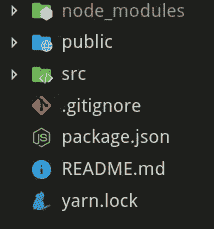

# Create-React-App 实际上是做什么的？

> 原文：<https://levelup.gitconnected.com/what-does-create-react-app-actually-do-73c899443d61>

照片由[通讯社跟随](https://unsplash.com/@olloweb?utm_source=medium&utm_medium=referral)于 [Unsplash](https://unsplash.com?utm_source=medium&utm_medium=referral) 上拍摄

许多人使用 create-react-app 作为创建 react 应用程序的简单起点。有些人并不确切知道随之而来的一切，或者为什么它会在那里。这篇文章是写给那些不知道发生在引擎盖下的每件事，但想了解更多的人的。

首先，我会先说这是用 create-react-app 2.1.5 写的，因此当你读到这篇文章时，事情可能已经发生了变化。

运行`npx create-react-app yourApp`后，你会发现你的应用根目录有三个文件夹和四个文件。文件夹是`node_modules/`、`public/`和`src/`。这些文件是`.gitignore`、`package.json, README.md`和`yarn.lock`

# 运行创建 React 应用程序

让我们来分析一下你刚才到底做了什么。输出中的第一行来自`npx`。当您给它一个命令时，npx 可以做两件事。它首先在您的本地机器上寻找要运行的包。如果没有找到，它就会开始查看 npm 的包列表。输出中的第一条消息只是让您知道它处理了。

接下来，在 create-react-app (CRA)中，您的命令将通过一系列检查。它会查找关于您的系统的信息，查看您是否附加了任何标志，并确保您指定了要输出的文件夹。然后实际的`createApp`功能运行。这将检查您选择的目录是否安全。它通过查找日志文件之类的东西来做到这一点。如果你没有通过任何检查，你会收到一个错误信息，然后 CRA 将退出。

接下来，它开始用默认值`name:<YOURAPP'SNAME>`、`version: '0.1.0'`和`private: true`组成`package.json`。这将被写入您指定的目录。在这里，它会根据您的系统来决定是应该使用`yarn`还是`npm`。如果你已经安装了`yarn`将会被使用。对`node`、`yarn`和`npm`的版本进行一系列检查，以选择要使用的`react-scripts` 的正确版本。

下一个函数叫做`run()`。这将继续安装。现在唯一出现在你面前的是 npx 行和“在<你的目录>中创建一个新的 React 应用”。依赖性列表被创建。默认包括:`react, react-dom`和您指定的`react-scripts`版本。如果您添加了 TypeScript 标志，它也会添加对该标志的依赖。

新的一行被写入控制台。“正在安装软件包。这可能需要几分钟时间。”使用之前确定的一切，它运行你的软件包管理器来安装正确版本的`react-scripts`,如果你在线的话从互联网安装，如果你不在线的话从本地缓存安装。

这就是“安装 react、react-dom 和 react-scripts…”一行出现的地方。安装是异步完成的。如果失败，package.json、yarn.lock 和 node_modules 都会在打印警告后被删除。

如果到现在为止一切都成功了，我们就移动到一个新文件:`react-scripts`。它做的第一件事是检查`package.json`和`yarn.lock`。它将`package.json`加载到一个 json 格式的变量`appPackage`中。完成此操作后，它会检查 TypeScript 是否为依赖项。接下来，它开始添加 json。

首先是剧本。这些可能与启动、构建、测试和弹出类似。这些脚本实际上位于与我们当前正在浏览的 init.js 相同的目录中。接下来是 eslinstConfig，然后是 deafultBrowsers。这些默认是' > 0.2% '，'没死'，'不是 ie <= 11’, ‘not op_mini all’. Basically this means target all browsers that are higher then .2% market share, in active use, not bellow IE 11, or Opera Mini. This is actually a separate package located [这里](https://www.npmjs.com/package/browserslist)。

然后`package.json`被写出来，不会再被触摸。到目前为止，还没有其他事情发生。检查自述文件，如果存在，则将其重命名。然后，模板文件夹中指定的文件被复制到工作目录中。这是`public`、`src`、`README.md`和`gitignore`。这里没有打字错误，gitignore 是在没有。前面后来改名了。这里有一条评论指出这是为了防止 npm 错误。

在检查 React 是否真正安装后，它继续检查存储库是否已经用 git 初始化。这会运行 git init，并添加第一次提交。这就是“初始化 git 存储库”一行出现的地方。

init.js 在结束前做的最后一件事是打印成功消息和指令。这些向您介绍了基本的`react-scripts`命令，并建议您进入刚刚创建的目录。

# Create React App 的许多依赖项(以及它们的作用)

然后问题变成了，那么`react`、`react-dom`和`react-scripts`带来了什么？对于`react`和`react-dom`，列表是相同的。`loose-envify`、`object-assign`、`prop-types`和`scheduler.`

`[loose-envify](https://github.com/zertosh/loose-envify)` —替换 process.env 变量
`[object-assign](https://www.npmjs.com/package/object-assign)` — Object.assign()用于不支持的浏览器/节点版本
`[prop-types](https://www.npmjs.com/package/prop-types)`—React props 的类型检查器
`[scheduler](https://www.npmjs.com/package/scheduler)` — React 自己的调度器

看着这四个你可能会奇怪为什么你的 node_modules 文件夹这么大。这可归结为`react-scripts`。它的依赖列表是:

> " @babel/core": "7.2.2 "、
> "@svgr/webpack": "4.1.0 "、
> " babel-core ":" 7 . 0 . 0-bridge . 0 "、
> "babel-eslint": "9.0.0 "、
> "babel-jest": "23.6.0 "、
> "babel-loader": "8.0.5 "、
> "babel
> " jest-watch-type ahead ":" 0 . 2 . 1 "、
> " mini-CSS-extract-plugin ":" 0 . 5 . 0 "、
> " optimize-CSS-assets-web pack-plugin ":" 5 . 0 . 1 "、
> " PNP-web pack-plugin ":" 1 . 2 . 1 "、
> " post CSS-flex bugs-fixes ":" 4 . 1 . 0 "、
> "postcss-loader " "

事态升级得很快。我们来分析一下。

## 巴比伦式的城市

巴别塔改变你的代码。也就是说，它会做一些事情，如添加 polyfills，使您的 ES2015+代码可以与旧浏览器一起工作。package.json 通过 *browserslist 定义它的目标。*

`[@babel/core](https://babeljs.io/docs/en/next/)` —巴别塔的核心库
`[*babel-core*](https://www.npmjs.com/package/babel-core)` *—* 从巴别塔的第 7 版开始，命名方案发生了变化。并非所有内容都已更新，这是为那些尚未更新到新的@ naming
`[babel-eslint](https://github.com/babel/babel-eslint)`的包提供的桥梁——这是一个规则集，允许您在 Babel 解析的代码
`[babel-jest](https://www.npmjs.com/package/babel-jest)`上运行 eslint 允许 Jest(JS 的测试库)与 Babel
`[babel-loader](https://github.com/babel/babel-loader)`很好地配合——一个告诉 Webpack(我们将进入 Webpack)在代码
`[babel-plugin-named-asset-import](https://www.npmjs.com/package/babel-plugin-named-asset-import)`上运行 Babel 预处理器的加载程序——一个允许命名导入
`[babel-preset-react-app](https://www.npmjs.com/package/babel-preset-react-app)`的 CRA 特定插件——这是预设

## 埃斯林特

ESLint 是一个 linter，意思是根据一组规则扫描你的代码。如果你违反了这些规则之一，它会警告你。这些警告是 CRA 在控制台中出现许多错误的原因。

`[eslint](https://github.com/eslint/eslint)`—ESLint 的基础库
`[eslint-config-react-app](https://www.npmjs.com/package/eslint-config-react-app)` — CRA 的默认 ESLint 规则
`[eslint-loader](https://www.npmjs.com/package/eslint-loader)` —类似于上面的 Babel-loader，这允许 ESLint 由 WebPack
`[eslint-plugin-flowtype](https://www.npmjs.com/package/eslint-plugin-flowtype)`运行——向 ESLint
`[eslint-plugin-import](https://www.npmjs.com/package/eslint-plugin-import)`添加 flowtype 语法——添加对 ES2015+ import/exports
`[eslint-plugin-jsx-a11y](https://www.npmjs.com/package/eslint-plugin-jsx-a11y)`的林挺支持——对 JSX 的屏幕阅读器之类的东西实施可访问性规则
`[eslint-plugin-react](https://www.npmjs.com/package/eslint-plugin-react)` —为 React 添加 ESLint 规则

## 玩笑

Jest 是一个 Javascript 测试库。它也是由脸书和 CRA 一样做出反应的

`[jest](https://www.npmjs.com/package/jest)`—Jest
`[jest-pnp-resolver](https://github.com/arcanis/jest-pnp-resolver)`的基本依赖关系—为 Jest
`[jest-resolve](https://www.npmjs.com/package/jest-resolve)`添加了[即插即用](https://gist.github.com/arcanis/02b49752c385908479734d8027d7a6c7)支持—这是一个为 Jest 添加了一些东西的脸书。很抱歉我没有更好的细节，但没有自述文件，并且代码在 repo
`[jest-watch-typehead](https://www.npmjs.com/package/jest-watch-typeahead)`中没有解释——允许过滤 Jest 测试

## PostCSS

PostCSS 允许将规则应用到您的 CSS 文件中。一个简单的例子是，它可以添加供应商前缀到您的 CSS，以节省您这样做的努力。

`[postcss-flexbugs-fixes](https://www.npmjs.com/package/postcss-flexbugs-fixes)` —修复特定于浏览器的 flexbox 错误
`[postcss-loader](https://www.npmjs.com/package/postcss-loader)` —向 Webpack 添加一个运行 PostCSS
`[postcss-preset-env](https://www.npmjs.com/package/postcss-preset-env)`的加载程序—添加 polyfills 以允许较新的 CSS 在缺少该功能的较旧浏览器上工作
`[postcss-safe-parser](https://www.npmjs.com/package/postcss-safe-parser)` —发现并修复 CSS 错误

## 网络包

一个高度可修改的捆绑 JS 文件的工具。正如您从这个列表中的大量依赖项中看到的，它有很多用途。Webpack 也是运行 Babel、ESLint 和 PostCSS 的工具。

`[@svgr/webpack](https://www.npmjs.com/package/@svgr/webpack)` —将 SVG 转换为 React 组件
`[case-sensitive-paths-webpack-plugin](https://www.npmjs.com/package/case-sensitive-paths-webpack-plugin)` —阻止区分大小写的操作系统和不区分大小写的操作系统相互产生问题
`[css-loader](https://www.npmjs.com/package/css-loader)` —允许@import url() 使用 CSS 文件
`[file-loader](https://www.npmjs.com/package/file-loader)` —解析导入/请求 URL 并将文件添加到目录
`[html-webpack-plugin](https://www.npmjs.com/package/html-webpack-plugin)` —为您的所有 webpack 捆绑包
`[mini-css-extract-plugin](https://www.npmjs.com/package/mini-css-extract-plugin)`创建一个 HTML 文件—为每个包含 CSS
`[optimize-css-assets-webpack-plug](https://www.npmjs.com/package/optimize-css-assets-webpack-plugin)`的 JS 创建一个 CSS 文件—使用 [cssnano](https://github.com/cssnano/cssnano) 来缩小和优化 CSS 代码
`[pnp-webpack-plugin](https://www.npmjs.com/package/pnp-webpack-plugin)`—Webpack 的 Yarn Plug'n'Play 插件
`[sass-loader](https://www.npmjs.com/package/sass-loader)` —这允许 web pack 将 Sass 转换为普通的 CSS 文件。 使用上面的`css-loader`输出文件
`[style-loader](https://www.npmjs.com/package/style-loader)` —将 CSS 添加到样式标签
`[terser-webpack-plugin](https://www.npmjs.com/package/terser-webpack-plugin)` —允许缩小 Javascript
`[url-loader](https://www.npmjs.com/package/url-loader)` —将文件转换为 base64 URIs。这使您不必请求第二个文件，因为数据是在 HTML 文档
`[webpack](https://www.npmjs.com/package/webpack)`中传输的——这里的所有内容都插入了这个文档。允许转换和捆绑 JS 文件
`[webpack-dev-server](https://www.npmjs.com/package/webpack-dev-server)` —向 Webpack 添加实时重新加载。这意味着它将在您每次保存
`[webpack-manifest](https://www.npmjs.com/package/webpack-manifest-plugin)`时运行——从您的文件
`[workbox-webpack-plugin](https://developers.google.com/web/tools/workbox/modules/workbox-webpack-plugin)`中创建一个[manifest . JSON](https://developer.mozilla.org/en-US/docs/Mozilla/Add-ons/WebExtensions/manifest.json)——这与服务工作者有关，添加工具来生成，以及添加一个到它

## 其他人

这些是非 Webpack 或 Babel 相关的插件
`[bfj](https://www.npmjs.com/package/bfj)`——友好的 JSON。它允许解析大型 JSON 文件，而不会使您的 JS 陷入停顿
`[dotenv](https://www.npmjs.com/package/dotenv)`——允许从。环境文件
`[dotenv-expand](https://www.npmjs.com/package/dotenv-expand)` —允许变量在 JSON 格式中使用。env 文件
`[fs-extra](https://www.npmjs.com/package/fs-extra)` —替换节点的 FS 方法，增加了额外的方法
`[react-app-polyfill](https://www.npmjs.com/package/react-app-polyfill)` —为 CRA 使用的旧浏览器增加了 polyfill
`[react-dev-util](https://www.npmjs.com/package/react-dev-utils)`—由 CRA
维护的实用程序库`[resolve](https://www.npmjs.com/package/resolve)` —为 require.resolve()增加了异步支持

正如你所看到的,`react-scripts`为你做的大部分事情都与设置和运行 Webpack 有关。这里列出的几乎所有其他依赖项要么插入到 Webpack 中，要么插入到 Webpack 的插件中。

# 反应脚本开始

现在你知道了`react-scripts`包含什么，但是它做什么呢？使用最多的命令大概是`yarn start`或者`npm start`。这在 package.json 中被定义为用于运行`react-scripts start`。接下来会发生什么。

首先`react-scripts.js`被称为开始过程。它查找参数，如 start 或 test。如果它找到一个有效的参数，那么它运行`/scripts/<THE ARGUMENT YOU GAVE>.js`，在本例中是`start.js.`

在一系列的检查和导入之后，它开始读取。环境文件。这将检查设置的端口和主机 IP。接下来，它查看您想要支持的浏览器，确保您的端口是空闲的(如果不是，您可以选择更改它)，然后运行 createCompiler 函数。

createCompiler 函数位于`react-dev-utils`中，它的作用是创建一个函数来监听来自 Webpack 的消息。这是输出到控制台消息的内容，如“正在编译…”和“编译失败”这对于经常使用 CRA 的人来说是很熟悉的。这不是实际的 Webpack 配置，而是与 Webpack 接口的方法。然后使用配置文件为 WebpackDev 服务器生成一个配置文件。

创建了来自同名库的 WebpackDevServer 的新实例，传递了编译器和配置。Webpack 在这里由 WebpackDevServer 运行。调用实例上的侦听器方法，传入端口和主机值。然后，这将清除控制台并显示文本“启动开发服务器…”。浏览器以正确的开发 URL 打开。最后，添加了两个侦听器，用于在进程被终止时关闭 web 服务器，并退出 start.js 进程。

我希望你喜欢 Create React 应用程序的这种外观，现在把它看作一个不那么黑的盒子。除了这里所描述的，还有更多，例如构建、测试和弹出脚本都没有涉及到。像往常一样，如果我做错了什么或者有什么变化，请告诉我。