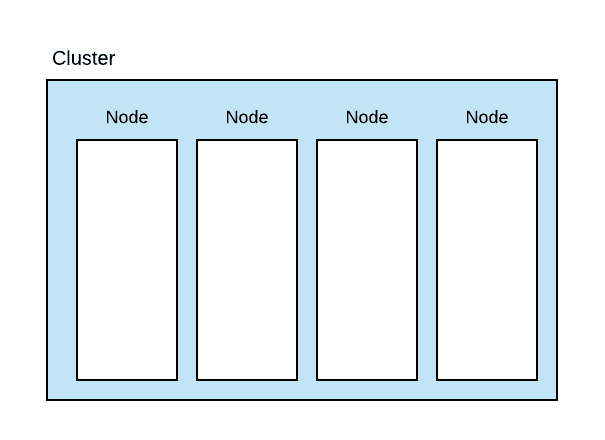
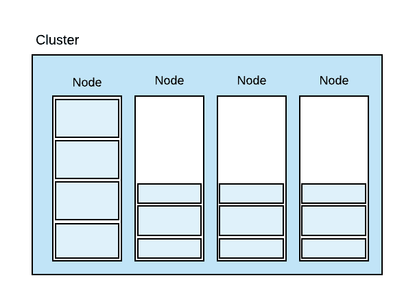
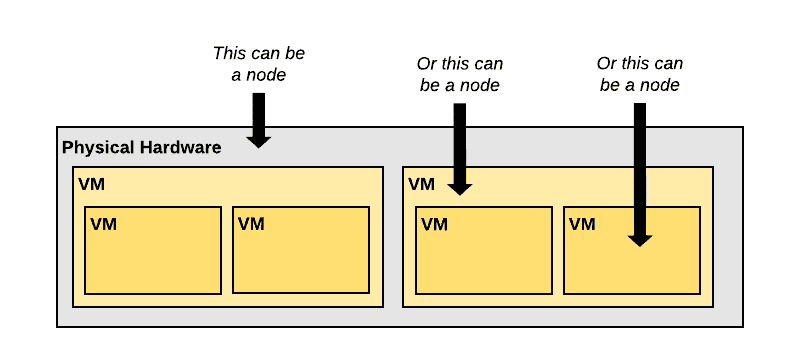
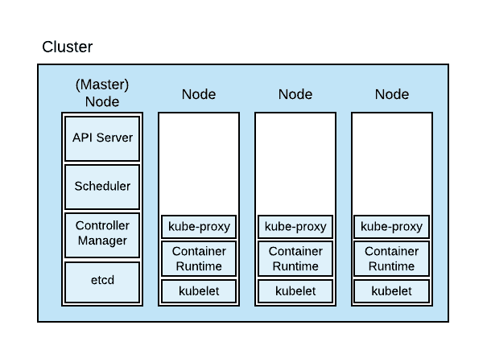
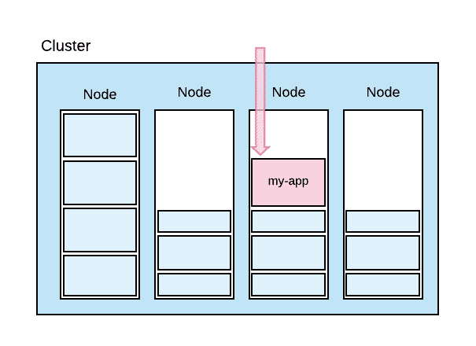
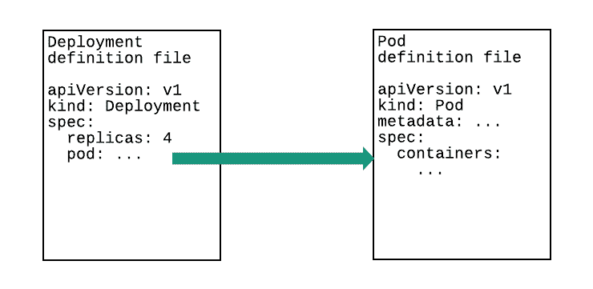
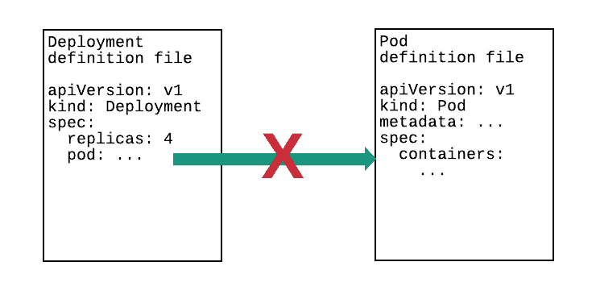
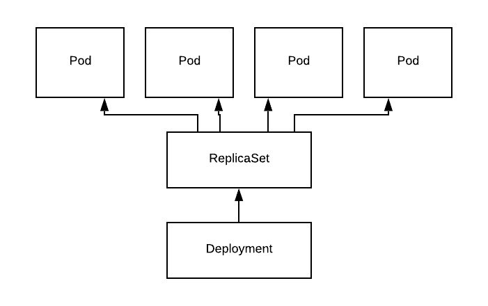
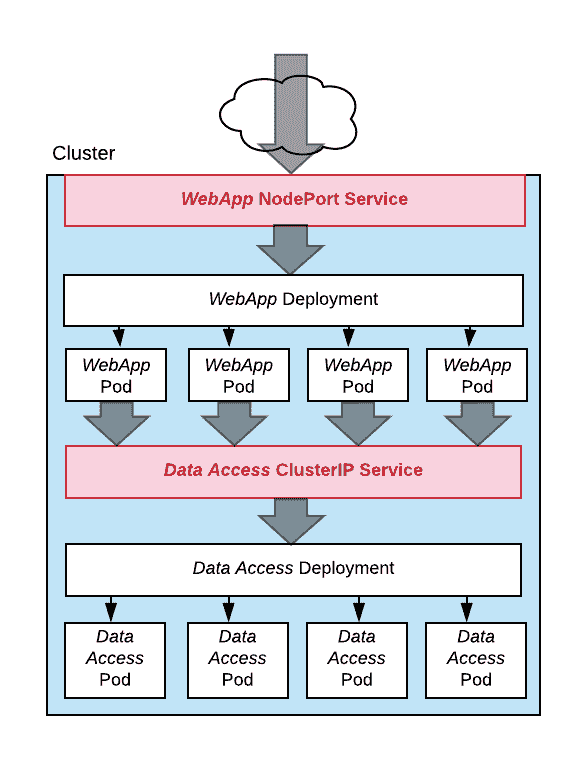
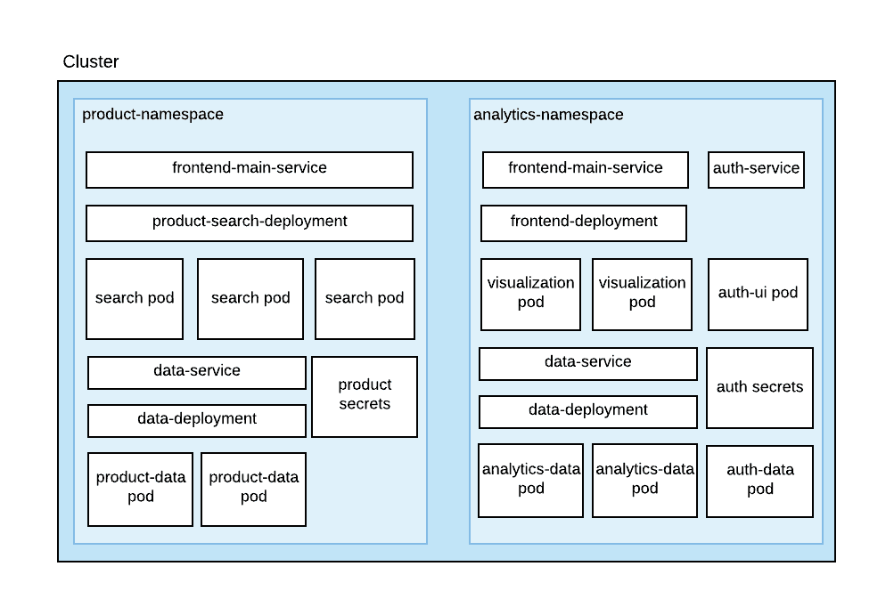

# Kubernetes 到底是做什么的？

> 原文：<https://levelup.gitconnected.com/what-does-kubernetes-do-anyway-fa4efc3b57f8>

## 你知道这是革命性的。你知道这是你应该学的东西。你只是不知道它有什么用。


丹尼尔·利维斯·佩鲁西在 [Unsplash](https://unsplash.com?utm_source=medium&utm_medium=referral) 上的照片

如果你开发软件，你会知道 Kubernetes 是最近的热门话题。随着 Kubernetes 的普及，它已经改变了我们部署应用程序的方式。它正迅速成为一种标准，越来越多的工程师被期望学习如何使用它。

除了当你弄不清楚它到底*做什么*的时候，你很难去了解它。

# 解释库伯内特的另一种方法

我最近经常使用 Kubernetes。但就在不久前，当我不断听到它的时候，我根本不知道它是什么。我花了很多时间在网上搜索，询问同事，阅读 Kubernetes 的书籍。最终，一些事情发生了，Kubernetes 突然明白了。事实证明，Kubernetes 相当简单——至少在概念上是这样。但是当你是一个初学者的时候，它确实看起来不是这样的。

回顾我读过的所有资料，似乎它们都集中在 Kubernetes 的“如何”上，并假设读者对“是什么”和“为什么”有基本的理解。

这是我希望在学习 Kubernetes 时就有的文章。在这里，我们将走一条不同于大多数其他在线资源的道路:

*   我们将研究导致库伯内特斯的历史。Kubernetes 并不是突然出现的，而是 devops 发展过程中的一个环节，以满足特定的需求。
*   我们将更多地关注概念，而不是技术细节。事实上，无论如何我都不是 Kubernetes 专家。虽然我不打算提供任何错误的信息(当然),但我将依靠隐喻和抽象来帮助理解这一点。
*   为了真正掌握 Kubernetes，我们将把重点放在作为工程师的你特别需要理解的事情上。

一旦你了解了 Kubernetes 存在的原因和它的作用，并从概念的角度理解了它，*然后*你就可以开始钻研现有的在线资源了。

# 回到过去

在我们进入 Kubernetes 之前，让我们从头开始。很久以前，当我们都还在学习“万维网”现象的时候。当人们刚刚意识到互联网不仅仅是一个学术上的好奇心，它实际上可能是一个赚钱的平台。

我们在谈论，像，几十年前。

当时，网站直接在硬件上运行。从字面上看，几乎每个“网络公司”都有巨大的空调房间(要么在内部，要么在数据中心),其中他们的服务器——披萨盒大小的金属盒，为他们的网站、数据库等提供动力——发出咔哒咔哒的声音，散发出热量和强烈的金属气味。

重要的是，出于安全和资源管理的原因，一个应用程序的一个实例运行在一台物理服务器上。这意味着 10 台 Apache 服务器(每台服务器都由一台 WebLogic 应用服务器支持)访问一个 Oracle 数据库需要 21 台物理服务器。此外，增加额外的容量来处理增加的负载实际上需要在机架中安装新的物理服务器。


那时候是这样的

它很贵。当涉及到测试之类的事情时，它也容易出错。很难确保测试环境与生产环境完全匹配，开发人员也不可能在任何类似生产的环境中进行本地测试。操作系统、应用服务器版本等方面的差异。在不同的环境中，无法保证在将变更部署到生产环境之前，能够对其进行充分的测试。

## 虚拟化

虚拟化开始改变这种状况。[虚拟机(VMs)](https://en.wikipedia.org/wiki/Virtual_machine) 的出现让我们可以在一台物理机上运行多个独立的操作系统实例。这意味着单个物理服务器现在可以托管多个应用程序，同时仍然保持应用程序隔离。与其在硬件上花费大量金钱，组织现在可以简单地花费大量金钱。


较好的

VMs 还提高了测试的可靠性。事实证明，在多个环境中部署单个虚拟机比让每台物理机都安装相同的补丁要容易得多，从而确保无论在什么环境中，应用程序总是运行在完全相同的操作系统版本和配置上。

## 容器和图像

集装箱更进一步。尽管容器与虚拟机非常相似(从概念上讲，我们可以简单地将它们视为更轻量级或更高效的虚拟机)，但容器利用了底层操作系统的大量功能。这种额外的效率提供了一些基本的好处。

首先，一台机器上可以运行更多的容器。这使得在虚拟机中运行容器变得非常普遍，许多虚拟机本身被部署到一台物理机上。


现在我们有所发现

此外，我们可以超越确保跨环境的一致运行时，而是将所有东西(操作系统、服务器、配置、*和*我们的应用程序代码)打包到一个不可变的映像中。然后，我们可以在本地桌面、QA、暂存和生产中运行该映像。这确保了我们在所有这些环境中进行一致的测试。

(术语的快速注释，以确保没有混淆。一个*映像*指的是我们创建并上传到存储库中的包。一个*容器*是该图像的一个运行实例。把图像想象成蓝图，而运行的容器是蓝图的表现。)

# 进入 Kubernetes

作为工程师，创建我们自己的图像很简单。例如，Docker 允许我们从一个基本图像开始，然后在上面叠加额外的图像。我们可以选择一个基础操作系统(比如 Ubuntu)，添加一个 Java 运行时作为另一个层，稍后添加我们的 JAR 文件作为另一个层，然后打包成一个映像。那么，目标就是将这些映像的运行实例部署为容器。

因此，我们已经创建了映像，准备部署到生产环境中。现在我们该怎么办？

我们第一次将它部署到生产环境中时，我们可能会手工完成。例如(假设我们可以访问我们的生产环境),我们可以执行如下内容:

```
docker run -d -p 80:8080 my-registry-loc/cool-application:1.0.0
```

瞧，我们的“酷应用”图像将作为一个运行容器启动。

但是我们每次都想这样启动我们的应用程序吗？大概不会。很快，我们会想做更多的事情，例如:

*   启动应用程序的多个并发实例来处理负载。
*   随着负载的增加，增加同时运行的实例数量…
*   …同样，随着负载的减少，实例的数量也会减少
*   重新启动任何崩溃或挂起的正在运行的实例
*   执行[滚动、淡黄色和蓝/绿色部署](https://dev.to/mostlyjason/intro-to-deployment-strategies-blue-green-canary-and-more-3a3)
*   对多个应用程序和服务执行上述所有操作

这将是非常令人生畏的手动实现。你说，写一堆脚本来实现自动化？嗯…也许吧。

或者，我们可以用 Kubernetes。因为*那个*就是它的用途。

## 快速定义

Kubernetes 是由 Google 构想出来的，来自另一个叫做 Borg 的内部容器管理系统。它现在是开源的，是第一批捐赠给[云本地计算基金会(CNCF)](https://en.wikipedia.org/wiki/Cloud_Native_Computing_Foundation) 的项目之一。

Kubernetes 这个名字是一个希腊词，意思是“舵手”或“领航员”(船的)。如今，Kubernetes 经常被缩写为 *k8s (* 即一个“k”和“s”，中间还有 8 个其他字符)。

k8s 通常被定义为一个*容器编排系统*。实际上，这意味着 k8s 是一个处理映像部署、管理容器的伸缩和负载平衡以及执行一系列其他相关操作的平台。

作为一名开发人员，这意味着什么呢？

## Kubernetes 是一个平台

为了与 Kubernetes 互动，你必须首先运行一个 Kubernetes *集群*。简而言之，k8s 集群是一组工作机，或者说*节点、*的集合，容器将被部署和运行到这些节点上。(我们稍后将更详细地讨论节点。)



集群实际上只是一堆节点…

此外，在该集群中，必须运行一个*控制平面*。控制平面是一组实际处理 Kubernetes 操作的组件。这些组件实际上作为集群节点中的容器运行，就像您自己的应用程序和服务一样。



…已经部署了一些容器

作为开发人员，*你不需要关心这些组件*。但是如果你好奇的话，我们会在稍后讨论它们，一旦我们了解了更多。

因此，在开始与 Kubernetes 交互之前，集群必须启动并运行。但是作为开发人员，您几乎永远不会参与它们的供应。那么，你在哪里可以找到一个呢？

*   *在您组织自己的数据中心*。在这种情况下，通常由专门的团队(例如运营团队)来创建和管理集群和控制平面。你永远都不需要处理它。
*   *使用云提供商*。谷歌云平台提供 [**GKE(谷歌 Kubernetes 引擎)**](https://cloud.google.com/kubernetes-engine) 作为运行 k8s 的绝佳地点。亚马逊网络服务提供 [**EKS(弹性 Kubernetes 服务)**](https://aws.amazon.com/eks/) 。Azure 还提供 [**Azure Kubernetes 服务(AKS)**](https://azure.microsoft.com/en-us/services/kubernetes-service/) 。当然，你需要告诉云提供商你想要为你的项目提供 Kubernetes，但是细节已经为你处理好了。
*   *本地*。 [**MiniKube**](https://kubernetes.io/docs/tasks/tools/install-minikube/) 是一个工具，它允许你在本地计算机上运行一个小型的单节点集群。它将自动创建集群和控制平面。然而，安装 MiniKube 本身所需的所有组件可能很棘手。
    更好的选择是 [**Docker 桌面**](https://www.docker.com/blog/get-to-know-docker-desktop/) 。它具有在您的机器上运行单节点集群的能力，并且它的[设置比 MiniKube](https://medium.com/@dt_23597/the-easiest-and-cheapest-way-to-try-kubernetes-for-yourself-d7367ff1d6e) 简单得多。

## 与 Kubernetes 互动

假设我们有一个可用的集群和控制平面。那么我们将如何使用 Kubernetes 呢？

使用 Kubernetes 作为开发人员，我们只需要两件事情。第一个是理解 YAML 文件的文本编辑器。我们会写很多关于 YAML 的文章。接下来是 [*kubectl*](https://kubernetes.io/docs/reference/kubectl/overview/) 命令行工具。*我们与 Kubernetes 的每一次互动都将通过 kubectl 进行。*

但是我们如何与 Kubernetes 互动呢？首先，重要的是要明白我们不会告诉 Kubernetes *去做什么。我们只是描述我们想要的状态。为了达到那种状态，Kubernetes 会想出该做什么，以及如何去做。*

这似乎是一个微妙的问题，但实际上非常重要。例如，假设我们想要我们的 my-app:v1.0.0 映像的两个实例，作为各有 500MB 内存的容器运行。如果 Kubernetes 的设计有所不同，我们可能会指示 Kubernetes:

*   使用我们的 *my-app:v1.0.0* 映像启动两个容器
*   给每个分配 500MB 的内存

据推测，Kubernetes 会尽职尽责地遵循我们的指示。现在想象一下，我们的一个容器变得不健康并崩溃了。不幸的是，Kubernetes 可能已经完成了我们的指示。我们将只剩下一个容器实例来处理所有的负载(当然，直到那个容器也崩溃)。

相反，我们只是描述我们想要的状态，Kubernetes 将确保我们的集群总是反映这种状态。这意味着 Kubernetes 将不仅推出我们的集装箱；它将持续监控集群，并在需要时采取措施。因此，如果我们的两个容器正在运行，其中一个崩溃，Kubernetes 将启动另一个。

正如你可能已经猜到的，我们在 YAML 文件中描述了这种理想状态。然后我们告诉 *kubectl* 将 YAML 文件中描述的状态应用到正在运行的集群。下面的`my-app-pod.yml`文件提供了一个简单的例子:

这里，我们已经指出，我们希望我们的`my-image-repo/my-app`映像的版本 *1.0.0* 在某个分配的内存范围内运行。我们将在命令行上用 *kubectl* 来应用它:

`kubectl create -f my-app-pod.yml`

然后，我们可以这样验证容器的当前状态:

`kubectl get pod my-app`

这是你将在 Kubernetes 上做的所有事情的简要介绍。

关于 *kubectl* 的一个小提示。我们知道我们的集群可以在任何地方运行(例如，在本地使用 MiniKube 或 Docker Desktop，或者使用云提供商，或者在我们公司的数据中心)。然而在任何情况下，kubectl 都在我们的桌面上本地运行。那么……它如何知道与哪个集群对话呢？kubectl 可能看起来有点神奇，但它也是通灵的吗？

事实上，我们可以配置多个集群通过本地 *kubectl* 实例进行访问。这些集群存储在本地的`~/.kube/config`。每个集群代表一个“上下文”， *kubectl* 将在任何给定的点在一个上下文下运行。因此，无论我们当前在哪个集群环境下运行，都是我们要与之交互的集群。

例如，您可能有一个本地 Docker 桌面集群，以及您组织的 GKE 集群。您可以使用
`kubectl config set-cluster ...`
命令添加每一个。您可以稍后使用
`kubectl config use-context *my-cluster-name*`在上下文之间切换。

# Kubernetes 的基本构件

现在，让我们看看 Kubernetes 给我们的积木。在其他 k8s 教程中，你可能会发现这些对象呈现得有些随意。相反，我们将从基础开始，然后研究它们是如何相互构建的。

需要理解的两个最重要的构建模块是*节点*和*pod*。如果你理解了它们，剩下的就一帆风顺了。

## 你的东西在节点上运行

我们之前提到过“节点”，在使用 Kubernetes 时，您会经常听到这个术语。节点可以简单地定义为一个运行 Kubernetes 工作负载的*逻辑机器*。

该定义的第一部分— *逻辑机器* —意味着一个节点既可以由一个物理硬件来表示，也可以由运行在物理硬件上的虚拟机来表示。事实上，一个节点也可以代表运行在另一个虚拟机中的一个虚拟机，而另一个虚拟机最终运行在物理硬件上。



一个节点可以映射到一个物理服务器、一个虚拟机或另一个虚拟机中的一个虚拟机…

作为开发人员，这对您意味着什么？本质上，您不知道——也不关心——节点在幕后映射到什么。您只关心在您的集群中已经创建了一个或多个逻辑机器——每个都有资源限制——并且您的每个容器都将被分配给一个。(好吧，这不完全是*说的*事实。一旦你熟悉了 Kubernetes，就可以*指定容器运行的节点，但这是大多数开发人员不需要担心的。*

请注意，群集中的节点在功能上可能有所不同(例如，可用内存、可用 CPU 等)。Kubernetes 的部分工作是确保容器在满足容器资源需求的节点上运行。

同样值得注意的是，一个集群可以由一个节点组成。事实上，MiniKube 和 Docker Desktop 都提供了*单节点集群*，在本地计算机上的单个虚拟机中运行。正如您可能猜到的那样，在单个节点上启动和运行多个容器是可能的，也是常见的。

前面，我们了解到 Kubernetes 的控制平面由运行在集群节点上的许多组件组成。虽然值得重申的是，作为开发人员，您不需要了解这些组件，但出于好奇，我们将在这里简要讨论它们。

首先，让我们充实之前的图像:



一个节点被视为*主节点*，在其上运行:

*   [*etcd*](https://etcd.io/) :维护集群状态的键值存储
*   *调度器*:顾名思义，它调度我们希望在集群上完成的所有事情
*   *控制器管理器*:监控集群并确保维持所需状态
*   *API 服务器*:提供 ReST API 发布命令，更新 etcd。事实上，当我们使用 *kubectl* 与集群通信时，这就是我们正在交谈的内容。

其余的节点——我们的容器将在其上运行——被称为*工作节点*。除了我们的容器之外，每个容器都运行:

*   kubelet :与 API 服务器通信的服务，管理 Pod 中的容器
*   *容器运行时*:运行容器的环境；例如码头工人
*   kube-proxy:实现容器、pod 和节点之间通信的组件

## 您的容器被部署为豆荚

所以我们的集群由一个或多个节点组成，我们在这些节点上运行我们的东西。但是这个*东西*到底是什么？正如我们之前讨论的，Kubernetes 的存在是为了将我们的图像作为容器来运行和管理。那么，我们是否简单地将 Kubernetes 指向我们想要部署的映像？

不完全是。当我们与 Kubernetes 互动时，我们就用 Kubernetes 对象来说话。Kubernetes 提供了许多现成的对象(我们可以向我们的集群添加其他 API 来提供额外的对象)。这些对象中最基本的一个你已经见过了:Pod*和*。

现在，把 Pod 想象成我们想要运行的图像的包装器。我们在 Pod 定义文件中定义了一个 Pod。在前面几节中，我们看了一个简单的 Pod 定义文件的例子；让我们再看一遍。

您可以马上看到，这不仅仅是简单地告诉 Kubernetes 您想要部署哪个映像。让我们检查定义文件的各个部分:

```
apiVersion: v1
kind: Pod
```

每个 Kubernetes 定义文件都将以参数`apiVersion`和`kind`开始。对于标准的 Kubernetes 对象来说，`apiVersion`通常等于 *v1* 或 *apps/v1* (对象的文档会告诉你其他的信息)。来自附加 API 的对象将具有不同的`apiVersion`;例如，来自 [Tekton](https://tekton.dev/) API 的对象可能有一个类似`apiVersion: tekton.dev/v1alpha1`的`apiVersion`值。

`kind`，正如你可能猜到的，表示我们正在定义的对象的种类。当然，这里我们定义的是一个 Pod。

```
metadata:
  ...
spec:
  ...
```

接下来，几乎所有的定义文件都将包含一个`metadata`和一个`spec`部分。在这里，我们给对象加上名字和标签，随着我们部署越来越多的对象，这些会变得很有用。在我们的示例中，我们将 Pod 命名为“my-app”。

`spec`是真正的肉的定义:

在它们的`spec`部分中，不同对象的定义文件将包含不同的子部分。在一个 Pod 定义文件中，我们将找到一个`containers`子部分。这里，我们定义了希望 Kubernetes 管理的容器。我们已经给了容器本身一个名称，并定义了要使用的图像。我们还提供了初始(250MB)和最大(500MB)内存分配(注意: *Mi* =兆字节)。

如前所示，一旦我们创建了 Pod 定义文件并用任意名称保存它(我们将使用`my-app-pod.yml`)，我们就可以通知 Kubernetes 我们希望这个 Pod 运行:

`kubectl create -f my-app-pod.yml`

此时，Kubernetes 将找到一个具有所需内存量的可用节点，并运行我们的 Pod。



然后我可以运行`kubectl get pod`，这将显示所有当前正在运行的 pod。如果一切顺利，结果会是这样:

```
NAME      READY STATUS  RESTARTS AGE
my-app    1/1   Running 0        30s
```

这表明我有一个单独的 Pod 在运行: *my-app* 。Pod 中的一个( *1/1* )容器准备就绪。Pod 已经运行了 30 秒，并且从未重新启动。

如果我们想要旋转 Pod，我们可以引用我们的 Pod 定义文件:

`kubectl delete -f my-app-pod.yml`

或者我们可以通过名字来终止 Pod:

`kubectl delete pod my-app`

现在，你可能已经注意到了一些事情。首先，定义文件需要一个`containers`，而不是`container`，子部分。此外，我们刚刚看到 *kubectl* 告诉我们在 Pod 中部署了多少容器。这是否意味着我们可以在一个 Pod 中部署多个容器？答案是:是的……但是现在不用担心。当我们讨论*边车*的时候，我们会探讨你什么时候以及为什么要这么做。

## 多个 pod 由部署管理

如果您在生产环境中使用过微服务，您可能会发现一些困扰您的问题。也就是说，在告诉 Kubernetes 部署单个 Pod 时，我们已经部署了单个容器。通常，为了处理负载和保持弹性，我们希望部署一个容器的多个实例。

为此，我们将转向另一个 Kubernetes 对象。

不久以前，我们会使用一个*复制集*。根据 Kubernetes 文档，副本集的目的是“在任何给定的时间保持一个稳定的副本集运行”。换句话说，ReplicaSet 确保指定数量的相同 pod 同时运行(同样是为了处理负载和确保弹性)。

*部署*是在复制集之后引入的。它们执行与副本集相同的功能(事实上，部署实际上是在幕后管理副本集),同时提供额外的功能。出于这个原因，为了运行一个容器的多个实例，我们现在更喜欢声明部署而不是复制集。

花点时间想象一下我们该如何做。我们已经创建了一个 Pod 定义文件，对吗？因此，我们的部署定义文件可能会定义要运行的 Pod 实例的数量，然后以某种方式引用我们现有的 Pod 定义文件来定义要运行的内容。



对吗？

你会这样想，但事实并非如此。



没有。

实际上，当我们创建一个部署定义文件时，我们实际上会*复制 Pod 定义文件的内容*:

注意一些事情:

*   *种*变成了`Deployment`
*   我们的*规格*部分看起来有点不同。具体来说，我们现在指出我们想要部署多少个*副本*(具体来说是 4 个)。*选择器*部分告诉我们 ***什么是我们想要的 4 个副本的*** (我们将在下面详细讨论)。
*   在我们的*规范*小节中，我们还有一个新的*模板*小节。在这里，我们定义了应该构成我们的部署的实际单元。我们使用`metadata:labels`部分为我们的 Pod 定义分配一个标签(`my-app-pod`)。然后我们从先前的 Pod 定义文件中复制&粘贴*规格*部分。(所以，是的，在部署定义文件中，我们将有一个*规范*部分嵌入到另一个*规范*部分中)。

让我们更详细地看看*选择器*部分，因为它有点混乱。您可能认为，在创建部署定义文件时，我们应该简单地告诉 Kubernetes 我们想要部署哪个 Pod。实际上，有一个间接的层次。让我们特别关注这一部分:

```
selector:
    matchLabels:
      app: my-app-pod
```

这里，我们告诉 Kubernetes**选择**包含**标签**的对象，该标签**匹配 *app: my-app-pod*** 。

现在让我们关注*模板*部分的这一部分:

```
template:
    metadata:
      labels:
        app: my-app-pod
    spec: 
      ... <pod definition> ...
```

请注意，在*规格*部分定义 pod 之前，该模板已被赋予**标签 ***app 的***:my-app-Pod**。因此，Kubernetes 将通过*和*来决定创建什么样的复制品。

这种间接性现在看起来可能有点奇怪。但是随着我们的集群变得越来越复杂，它变得越来越重要，随着您了解越来越多的 k8s 对象，您会经常看到这种模式。

如果我们将部署定义文件保存到一个`my-app-deployment.yml`文件中并运行

`kubectl create -f my-app-deployment.yml`

然后，我们将完成如下所示的部署:



请注意，实际的部署对象将被部署到集群中。反过来，部署在后台管理一个副本集，因此也部署了一个副本集对象。然后，如你所料，四个吊舱也将被部署。如前所述，我们不知道——也不关心——这些对象部署在哪个节点上。

# 其他 Kubernetes 对象

至此，我们已经介绍了 Kubernetes 的基础知识，包括两个常见的对象:pod 和部署。但是在使用 Kubernets 时，您可能会与更多的对象进行交互。虽然我们不会在这里创建一个详尽的列表，但是让我们来看几个更常见的 Kubernetes 对象，这样您就可以对那里有所了解。

## 服务

我们有一组容器在它们自己的舱里运行。现在我们该怎么办？

通常，我们希望以某种方式访问我们的 pod，为此，我们需要能够对我们的 pod 进行寻址。

我们可以查找我们的 pod 的 IP 地址，并使用它们来访问 pod。但是这也有一些问题。首先，pod 来来去去…它们的 IP 地址也是如此。每当 pod 的 IP 地址发生变化时，手动跟踪它们是不可行的。相反，我们需要某种形式的服务发现。第二，为了利用 pod 的部署，我们希望它们之间的流量负载平衡。

*服务*为我们执行这两项活动。服务是一个轻量级的 k8s 对象，它定义了 pod 的逻辑集合，以及访问它们的策略。换句话说，服务为一个或一组 Pod 提供稳定的寻址。有两种主要类型的服务:

*   ***ClusterIP*** 服务在 Kubernetes 集群内提供访问*。换句话说，它允许同一个集群中的不同 pod 相互查找和通信。*
*   ***节点端口*** 服务提供来自集群外部*的访问。例如，使用节点端口服务，我们可以使用本地 web 浏览器访问部署在集群内部的 web 应用程序。*

与其他 k8s 对象一样，我们在 YAML 文件中定义了一个服务，并使用 *kubectl* 应用它。此外，服务依赖于我们上面看到的“选择器”模式，以便识别它要提供寻址的 pod。一个小的示例 YAML 文件可能如下所示:

上面，我们创建了一个*节点端口* *服务*，它提供了对任何带有标签 *app: my-app-pod* 的 pod 的寻址，并将 Pod 的端口 80 作为端口 30080 向外界公开(不幸的是服务端口必须在 30000–32767 的范围内)。因此，它会将流量转发到其规范部分包含以下内容的任何 Pod 或部署的端口 80:

```
 metadata:
    labels:
      app: my-app-pod
```

因此，我们希望确保将该元数据添加到我们希望流量路由到的 Pod 或部署的定义文件中(并且该文件中只有*和*)!).



两种服务，红色。NodePort 服务提供对我们的 web 应用程序的外部访问，而 ClusterIP 服务允许 web 应用程序 Pods 从集群内部访问其他对象。

服务易于设置和使用，但有些过于简单。当您开发生产就绪系统时，您会发现存在更强大的寻址和负载平衡选项。

(注意:不幸的是，我们习惯于使用术语“服务”来表示正在运行的应用程序；即“微服务”的简称。使用 Kubernetes 时，请记住“服务”有特定的含义。)

## 名称空间

随着我们的组织和集群的增长，我们希望对容器和我们部署的其他对象进行逻辑分组。例如，我们可能希望将不同的功能应用程序组合在一起。或者我们可以隔离开发环境。或者，我们可能希望按垂直团队对应用程序进行分组。

我们使用*名称空间*来做到这一点。和服务一样，名称空间也是轻量级的 k8s 对象。它们允许我们在单个物理 k8s 集群中创建“虚拟集群”。



两个名称空间。注意相同名称的不同对象如何存在于不同的名称空间中。

同一命名空间中的对象可以直接访问。对于一个名称空间中的对象，要寻址另一个名称空间中的对象，必须使用另一个对象的完全限定域名(FQDN)。FQDN 的形式是`<service-name>.<namespace-name>.svc.cluster.local`，所以如果我们在“产品”名称空间中放置一个名为`my-app-internal-service`的服务，它的 FQDN 就是`my-app-internal-service.product.svc.cluster.local`。“分析”名称空间中的 Pod 将使用该 FQDN 来寻址`my-app-internal-service`。

名称空间定义文件非常简单:

```
 apiVersion: v1,
  kind: Namespace,
  metadata: 
    name: products
```

我们将通过向其他对象的定义文件中添加以下内容来放置这些对象:

```
apiVersion: apps/v1
kind: Deployment
metadata:
  name: my-ns-app-deployment
  **namespace: products**
...
```

一旦一个对象被部署在一个名称空间中，我们将需要向 *kubectl* 提供一个`-n`选项来告诉工具要查看哪个名称空间。例如，以下将无法定位`my-ns-app-deployment`:

`kubectl get deployment my-ns-app-deployment`

相反，我们需要以下内容:

`kubectl get deployment -n products my-ns-app-deployment`

Kubernetes 提供了一个“默认”名称空间，没有指定特定名称空间的对象被放入其中。到目前为止，在本文中我们看到的例子中，我们使用了默认的名称空间。

关于名称空间的另一个有趣的注意事项。回想一下，在我们关于 k8s 控制平面的讨论中，我们了解到 Kubernetes 自己的组件在集群中作为容器/pod 运行。这些组件运行在一个特殊的 *kube-system* 命名空间中。所以我们不会简单地通过`kubectl get pods`看到那些豆荚。但是`kubectl get pods -n kube-system`会起作用。

## 秘密

我们可能希望在定义文件中包含敏感数据。例如，不久前我想尝试将规范的 MongoDB 容器部署到我的本地 k8s 集群。正如您可能想到的，我需要指定用于我的 MongoDB 容器的凭证。最初，我的 MongoDB Pod 定义文件包括如下内容:

好的，这只是在我的本地集群中运行，这些显然是伪造的凭证。尽管如此，我还是不喜欢将*的任何*凭证作为明文传递的想法。

所以我创建了一个秘密定义文件:

您会注意到*用户名*和*密码*是 base64 编码的值。我按照找到的说明创建了它们，创建一个包含秘密值的文本文件，然后运行`cat secret.txt | tr -d \\n | base64`将值输入到我的秘密定义文件中(kubectl 也提供了一个`create secret`命令)。

现在我的 MongoDB 定义文件看起来更像这样:

实际上，base64 编码并不比明文更安全。但是将秘密从 Pod/部署定义文件中分离出来提供了一定的灵活性来支持事情。尽管如此，在组织的生产环境中，您不太可能看到秘密定义文件被签入源代码。

# 其他 Kubernetes 概念

当你了解 Kubernetes 的时候，你会听到其他的概念。下面是对其中一些概念的快速概述。

## 健康检查

我们已经讨论了 Kubernetes 在路由流量之前确保 pod 准备好处理流量，以及重新启动不健康的 pod。但是，Kubernetes 如何知道一个豆荚是准备好了…还是健康的？

这是通过健康检查完成的。从本质上讲，健康检查只是 Kubernetes(或任何其他想要检查系统健康的东西)可以 ping 通的一个 URL。成功的 *(20x* )响应表明运行状况良好，而失败的响应(通常为 *50x* …或超时)表明存在问题。


[在线营销](https://unsplash.com/@impulsq?utm_source=medium&utm_medium=referral)在 [Unsplash](https://unsplash.com?utm_source=medium&utm_medium=referral) 上拍摄的照片

过去，我们通常只提供一张支票。然而，Kubernetes 希望指定两种健康检查:一种是*准备状态*检查——表明 Pod 是否能够处理流量——另一种是*活性状态*检查——表明 Pod 是否健康。

为什么是两个？当然，两者之间有一些重叠。例如，内存不足的 Pod 既不能处理流量，也不健康。然而，在很多情况下，一个 Pod 可能是健康的，但是没有准备好处理流量；例如:

*   新启动的 Pod 可能需要先填充缓存，然后才能处理流量。很健康，但还没准备好。
*   Pod 可能无法连接到资源，如数据库。问题很可能出在数据库方面，但是在连接恢复之前，Pod 不应该处理流量。
*   一个 Pod 可能已经获得了一个长时间运行的 CPU 密集型任务，在此期间，我们不希望它接受任何更多的流量

如果一个 Pod 从它的*就绪*检查中得到一个失败的响应，Kubernetes 简单地停止向它发送流量，直到开始返回一个成功的响应。然而，如果 Pod 从其*活性*检查中得到失败的响应，Kubernetes 将认为 Pod 不健康并尝试重启它。

如果使用单一的组合健康检查，那么您可以想象我们的缓存填充 Pod 被一次又一次地重新启动，永远没有机会为流量提供服务！或者，如果 pod 在无法连接到其依赖项的任何时候报告为不健康，将会发生一连串的重启。

那么我们如何实施健康检查呢？假设我们的 pod 正在运行某种 ReST 或 RPC 服务器，只需添加两个端点:例如`GET /readiness`和`GET /liveness`。一般来说，活跃度端点应该比 ping 多一点，只需做很少的工作就可以立即返回。就绪端点可以检查与外部依赖性的连接，以及可能影响 Pod 处理流量的能力的任何其他条件。

一旦我们实现了端点，我们只需在 Pod/部署定义文件中声明它们:

## 操纵对象的其他方式

“配置即代码”是指像对待代码一样对待配置的实践:将配置登记到某个存储库中，跟踪变更，执行审查和批准，等等。如今，这被认为是一种最佳实践。正是由于这个原因，我们在讨论中的例子展示了如何使用 YAML 文件来创建我们的 Kubernetes 对象。

但是还有其他的方法。例如，以下简单命令将创建一个部署:

```
kubectl run my-app --image my-image-repo/my-app:1.0.0
```

我们还可以在运行时对现有对象进行更改。以下代码查找所有标有`app:my-app`的运行窗格，并对它们应用另一个标签`tier:frontend`:

```
kubectl label pods -l app=my-app tier=frontend
```

虽然使用这样的一次性命令更快，但是不要这样做。相反，在学习 Kubernetes 的同时练习编写定义文件。这些概念将会更快地被理解，并且您将会养成编写配置工件的习惯，并且遵守“按代码配置”的最佳实践。

## 舵图

假设我们已经创建了许多组成整个应用程序套件的组件。我们已经部署了 web 应用容器和后端微服务容器。我们已经创建了一个 ClusterIP 服务来允许 webapp 访问后端，还创建了一个 NodePort 服务，以便全世界都可以访问 webapp。也许我们也创造了一些秘密。我们已经为它们建立了一个命名空间。

现在，我们希望能够随意地将所有对象以适当的顺序部署到一个集群中。我们如何做到这一点？我们可以编写 shell 脚本。或者我们可以使用现有的工具来做这件事；即 [*掌舵*](https://helm.sh/) 。


弗兰克·艾弗特在 [Unsplash](https://unsplash.com?utm_source=medium&utm_medium=referral) 上的照片

严格地说，Helm 是作为 Kubernetes 的包管理器而创建的。也就是说， *Helm* 大致类似于 Maven、NPM、Pip 或者你选择的语言所使用的任何包管理器。依次， [*图表*](https://helm.sh/docs/topics/charts/) 代表包或库。

Helm 的一个典型用例可能是一个供应商，其产品由许多 Kubernetes 对象组成。供应商可以提供掌舵图，而不是向用户提供用户负责手动编辑和手动部署的少量 YAML 文件。从本质上来说，图表只是组织在公共目录结构中的文件的集合。最重要的部分是:

*   这个目录中(当然)有任意数量的模板。模板实际上是一个标准的 Kubernetes 定义文件，利用 [Go 模板语言](https://golang.org/pkg/text/template/)允许变量替换。
*   `values.yaml`这是图表用户可以编辑的文件。正如您可能猜到的，它包含用户可定制的值。模板文件中的许多变量都被替换为该文件中的值。
*   `Chart.yaml`这通常是一个小文件，包含关于图表的元数据。

Helm 是非常约定驱动的(感觉有点像 Ruby on Rails)，所以它不需要太多的配置。虽然 Helm 是作为 Kubernetes 的包管理器存在的，但是在您使用自己的本地 Kubernetes 集群进行实践时，您可能会发现它很有用。这肯定比维护手写的 shell 脚本要好！

## 边车

不久前，我们注意到在一个 Pod 中运行多个容器是可能的(现在也很常见)。事实上，Pod 配置文件的`containers`部分就是这样命名的——容器——我们可以在那里轻松地定义多个映像。


由[奥地利国家图书馆](https://unsplash.com/@austriannationallibrary?utm_source=medium&utm_medium=referral)在 [Unsplash](https://unsplash.com?utm_source=medium&utm_medium=referral) 拍摄的照片

在 Kubernetes 世界中，我们就是这样实现*边车*模式的。在边车模式中，两个或多个集装箱作为一个单元展开。它们一起启动，一起扩展，一起重启(如果需要)，一起销毁。

此外，容器不是任何任意的容器。一个容器是应用程序容器——基本上，这是 Pod 的首要原因。其他容器为应用程序容器提供支持功能。与摩托车边车非常相似，边车容器增强了应用程序容器；没有它，它就不会存在或发挥作用。

为什么我们要在一个单元中部署多个容器？考虑一个典型的微服务架构。虽然不同的微服务归不同的团队所有，但整个组织都希望在跨领域的关注点上实现标准化。例如，服务可能需要相互传递特定的头。数据在传输时可能需要加密(并在接收后解密)。日志应该以指定的格式发送到指定的位置。

传统上，我们会开发一个内部框架来处理这些跨领域的任务。但是越来越多的时候，我们开始了解到自主开发的框架所带来的问题。首先，他们将我们的组织限制在单一语言或平台上(当然，除非我们计划为多个平台构建和维护我们的框架)。将我们所有的服务持续升级到框架的最新版本也很困难。


左图:我们曾经在可执行应用程序中包含横切代码。右图:边车就不是这样了。

但是有了 Kubernetes，我们可以从那些横切任务中制作一个图像，并把它作为一个容器与我们的应用程序容器一起部署。此外，我们可以只将边车暴露给外部流量，从而确保在流量到达应用服务器之前，TLS 终止、解密等都得到处理，并且标题、日志、指标等都得到统一和自动的处理。

通过这样做，我们避免了框架所面临的问题。我们的 sidecar 服务可以用 Golang 编写，而我们的团队可以用 Java、Node、Python 等编写微服务。升级到 sidecar 的最新版本比升级到 framework 的最新版本要容易得多。最坏的情况是，每个团队在他们的定义文件中手工改变 sidecar 服务的版本号。在最好的情况下，我们的运营团队会在部署 pod 时自动注入 sidecar 服务，从而消除了单个团队的任何工作。

## 服务网格

如果你听说过 Kubernetes，你可能也听说过很多关于服务网格的事情。与 Kubernetes 一样，很明显，它们在微服务领域正变得越来越重要。同样，什么是服务网格*是*也不是很明显。

为了理解服务网格，让我们快速后退一步来理解催生服务网格的需求。成功的微服务架构依赖于某些交叉概念:

*   ***服务发现*** :随着微服务的部署和取消部署，其他服务需要知道如何找到它们并解决它们。
*   ***负载平衡*** :为了利用一组相同的服务，必须智能地分配流量。
*   ***可观察性*** :必须发布指标，以便可以创建仪表板和警报。日志必须包括跨度和跟踪 id，以允许分布式跟踪。
*   ***弹性*** :执行同步网络调用的微服务应该支持自动重试、断路器和其他弹性模式。


照片由 [Ricardo Gomez Angel](https://unsplash.com/@ripato?utm_source=medium&utm_medium=referral) 在 [Unsplash](https://unsplash.com?utm_source=medium&utm_medium=referral) 拍摄

为了标准化和实施这一点，组织通常依赖于框架。但是正如我们在 sidecar 部分所讨论的，笨重的框架已经被证明会引起问题。

好消息是。在理解我们关于边车的讨论时，您已经理解了服务网格是做什么的。实际上，您可以将服务网格视为一个基础设施层，通过 sidecar 容器实现，处理那些横切概念。

Istio (开源并由 Google、IBM 和 Lyft 支持)可能是最常见的服务网格产品。Istio 通过利用现有的开源 sidecar 代理， [Envoy](https://www.envoyproxy.io/) (由 Lyft 开发)来实现这一点。

当然，真正掌握和学习服务网格还有很多事情要做。但从概念上讲，它们就是这么简单。

# 下一步是什么？

到目前为止，您应该已经理解了 Kubernetes 存在的原因以及它的作用。现在是时候[建立你自己的集群](https://medium.com/@dt_23597/the-easiest-and-cheapest-way-to-try-kubernetes-for-yourself-d7367ff1d6e)了，开始玩吧。

有许多在线教程和课程。但是我发现最好的学习方法是规划你自己的道路。在我学习的过程中，我给自己的任务变得越来越复杂，当我陷入困境时，我会求助于在线文档(这是很多！)

所以，拿出你自己的示例应用程序——用你对 Kubernetes 能为你做什么的理解武装起来——弄清楚如何完成它！

# 资源

*   https://kubernetes.io/docs/reference/kubectl/overview/
*   【https://helm.sh/docs/topics/charts/ 
*   [https://istio.io/docs/concepts/what-is-istio/](https://istio.io/docs/concepts/what-is-istio/)
*   [https://www . oreilly . com/library/view/designing-distributed-systems/9781491983638/ch02 . html](https://www.oreilly.com/library/view/designing-distributed-systems/9781491983638/ch02.html)
*   [https://rollout . io/blog/configuration-as-code-everything-need-know/](https://rollout.io/blog/configuration-as-code-everything-need-know/)
*   [https://cloud . Google . com/blog/products/GCP/kubernetes-best-practices-setting-up-health-checks-with-readiness-and-liveness-probes](https://cloud.google.com/blog/products/gcp/kubernetes-best-practices-setting-up-health-checks-with-readiness-and-liveness-probes)
*   [https://kubernetes.io/docs/concepts/](https://kubernetes.io/docs/concepts/)
*   [https://en.wikipedia.org/wiki/Kubernetes](https://en.wikipedia.org/wiki/Kubernetes)

觉得这个故事有用？想多读点？只需[在这里订阅](https://dt-23597.medium.com/subscribe)就可以将我的最新故事直接发送到你的收件箱。

你也可以支持我和我的写作——并获得无限数量的故事——通过今天成为媒体会员。