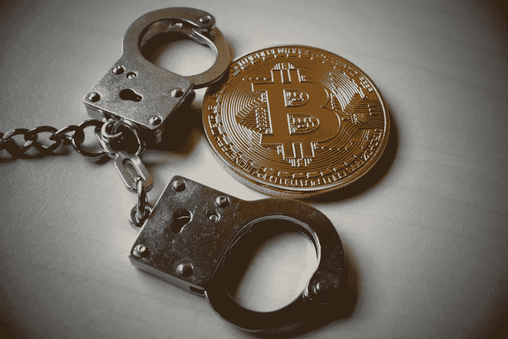
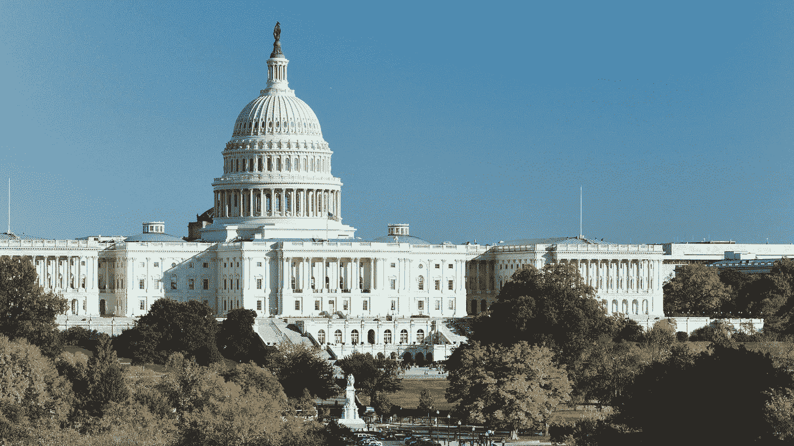
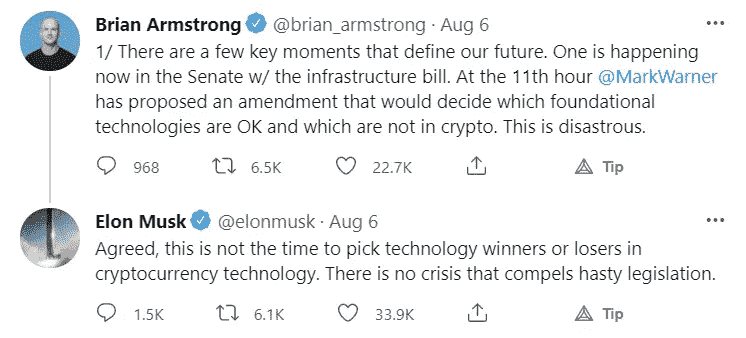
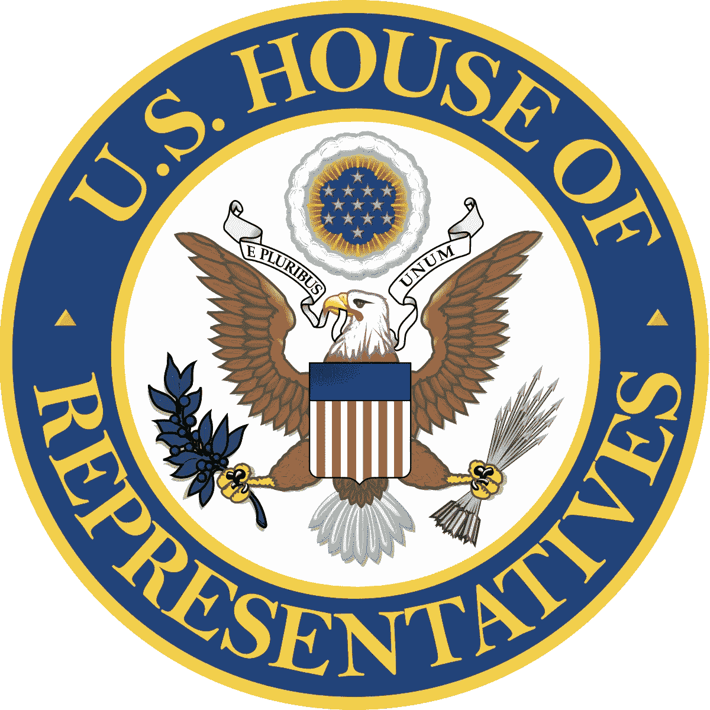

# 基础设施法案中的加密货币部分对美国的 Crypto 意味着什么？

> 原文：<https://levelup.gitconnected.com/what-does-the-cryptocurrency-portion-of-the-infrastructure-bill-mean-for-crypto-in-the-united-18f1531a8b77>

最近，美国迈出了对加密货币征税的第一步。美国基础设施法案的具体措辞将要求加密货币的几乎所有人，包括矿工、赌注者、钱包创造者和 DeFi 开发者，对他们的用户执行 KYC，这几乎是不可能的。幸运的是，还有许多年才会生效，还有许多机会修改立法。

美国正开始以非正统的方式推动对加密货币的监管和征税。政客们没有举行听证会、听取专家意见和起草法案，而是将加密立法偷偷纳入基础设施法案，这是一项描述美国将在哪些方面花钱以及这些钱将来自哪里的大型法案。

基础设施法案涵盖了高速公路和道路支出、军事支出和宽带连接等主题。总的来说，这些改进将花费政府 1 万亿美元，并将通过税收支付。到目前为止，加密货币在美国没有税收指导，被选为产生约 280 亿美元税收的一种方式。

该法案中的这一部分指出，数字资产的经纪人需要报告税务信息，并将经纪人定义为“负责代表他人定期提供实现数字资产转让的任何服务的任何人。”

这句话的主要问题是经纪人的定义是多么模糊和宽泛。目前，这可能包括交易所，矿工，赌注代表，甚至硬件钱包制造商。对于像 delegates 这样的实体，他们只知道他们的委托人的地址，其他什么都不知道，这种类型的法律是不可能执行的，因为它需要委托人向每一个委托他们加密货币的人发送税务文件。这不仅是荒谬的，而且也不可能正确执行。这将有效地摧毁美国的加密货币行业，因为没有人能够遵守法律，并且必须在关闭或坐牢和支付罚款之间做出选择。

由于许多知名投资者和科技巨头反对该法案，如埃隆·马斯克、杰克·多西和马克·库班，政客们面临着尽快改变措辞的巨大压力。

参议员卢米斯、图米和怀登对该法案提出了修正案，但遭到了参议员谢尔比的反对，他从银行获得了近 50 万美元的捐款。

尽管这项法案现在已经由参议院正式通过，对密码行业来说将是毁灭性的，但在该法案正式成为法律之前还有很长的路要走。首先，该法案必须通过众议院，在那里将由 400 多名政治家进行审查和修改。众议院可能会有人希望修改该法案，以更好地接受加密货币，因为这将是一个巨大的受欢迎程度，特别是在明年举行选举的情况下。

即使该法案在众议院获得通过，在未来几年仍有机会对其进行修改。这是可能的，因为 [SEC](https://en.bitpush.news/articles/tag/sec) 和其他监管机构将在 2022 年开始发布对加密货币行业的监管，这可能会推翻或澄清经纪人的定义。证交会现任主席加里·詹斯勒(Gary Gensler)是麻省理工学院区块链分校的教授，因此他应该知道这条法律有多么不可执行，而且需要修改。

最后，如果所有其他措施都失败了，这部法律要到 2023 年才会生效，这将给所有加密公司和实体充分的机会来绕过这项立法，或者完全转移到不同的国家。

尽管这项立法似乎对加密货币行业非常不利，但很可能在未来几年内会发生一些事情，解决该法案的问题，政府将采取更有利于加密的立场。随着加密货币在世界各地被研究和采用，如果他们不主动采用和接受加密货币，以及它们以就业和税收形式为国家带来的数十亿美元，美国将会落后。

林肯·穆尔