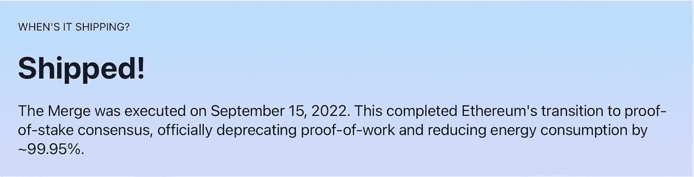
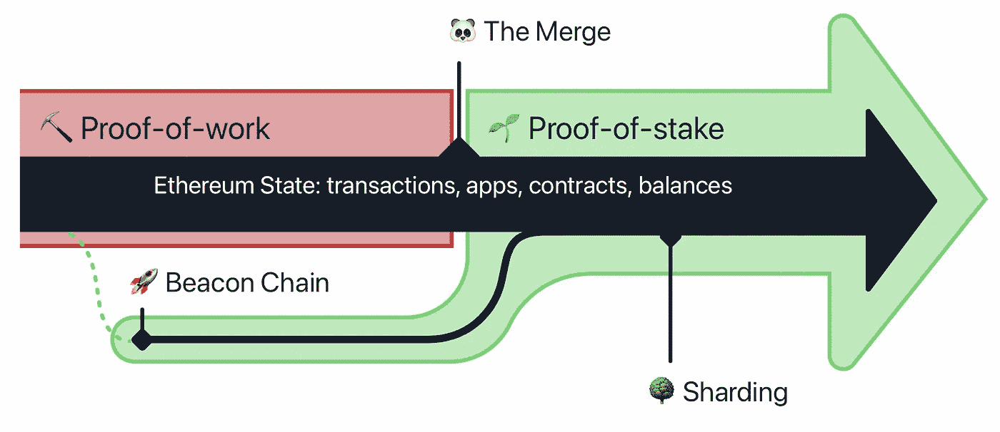
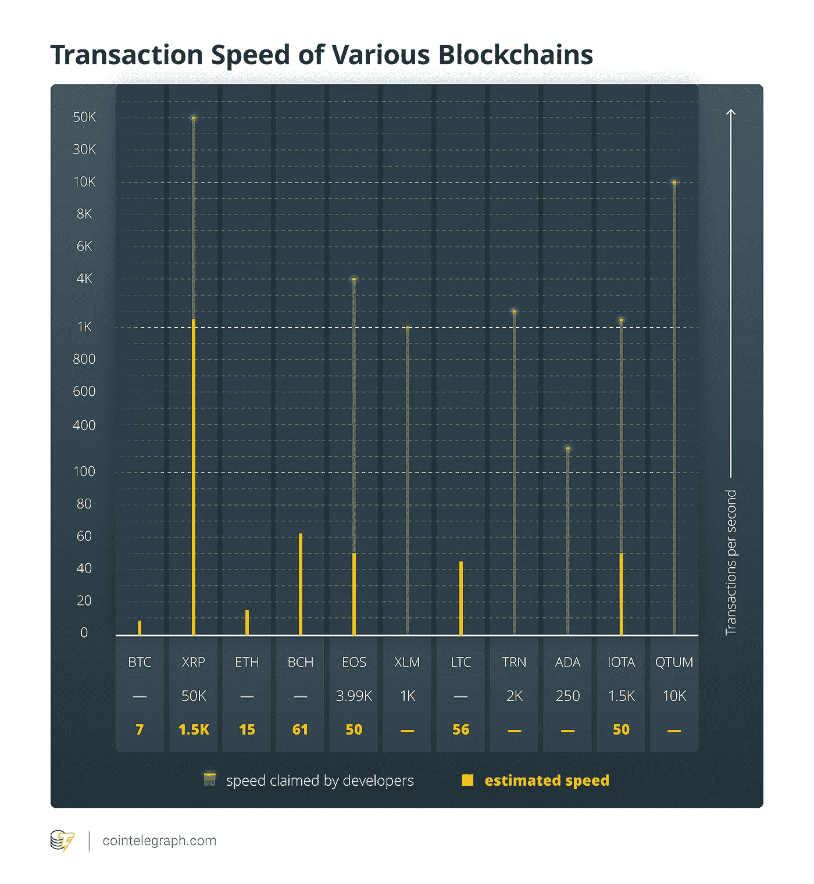

# ETH 合并是什么意思

> 原文：<https://levelup.gitconnected.com/what-eth-merge-means-8531bf23b4fd>


信用:[以太坊](https://ethereum.org/en/upgrades/merge/)

在撰写本文时，期待已久的 ETH 合并过程已经完成。



信用:[以太坊](https://ethereum.org/en/upgrades/merge/)

这对世界意味着什么？对金融界来说，非常重要。更重要的是，科技世界。

# ETH 合并是什么意思:

ETH 合并不是一个过程。相反，这是区块链经历了五年之久的以太坊转型的终结。

以太合并是一个时间点(关键时刻)，标志着这一过渡的结束，在此期间，以太坊区块链从一种工作模式( **PoW** )过渡到另一种工作模式( **PoS** )。

为了测试，一段时间以来，这两种模式一直共存。从现在开始，一个(PoW)将不复存在，另一个(PoS)将取而代之。



信用:[以太坊](https://ethereum.org/en/upgrades/merge/)

权力意味着工作证明。PoS 表示利害关系的证明。

# 区块链的工作证明是什么:

自发明比特币以来，区块链一直以铸造代币和处理交易为基础。这两种结果都发生在计算机解出谜题之后(被称为区块链节点)。

区块链越大，解谜需要的时间就越长，因为每台计算机都必须参与这个过程。这是去中心化的主要要求之一，在这种情况下，没有单个服务器决定事务的成功/失败。

一个 BTC 矿井或 BTC 交易意味着几台计算机同时试图解决一个难题，其中一台随机提出一个解决方案。这就是为什么 BTC·区块链的模式被称为**工作证明**。

从早期开始，ETH 就遵循同样的 **PoW** 交易处理模式。

任何程序员都知道，这不仅耗时，而且是一个非常耗能的操作。这无疑是昂贵的，以至于 GPU 制造公司(NVidia，AMD 等)在整个加密十年期间榨取了这种趋势。

根据这篇 [2019 文章](https://cointelegraph.com/news/who-scales-it-best-inside-blockchains-ongoing-transactions-per-second-race)，VISA 网络有能力处理大约 1700+ TPS(每秒交易量)。相比之下，cryptos(不包括 XRP，因为它由银行所有，所以没有真正分散)落后得多(ETH 大约为 20 TPS):



来源:硬币电讯报

# 为什么以太坊必须与众不同？

如果一个金融网络每秒只能处理 **< 20 笔交易**，那么它就不存在于其创造者的爱好之外。它不能运行世界货币——这是以太坊区块链后的目标之一。

以太坊必须比比特币好 100 万倍:它不是作为价值储存手段(纸币/黄金)设计的，而是作为一个框架来实现这么多目标:

*   为了帮助 DApp(分布式应用程序)开发人员从世界各地找到可以运行的节点(计算机)
*   为节点所有者的计算能力和事务存储付费
*   消除中间人
*   像银行中间人那样保护整个事情，也许更好。因为不安全感也有一个根源是过度集权。

以太坊是这个框架的名字。ETH (Ether)是它操作的代币，就像美元是国际货币一样。

# 什么是基于区块链的股份证明:

以太坊的开发者仔细考虑了这一点，并提出了一个计划，不仅消除了 PoW 的低效率，还扩大了网络规模，以服务于其真正的意图:满足并超越传统的交易网络，如 VISA 和 MasterCard。

解决方案是利用一个新颖的方案来验证交易:**利益证明(PoS)。**

这意味着只有在区块链以太坊投资的节点**可以验证交易，其他任何人都不能。哎呀，这就是去中心化。因此没有独立的节点会进行验证。相反，所有节点将投票确认交易是否合法。**

同样，这些节点需要*投入*以太坊区块链。

在以太坊的行话中，这笔投资被称为**股权**。只有你下注 32 个 ETH 令牌(或者今天 32 ~ 48000 美元的倍数)，才能成为验证器节点。(交易所将小股东集合在一起，以确保每个人都能参与并受益)

BTC 交易类似于你的主管观察你朝九晚五的工作，并在一天结束时付给你报酬。

ETH 交易(基于 PoS)类似于你购买股票/单位，你的投资公司在你睡觉的时候把股息存入你的账户。

# 合并能达到什么目的？

首先，它将开始以激烈的方式拯救地球。

以太坊区块链声称，过渡到 PoS 将减少 99%以上的能源节约。

转换到 PoS 的两个副作用是:

1.  ETH 将不再被开采。ETH 供应将开始减少。ETH 将变得通货紧缩。这将导致需求的增加，尤其是因为它能够运行 Deci 应用程序(也就是 NFTs)
2.  ETH 可以被标桩。这将允许地球上的任何人验证 ETH 交易。一个赌注 ETH 代币可以获得大约 5%的回报(类似于利息)

但最重要的是，由于验证交易的计算更简单，ETH 将实现难以想象的实时交易速度，有可能超过 VISA 和 MasterCard。

维塔利科的以太坊目标

但是如果事务计算太简单，如何实现安全性呢？毕竟，去中心化必须包括更好的节点表现，以确保没有一方可以通过拥有超过 50%的网络来破坏整个区块链。以太坊将使用一个名为**分片**的巧妙架构方案来实现这个目标。

## 什么是分片:

```
Ethereum 2.0 will distribute transaction blocks among smaller sub-chains called **shards**. A random notary validator (one of the 32 ETH stakeholders) within a shard would validate the blocks assigned to it. All such validated block-vote numbers will then be validated by the main Ethereum blockchain. If you find it difficult to grasp, just consider State elections sending elected representatives to the parliament.
```

分片将确保 3 个目标都不会被牺牲:去中心化、安全性和可伸缩性。(详细解释，[看这个](https://education.district0x.io/general-topics/understanding-ethereum/ethereum-sharding-explained)。)

# 结论:

> 与 BTC 不同，瑞士联邦理工学院有潜力推动有机需求。

它将使大量的 DApps 以一种更快、更难以想象的方式利用以太坊网络。

这将在 DApps 市场创造一个强烈的繁荣。会写 Solidity(智能合约的语言)的程序员会很吃香。

这一天无疑是历史性的。如果说有什么东西紧随其后，那就是苹果在 2007 年推出的 app store，它带来了一个围绕移动应用开发的全新生态系统。

如果区块链周边的法规顺利通过，以太坊将会实现它梦想中的革命。

BTC 可能是迄今为止密码王国的国王。有一天可能会达到 100 万美元。理论上可以降到 500 美元，抹去 Satoshi 的大部分财富。它是不可预测的，因为它只不过是一种价值储存手段。它的价值将永远取决于世界人口的情绪。

在黄金和政府支持的菲亚特，BTC 有了竞争对手。

由高性能以太坊区块链支持的 ETH 有潜力推动有机需求。整个 NFT + Defi 产业都依赖于以太网。他们需要 ETH 令牌来支付在其上运行的计算时间。

不用说，在接下来的几天、几个月和几年里，ETH 的采用将会激增。

不像 BTC，它不是密码王国的国王。

它是国王的创造者，而且会一直存在下去。

## **阅读更多**:

[](/how-blockchain-works-878bd6baf30) [## 区块链如何工作

### 一个网络开发新手的入门加密+NFT

levelup.gitconnected.com](/how-blockchain-works-878bd6baf30) [](https://medium.com/swlh/will-tesla-buy-ether-66ca2027557e) [## 特斯拉会买以太吗？

### 它能做的远不止这些。

medium.com](https://medium.com/swlh/will-tesla-buy-ether-66ca2027557e) 

想看完每一个介质故事？使用此链接成为会员[。你的会员费的一部分将支持笔磁铁的写作。](https://tipsnguts.medium.com/membership)

想在每次 Pen Magnet 发布时收到电子邮件吗？[点击这里加入他的订户名单](https://tipsnguts.medium.com/subscribe)。

[笔磁铁**笔磁铁**笔磁铁](https://tipsnguts.medium.com/)是流行的高级开发者访谈电子书的作者:

[**【高级开发人员面试综合方法(40+例题)**](https://tipsnguts.gumroad.com/l/crrzat/)

# 分级编码

感谢您成为我们社区的一员！在你离开之前:

*   👏为故事鼓掌，跟着作者走👉
*   📰查看更多内容请参见[升级编码刊物](https://levelup.gitconnected.com/?utm_source=pub&utm_medium=post)
*   🔔关注我们:[Twitter](https://twitter.com/gitconnected)|[LinkedIn](https://www.linkedin.com/company/gitconnected)|[时事通讯](https://newsletter.levelup.dev)

🚀👉 [**加入升级人才集体，找到一份神奇的工作**](https://jobs.levelup.dev/talent/welcome?referral=true)