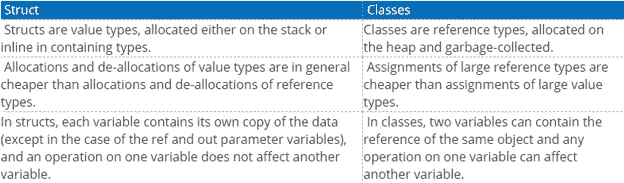
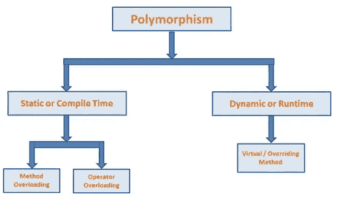
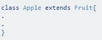
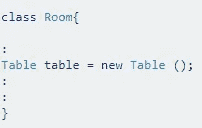
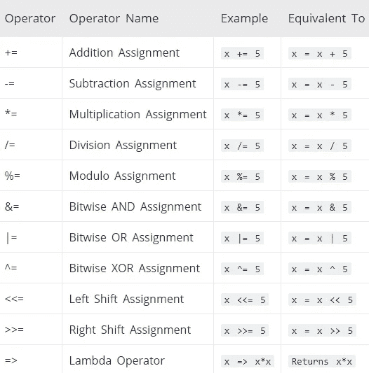
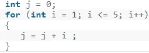
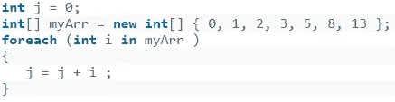

# 每个初学者应该知道的关于 OOP 的知识

> 原文：<https://levelup.gitconnected.com/what-every-beginner-should-know-about-oop-e21719634911>

面向对象编程是一种基于“对象”概念的编程模型，它可以包含字段形式的数据和过程形式的代码。对象的一个特性是对象自己的过程可以访问并经常修改它自己的数据字段。如果您开始学习 OOP，那么这里讨论的这些主题应该会帮助您更好地理解。

在 [Unsplash](https://unsplash.com?utm_source=medium&utm_medium=referral) 上由 [Max Duzij](https://unsplash.com/@max_duz?utm_source=medium&utm_medium=referral) 拍照

# **阶级 vs 对象**

在面向对象编程中，**类**是创建**对象**(一种特定的数据结构)、提供状态初始值(成员变量或属性)和行为实现(成员函数或方法)的蓝图。每个对象被认为是一个特定类的实例，例如，这里的类“car”是其他对象如“polo”、“mini”和“beetle”的蓝图。它们都有不同的颜色值，但都遵循汽车的蓝图形式。

**对象**是一个类的实例。对象可以彼此交互，而不必知道它们内部代码的所有细节。同一类可以同时存在多个实例，这意味着同一类可以有多个对象。

# **类与结构**

类的主要区别在于它提供了组合数据和方法(函数)的灵活性，并提供了被称为继承的可重用性。结构通常应该用于对数据进行分组。Class 是通过引用传递的，Struct 是通过复制传递的，这意味着 Class 是引用类型，它的对象是在堆内存中创建的，而 structure 是值类型，它的对象是在堆栈内存中创建的。

类仍然适用于较大或复杂的对象，并且还允许在对象被释放之前执行清理(垃圾收集器),因为垃圾收集器在堆内存上工作，另一方面，结构适用于小的、隔离的模型对象，并且不能是垃圾收集器，因此没有有效的内存管理。

# **OOP 基础:构造器、解构器、重载与覆盖**

在面向对象编程中，**构造函数**是一种特殊类型的子程序，被调用来创建一个对象。它准备新对象以供使用，通常接受构造函数用来设置所需成员变量的参数。

在面向对象编程中，**析构函数**给对象最后一次机会来清理它所分配的任何内存，或者执行任何其他必须在对象被销毁之前完成的任务。

在面向对象编程中，**重载**指的是使用一个标识符定义一个类的多个方法的能力，这些方法的输入和输出参数不同。当重载方法在概念上执行相同的任务，但参数集略有不同时，通常会使用重载方法。

在面向对象编程中，**覆盖**功能，使子类能够为已经在其父类或父类之一中定义和/或实现的方法提供不同的实现。子类中被重写的方法应该与其父类中的方法具有相同的名称、签名和参数。

# **多态性**

在面向对象编程中，**多态性**指的是一种编程语言根据对象的数据类型或类来不同地处理对象的能力。更确切地说，是为派生类重定义方法的能力。它经常被表达为“一个界面，多种功能”。

C#中有两种类型的多态性:*编译时多态性*和*运行时多态性*。**编译时多态性**是通过 C#中的方法重载和运算符重载实现的。也称为静态绑定或早期绑定。**运行时多态性**通过方法覆盖实现，也称为动态绑定或后期绑定。

# **区别“是一个”和“有一个”的对象关系**

在面向对象编程中，关系是完全继承。继承的类被称为子类或子类。这意味着子类是父类的一种类型。例如，苹果是一种水果。所以你会伸出水果去拿一个苹果。

在面向对象编程中，HAS-A 关系是动态(运行时)绑定，而继承是静态(编译时)绑定。如果你只是想重用代码，并且你知道这两者不是同类的，那么就使用组合。例如，你不能从厨房继承一个烤箱。厨房有一个烤箱。当你觉得有一种天然的关系，就像苹果是一种水果一样，使用遗传。

# **类 vs 接口**

接口提供了指定如何创建对象的契约，而不关心它们如何做事情的细节。接口是一种引用类型，它只包含抽象成员，如事件、方法、属性等。并且它没有任何成员的实现。

类有定义和实现，而接口只有定义。类可以实例化，但接口不能实例化。您可以创建实现接口的对象的实例。类是一个完整的实体，有成员、方法以及定义和实现。接口只是一组定义，您必须在继承该接口的类中实现这些定义。

# **坚实的原则**

在面向对象的计算机编程中，SOLID 是五个设计原则的助记首字母缩写词，旨在使软件设计更易于理解、灵活和维护。

***单一责任原则*。**一个类应该只有一个单一的职责，也就是说，只有对软件规范的一个部分的更改应该能够影响到这个类的规范。

***开放原则。*** 开/闭原则说明软件实体(类、模块、函数等。)应该对扩展开放，但对修改关闭。

***利斯科夫替代原理。*** 这个大概是第一次被介绍时最难缠的一个了。如果 S 是 T 的子类型，那么 T 类型的对象可以被 S 类型的对象替换。

***界面分离原理。不应该强迫任何客户端依赖它不使用的方法。更简单地说，不要通过添加新方法来为现有接口添加额外的功能。***

***依存倒置原则。*** 这是一种解耦软件模块的方法。这个原则声明高级模块不应该依赖于低级模块。两者都应该依赖于抽象。抽象不应该依赖于细节。细节应该依赖于抽象。

# **多重继承**

多重继承是一些面向对象的计算机编程语言的特征，其中一个对象或类可以从一个以上的父对象或父类继承特性和特征。它不同于单一继承，在单一继承中，一个对象或类只能从一个特定的对象或类继承。

在面向对象编程(OOP)中，继承描述了两个类之间的关系，其中一个类(子类)是父类的子类。子代继承父代的方法和属性，允许共享功能。

# **操作员**

运算符是用于对操作数执行运算的符号。操作数可以是变量和/或常数。

**基本赋值运算符**，(=)用于给变量赋值。

**算术运算符**用于执行加、减、乘、除等算术运算。

**关系运算符**用于检查两个操作数之间的关系。如果关系为真，结果将为真，否则，结果将为假。关系运算符用于决策和循环。

**逻辑运算符**用于执行逻辑运算，如与、或。逻辑运算符对布尔表达式(真和假)进行运算，并返回布尔值。逻辑运算符用于决策和循环。

一元运算符与其他运算符不同，它们对单个操作数进行运算。

**三元运算符**？:对三个操作数进行操作。它是 if-then-else 语句的简写。三元运算符的工作方式如下:
—如果 Condition 所述的表达式为真，则 Expression1 的结果被赋给变量。
—如果为假，表达式 2 的结果被赋给一个变量。

**按位和位移运算符**用于执行位操作操作。

**复合赋值运算符:**

# **列表 vs 数组**

列表和数组都是可以用来保存变量的对象，但是它们是不可互换的。列表**是一个以特定顺序保存变量的对象。列表可以存储的变量类型是使用通用语法定义的。**

一个**数组**存储一个固定大小的相同类型元素的序列集合。数组用于存储数据集合，但是将数组看作存储在连续内存位置的相同类型变量的集合通常更有用。

# **数据结构**

一个**数组**基本上是一个对象列表。它的定义特征是所有的对象都是相同的类型(在大多数情况下),并且有特定的数量。数组的性质允许根据元素在列表中的位置(也称为索引)快速访问元素。

**ArrayList** 是一个动态数组。这意味着数组列表可以有任意数量和任意类型的对象。这种数据结构旨在简化向数组中添加新元素的过程。ArrayList 是一个数组，每当它用完空间时，它的大小就会翻倍。从长远来看，将内部数组的大小加倍是减少元素复制量的非常有效的策略。

列表中引入了数据结构。NET Framework 2.0 作为新的泛型集合的一部分。该列表是 ArrayList 的通用版本，这意味着它的行为完全相同，但在指定的*类型*内。

一个 **LinkedList** 是一系列的对象，它们通过在节点中相互链接而保持在一起，而不是索引它们的引用(像一个数组)。LinkedList 节点基本上有三个值:对象的值、对下一个节点的引用和对上一个节点的引用。

字典数据结构是一个非常有用的数据结构，因为它允许程序员处理索引键。

**哈希表**数据结构非常类似于字典数据结构。哈希表也接受键/值对，但它是作为通用对象而不是类型化数据来接受的。

**HashSet** 数据结构类似于 List < >数据结构，很重要的区别是它不允许重复。

# **试抓最后**

异常是对程序运行时出现的异常情况的响应，例如试图被零除。C#异常处理是使用以下关键字执行的

**try**——try 块标识特定异常被激活的代码块。它后面是一个或多个 catch 块。

**catch**—程序在程序中你想处理问题的地方用异常处理程序捕捉异常。catch 关键字指示异常的捕获。

**finally**—“finally”块用于执行一组给定的语句，无论是否抛出异常。例如，如果打开一个文件，无论是否引发异常，都必须关闭它。

# **异常处理(throw/throw new)**

异常用于指示程序运行时发生了错误。描述错误的异常对象被创建，然后用 throw 关键字抛出。然后，运行库搜索最兼容的异常处理程序。

**throw** 重新抛出原始异常，并保留其原始堆栈跟踪。

**throw** **ex** 抛出原始异常，但重置堆栈跟踪，销毁所有堆栈跟踪信息，直到您的 catch 阻塞。

**抛出新异常**更惨。它创建了一个全新的异常实例，丢失了异常的原始堆栈跟踪及其类型。

# **for 和 foreach 的区别**

循环的**重复执行一个语句或语句块，直到指定的表达式计算为 false。**

**foreach** 语句为数组或对象集合中的每个元素重复一组嵌入式语句。您不需要指定循环边界的最小值或最大值。下面的代码循环遍历数组中的所有项。

foreach:将所有内容都视为一个集合，降低了性能。foreach 创建一个枚举器实例(从 GetEnumerator()返回)，该枚举器还在 foreach 循环的整个过程中保持状态。然后，它重复调用枚举器上的 Next()对象，并为它返回的每个对象运行您的代码。

# **访问修饰符**

所有类型和类型成员都有一个可访问性级别，该级别控制是否可以从您的程序集中的其他代码或其他程序集中使用它们。在声明类型或成员时，可以使用下列访问修饰符来指定其可访问性:

**public** —该类型或成员可由同一程序集中的任何其他代码或引用它的另一个程序集中的任何其他代码访问。

**私有** —类型或成员只能由同一类或结构中的代码访问。

**受保护的** —该类型或成员只能由同一个类中的代码或从该类派生的类中的代码访问。

**内部** —同一程序集中的任何代码都可以访问该类型或成员，但不能从另一个程序集中访问。

**受保护的内部** —类型或成员可以由声明它的程序集中的任何代码访问，或者从另一个程序集中的派生类中访问。

**private protected** —类型或成员只能在其声明程序集中被同一类中的代码或从该类派生的类型访问。