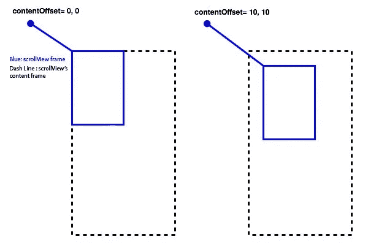
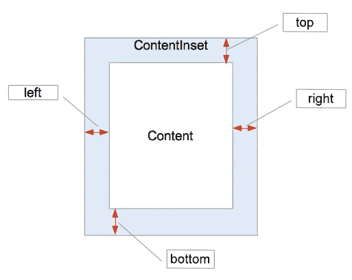
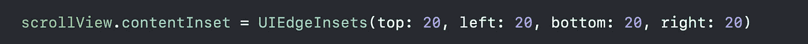
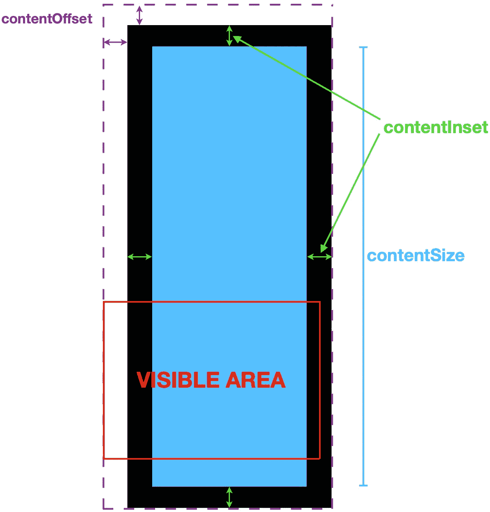

# UIScrollView 的 contentOffset、ContentInset 和 ContentSize 到底是什么？

> 原文：<https://levelup.gitconnected.com/what-exactly-are-contentoffset-contentinset-and-contentsize-of-a-uiscrollview-960207c75b88>

[缺口](https://unsplash.com/@nickdepartee?utm_source=medium&utm_medium=referral)在[未溅上的照片](https://unsplash.com?utm_source=medium&utm_medium=referral)

`UIScrollView`是 iOS 中最通用、最有用的控件之一，从 iOS 2.0 开始就有了。这是非常受欢迎的`UITableView`的基础，也是在单个屏幕视图中呈现更大内容的好方法。

`UIScrollView`有很多实例属性，但是`contentInset`、`contentOffset`和`contentSize`可能是最常用的。完全理解这些属性可以创造奇迹——从一个可拉伸的工具栏开始，用手指捏出图像和许多其他很酷的东西。

# 内容偏移量

`contentOffset`是内容视图的原点从滚动视图的原点偏移的点。换句话说，它是用户当前在滚动视图中滚动的位置。这显然会随着用户的滚动而改变。

`contentOffset`表示滚动视图内容的当前位置，相对于左上角的原点坐标。内容大小保持不变，但是内容偏移量会发生变化以响应用户交互。

# 内容插入

`contentInset`是滚动视图中可视嵌入的内容量。这是内容视图从安全区域或滚动视图边缘插入的自定义距离。

`contentInset`允许您指定 scrollview 中内容周围的边距或填充。您可以通过编程方式指定边距，如下所示:

# 内容大小

`contentSize`定义可滚动内容的大小。这是内容在`UIScrollView`中的大小以及它在`UIScrollView`中的长度。

滚动视图必须知道内容视图的大小，这样它就知道何时停止滚动。其默认值为零，必须设置为使用任何滚动视图，即使内容大小小于滚动视图本身的大小。

# 把所有的放在一起

这就是属性放置在 scrollView 上的方式

iOS 中一些流行的 ui 组件即`UITextView`、`UITableView`、&、`UICollectionView`都是从`UIScrollView`类继承来的，所以所有这些属性也适用于`UITextView`、`UITableView`、&、`UICollectionView`。

感谢阅读！