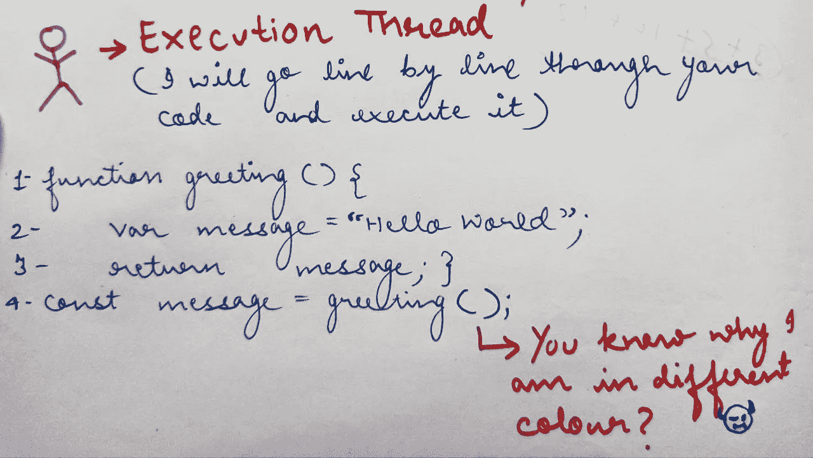
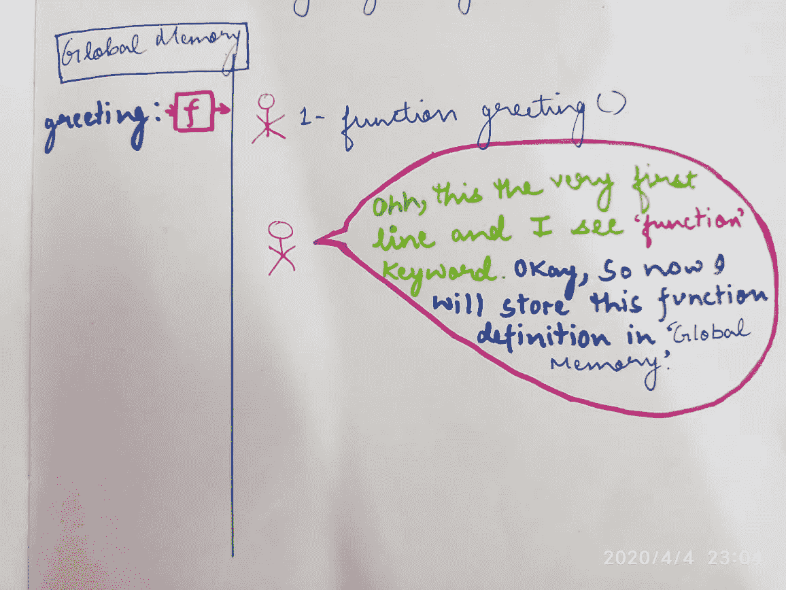
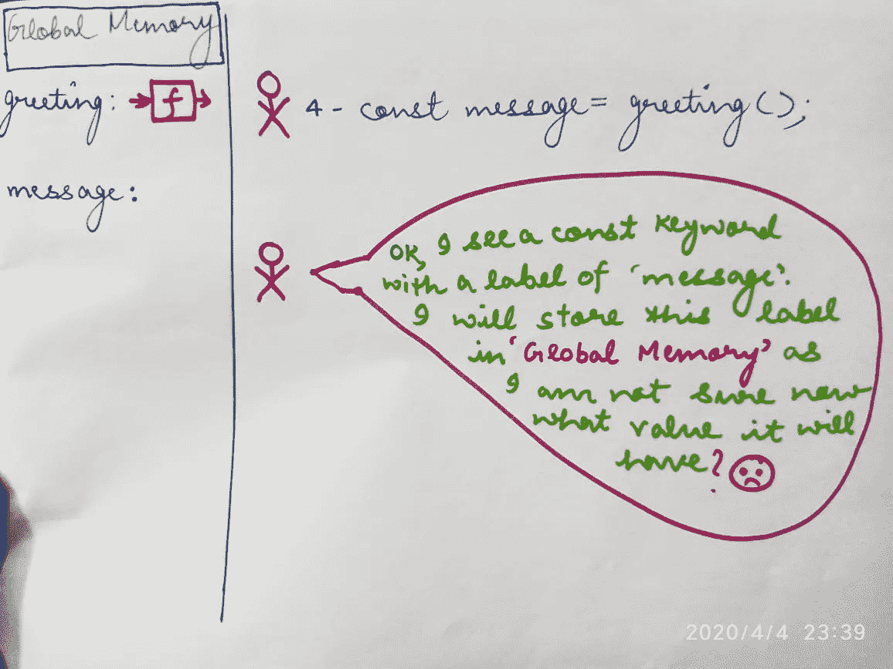
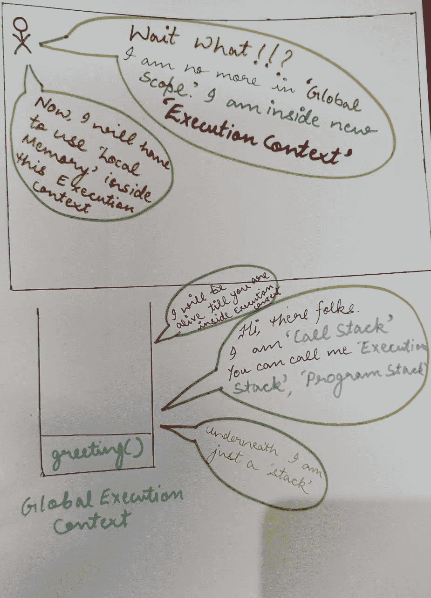
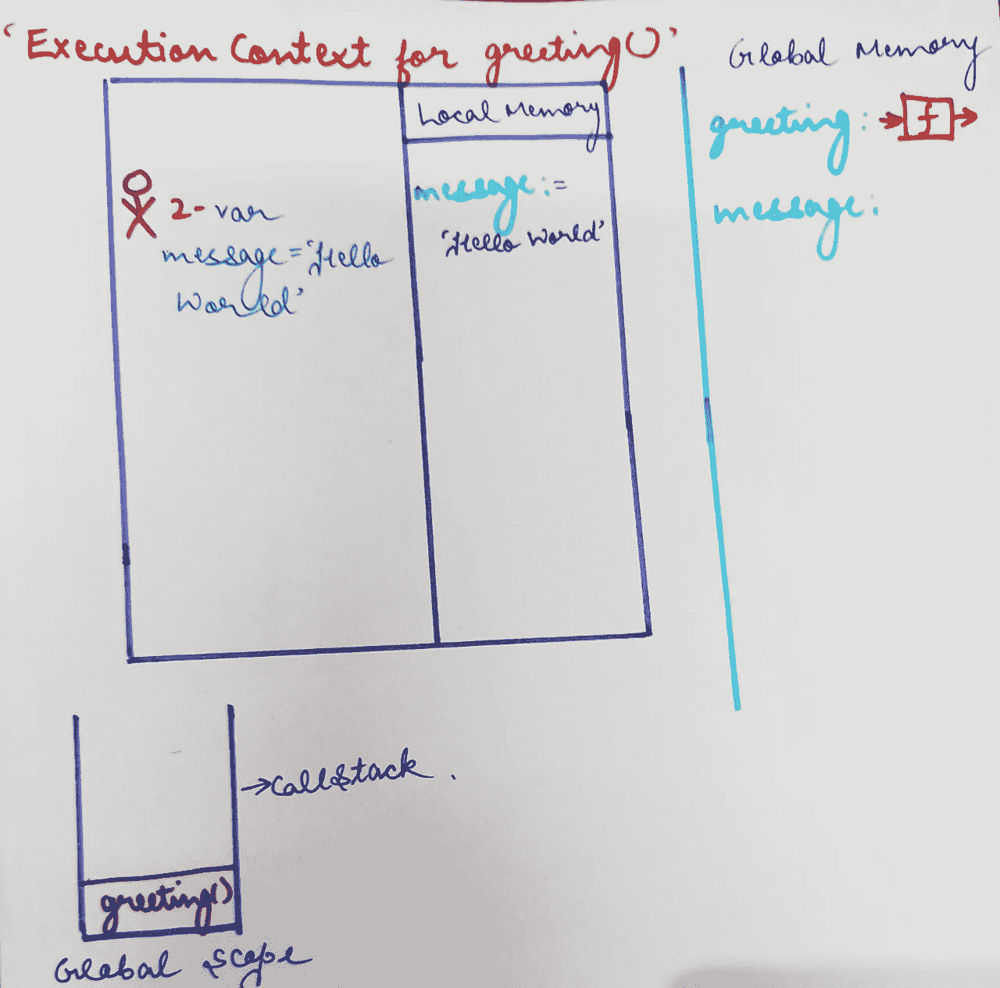
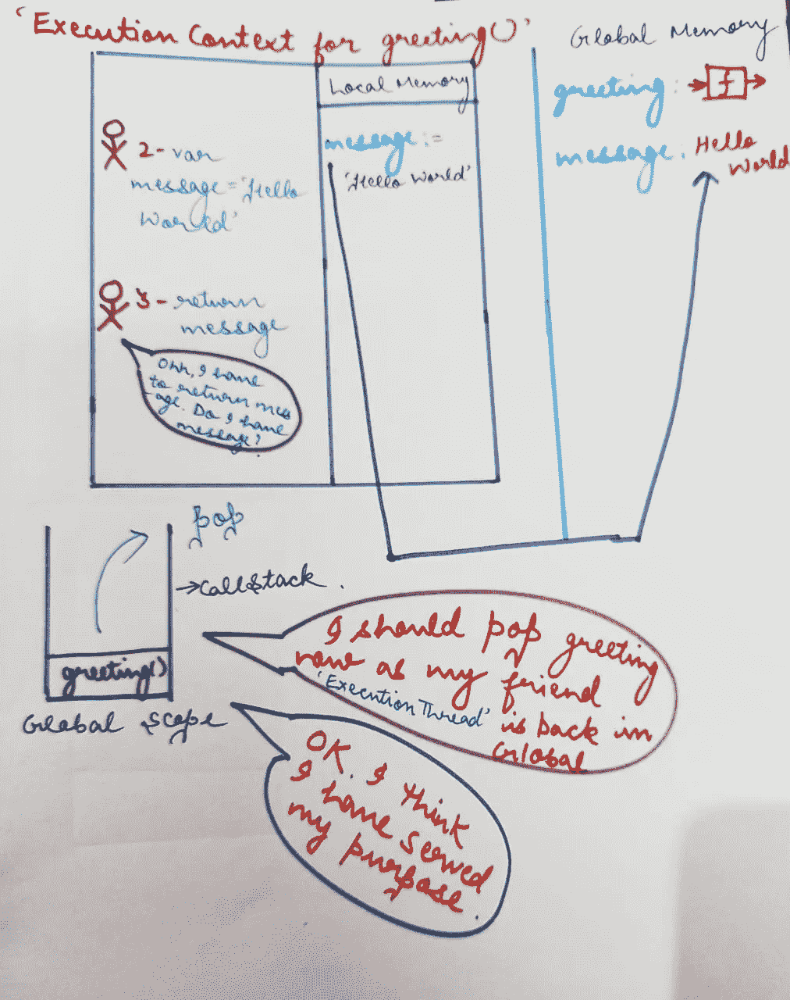
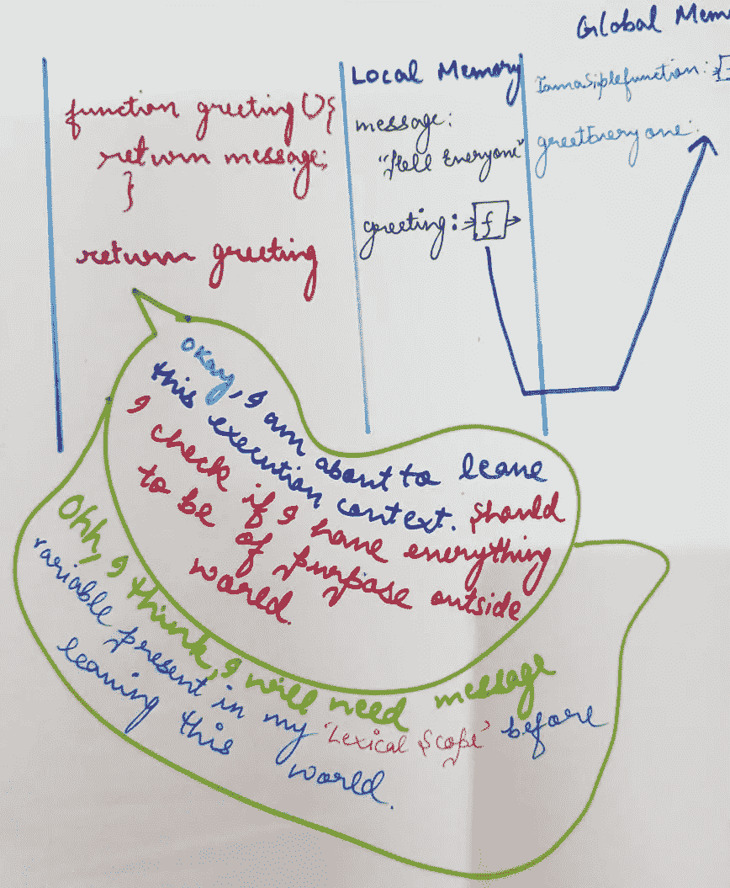

# JavaScript 中的闭包到底是什么？

> 原文：<https://levelup.gitconnected.com/what-exactly-is-a-closure-in-javascript-1dc6b5e6e375>


凯文·Ku 在 [Unsplash](https://unsplash.com?utm_source=medium&utm_medium=referral) 上的照片

*我相信每个接触 JavaScript 很短时间的人都一定听说过'* ***闭包*** *'这个术语。在这篇文章中，我将尝试揭示关于闭包的一切，但不会频繁使用这个术语:)*

考虑下面的代码:

```
1- function greeting(){2- var message="Hello World";3- return message; }4- const message=greeting();
```

*那么，当上面的代码执行时，会发生什么呢？*



*让我们介绍一些有助于我们追踪上面这段代码的字符。:)*

**执行线程:**为了简单起见，假设这个人会一行一行地检查我们的代码并执行。

> 好了，当我们的朋友“执行线程”在第一行时，会发生什么呢？



*   执行线程从第 1 行开始，找到关键字' **function'**
*   它将创建一个名为“*问候*的标签，并将整个函数存储在**全局内存**中
*   现在，执行线程跳过函数内部的代码，转到下一行。
*   因此，在我们的例子中,“执行线程”将跳过第 2 行和第 3 行，到达第 4 行。

> 好了，现在我们的朋友在第四排。现在怎么办？？？？？？



*   我们的朋友，'**执行** **线程**'找到标签名为' message '的关键字 const。
*   他很清楚自己在**全局内存**中分配新内存空间的责任。
*   目前，我们的朋友不确定这个标签中会存储什么值。
*   我们的朋友现在在问候后会看到“()”符号。

> *每当我们的朋友看到“函数调用”或俗称的“调用函数”时，他都很清楚自己需要做什么*

**

*   *是时候介绍我们的新朋友'**调用堆栈'**了，它也被称为**、【执行堆栈】、**或**程序堆栈。***
*   *调用堆栈用于几个相关的目的，但使用它的主要原因是为了跟踪每个活动函数在完成执行时应该返回控制的点。*
*   *因此，我们的问候函数被推入调用堆栈，并创建了一个新的'**执行上下文'**'，现在我们的老朋友'**执行线程'**'被困在这个全新的世界中。*
*   *我们的朋友不知道如何走出这个新世界。所以，他开始做他擅长的事情。( ***逐行读取代码并执行*** *)**

**

*   *因此，我们的朋友将标签为*‘消息’*的变量存储在我们的“**执行上下文”**的**‘本地内存’**中*
*   *现在，**'执行线程'**到达第 3 行，找到一个*'****return '****关键字。**
*   *我们的朋友检查他是否认识标签为“*消息*的人。他首先检查执行上下文的'**本地存储器'**'内部。*
*   *他找到了它，并高兴地将值返回给我们的“**全局范围”中的“消息”标签。***

**

*   *结果，“问候”从“**调用堆栈”**中弹出*

# *最后，“执行上下文”被破坏*

> *你可能会想:*
> 
> *“好了，足够的‘炫耀’了，但是鸭子在哪里才是‘终结’呢？这是正常函数的执行方式！！*
> 
> ****耶耶！！我知道你们都很聪明，已经知道了这一切。但是坚持住，伙计们，这将是我接下来解释闭包的基础:)****

```
*Let us take a bit more complex code now:1- function IamaSimpleFunction(){
2-     var message="Hello everyone!";
3-  function greeting(){
4-       return message;
     }
5- return greeting;
}
6- const greetEveryOne=IamaSimpleFunction();
7- greetEveryOne();*
```

*好了，让我们开始追踪我们的'**不那么简单的函数':)***

*   *我们将再次需要我们的朋友'**执行线程'**的帮助*
*   *执行线程开始逐行读取我们的代码。在第 1 行，它遇到了关键字' **function '。**像往常一样，它转到**‘全局内存’**，内存被分配给名为’**IamaSimpleFunction’**的函数*
*   *它现在将跳过第 2、3、4 和 5 行，转到第 6 行。它创建了一个存储' **greetEveryOne'** 的内存空间，但是像往常一样，他现在不知道在这个标签中存储什么:(*
*   *现在，它看到了函数的执行。创建一个新的**‘执行上下文’**，并将其推入到**调用栈中***
*   *现在'**执行线程'**将值' Hello everyone '存储在'**本地内存'**内的标签消息中，如我们在前面的示例中所讨论的。*
*   *类似地，在第 3 行**上，函数‘问候’**也存储在我们的’**执行上下文’**的本地内存中*
*   *现在在下一行' **return'** 就在那里。执行线程在本地存储器中检查他是否找到任何名为“greeting”的东西。*
*   *它将存储的值(函数)返回到存储在'**全局内存' ' greetEveryOne *'中的标签。****
*   *现在，我最喜欢的部分来了。*

# *摧毁一切！！！！*

***‘执行上下文’**被破坏，随之其本地内存也被破坏。该函数从“CallStack”中弹出。*

# *好了，有趣的部分来了。你认为输出是什么？？？？*

*一些合理的推理。我会想出类似这样的东西*

**“是的，所以函数‘IamaSimpleFunction’被返回，它的* ***执行上下文*** *被销毁，随之，它的本地内存中的所有内容也被销毁。简单来说，就是将* ***未定义*** *或某些错误与* ***消息*** *【变量未找到】**

*但是，出乎所有人意料的是，输出是:*

```
***Hello everyone!***
```

*是的，我知道我知道你对这个很着迷！！！*

**

*好了，别闹了！！让我们解开这个输出背后的谜团。*

**

*   *因此，在返回“greeting”时，检查它是否需要来自当前“**当前词法范围”**(代码驻留的地方)的任何东西在我们的例子中，“greeting”在函数“IamaSimpleFunction”内部*
*   *因此，它将所有东西打包在一个名为' **[[scope]]'的私有属性中。***
*   *因此，现在即使外部函数被返回并且**执行上下文**被销毁，问候语也将在“**[[scope]]”**中存储“消息”值*
*   *当从全局上下文中调用它时，它知道在哪里寻找“消息”值。是的，伙计们！在**'[[范围]]'** 内*

> ***是的，JavaScript 的这个特性被称为‘闭包’***

*没什么花哨的！！！是的，我知道:)它只是一个从高阶函数返回的函数，可以存储存在于其词法范围内的变量和对象。*

*好了，各位，就这样:)*

*这是我的第一个博客。表现出一些爱:)反馈将不胜感激。*

*你可以通过 [Omkar Nath Mandal](https://www.linkedin.com/in/omkar-nath-mandal/) 与我联系*