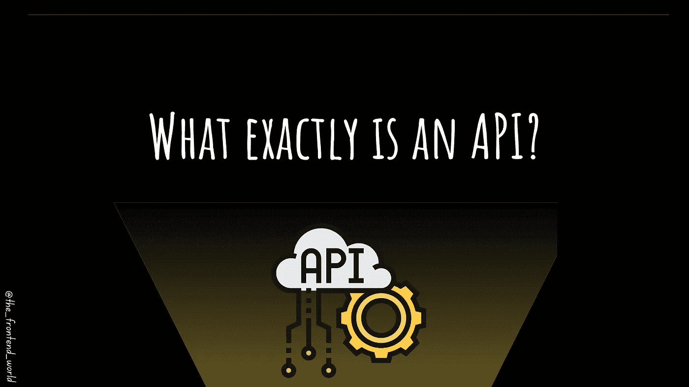
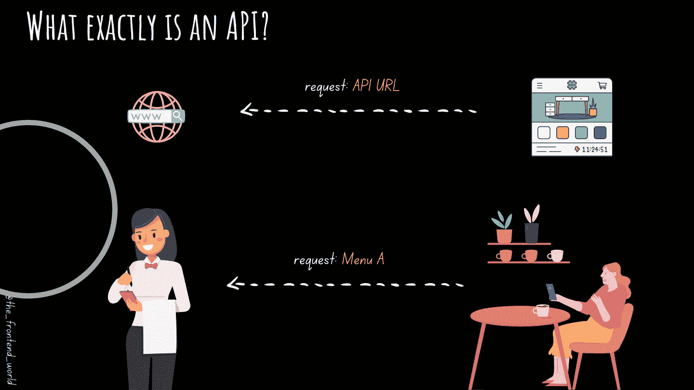

# API 到底是什么？

> 原文：<https://levelup.gitconnected.com/what-exactly-is-an-api-ab0f46062da0>

## API 的主要目的是什么？API 有哪些例子？

作者:FAM

API 无处不在。一般来说，它们对于 web 开发和 web 应用程序是至关重要的。那么什么是 API 呢？它有哪些类型？API 有哪些例子？

# 什么是 Web API？

API 代表应用程序编程接口。

谈到 web 开发，有许多现有的 Web APIs。

API 是另一个应用程序，您可以请求并启用应用程序和 API 之间的数据传输。

# 怎么看？

作者:FAM

# 原料药的类型

## -公共

正如其类型所命名的那样，这些 API 是公共的，任何第三方开发人员都可以使用。并不是说每个公共 API 都是对所有人开放的酒吧。一些 API 带有一些限制，比如注册、OAuth 认证等等。

**这些 API 的例子:**

*   我已经谈了一些必须知道的 JavaScript APIs，比如下面这篇文章中著名的`fetch` API:

 [## 每个 Web 开发人员都应该知道的 JavaScript APIs

### 如何使用最强大的 JavaScript APIs 的实用指南。

javascript.plainenglish.io](https://javascript.plainenglish.io/javascript-apis-every-web-developer-should-know-fa9b36cc1ecf) 

## -搭档

合作伙伴 API 只对业务合作伙伴公开(就像 Java 类的受保护属性一样)。它们是不公开的。你需要特别的权限。只有拥有该权限的合作伙伴才能访问它们。

**这些 API 的例子:**

这些 API 促进了企业对企业的活动。例如，我们可以举出:

*   亚马逊网络服务
*   销售力量

## -私人/内部

私有 API 对外部用户是隐藏的，只对内部系统公开。您可能已经在您的应用程序中使用了这些 API。它们意味着在不同的内部开发团队之间交流和交换数据，以获得更好的生产力或服务重用。

**这些 API 的例子:**

这些 API 促进了内部服务。例如，我们可以举出:

*   人力资源系统。
*   公司内部工资系统
*   应用的后端 API

公共 API 的好处是你可以用它们来构建你的投资组合:

 [## 您应该尝试的 5 个有趣的 Web APIs

### 可以改变你的网络应用的网络应用编程接口

medium.com](https://medium.com/geekculture/5-interesting-web-apis-you-should-try-out-9d1dc8c2fef6) 

> 我今天的故事到此结束，我希望你喜欢它，并从中吸取教训，❤

如果我的作品有 ***打动了你。*** 如果你 ***喜欢的话。*** 如果你觉得值得 ***。请你成为付费会员来支持我，你的一部分费用会寄给我。***

> 对我来说这意味着整个世界，我的触摸创造了这个世界上有价值的小东西…谢谢你，❤

对我来说这意味着整个世界，我的触摸创造了这个世界上有价值的小东西…谢谢你，❤

如果你喜欢看我的文章…并且想收到我的文章(我不每天发表，这样就不会给你发垃圾邮件。你可以随时退订，没有问题)♥️

 [## 如果你喜欢看我的文章… ♥️

### 如果你喜欢读我的文章… ♥️，当我的文章发表时，欢迎你第一个得到通知…

famzil.medium.com](https://famzil.medium.com/subscribe) 

亲爱的读者，感谢你在我生命中的存在。让我们在 [**上取得联系**](https://medium.com/@famzil/)**[**Linkedin**](https://www.linkedin.com/in/fatima-amzil-9031ba95/)**[**脸书**](https://www.facebook.com/The-Front-End-World)**[**insta gram**](https://www.instagram.com/the_frontend_world/)**[**YouTube**](https://www.youtube.com/channel/UCaxr-f9r6P1u7Y7SKFHi12g)**或**********

****参见我的关于网络要素和一般文化的电子书。****