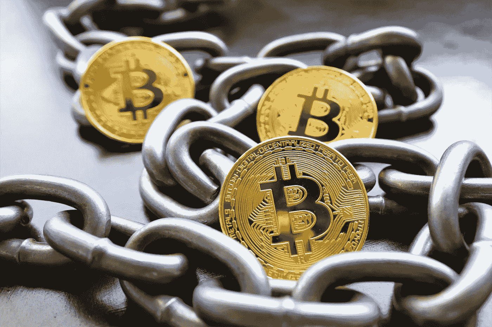

# 工作证明到底是什么？

> 原文：<https://levelup.gitconnected.com/what-exactly-is-proof-of-work-8515c0b0fe40>

## 比特币工作原理的简单解释

谢谢 [Pexels](https://www.pexels.com/photo/close-up-of-bitcoins-5698697/) ！

[工作证明](https://en.wikipedia.org/wiki/Proof_of_work#:~:text=Proof%20of%20work%20(PoW)%20is,minimal%20effort%20on%20their%20part.)是一个允许区块链技术工作的系统。有不同的种类。不过还是从比特币说起吧。

比特币 [*矿工*](https://en.bitcoin.it/wiki/Mining) 利用他们的计算机能力来保障网络上的交易安全。作为回报，他们会得到比特币作为奖励。这些比特币中的一部分是由固定的供应商创造的，但矿工们也从发送者那里赚取*费用*。寄件人支付一笔费用来保护他们在网络上的交易。

这让比特币网络保持了共识。所有交易都记录在区块链的公共分类账中。公共分类账由**所有人**维护。

> 矿工获得报酬，将交易记录添加到公共分类账中。

矿工们相互之间展开了激烈的竞争。他们竞相解决下一个验证交易的问题。谁解决了它，谁就有奖励。鉴于目前比特币的价格，这可能是一笔巨大的收入。因此，验证交易的动机很强。

# 并非所有的矿工生来平等

工作证明的一个问题是一些矿工有特殊的硬件。这些被称为 ASICS，或专用集成电路。基本上就是专门用来挖掘比特币(或另一种加密货币)的计算机。

目前，没有 ASIC 计算机的采矿可能是无利可图的。别忘了，你的电脑会用电。因此，如果你让你的 200 美元的笔记本电脑整天挖掘比特币，你最终将为你的电费支付更多。

# 问题是

工作证明是一项革命性的技术。比特币的存在和运行是一个严重的奇迹。但这并不能使系统变得完美。

为了给所有这些保护比特币网络的矿工供电，矿工们使用了大量的电力。一些研究表明，开采[比特币比阿根廷](https://www.bbc.com/news/technology-56012952)用的电还要多。是的，这个国家。它用的电比一个该死的国家还多！哎哟。

这可以说是反对比特币和其他证明有效的加密货币的最佳论据。

但是，尽管有合理的批评，人们真的无法阻止人们挖掘比特币。人类要么必须:

1.  集体决定反对采矿
2.  或者关闭互联网

这是唯一的两个选择。这两种情况都不太可能很快发生。