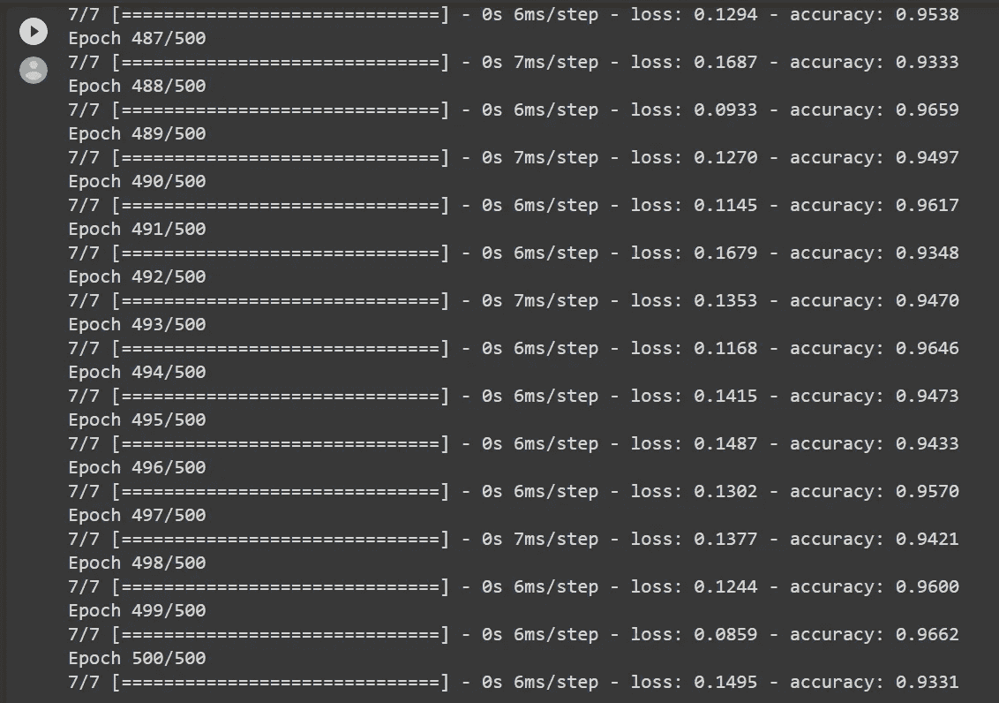

# 凯蒂·佩里遇到 TensorFlow 会怎样？让机器为我们写新歌！

> 原文：<https://levelup.gitconnected.com/what-happens-when-katy-perry-meets-tensorflow-let-machine-write-new-songs-for-us-bf63d2e86a43>

凯蒂·佩里(Katy Perry)是美国歌手兼词曲作者，TensorFlow 是谷歌开发的机器学习库。如果我们把凯蒂·佩里的歌 [*吼*](https://www.youtube.com/watch?v=CevxZvSJLk8) *(* 歌词 *)* 输入 TensorFlow 的 NLP 人工神经网络引擎会发生什么？AI 写的歌比人类好吗？

[https://variety . com/WP-content/uploads/2013/09/Katy Perry _ roar . jpg？w = 640](https://variety.com/wp-content/uploads/2013/09/katyperry_roar.jpg?w=640)&[https://en.wikipedia.org/wiki/TensorFlow](https://en.wikipedia.org/wiki/TensorFlow)

我们先来看看输入的歌词:

[https://www.youtube.com/watch?v=CevxZvSJLk8](https://www.youtube.com/watch?v=CevxZvSJLk8)

[https://www.youtube.com/watch?v=CevxZvSJLk8](https://www.youtube.com/watch?v=CevxZvSJLk8)

我们会把上面的歌词输入到 TensorFlow。然后我们会看到机器为我们写的新歌。

以下所有代码都保存在[这个 Google Colab 笔记本](https://colab.research.google.com/drive/1MmNrehDHk_4qmsZbuypX2aNnVUp7zSu4?usp=sharing)中。

输入 TF NLP 库

我们先输入所有必要的 TensorFlow 库。

然后我们将输入数据:

输入歌词数据

所有歌词数据都由“数据”变量保存，然后转换成小写字母。数据由换行符“\n”分割，然后生成包含语料库的 Python 列表:

歌词语料库

> " tokenizer.fit_on_texts(语料库)"

该命令创建一个 Python 目录，关键字是单词，值是单词的标记(语料库标记化):

> { '我':1，' the': 2，' a': 3，' you': 4，' me': 5，' hear': 6，' my': 7，' got': 8，' goto ':9，' and': 10，' hold ':11，' down': 12，' but': 13，' up': 14，' like': 15，' see': 16，' it': 17，' you ' s ':18，' roar': 19，' to': 20，' that': 21，' had': 22，' now': 23，' cause': 24，' am': 25，'冠军':26，' so 我有:41，“够了”:42，“所有”:43，“眼睛”:44，“of”:45，“老虎”:46，“斗士”:47，“跳舞”:48，“穿越”:49，“开火”:50，“大声”:51，“使用”:52，“咬”:53，“舌头”:54，“保持”:55，“呼吸”:56，“害怕”:57，“摇滚”:58，“船”:59，“制造”:60，“狼狈”:61，“坐下”:62，“安静”:63，“同意”:64，“礼貌”:65 '浮动':81，'蝴蝶':82，'蛰':83，'蜜蜂':84，'挣':85，'条纹':86，'去':87，'从':88，'零':89，'自己':90，'英雄':91}

总共有 91 个标记，然后我们给它加一个“1”来考虑词汇之外的单词。

> " total _ words = len(tokenizer . word _ index)+1 "

接下来，我们将把这个转化为训练数据。

> " token _ list = tokenizer . texts _ to _ sequences([line])[0]"

我们首先通过 texts_to_sequences 函数将每个句子转换成一个标记列表。(由我们之前看到的 python 字典翻译)

> 例如转换“我曾经咬着舌头屏住呼吸”=> [1，52，20，53，7，54，10，55，7，56]

(到第二个 For 循环)对于每个标记化列表，我们创建 n 元语法序列，n 的范围从 1 到句子中标记的总数。

例如，将[1，52，20，53，7，54，10，55，7，56]转换为:

n _ gram _ 序列

这就把句子分成了几个短语。

我们在所有 n _ gram _ 序列的前面填充零。

填充序列

然后，我们将最后一列标记为 y，所有其他列标记为 Xs。我们将使用 x 来预测 y。

标记

胡尔基·奥莰·塔巴克在 [Unsplash](https://unsplash.com?utm_source=medium&utm_medium=referral) 上拍摄的照片

现在，数据工作已经完成。让我们和模型一起工作吧！

TensorFlow 中的一个简单 NLP 模型

这是一个简单的顺序模型:

首先，我们放置一个嵌入层，并向嵌入层提供单词总数(唯一的标记)，并将每个标记映射到 64 个维度。

[如果你需要更多的信息，这个](https://www.coursera.org/lecture/customising-models-tensorflow2/the-embedding-layer-GBg9t)视频很好地解释了嵌入层。

其次，我们然后把一个简单的长短期记忆 LSTM 双向层与 20 个单位。在进行预测时，LSTM 双向层允许信息向前和向后移动。

在双向层中有两种类型的连接:前向连接(用于过去的信息)和后向连接(用于未来的信息)。

> 所以当预测现在的 Y 时，除了现在的信息，我们还使用了过去的信息和未来的信息。听起来像科幻电影，不是吗？《回到未来》呃？

把“我曾经咬着舌头屏住呼吸”这句话放到 LSTM 双向层上

来自 Coursera 课程“序列模型”的双向 RNN 文章

吴恩达有一个关于双向 RNN 的很棒的简短解释[视频](https://www.coursera.org/lecture/nlp-sequence-models/bidirectional-rnn-fyXnn)。

第三，我们为单词总数放置一个密集层，并应用一个 softmax 激活函数。

我们将记号的数量作为节点的数量，使得该分类预测可以预测从输入的唯一记号中选择的任何单词，即，为了写一首新歌，机器可以从它已经学习的歌词中选择任何单词。

softmax 激活功能的应用是将预测转化为概率。将选择具有最高预测概率的令牌。

Softmax 激活函数将输出转化为概率:[https://miro . medium . com/max/3000/1 * reypdiz 3 zsapb 2 w 8 cjpkbg . JPEG](https://miro.medium.com/max/3000/1*ReYpdIZ3ZSAPb2W8cJpkBg.jpeg)

我们使用分类交叉熵损失函数(因为这是一个分类预测)和 adam 优化器来编译该模型。

adam 优化器(讲座视频[此处](https://www.youtube.com/watch?v=JXQT_vxqwIs&t=146s))结合了动量梯度下降(讲座视频[此处](https://www.youtube.com/watch?v=k8fTYJPd3_I))和均方根传播(RMSProp)的优点(讲座视频[此处](https://www.youtube.com/watch?v=_e-LFe_igno&t=21s))。Adam optimizer 是深度学习应用中最常用的优化器之一。

我们最终完成了这个简单但设计良好的神经网络架构。

神经网络模型架构

因为没有太多的数据，我们用 500 个时期训练模型(即，模型将根据数据训练 500 次。)

具有 500 个纪元的训练模型

照片由[帕拉德普·查理斯](https://unsplash.com/@pccharles?utm_source=medium&utm_medium=referral)在 [Unsplash](https://unsplash.com?utm_source=medium&utm_medium=referral) 上拍摄

让我们看看模型对数据的训练有多好:

培训结果

当训练接近 500 个历元时，准确度保持接近 0.95。这表明模型已经从最后的数据中学习得很好。

事实上，即使在 150 个时期之后，该模型也从数据集得到了良好的训练:

培训结果

由[托拜厄斯·图利乌斯](https://unsplash.com/@tobiastu?utm_source=medium&utm_medium=referral)在 [Unsplash](https://unsplash.com?utm_source=medium&utm_medium=referral) 拍摄的照片

现在，表演时间到了！

让张量流写新歌

我们给模型输入一个种子文本:“你会听到姚的怒吼”，然后让模型为我们写下接下来的 100 个单词。

for 循环的用途是允许模型对预测进行预测。所以新歌时间越长，歌词质量就会下降。

照片由 [Alireza Attari](https://unsplash.com/@alireza_attari?utm_source=medium&utm_medium=referral) 在 [Unsplash](https://unsplash.com?utm_source=medium&utm_medium=referral) 上拍摄

让我们听/读这首新歌吧！🎵

> 你会听到姚的怒吼
> 
> 起床了
> 
> 起床起床
> 
> 起床
> 
> 向上通过点
> 
> 点战斗机战斗机战斗机战斗机战斗机战斗机战斗机
> 
> 乱点乱点乱点乱点乱点
> 
> 我是零乱乱乱
> 
> 我是英雄乱乱乱乱偏离主题
> 
> 点点战斗机
> 
> 乱七八糟一点
> 
> 乱七八糟的选择
> 
> 我是零乱乱乱
> 
> 我是英雄狼狈狼狈狼狈
> 
> 偏离主题
> 
> 点点战斗机
> 
> 乱七八糟一点
> 
> 乱七八糟的选择
> 
> 我是零乱乱乱
> 
> 我是英雄狼狈狼狈狼狈
> 
> 偏离主题
> 
> 点点点
> 
> 战斗机食堂食堂

我不知道你是怎么想的，但至少，我得到了一个很好的笑 XD。

生成的歌词质量不高，是因为这个输入语料库规模太小，机器在预测上做预测。这个模型和数据还有很大的改进空间，本文只是提供一个起点！

创意 AI？创意 AI！