# 在地址栏中输入网址，直到浏览器显示出来，会发生什么？

> 原文：<https://levelup.gitconnected.com/what-happens-when-the-url-is-entered-in-the-address-box-until-the-browser-displays-it-159849f75cc0>

## 这可能是你见过的最完整的回答了

由 [Edho Pratama](https://unsplash.com/@edhoradic?utm_source=medium&utm_medium=referral) 在 [Unsplash](https://unsplash.com?utm_source=medium&utm_medium=referral) 拍摄的照片

这个问题你可能在很多地方都见过，但这并不妨碍它很受欢迎。这篇文章将向你介绍一些不同的。

# 浏览器中的流程模型

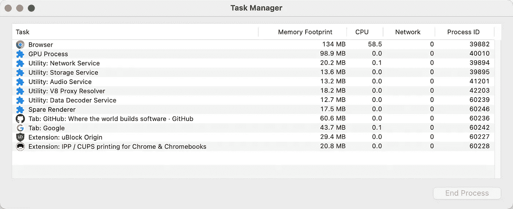

这里我们以有代表性的 Chrome 浏览器为例，其他主流浏览器也差不多。

单击最右边的三个点，选择更多工具->任务管理器。可以看到类似上图的东西。也可以使用快捷键`Shift + Esc`快速打开。

这是浏览器中的流程模型，我来详细解释一下:

*   **一个浏览器主进程**:主要负责界面显示、用户交互、子进程管理、文件存储等。
*   **一个 GPU 进程**:渲染所有内部 UI 如网页、Chrome UI 等。
*   **一个网络进程**:负责加载所有网络资源
*   **多个扩展进程**:负责运行扩展
*   **多重渲染进程**:主要负责将 HTML、CSS、JavaScript 转换成交互式网页。排版引擎和 V8 引擎都在这个过程中运行。并且每个渲染过程都在沙箱中运行，以保护用户系统的资源

**早期的浏览器都是单进程**，也就是所有的浏览器功能模块都运行在同一个进程中。这导致了很多问题，比如:

*   当网页或扩展崩溃时，整个浏览器都会崩溃。
*   当恶意脚本被注入网页或扩展时，可能会出现安全问题。
*   如果在网页中运行无限循环，浏览器中所有打开的页面都会被卡住。*这是 Windows 中常见的无响应现象*:)

所以现在的浏览器采用的是多进程架构。网页和扩展都是沙箱化的(使它们不能接触用户的系统)。而且每个网页和扩展都是独立的进程，互不影响。这解决了上述问题。

# 发生了什么事？

了解了浏览器的流程模型，那么我们就可以开始回答这个问题了。

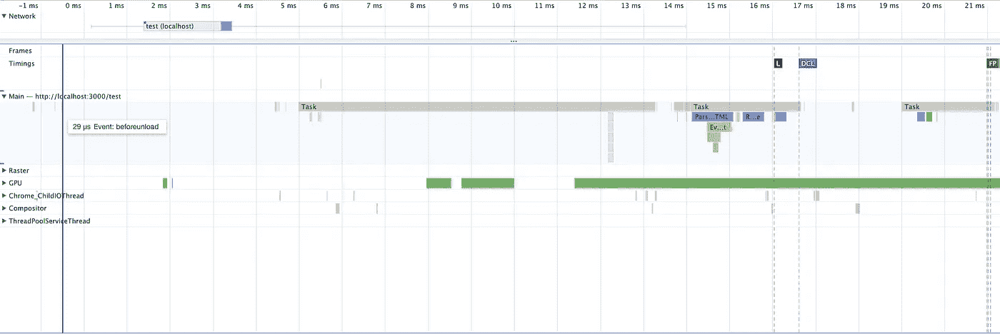

上图是带着表演录制的全过程，看起来很长。我会在解释的时候删掉一些部分，请注意上面的时间线，以便与整个过程保持一致。

简单地将过程分为两个阶段:

## 第一阶段的

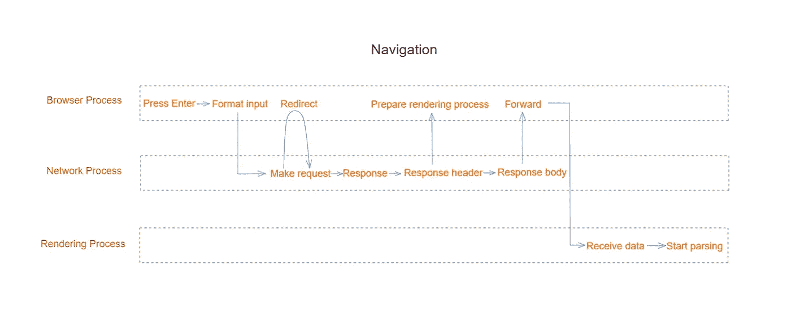

上图是**导航**的过程(从用户发起 URL 请求到页面开始解析)。

用户在地址框中键入并按 enter 键后:

**1。**浏览器会先判断输入的内容是否是 URL，如果不是，会被默认的搜索引擎拼接成一个 URL。之后，如果原网页绑定了 [beforeunload](https://developer.mozilla.org/en-US/docs/Web/API/Window/beforeunload_event) 事件，就会触发弹窗。

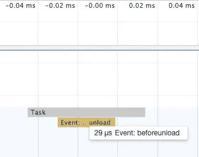

**2。**只有点击确认按钮才能进行下一步。此时，浏览器进程通过 **IPC** 向网络进程发送 URL 请求。则网络进程将首先检查本地缓存中是否有缓存。本地缓存的优先级是服务工作线程、内存缓存、磁盘缓存和 HTTP2 推送缓存。如果有可用的，就直接返回，不会进行真正的请求。

**3。**真正的请求是我们熟悉的 HTTP 请求流程。第一步是 **DNS 解析**获取服务 IP 地址。如果是 HTTPS，需要建立 TLS 连接。下一步是使用 IP 三次握手建立一个 **TCP 连接**。建立后，网络进程构造**请求行(方法、URL、版本)、请求头、请求体**并发送给服务器。服务器收到后，处理完成，生成一个**响应行(版本、状态码、状态描述)、响应头和响应体**返回给客户端。

**4。**网络进程收到后，首先解析状态码和响应头。如果状态码是 301 或 302，那么请求将根据响应头中的`Location`再次拼接。然后再看`Content-type`响应头。如果是字节流，将提交给下载管理器进行下载。如果是 HTML，会通知浏览器进程准备**渲染进程**。

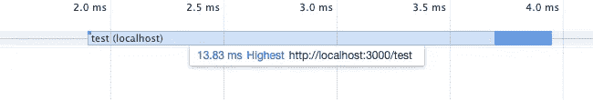

**5。典型地，浏览器为每个网页创建一个渲染过程。但如果是同一个站点，可能会重复使用同一个。等它准备好了，网络进程的数据就会通过浏览器进程流向渲染进程。传输完成后，浏览器还会更新浏览器的外部用户界面。例如，HTTPS 的安全锁状态，前进和后退的历史状态等。**

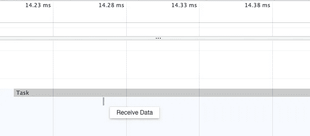

接下来是渲染过程的主页。

## 第二级

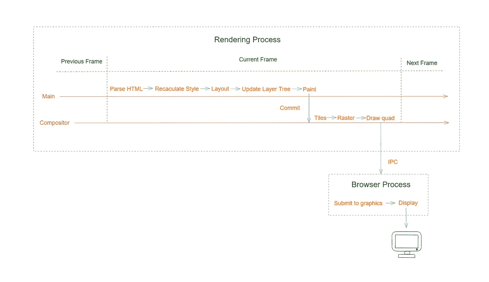

**1。**首先是构建 DOM 树。这将接收到的 HTML 文本转换成内存中的树状结构。这个过程的 HTML 解析器使用状态机来分割标记。这使得实时解析成为可能，而无需等待整个文本被传递。

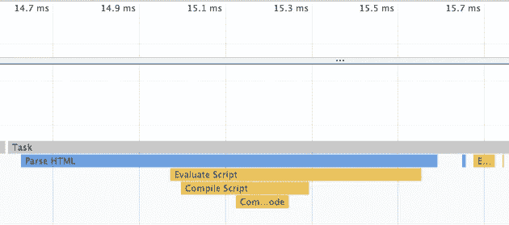

**2。**接下来是风格计算。首先总结所有的样式源，包括那些由链接引用的、与样式标签内联的，等等。这些被转换成内存中的数据，可以通过 [document.styleSheets](https://developer.mozilla.org/en-US/docs/Web/API/Document/styleSheets) 访问。

而且这些样式值也会被归一化，比如粗体会转换成 700，颜色转换会是 RGB 等等。

最后根据继承规则和级联规则计算出单个节点的具体样式，可以通过调用[window . getcomputedstyle()](https://developer.mozilla.org/en-US/docs/Web/API/Window/getComputedStyle)来访问。

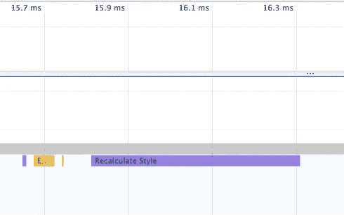

**3。**接下来是布局阶段。它可以计算每个元素的几何位置。具体来说，它结合了 DOM 树和 ComputedStyle，比如它会去掉`display:none`的元素节点。

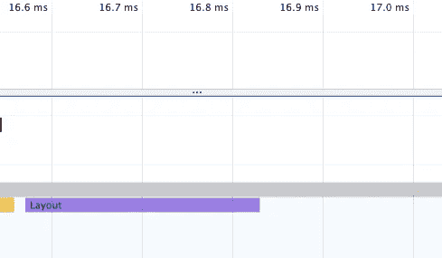

**4。**接下来，到达更新层树阶段。我们看到的实际上是一个多层的 2D 页面，所以浏览器会根据一些特征对这个片段进行分层。

具体来说，每个节点将直接或间接属于一个层。具有[堆叠上下文](https://developer.mozilla.org/en-US/docs/Web/CSS/CSS_Positioning/Understanding_z_index/The_stacking_context#the_stacking_context)属性的元素在一个单独的层中，滚动条在一个单独的层中，依此类推。

值得一提的是，一个典型的 CSS 属性— `[will-change](https://developer.mozilla.org/en-US/docs/Web/CSS/will-change)`为开发人员提供了显式创建独立堆栈上下文的能力。

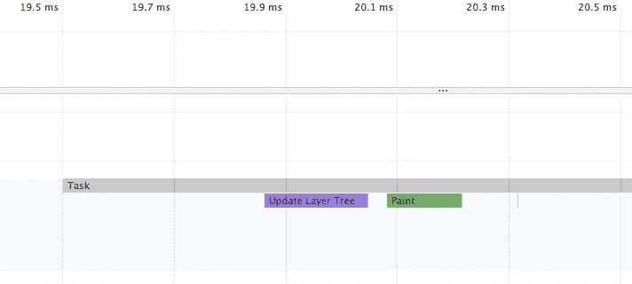

**5。**下面是画图阶段，但是在这个阶段，只生成画图命令队列。

最终交给了合成线程(其任务执行状态可以在性能左面板的合成器中查看)进行具体合成。最终绘制的产品是一张图片，浏览器会将其提交到显卡的后台缓冲区。然后 GPU 会交换前后缓冲区，显示器会从前缓冲区读取画面。我们的页面会展现在你面前！

今天就到这里。我是 Zachary，我将继续输出与 web 开发相关的故事。如果你喜欢这样的故事，想支持我，请考虑成为 [*中等会员*](https://medium.com/@islizeqiang/membership) *。每月 5 美元，你可以无限制地访问媒体内容。如果你通过* [*我的链接*](https://medium.com/@islizeqiang/membership) *报名，我会得到一点佣金。*

你的支持对我来说非常重要——谢谢。