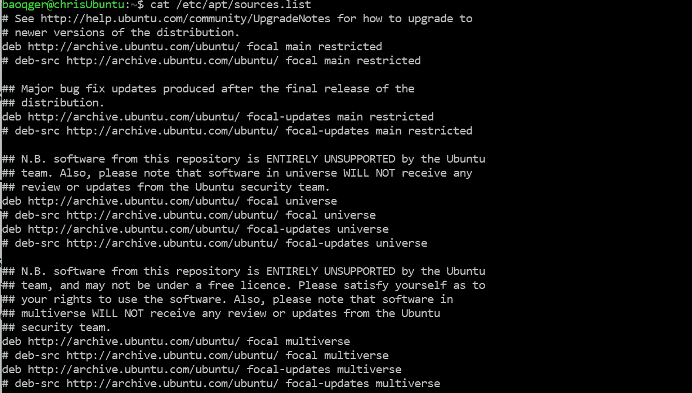
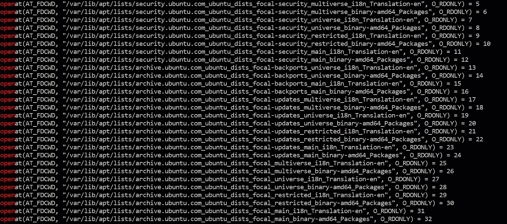
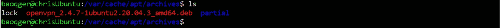
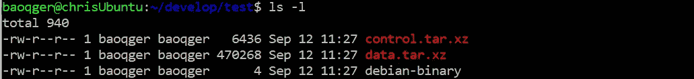
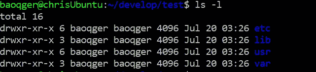

# 运行 apt 命令时会发生什么

> 原文：<https://levelup.gitconnected.com/what-happens-when-you-run-apt-commands-1e8acc38d4f0>

# 背景

在 Linux 世界中，软件是以`package`的形式交付的。当一个软件工程师想要在 Linux 平台上工作时，您将会一次又一次地运行包管理命令。因此，您需要理解运行这些命令时实际会发生什么。在本文中，我将介绍这个主题。

**注意**不同的 Linux 发行版有不同的包管理工具。在本文中，让我们关注 Ubuntu 系统和软件包管理工具`apt`。

# 软件仓库

如今，每个人都熟悉 app store，它是一个中心位置。用户可以在那里检索应用程序。在 Linux 世界里，**软件仓库**就像应用商店一样工作。软件库通常以 mirros 的形式提供，您的 Linux 系统可以订阅它。

世界上有许多存储库镜像，您可以决定使用哪一个。在 Ubuntu 系统中，它在`/etc/apt/sources.list`的配置文件中定义如下:

来源列表

文件中定义的 URL 只是软件仓库。

# 包装索引

APT 包索引本质上是一个数据库，其中包含了来自上述存储库的可用包。

在 Ubuntu 系统中，包索引文件存储在`/var/lib/apt/lists`中

# apt 更新

基于以上两点，我们很容易理解当我们运行`apt update`时会发生什么。它不更新任何已安装的软件包，而是通过向**软件库**发送新的网络请求来更新本地机器中的**软件包索引**文件。这也是为什么我们需要在运行`apt upgrade`或`apt install`之前运行它的原因。因为升级的版本或新安装的版本将依赖于更新的包索引文件。通过这种方式，用户将获得目标包的最新版本。

# apt-缓存搜索

在您实际安装一个包之前，您可以运行带有包名的`apt-cache search`命令来获得任何匹配的可用包的列表。如果您事先不知道确切的包名，这可以帮助您。

`apt-cache`命令不发送任何网络请求，而是基于本地机器中的包索引文件工作。如何证明这一点？当然最直接的方法是阅读源代码。但是我想用`strace`这个工具给大家展示另一种证明方式。

`strace`是一个可以显示你运行命令时调用的所有`system call`的工具。如果我们对`apt-cache search`的猜测是正确的，它应该会调用系统调用来读取包索引目录`/var/lib/apt/lists`中的文件，对吗？让我们通过运行以下命令来看看:

不是前面命令中的**2>1**部分，这是因为`strace`将其所有输出写入`stderr`，而不是`stdout`。一个`pipe`重定向 stdout，而不是 stderr。所以在管道到`grep`之前，需要将 strace 的 stderr 重定向到 stdout。输出很长，但包含以下几行:

和我们猜测的一样。好吧。

# 易于安装

论坛上有很多人在问关于`apt install`的秘密，比如[这个](https://askubuntu.com/questions/162477/how-are-packages-actually-installed-via-apt-get-install)。`apt install`下载包的源代码然后在你的机器上编译吗？这也是我第一次接触 Linux 世界时想到的问题之一。我的直觉告诉我，当我运行`apt install`时，不应该有编译和构建过程。因为我觉得太费时间了。

事实上，`apt install`是用来将**预构建的二进制包**安装到您的机器上的。简单地说，它完成两项任务:

*   下载这个包，一个 **Debian 包**，到`/var/cache/apt/archives`
*   从 Debian 包中提取文件，并将它们复制到特定的系统位置

因为 Ubuntu 源自 Debian 系统，所以你在 Ubuntu 上安装的包实际上是一个 Debian 包，是一个文件名以`.deb`结尾的存档文件。例如，`openvpn` Debian 包如下:

然后我们可以用`ar x <package_name.deb>`命令解压这个包，你会发现每个 Debian 包里面有三个文件:

*   debian-binary——一个文本文件，指示。deb 包格式。
*   control.tar.gz—一个压缩文件，包含 md5sums 和用于构建包的控制目录。
*   data.tar.xz —一个压缩文件，它包含要在您的系统上安装的所有文件。这是我们需要继续探索的。

运行下面的`tar`命令打开这个 tarball:

请注意，tarball 包含以下目录:

查看一下`usr`目录，您会发现预编译的二进制文件。