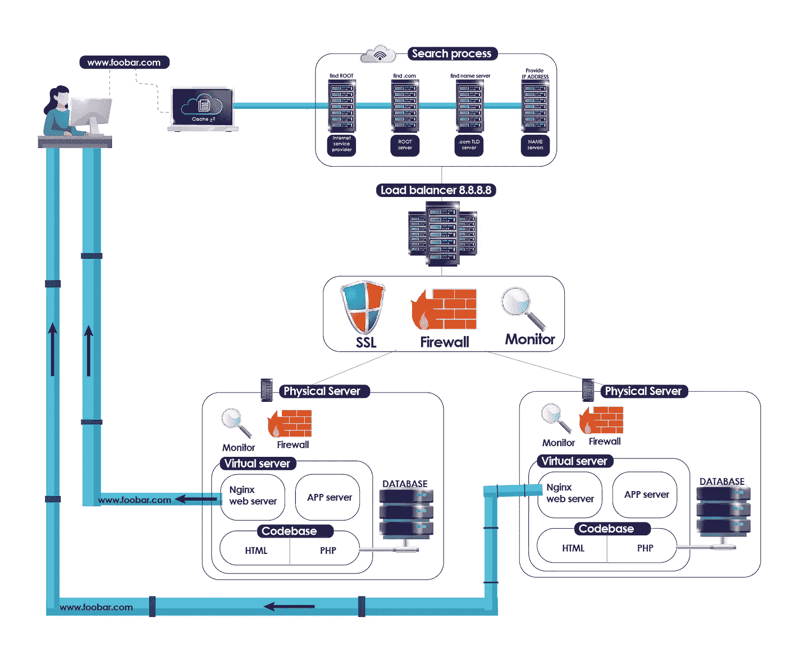

# 当你在网上冲浪时会发生什么？

> 原文：<https://levelup.gitconnected.com/what-happens-when-you-surf-the-web-89a0325daf50>

互联网是一个巨大的、不断增长的共享信息空间，其中包含大量有价值的材料。它主宰着我们的现在，也将决定我们的未来。如今，物联网在某种程度上是每个人都熟悉的东西，由于互联网提供的可访问性，当谈到潜在的应用时，可能性是无限的。但你有没有停下来想一想，当你在浏览器中输入一个域名时，它会拉出一个网站，并无缝地显示给你？幕后有很多事情在进行，在这篇文章中，我将把它分解成一些简单的信息片段。

让我们从计算机如何相互通信开始:

# **TCP/IP** (传输控制协议/互联网协议)

从语法的角度来看，协议是“管理设备之间数据交换或传输的一组规则”，因此这基本上是为所有计算机能够相互理解而建立的一组规则。更专业地说，现在我们可以把形式定义分成两部分。第一个是传输控制，然后是互联网协议。

**传输控制协议** (TCP)是一组既定的规则，数据通过这些规则在互联网上传输，它非常可靠，并且被设计为与互联网协议一起使用。它有四层，分别是:

*   **数据链**:这一层负责物理方面，比如连接类型、设备本身和电缆。把它想象成运送你的邮件的送货卡车。
*   网络:这是互联网，数据被发送到这里。
*   **传输**:这一层负责检查数据是否完整，是否正确传输。就当是质量检查吧。
*   **应用**:这是从中提取数据的地方。这是你用来寻找你想要的信息的浏览器。

您可能已经注意到，这与 OSI 支持模型有一些相似之处，但它只使用了它的一部分，这是因为 OSI 模型是一种标准，因此基于它的 TCP 模型意味着它可以在世界范围内应用。

另一方面,**互联网协议**是一套规则，通过这套规则，连接到网络的每台计算机或设备都被分配了一个号码，通过这个号码可以定位设备。对此最经典的比较是把它想象成你的电话号码。我可以通过拨打你的电话号码(IP)给你打电话，然后一个进程将开始连接呼叫，这样我们就可以开始我们的交换(TCP)。这是协议时钟！

现在，您已经知道设备如何在网络上相互通信，我们可以开始分解通信过程:

# **DNS(域名服务器)**

就像你不需要记住联系人列表中的每一个电话号码，你只需输入你想打电话的人的名字，有一种叫做**的 DNS** 负责将你在浏览器中输入的域名(例如:google.com)翻译成相应的 IP 地址。

在你阅读通过 DNS 找到一个 IP 地址的过程之前，请记住一个域名有几个部分，在 https://www.google.com[的情况下，应该是这样的:](https://www.google.com)

*   https:// :这是超文本传输协议 Secure，它决定了文本如何在网络上格式化和传输。
*   www :这就是所谓的谷歌域名的一个子域。可能是“docs ”,所以如果你输入 docs.google.com，它会把你带到别的地方。
*   **谷歌:**域名。
*   **。com** :顶级域名。有许多顶级域名，其中最受欢迎的可能是。com，。网，。org，. io。

当用户在任何浏览器中请求“google.com”时，步骤如下:

1.  如果 ip 地址存在，查看设备缓存。
2.  找不到 ip 地址后，操作系统会询问您的 ISP(互联网服务提供商)
3.  互联网服务提供商将重定向到根。
4.  根服务器知道你需要的顶级域名服务器在哪里(TLD 就是)。com’)。在这种情况下，根目录会将您发送到。TLD 服务器。
5.  TLD(顶级域名)服务器现在将寻找具有“谷歌”域名的域名服务器。
6.  一旦进入域名服务器，它将提供谷歌域名的 IP 地址。
7.  最后，请求被发送到之前找到的位置，web 服务器会将数据发送回浏览器，以便您可以查看。

这是一个基本的示意图，你可以有一个更好的图像:

简单的 dns 过程

看起来很多事情都在以非常高的速度进行，所以你可以在网上冲浪，对吗？这就是互联网的神奇之处！记住，通信是通过 TCP/IP 协议进行的。

# **HTTPS / SSL**

查看您在浏览器中键入域名的位置，并寻找一个小锁符号。

看到了吗？如果您这样做，这意味着您使用安全的超文本传输协议连接到本网站，并且您正在使用 SSL(安全套接字层)证书加密通信。

HTTPS 协议是 HTTP 最安全的版本，它是由万维网组织建立的一组规则，用于按照国际标准以文本格式传输数据。一开始，HTTP 只是以明文形式传输数据，没有加密或保护，所以如果任何恶意黑客截获了信号，他就可以很容易地读取来回发送的信息。

现在，有了 HTTPS，连接使用只有服务器和用户拥有的一对密钥加密，这样即使信号在某个阶段被截获，其他人也无法读取正在传输的信息。

我上面提到的加密是通过生成 SSL(安全套接字层)证书并将其安装在您想要保护的服务器上来实现的。一旦安装了证书，总共会生成三个“密钥”:只有服务器拥有的私钥、提交给请求连接的浏览器的公钥以及在提交给公钥后与浏览器生成的密钥进行比较的会话密钥。当在服务器中设置证书时，一个好的开源选项是使用“certbot ”,它的设置既快速又简单。

使用所有密钥并检查其有效性的过程几乎立即发生，通常称为“握手”:

1.  浏览器接收公钥并检查它是否仍然有效。
2.  浏览器向服务器发送加密的会话密钥。
3.  服务器解密会话密钥并检查有效性以建立安全连接。
4.  会话密钥现在将加密所有通信。

尽管这个过程非常安全，但它仍然不是完美的，所以请记住当连接到公共网络时你在做什么。为了增加一些额外的安全性，你可以设置防火墙。

# **防火墙**

防火墙是一种软件或硬件，用于限制进出网络的活动。这将有助于您将您的连接划分到某些类型、端口、IP，或者它甚至可以根据其类型重定向流量。这将有很大的帮助，以及其他措施，以确保您的系统得到良好的保护，并从外部威胁或不必要的访客安全。有几种类型的防火墙:

1.  **包过滤**:它会查看每个正在传输的数据包，并根据配置决定是否让其通过。
2.  **电路级**:在连接通过之前，检查握手并确保协议是安全的。
3.  代理服务器:流量将根据一些设定的参数被重定向。
4.  **应用:**通过使用的 http 协议对数据包进行深度检查。

在 Linux 中，你可以使用最著名的免费软件:UFW(简单防火墙)。这个防火墙是用 Python 编写的，可以通过命令行轻松配置。

到目前为止，我们一直在分析通信是如何发生的，网站的服务器是如何通过 DNS 和 IP 地址定位的，它将数据传输回浏览器的方式，以及活动如何在网络或连接中受到保护。现在，我们将仔细看看请求的服务器端发生了什么。服务器如何提供信息？它的信息来自哪里？什么是动态和静态内容？负荷是如何分配的？

# **网络服务器**

web 服务器是能够处理 HTTP 请求并提供所请求内容(如果找到)的计算机(硬件)或软件。web 服务器在其最基本的状态下包含网站的源代码和内容文件，就像它可能拥有的任何图像一样。一个基本的网络服务器将只能服务于静态网站，这意味着内容不会改变，它只是加载一个网站的设置内容和最小的变化是必要的。

互联网上最著名的网络服务器是 Apache 网络服务器。Apache 运行在大约 47%的互联网网站上，它是最古老的网络服务器之一。

网络服务器永远不会改变 IP 地址，它将容纳你的网站，并处理传出和传入的请求。

# **应用服务器**

应用服务器与常规 web 服务器有许多相同的特征，只是它可以为动态网站提供服务，这意味着与不变的静态网站不同，它可以根据一些设定的配置或根据它从数据库中提取的信息动态更新网站上的内容，该数据库会不断更新来自用户的新信息。

通常，web 服务器会将动态请求传递给应用服务器，应用服务器会根据需要处理请求，然后将响应返回给 web 服务器，以便发送给最终用户。

# **负载均衡器**

*“负载平衡是指在一组后端服务器(也称为服务器群或服务器池)之间高效地分配传入的网络流量。”—Nginx.com*

当你有一个大项目，或者你的网络服务器收到成千上万的内容请求，而你把每个请求都发送到同一个服务器，最终它会在这么多工作的重压下崩溃。为了解决这个问题，负载平衡器软件和算法应运而生。

简而言之，负载平衡的作用是将传入流量尽可能平均地分配给服务器，并根据您选择的分配方法考虑几个因素。如果您选择了循环算法，那么它会简单地将一个新请求分配给队列中的下一个服务器，并无限期地重复这个循环。

有大量的算法可供选择，这些算法结合使用可以大大减轻 web 服务器处理的负载，从而提高系统的性能。

NginX 是最受欢迎和广泛使用的负载平衡软件之一，因为你可以快速设置它，还可以将它用作 web 服务器、代理或平衡器。

# **数据库**

严格地说，数据库是信息/数据的集合，这些信息/数据是有组织的，可以很容易地访问和更新。对于 web 应用程序，数据库服务器允许您保存所有类型的信息并定期更新内容。

一个应用程序可以有多个数据库，而数据库服务器存储的信息可能难以处理，这就是为什么有一个良好的数据库管理系统(DBMS)是很重要的。

DBSM 将使您能够真正利用保存在服务器中的数据，并将其用于您的优势。根据您想要完成的任务，有几种后端语言可供您使用。例如，您可以使用 Flask 将数据库表和信息映射到 Python，以便操作数据，或者您可以在更常用的 SQL 语句中这样做。这完全取决于你的品味和目标。

如果操作得当，数据操作可以提供关于您正在运营的业务或与您联系的用户的独特见解。可能性是无限的。

一起

来源:

> 【https://www.avast.com/c-what-is-tcp-ip 
> 
> [https://www . cloud flare . com/learning/DDOS/glossary/internet-protocol/](https://www.cloudflare.com/learning/ddos/glossary/internet-protocol/)
> 
> [http://verisign . com/en _ US/website-presence/online/how-DNS-works/index . XHTML https://www . cloud flare . com/learning/DDOS/glossary/internet-protocol/](http://verisign.com/en_US/website-presence/online/how-dns-works/index.xhtmlhttps://www.cloudflare.com/learning/ddos/glossary/internet-protocol/)
> 
> [https://www . how togeek . com/181767/htg-explaints-what-is-https-and-why-should-I-care/](https://www.howtogeek.com/181767/htg-explains-what-is-https-and-why-should-i-care/)
> 
> [https://www.digicert.com/ssl/](https://www.digicert.com/ssl/)
> 
> [https://search security . techtarget . com/feature/The-five-different-type-of-firewalls](https://searchsecurity.techtarget.com/feature/The-five-different-types-of-firewalls)
> 
> [https://kb.iu.edu/d/aoru](https://kb.iu.edu/d/aoru)
> 
> [https://kinsta.com/es/base-de-conocimiento/que-es-apache/](https://kinsta.com/es/base-de-conocimiento/que-es-apache/)
> 
> 【https://www.nginx.com/resources/glossary/nginx/ 号
> 
> [https://www . oreilly . com/library/view/we B- database-applications/0596005431/ch01 . html](https://www.oreilly.com/library/view/web-database-applications/0596005431/ch01.html)