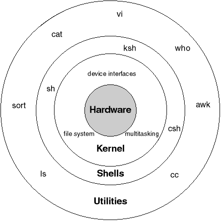
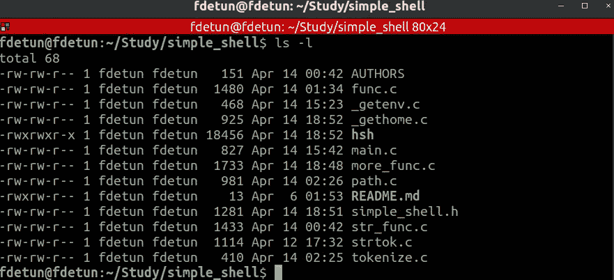
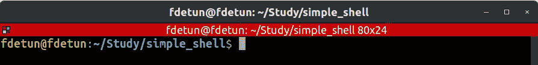
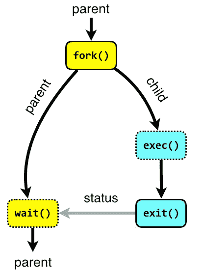
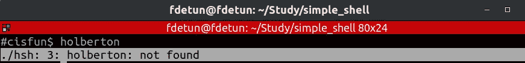
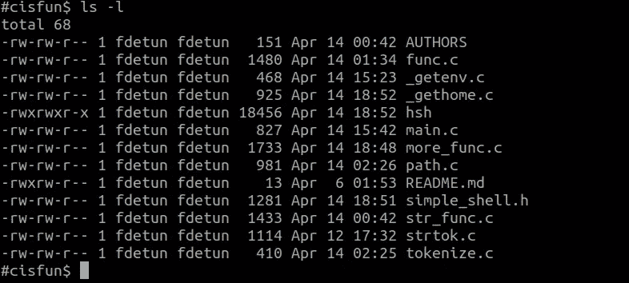

# 在 Linux Shell 中键入 ls -l 会发生什么

> 原文：<https://levelup.gitconnected.com/what-happens-where-you-type-ls-l-in-a-linux-shell-98ad95430cbf>

shell 是一个程序，它从键盘上获取你的命令，然后交给操作系统去执行。外壳隐藏了底层操作系统的细节，并管理操作系统内核接口的技术细节。

提示符$，称为命令提示符，是由 shell 发出的。当提示符显示时，您可以键入命令。在您按 Enter 键后，shell 会读取您的输入。它通过查看您输入的第一个单词来确定您想要执行的命令。单词是一组完整的字符。空格和制表符分隔单词。Shell 脚本是一个命令列表，按照执行顺序排列。



ls 是一个 shell 命令，列出一个目录中的文件和目录。使用 **-l** 选项，ls 将以长列表格式列出文件和目录。



# 那么…到底发生了什么？

首先，在您键入任何内容之前，shell 会打印一个提示，通常以一个 **$** 符号结尾。提示符或命令行是您键入命令的地方。

# 1.将显示 shell 提示符



# 2.shell 从用户输入的标准输入中读取命令

其次，在您键入命令后，shell 会读取您使用 getline 函数键入的内容。

getline 函数将输入的行作为一个字符串从标准输入中读取，并将其存储在缓冲区中。

# getline()函数

最新最流行的读取一串文本的函数是 *getline()* 。这是一个新的 C 库函数，出现在 2010 年左右。

你可能没有听说过 *getline()* 函数，一些 C 程序员避免使用它，因为它使用了——振作起来— *指针*！尽管如此，这是一个很好的行输入函数，即使您不打算使用它，您也应该熟悉它。

下面是一个典型的 *getline()* 语句:

```
getline(&buffer,&size,stdin);
```

*getline()* 函数的原型在`stdio.h`头文件中。这里有三个论点:

`&buffer`是存储输入字符串的第一个字符位置的地址。是*不是*缓冲区的基址，而是缓冲区中第一个*字符*的基址。这种指针类型(指针-指针或`**`之类的东西)导致了巨大的混乱。

`&size`是保存输入缓冲区大小的变量的地址，另一个指针。

`stdin`是输入文件的句柄。因此，您可以使用 *getline()* 从文件中读取一行文本，但是当指定了`stdin`时，将读取标准输入。

在读取该行并将其存储在缓冲区中之后，getline 返回一个 int/ssize_t，它等于:

1.  成功时读取的字符数，不包括字符串的终止空字节。

运筹学

2.-1，表示未能读取一行(包括文件结束条件)。

名词（noun 的缩写）程序员必须在程序结束时释放分配给缓冲区的内存。

# 3.解析用户输入

调用字符串标记化函数，将命令行拆分为标记。在我们的 shell 中，我们使用了一个名为`strtok()`的函数，该函数用行来标记，用分隔符来定义标记边界

以该命令为例:

```
ls -la /
```

我们有二进制文件的名字(ls)和它的参数。

该命令也可以是:

```
$  ls       -la      /
```

我们将编写一个函数，将我们的命令(不带空格)存储在 char **中，它将给出:

```
[ls][-la][/]
```

# 4.shell 检查第一个标记(主命令本身)是否是别名，如果是，就用实际的命令替换别名

shell 通常会在其系统文件中查找已定义的别名。如果`ls`命令是其他命令的别名，那么 shell 将用`ls`代表的命令字符串替换`ls`标记，以便在后续步骤中进行正确的操作。

# 5.执行

为了执行我们的订单，我们将使用 syscall `execve`。

我们必须使用 syscall `fork`来创建一个新的进程，并在其中启动我们的命令。

**fork()** 系统调用用于在 C 程序中创建子进程。fork()用于应用程序中需要并行处理的地方。fork()系统函数在头文件 **sys/types.h** 和 **unistd.h** 中定义。在使用 fork 的程序中，还必须使用 wait()系统调用。wait()系统调用用于在父进程中等待子进程完成。为了完成子进程，在子进程中使用 exit()系统调用。wait()函数在头文件 **sys/wait.h** 中定义，exit()函数在头文件 **stdlib.h** 中定义。



以下系统调用用于基本流程管理。

**fork :** 父流程使用 fork 创建新的子流程。子进程是父进程的副本。fork 之后，父进程和子进程执行相同的程序，但是在不同的进程中。

exec : 替换进程执行的程序。子进程可以在 fork 之后使用 exec 来用新的可执行程序替换进程的内存空间，使子进程执行与父进程不同的程序。

**退出:**以退出状态终止进程。

**等待:**父进程可以使用等待来暂停执行，直到子进程终止。使用 wait，父进程可以获得被终止的子进程的退出状态。

# Fork 成功返回两次

成功时`fork`返回两次:一次在父节点，一次在子节点。在调用`fork`之后，程序可以使用 fork 返回值来判断是在父进程中执行还是在子进程中执行。

*   如果返回值是`0`，程序在新的子进程中执行。
*   如果返回值大于零，程序在父进程中执行，返回值是创建的子进程的进程 ID (PID)。
*   失败时`fork`返回`-1`。

注意:通过向我们的 shell 发送一个像 holberton 这样的简单命令，`**execve**`我们返回-1，`**perror**` 显示**。/hsh: 3:霍尔伯顿:找不到。**



第一个参数`d'execve`必须是要执行的二进制文件的绝对路径。

为了找到程序在哪里，我们需要使用环境变量`PATH`。

如果我们执行命令:

```
$> echo $PATH
```

我们将得到如下所示的输出:

```
/bin:/usr/bin:/usr/local/bin
```

这些是文件(用':'分隔)，否则我们的 Shell 将查找要执行的二进制文件。

我们现在需要编写连接路径和二进制文件的函数。

您必须用函数`getenv`检索$ PATH 变量的内容。它接受一个我们正在寻找的变量的参数，并返回一个指向作为参数传递的变量内容的指针。

如果我们的二进制文件不在任何文件夹中，我们可以通过一个`Command not found`来警告用户，否则我们可以执行 execve: D。

检索＄PATH 变量的内容并返回绝对路径:D 的函数

此时，我们的 shell 执行一个命令，但是没有内置或环境。



我们现在将添加一些内置到我们的外壳。

**内置**是我们 shell 中的一个编码器命令。也就是说，该命令不会与 execve 一起执行。

如果我们启动 bash 并删除环境变量`PATH`，我们的 shell 必须仍然能够执行基本的命令。

命令`cd, pwd, exit ...`必须是可执行的。

您可以使用命令`help`列出 bash 下的所有内置代码

我们会看到内置的`cd, pwd`。还有很多其他的，但是目标只是让你理解什么是内置以及如何实现它。

对于内置的`cd`，我们将使用函数`chdir`

`chdir`将成为当前文件夹的路径作为参数

内置实现的一个例子`cd`:

# 是时候退出外壳了

退出 shell 有三种方式:

1-键入命令“exit”或“exit n”(n 是整数)

2-按下 Ctrl + D(这标志着 EOF，标准输入文件的结尾)

3-按下 Ctrl + C(这被定义为退出的信号)

[](https://skilled.dev) [## 编写面试问题

### 一个完整的平台，在这里我会教你找到下一份工作所需的一切，以及…

技术开发](https://skilled.dev)