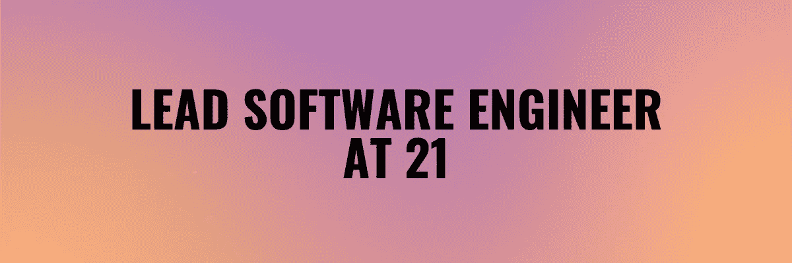

# 是什么帮助我在 21 岁时成为首席软件工程师

> 原文：<https://levelup.gitconnected.com/what-helped-me-to-become-a-lead-software-engineer-at-21-697060255c45>

最近，我通过了 EPAM 系统首席软件工程师的评估，人们有时会问我是怎么做到的。我想告诉你帮助我在 21 岁时实现这一目标的原则。我不会在本文中谈论这条道路的技术方面。

# 我的短篇小说

我在高中的时候开始写代码，那是一堂普通的 it 课，一位老师向我们展示了 Pascal。那时候，编程的一切都像魔术一样。

过了一段时间，我意识到我想完全独立于我的家庭，我需要资源。作为一名自由职业者，Web 开发看起来是一个很好的成长和在互联网上寻找机会的地方，所以我开始学习 Web。

很快，我注册了 NURE 大学计算机科学专业，并开始寻找发展的机会，最终找到一份软件工程师的工作。我发现了 EPAM 和他们正在做的培训课程，所以 3 年前我开始在 EPAM 系统公司做前端培训。在实习期间，我将我的主要技能转换到 Node.js，现在我是一名首席软件工程师，今年 21 岁。

p . s . Elon Mask 这样的人激励着我。

# 关键原则

我不想在这篇文章中谈论技术路线图，但我更愿意关注我在生活中使用的原则，这些原则帮助我在如此短的时间内成为一名首席软件工程师。

虽然我们在这里谈论的是软件工程，但我相信同样的原则可以用于你生活的其他领域或其他行业。

## 求责任

如果我们把问题的技术/知识方面去掉，领导和高管之间唯一的不同就是这个人承担的责任程度。

作为一个人，你不应该害怕承担责任，相反，你应该寻求它。首先，对你的生活和你生活中发生的一切负责。是的，你不能控制生活中发生的所有事情，但是你可以控制你的反应。

你在职业生涯中成长得越多，人们对你的期望就越高。拥抱它。

## 永远尽力而为

有时候我们会觉得很累，或者项目对我们来说不感兴趣，但我们应该总是尽力而为。如果你想从事更好的项目或获得更高的薪水，你的管理层应该知道你是一个可靠的人，他们可以给你任何任务，并且会尽你所能完成。

此外，它将帮助你更快地提高你的技能。**不要只是走走过场，从工作中你总会学到一些东西。**

我喜欢 EPAM 的一点是，追求卓越实际上是这里的关键价值观之一。

## 建立你的关系网

我们生活在社会中，社会以这样或那样的方式影响着我们的生活，尤其是生活给我们提供的机会。你可以成为世界上最酷的工程师，但是如果没有人知道你，那么你就没有机会了。

确保人们了解你和你的优点，并参加活动。抓住机会，总是尽力而为，人们会谈论你，给你更多的机会。

## 抓住机会

人们会注意到你是一个可靠的人，他们会为你提供更多的机会。因此，你不应该害怕接受新的项目或活动。

新的活动给你带来更大的成长空间，扩大你的影响力，建立更广阔的人脉。

## 记住你的目标

当你手头有很多项目时，你会感到不知所措，这没什么。

> “如果你知道了**为什么**，你就能过上任何**怎样的**”
> 
> ― **弗里德里希·尼采**

记住你为什么要忍受怎样。

## 做一个不断学习的人

如果你想成功，你需要每天成长，提高自己，或者我更应该说投资自己。

记住，每天 1%的进步在年底是 37 倍的进步。

总是寻找方法变得更好，把你的手艺做得更好。

## 永不停止前进

当你实现一个目标时，可能会有点沮丧，因为你终于实现了你长期以来一直在努力争取的东西。

现在，当你有动力时，你必须坚持下去，否则，你会陷入沮丧。

在达到当前目标后，永远要有下一个更大的目标。记住，小步骤会带你走向大目标。

# 摘要

职业发展会给你和你所做的工作带来更多的责任和更高的期望。虽然头衔或薪水可以是一个目标，但真正重要的是在实现这个目标的过程中你成为了什么样的人。

给初级/见习工程师的一个建议是永远申请你能进入的最大的公司，因为它有更多的空间和机会让你成长和发展你的技能。