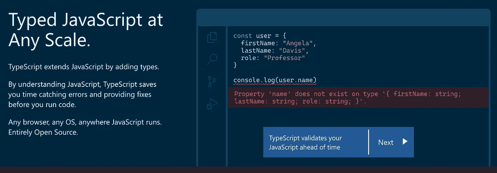

# 本周我在工作中所学到的:理解打字稿

> 原文：<https://levelup.gitconnected.com/what-i-learned-at-work-this-week-understanding-typescript-3dffe827b1a1>

我在[熨斗学校](https://flatironschool.com/welcome-to-flatiron-school/?utm_source=Google&utm_medium=ppc&utm_campaign=11658496690&utm_content=118992107208&utm_term=flatiron%20school&uqaid=488305145676&CjwKCAjwr_uCBhAFEiwAX8YJgT2zE8NMdJMiEoiDWePkmHJ8HAJSxz3WahyrmH9hELjMBL7KUEhkCBoCqs8QAvD_BwE&gclid=CjwKCAjwr_uCBhAFEiwAX8YJgT2zE8NMdJMiEoiDWePkmHJ8HAJSxz3WahyrmH9hELjMBL7KUEhkCBoCqs8QAvD_BwE)学过 SQL、JavaScript 和 React。我和朋友在 [BrightCode](https://www.brightcode.dev/) 学习 Java，我的 Python 基础来自[的 Udemy 课程](https://www.udemy.com/share/101W8QAEMfdVZSR34D/)。这为我在工作场所编写代码做好了准备…直到我接触到使用 TypeScript 构建的新 repos。我一直在拖延对这种语言的研究，因为如果你对 JavaScript 有经验并且理解强类型语法的话，这有点直观，但是最终我们不得不停止掩饰我们不理解的代码，并且实际上写一个关于它的博客。所以我们在这里。

## **键入 JavaScript**



我们可以在图中看到: *TypeScript 通过添加类型来扩展 JavaScript。我记得在我第一次学习 Java 的时候——给变量添加类型有助于使我们的代码更加清晰，减少运行时错误。对于曾经试图对一组数字进行排序，但后来发现它们是作为字符串输入的人来说，这应该是一个很大的解脱。TypeScript 编译成 JavaScript，TS 文档提醒我们所有有效的 JavaScript 代码也是 TypeScript 代码*，因为即使是类型检查警告也不会在运行时引起问题。TypeScript 的主要工作是在我们为代码设定期望值时让我们负起责任。我们声明我们的值应该采取某种形式，如果没有，TypeScript 会让我们知道。

这里有一个基于我在工作中尝试使用的新 repo 的 TypeScript 语法的例子。这是比较棘手的一面，所以如果你像我一样是新手，请不要担心:

```
export const collectDataFromPage: EnricherPlugin<EnricherConfig> = (configuration) => {
  // function logic
};
```

这里有很多 JavaScript 开发人员应该熟悉的东西。我们正在导出一个名为 *collectDataFromPage* 的常量，但是在常量之后，我们希望等号表示赋值。相反，我们得到一个冒号。这是 TypeScript:在我们给常量赋值之前，我们提供了一个*类型注释*。

编码语言将我们的数据分成*类型*，比如*数字*、*字符串*，或者*布尔*。类型有助于我们确定哪些操作适用于不同的数据，这也是我们试图运行这段代码时会出现错误的原因:

```
5 / "cardboard";
```

凭直觉，我们知道我们不能用一个字符串除一个数，因为我们已经有了基本的数学知识。JavaScript 知道这一点，因为这两种类型之间不允许这种操作。通过允许我们注释类型，当我们试图运行像我上面写的无效逻辑时，TypeScript 使它变得更加明显。例如:

```
const numerator: number = 5;
const denominator: number = "cardboard";
// Type 'string' is not assignable to type 'number'.
```

如果我最初的例子没有说清楚，我们可以通过在变量名和值赋值之间使用冒号和类型名(或别名)来注释类型。在这种情况下，在 TypeScript 警告我变量有问题之前，我甚至不能进行操作。如果我知道我打算执行一个数学运算，但却给我的一个变量赋了一个非数字值，TS 会让我知道。相反，如果我知道我的第二个变量是一个字符串，但试图以错误的方式使用它，我会得到一个不同的错误:

```
const numerator: number = 5;
const denominator: string = "cardboard";
return numerator / denominator
// The right-hand side of an arithmetic operation must be of type 'any', 'number', 'bigint' or an enum type.
```

这里有一些有效的类型，但 string 不是其中之一。多亏了 TypeScript，我们知道有些东西需要改变。现在让我们再来看看这个例子:

```
export const collectDataFromPage: EnricherPlugin<EnricherConfig> = (configuration) => {
  // function logic
};
```

我们看到一个注释，但是如果我们跳过一分钟，它看起来就像我们在处理一个函数。为了清楚起见，下面是不带注释的代码:

```
export const collectDataFromPage = (configuration) => {
  // function logic
};
```

我们知道类型注释描述了应该与变量相关联的类型。我们之前的例子表明*的分子*应该是一个*数*。同样，如果我们的变量对应于一个函数，注释实际上可以描述这个函数。那么什么是*enricher plugin<enricher config>呢？*

## 如何在 TypeScript 中定义一个类型？

得知*数字*、*字符串*和*布尔值*并不是 TypeScript 提供给我们的唯一类型，这可能并不令人惊讶。实际上，TypeScript 的大部分效用来自于我们创建定义某些属性的*对象*类型的特定别名或接口的能力。如果您曾经定义过一个类，这可能看起来很熟悉:

```
type Cat = {
  name: string;
  age: number
};
```

现在，如果我们使用别名，我们就有了 TypeScript 警告/提示的好处:

```
const mittens: Cat = {
  name: 'Mittens'
};
// Property 'age' is missing in type '{ name: string; }' but required in type 'Cat'.
```

我在这里有意使用术语*别名*。从技术上讲，我们并没有定义一个新的*类型*，但是我们定义了一个现有类型的别名，在本例中是 object。我们还可以定义一个接口，它的作用与类型别名基本相同，但是如果我们决定要添加一个属性，可以更容易地修改它。决定使用哪一个将可能归结为个人/组织的偏好。当试图解码我在工作中看到的类型别名的含义时，我发现了这个定义:

```
export type EnricherPlugin<T> = (configuration: T) => AnalyticsData;
```

我们看到了一个看起来相似的类型别名，尽管与我们的调用并不完全相同。我们看到的不是 EnricherPlugin <enricherconfig>，而是 EnricherPlugin <t>。本例中的<t>正在利用 TypeScript [泛型](https://www.typescriptlang.org/docs/handbook/2/generics.html)来允许我们的别名中有一个变量。</t></t></enricherconfig>

在某些情况下，我们可能希望在指定类型时考虑到灵活性。例如，如果我定义了一只狗和一只猫的别名，我可能想写一个函数类型，它可以接受这两个别名作为参数。泛型允许我们在类型别名定义中创建一个变量，而不需要立即指定它的类型。相反，函数的参数类型将在编写该类型的函数时声明。如果我们回头看看我们的 EnricherPlugin， *T* 是最终被 EnricherConfig 替换的变量。这意味着，在 collectDataFromPage 的情况下，预期的配置变量是 EnricherConfig 类型。如果我们传递给它错误的类型…我们将得到一个类型警告！

最后，在我们的定义中，我们看到函数的结果应该是 AnalyticsData。在代码库中有另一个类型别名来定义它，然后导致其他别名等等，直到我们最终得到由原始数据类型组成的对象。尽管还有很多东西需要学习，特别是关于这个函数*到底做了什么*，揭开这个不熟悉的语法的神秘面纱可以帮助我们增强理解函数内部逻辑的信心。

## **一种新语言**

当我们从新兵训练营毕业时，我们会得到各种各样的建议，告诉我们在培养技能和找工作时应该关注什么:算法、网络和聚会、开源项目、博客、高级概念和词汇等等。但是我一直得到的一个建议是，刚从训练营出来就尝试学习一门新的语言或框架并不是一个好主意或有效的时间利用。在我完成熨斗学校的课程一年后，我对这个想法有了新的看法。

当我们刚进入这个行业时，我们经常缺乏方向和背景。我们想知道哪些语言正在崛起，或者哪些语言是古怪或独特的。我们可以查找哪种语言与最高工资或最高就业率相关联。当然，这些都不是学习一门新语言的好理由。在一门新语言上花费时间的不利方面是，我们可能对它有了肤浅的理解，最终知道如何用两种语言编写基本代码，而不是用一种语言编写高级概念。

我仍然认为，算法和网络会让你在找工作时获得最高的投资回报率，但学习一门新语言比简单地在简历上增加一颗子弹有更多的好处。像 TypeScript 这样的强类型语言帮助我们实践 JavaScript 根本没有的概念。这些概念有助于我们更好地理解 JavaScript，从整体上更好地理解编程。我之所以能够使用 TypeScript，是因为我在学习 Java 时研究过数据类型。Java 并不太难，因为我在学习 Ruby 的时候已经学习了面向对象编程。我们不需要新的语言来学习这些东西，但是它们同时提供了学习新语法和新概念的双重好处。当然，我最初的观点“学习一门新的语言不是一个好主意”是过于简单化了，但仍然值得记住的是，我们的目标应该是每次坐下来编码时学习一些东西，*任何新的东西。如果我们坚持这样做，我们将更接近我们的目标。*

## **来源**

*   [打字稿文件](https://www.typescriptlang.org/)
*   [打印文档中的日常类型](https://www.typescriptlang.org/docs/handbook/2/everyday-types.html)
*   [关于 TypeScript 文档中函数](https://www.typescriptlang.org/docs/handbook/2/functions.html)的更多信息
*   [类型脚本文档中的泛型](https://www.typescriptlang.org/docs/handbook/2/generics.html)