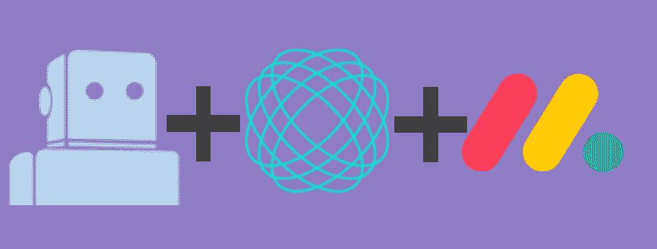
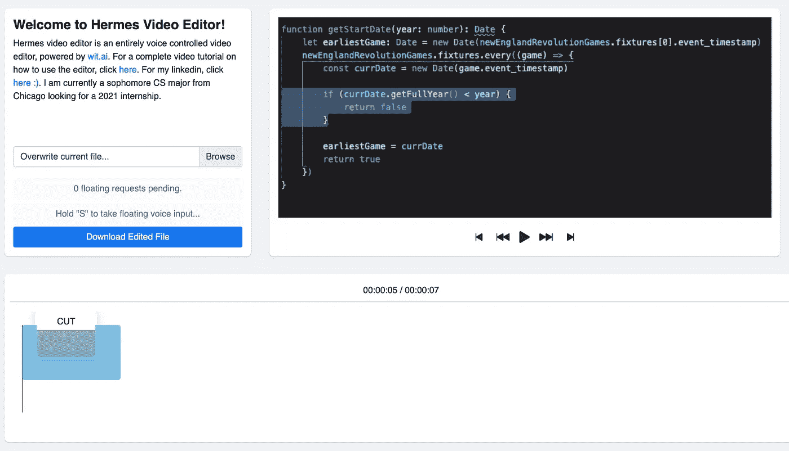
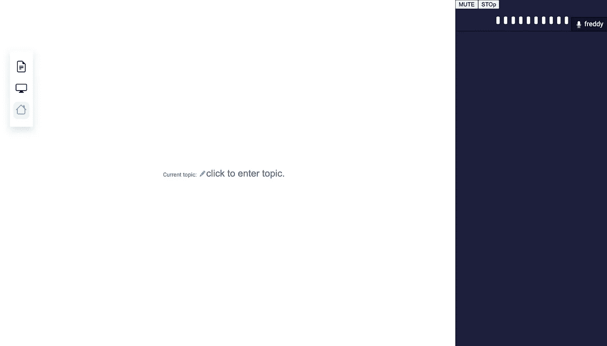

# 我在一个月内编写 3 个项目代码中学到了什么(给开发人员的 8 条建议)

> 原文：<https://levelup.gitconnected.com/what-i-learned-coding-3-projects-in-a-month-8-tips-for-developers-213275f0496d>

3 个项目

我决定，在疫情的一个学期里，保持我的编程技能敏锐的最好方法是参加黑客马拉松。

我将回顾我参加的三次黑客马拉松。每一次黑客攻击，我都是单干的。我的目标不是赢，而是提高我的技能——如果我赢了，那就太棒了！我不觉得把团队聚集在一起会是一条出路，所以我独自踏上了我的旅程。

# Hack 1: Hermes 视频编辑器，用于 wit.ai 黑客马拉松

这个由脸书举办的黑客马拉松是我参加的第一个黑客活动。我的最终产品可以在这里找到(取决于你什么时候读到这篇文章，有些链接可能会断开，也可能不会断开！).这是产品的样子:

爱马仕视频编辑器的屏幕截图

黑客马拉松的目标是使用自然语言处理平台`wit.ai`。用外行人的话来说，这意味着一个 API 可以处理正常的句子，比如“你能剪掉视频的最后 10 秒吗？”转换成一个容易解析的`json`。

我的想法是采用一个复杂的用户界面，比如视频编辑器，并使其可以通过语音访问。这包括告诉编辑剪切、静音、快进等。

## **关键要点**

**如果你的目标是出货，少写代码**

很明显，我没有想象中那么多的时间来创建这个项目。在这里，当我在屏幕后面时，我开始尝试最大化我的效率:我开始大量使用 bootstrap，而不担心某些东西是否风格完美。我还首先关注核心功能，然后做细节，比如设计——这是为了确保在截止日期之前，我至少有一个功能性的黑客。

**永远不要有零的一天**

这个真的很重要。如果你有最后期限，挑战自己每天至少做一点点工作——很容易陷入“我明天再做”的怪圈。我还发现最难的部分是让自己坐下来开始工作。工作自然而然地就开始了，很多次我都没有完成一个小时的时间表，结果工作了更长时间。

**过早优化确实是万恶之源**

我要第一个说:我对优化很着迷。我学习 Rust 是因为我想写更快的代码，即使我现在的代码并不慢。我最近一直在学习无服务器架构，所以当我最终推出一个产品时，它可以无限扩展——即使我从未推出过产品。

不要担心在一个列表上做二进制插入来保持它的排序。加到最后做个`.sort()`就行了。如果你的应用程序很慢，那就回去优化——但是十有八九，`.sort()`会工作得很好，你的用户永远不会知道有什么不同。

# 黑客 2:足球机智

这个黑客是上一个的延伸。我选择它是因为两件事:首先，我已经学会了使用前一个教程的`wit.ai`，其次，我想开始写作，写一个教程似乎是一个很棒的开始方式。

该项目是在一系列技术中的一个上建立一个教程，其中一个包括`wit.ai`。你可以在这里找到我为黑客制作的[两分钟视频](https://youtu.be/quuNoqQsphY)，或者在这里找到我的[实际教程](/natural-language-processing-is-easy-adding-nlp-for-better-ux-to-your-app-d8b21e901a05)。

## 关键要点

**写得易懂**

仅仅为了完成工作而编写代码或文字是很容易的——也许你只是想在工作中完成一张糟糕的吉拉罚单，或者也许你只是为了写评论而写评论。我发现，当我们回头看的时候，我们经常会发现我们的代码是不可读的，或者我们的注释是愚蠢的。

为其他人写评论和代码，这样当他们看到你写的东西时，他们会说“这家伙以我喜欢阅读的方式写作！”。

**文档不容易**

编写代码和编写文档是两种非常不同的技能——不幸的是，如果我们希望我们的代码被使用，我们需要编写可靠的文档。曾经偶然发现一个维护良好的伟大项目，但是医生说“这里有一个例子的链接。祝你好运！”？

这是因为编写文档既困难又费时，而且像所有其他技能一样，这是一项需要练习的技能。然而，拥有好的文档，即使是在内部代码库中，回报也是巨大的。开发人员的工作效率将会更高，速度也会更快，也能更快地找到他们需要的东西。减少挖掘时间，增加工作时间。

**理解的最好方法是教**

如果你正在尝试学习一种新的 API 或技术，我强烈建议你为自己录制一个教程。你甚至不必保留它——只需记录并删除它。

这是因为很多时候，我发现自己复制粘贴或只是听编译器。如果我不得不花时间大声说出我在做什么，我就开始尝试推理。这让你对正在做的工作有了更深层次的理解。

# 黑客 3:周一发布会

完全披露:我实际上还没有完成这个——我目前还在做。本质上，它是一个与在线生产力平台 monday.com 集成的缩放克隆。我会附上 WIP 版本的截图。

## **关键要点**

**不要害怕使用新技术**

webRTC 是个可怕的东西。在网络上建立 P2P 连接很难——但是非常有用。对于这次攻击，我使用 webRTC 作为客户端之间的主要通信通道。虽然这是一场斗争，但我最终真的很好地学习了一项新技术，现在我已经把它放在我的工具箱里了。P2P 连接实际上在许多情况下非常有用，如果我需要创建一个，将来会容易得多。

**使用风格指南**

我不是设计师。我花了很多时间试图让我的应用程序看起来像样，这意味着我花了很多时间没有实际开发。对于这次攻击，我使用了 Monday.com 的风格指南，该指南详细说明了如何设计大多数东西的风格。我的工作流程变得非常快，因为我不需要考虑什么看起来最好，相反，我可以在功能上工作。

你不需要复制现有的公司风格(尽管这不是一个坏主意)——类似于 bootstrap 风格或 Chakra 就足够了。