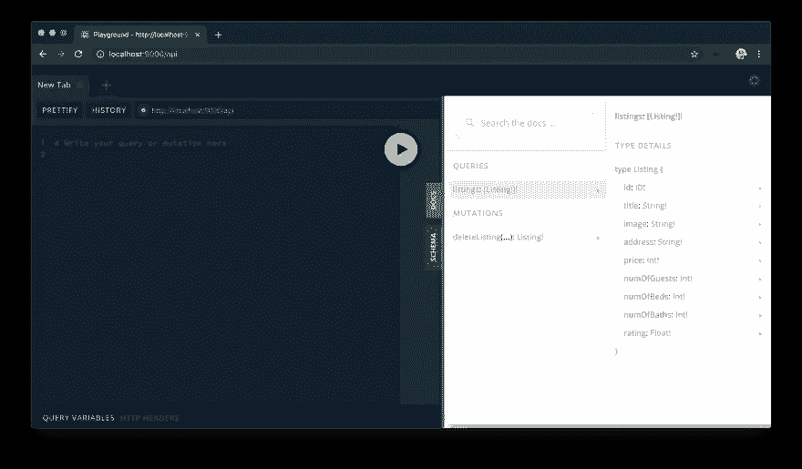

# 我从 GraphQL 和 TypeScript 的 2 小时速成课程中学到了什么

> 原文：<https://levelup.gitconnected.com/what-i-learned-from-a-2-hour-crash-course-on-graphql-and-typescript-c7773e23490b>

约书亚·索蒂诺在 [Unsplash](https://unsplash.com?utm_source=medium&utm_medium=referral) 上拍摄的照片

作为一个对 JavaScript 和 Ruby 有扎实理解但对其他编程语言了解不多的人，我一直想了解更多关于许多 JavaScript 开发人员称赞的工具集: **TypeScript** 。

另一个我注意到的在开发领域比较新的工具是 **GraphQL** 。

由于没有足够的带宽来深入研究这两个工具，我很高兴地找到了一个全面的免费视频教程，涵盖了这两个主题:
[用 Node 和 TypeScript 构建您的第一个 GraphQL 服务器](https://www.newline.co/courses/the-newline-guide-to-building-your-first-graphql-server-with-node-and-typescript/)

尽管课程时长为 2.5 小时，但实际上我花了至少两倍的时间才完成。这段时间花得很值。

除了了解 TypeScript 和 GraphQL 的要点之外，您还将看到一个初学者友好的代码环境设置和一些节点包配置的演练。

以下是我的课程之旅中的 4 个关键收获:

# TypeScript 是 JavaScript 的类型检查器

简单来说，TypeScript 是 JavaScript 的*类型化*扩展。

因为 JavaScript 是弱**(或动态)类型的，例如一个变量可以被重新分配给不同的数据类型，所以拥有一个强**类型的超集有助于减少数据类型放错地方的生产问题。****

****TypeScript 是超集。它由微软在 2012 年推出，作为一种开发工具，帮助 JavaScript 开发人员避免令人痛苦的错误，并使代码更容易理解。****

****TypeScript 最终将在编译过程中转换成有效的 JavaScript，因为客户端和服务器不识别 TypeScript。****

# ****GraphQL Playground 功能强大****

****正如课程创建者所言:****

> *****GraphQL 是一种向 API 发出请求的查询语言。使用 GraphQL，客户端告诉服务器*它到底需要什么*，服务器用请求的数据进行响应。*****

****不仅如此，我还被 [GraphQL Playground](https://github.com/graphql/graphql-playground) 流畅、直观、现代设计的界面所震撼。这里有一些截图，但我鼓励你尝试一下，见证它的威力:****

****************

# ****Monokai Pro 很美****

****在代码编辑器的初始环境设置期间，我被介绍了一个可爱的 VS 代码扩展，叫做 [Monokai Pro](https://monokai.pro/) 。作为一名视觉学习者，使用相同的编辑器/配色方案编写课程代码也很有帮助。****

# ****节点问题？没问题！****

****好吧，我承认这个吸引人的标语可能有点混乱。我想说的是我个人对 NodeJS 的了解非常有限。当然，我使用`npm`来安装各种 JavaScript 库，但是我来自 Rails 背景，在参加课程之前还没有构建过节点服务器。****

****如果你们有相似的背景，不用担心。本教程实际上是从介绍 Node 开始的。您甚至可以构建一个简单的节点:Express server！****

****总的来说，我从本教程中受益匪浅，并强烈推荐给那些时间紧迫但只想看看 TypeScript 和 GraphQL 的强大功能的人。****