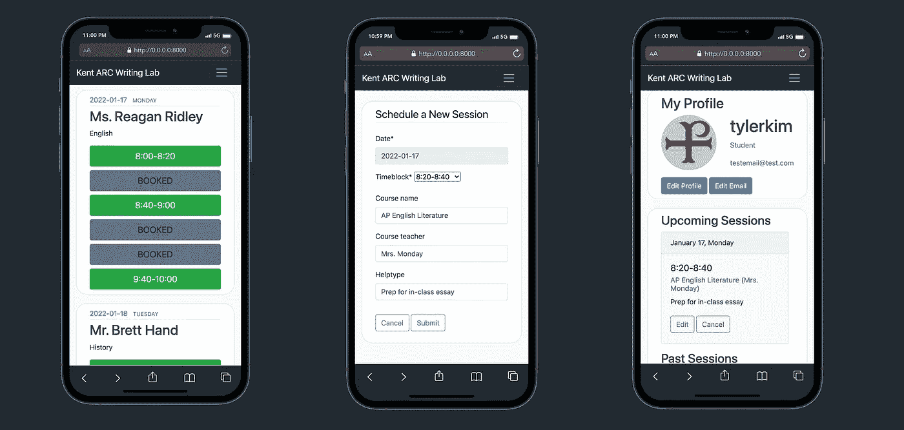
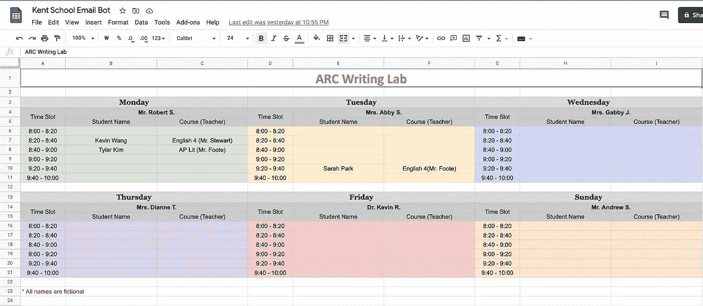

# 我从为我的学校构建 Django 预约时间表中学到了什么

> 原文：<https://levelup.gitconnected.com/what-i-learned-from-building-a-django-appointment-scheduler-for-my-school-2a9af57f6f2a>

这个项目教会了我如何学习，为什么学习，以及在我未来的 CS 生涯中学习什么。

我最近在 Reddit 上发布了一篇关于我的第一个网络应用的文章。一个预约调度程序，使用 Django 和 Bootstrap 改进我母校的导师调度服务。

*   [Github 回购 ](https://github.com/tylertaewook/tutor-scheduler-django)
*   [**项目页面**](https://tylertaewook.com/projects/tutorscheduler)

许多人给出了很好的建议和反馈，有些人询问了这个项目背后的更多故事。

因此，作为我今年的第一篇博文(是的，已经有一段时间了)，我想写一下我的项目的幕后:

*   **之前**:这个项目是怎么开始的？
*   **期间**:和 Django 一起造吧！
*   **之后**:我学到的教训

# 这个项目是怎么开始的？

## 背景:现有注册系统的问题

先说我高中以前是怎么组织预约的，我是怎么提出更好的办法的。

我母校的图书馆有一个学术资源中心(ARC)，他们每晚在六个 20 分钟的街区提供写作辅导服务。它通常被那些希望收到关于他们的写作作业和常见应用程序文章的反馈的学生使用。

虽然这是一个很棒的资源，但包括我在内的许多学生都被它的高科技注册系统所困扰:白板。是的，我们经常要穿过校园，每天在白板上写下我们的名字。当学生想重新安排或取消约会时，他们经常忘记擦掉自己的名字，这也造成了很多混乱。

## 为新的注册系统提出建议

作为一名正在寻找新项目的高中生，这是我能想到的最好的主意。我很快用基本的 python 建立了一个概念验证，学生可以用谷歌表单注册，用谷歌表单检查可用性，用电子邮件机器人取消约会。

基于 Google-sheet 的调度程序的概念证明

然后，我与图书管理员会面，提出了这个新系统，但是我当前的系统对于生产级应用来说不是很有效，也不可靠。表单和表格都必须每周手动更新，python 脚本必须每小时运行一次，违反直觉的 UI 等等…

# 让我们和姜戈一起建造它吧！

然后，我寻找一种方法将这个想法转化为一个实际可用的应用程序。我需要一个可靠的、可伸缩的 CRUD 后端，一个直观的、移动友好的 UI，以及具有不同权限组的独特用户模型。

在研究了 r/webdev 几天之后(顺便说一下，这是一个很棒的社区)，我了解到 Django 既是一个“包含电池的 web 框架”，也是一个备受推崇的技能集。我还能要求什么？

有一个小问题:我对 web 开发毫无经验，更不用说缺乏数据库和 ORM 方面的知识。我基本上必须在几个月内完成一个生产级的 web 应用程序，使用一个我以前从未使用过的框架。

## 学习和建设并举

许多人建议我从阅读 Django 文档开始，并遵循它的六部分教程。我能够通过一行一行地编写代码来遵循教程，但这远远不足以让我准备好独自从头开始做一个项目。特别是，我很难掌握 Django 的模型-模板-视图架构模式及其 ORM(对象-关系-映射)特性。

然后，我偶然看到了科里·斯查费的 [Django 教程](https://www.youtube.com/playlist?list=PL-osiE80TeTtoQCKZ03TU5fNfx2UY6U4p)；一个 17 个视频的播放列表，他在其中构建了一个完整的 CRUD(创建、读取、更新、删除)web 应用程序，具有用户验证、分页等功能。

我认为这是姜戈最好的资源之一。他对核心概念的解释非常详细，足以让像我这样的初学者理解。更好的是，他在播放列表中构建的 CRUD web 应用程序涵盖了任何人都需要的最常见的功能。

我按照他的指导一行一行地编码，直到前五六个视频，所有的概念突然在我脑海中闪现。在这一点上，我可以开始在 Corey 的项目上添加我自己的功能，因为我现在知道了*【谷歌什么】*。

基本上，Corey 的指导给了我足够的动力去克服 Django 学习曲线上的第一座山。项目的其余部分是我钻研 Django 的文档，多篇博客文章，以及 StackOverflow，因为我慢慢地将项目转化为我自己的项目。

## 部署了一个学期

最后，我完成了项目，并进行了广泛的单元测试，以尽可能避免在部署到生产环境时出现的问题。我与当地一所学校进行了最后一次会面，展示了完成的应用程序，并将其部署到 AWS 实例中。

在写这篇文章的时候，我们刚刚结束了为 500 多名学生实验性部署该应用的第一个学期。我通过 google forms 收集了错误报告，谢天谢地，到目前为止我还没有遇到任何大的扩展/中断问题。

以下是我们遇到的一些值得注意的错误，以及我们是如何修复它们的:

1.  **拥有多个 gmail 账户的学生**:修复了只允许 student@school-name.edu Gmail 账户注册会话的问题
2.  **不同时区问题**:原来是学生使用 VPN 时造成的。该应用程序只有一个时区，因为它是为寄宿学校的学生。
3.  **前一周的重复预约:**由于学生超过一周未关闭注册标签。通过实现超时功能修复。

除了这些小错误报告，我还收到了许多来自学生和老师的电子邮件，感谢我免费构建了这样一个服务。这当然是一个有益健康的时刻，我不会忘记:)

我计划在夏天增加更多需要的功能，为即将到来的秋季学期做准备。

# 我学到了什么？

## 如何学习:**完全初学者的最佳学习方法**

我真的在“教程地狱”中挣扎了几个月，我盲目地跟随教程，复制代码，但是从来没有在我自己的项目中使用它们。

在做这个项目的时候，我发现“边做边学”是最适合我的方法:**从跟随一个类似于你想要构建的教程开始；然后慢慢把项目从教程中脱离出来，独立出来。**

这个技巧的第一部分允许你克服最初的学习曲线，在那里你对一切都感到困惑。通过这种方式，你可以学到足够的知识，知道遇到问题时应该去谷歌搜索什么。然后，第二部分教你编程的“研磨”过程。我说的是那些为了解决一个 bug 而不得不阅读大量博客文章和文档的时间。我相信这个磨砺过程是真正推动你成为一个更好的有毅力的程序员的东西。

## 我为什么学习:做出更有影响力的贡献

为我的学校建立一个日程表是第一个对其他人产生真正影响的项目:我的学校社区。我可以见证我给学校带来的变化；学生不再需要穿过校园去报名参加辅导课，辅导老师可以轻松查看过去和未来的课程，教师可以在课堂上给学生分配课程。

事实上，我能用我的技能给我所热爱的社区带来如此积极的改变，这是我所能要求的最好的感觉。我喜欢 SWE，因为我相信这是少数几个可以在做自己喜欢的事情的同时回报社区的领域之一:编码。

从事这个项目是我迄今为止编码生涯中最激励人心的经历，我可以自信地说，我学到的经验将成为推动我前进的核心价值。

## 现在学什么:React -> Fullstack

我在这个项目中使用 Django 模板来代替前端框架的需要。虽然使用模板非常强大且易于实现，但我意识到需要学习前端框架来处理更动态的网站。

因此，我自然而然地开始学习一项新技能:反应。既然我已经体验了 web 开发的后端，我想尝试一下前端框架，看看我更喜欢哪一个。

我目前正在使用我上面提到的同样的学习技术开发 Django REST+ NextJS SaaS。我很快会写另一篇关于它的文章，所以请关注我！