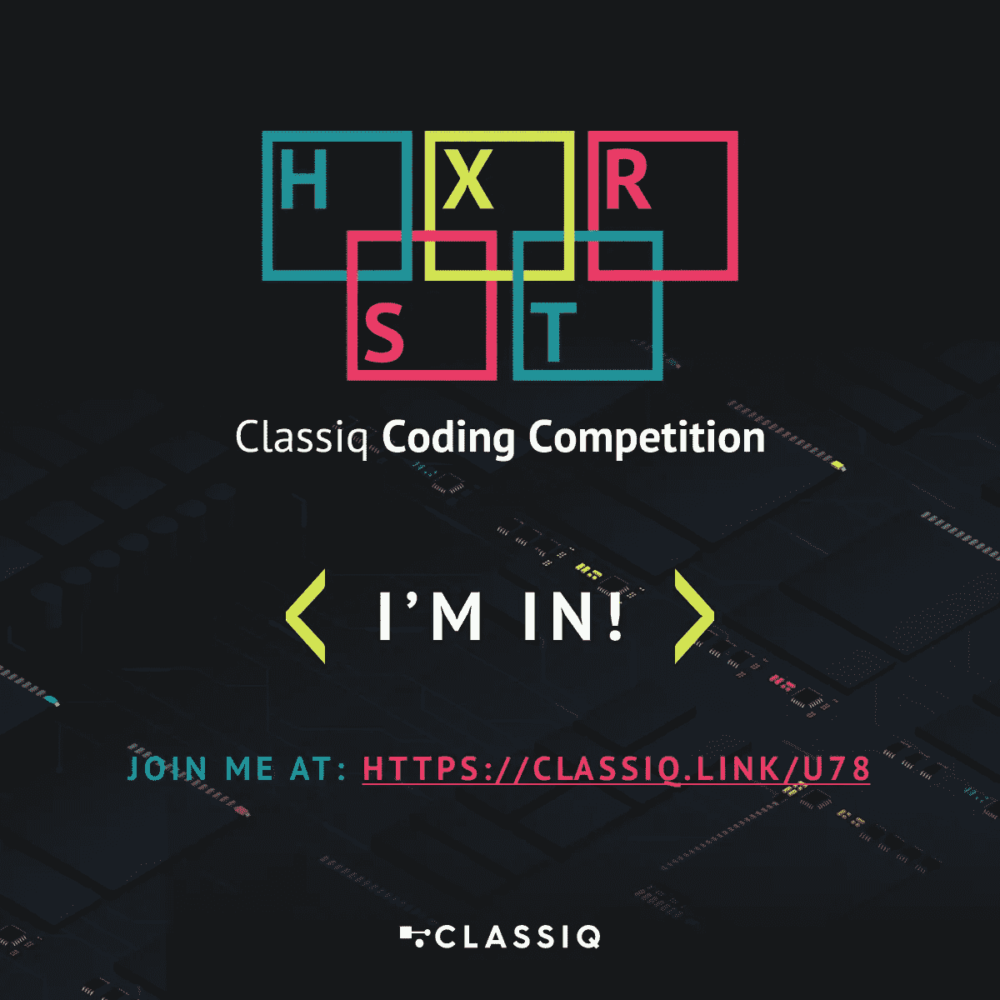

# 从 Classiq 的编码竞赛中学到的。

> 原文：<https://levelup.gitconnected.com/what-i-learned-from-classiqs-coding-competition-9ebfbb6816bb>

[https://www.classiq.io/competition](https://www.classiq.io/competition)

# 以下是通用的课程。

这些年来，我报名参加了多个编码比赛。我总是看着问题，很快就失去了兴趣，而且我从来没有真正提交过任何东西。 [Classiq 的编码竞赛](https://www.classiq.io/competition)标志着我第一次真正参加竞赛，我必须说我学到了很多。当然，我从每个挑战中学到了很多，但总体来说，我也从这样的比赛中学到了很多。

## 工具

在比赛的早期，我意识到 Classiq 的目标之一肯定是让我希望我正在使用他们的[量子算法设计(QAD)平台](/demo-classiqs-qad-platform-f0bec3608549)。对此我要说，“干得好。”没有一个挑战是不可能的，但每个参与者一定在某个时候想过，“一定有更简单的方法。”

## 协力

我应该组建一个团队或者加入一个团队或者以某种方式加入一个团队。我的绝大多数项目都是合作完成的，好处是显而易见的。显然，更多的想法摆在桌面上。好处可能很简单，就像有人听说了某件事，然后探索这个想法就有了回报。此外，我的几个提交纠正了早期提交的错误。如果我在一个团队中，我的队友可能会更早发现这些错误。

## 研究

部分获奖方案提供参考。我在某种程度上也是这样做的。然而，我没有研究我认为我已经知道的东西。我已经知道了，那我就开始编码吧？这是一个经典的编程错误，而这是量子编码。因此，其他竞争者发现并使用了更好的方法。展望未来，我的更多项目将从前往 [arXiv](https://arxiv.org/) 开始。

## 焦点

我应该专注于一两个挑战，就像我在日常项目中做的那样。相反，我的首要任务是快速提交一些东西，任何挑战的东西。毕竟什么都不提交是赢不了的。然后我绕了回来，在比赛期间，我做了一些改进，并重新提交了我的代码。最终的结果是我敢说有四个好的提交，但显然没有伟大的提交。

## 时间

我是最早的注册者之一，因此，我有最多的时间来应对这些挑战。因为比赛允许多次提交，所以我很早就为每个挑战提交了至少一个解决方案。我希望能够稍后修改并重新提交。回想起来，我真的不知道我为什么这么着急。我真的有很多时间。

## 创新ˌ革新

我很早就决定，我将专门为创造和创新的奖项而竞争。这确实得到了回报。我已经发表了一篇关于我的非辅助 MCX 作品的文章，尽管我不知道那篇文章是否为我赢得了一个奖项。我也打算写一些关于我其他作品的文章。

## 结论

尽管我是一名拥有政治学学位的冰淇淋厨师，但我在没有帮助的情况下，成功赢得了一项“创新解决方案”奖和一项“荣誉奖”。我不认为那是坏的，但是我显然能做得更好。下一次，我的团队将会赢得一切。不知道食肉仙人掌队有没有空缺？

# # ClassiqCodingCompetition 竞赛系列

*   [街区上的新大门](https://bsiegelwax.medium.com/new-gates-on-the-block-9cad1bc583fd)
*   [我从 Classiq 的编码竞赛中学到了什么](https://bsiegelwax.medium.com/what-i-learned-from-classiqs-coding-competition-9ebfbb6816bb)
*   [Classiq 的哈密顿问题](https://bsiegelwax.medium.com/classiqs-hamiltonian-problem-31e2992903d0)
*   [Classiq 的分配问题](https://bsiegelwax.medium.com/classiqs-distribution-problem-8e3c7a74afaa)
*   [Classiq 的托夫里问题](https://bsiegelwax.medium.com/classiqs-toffoli-problem-54b7e5084833)
*   [Classiq 的可满足性问题](https://bsiegelwax.medium.com/classiqs-satisfiability-problem-c8e78502f82b)
*   [非安西利亚 MCX](/no-ancilla-mcx-e59f455bb9f6)
*   [回顾:Wolfram 量子框架](/review-wolfram-quantum-framework-1fdb23d61be9)
*   [一个土生土长的托夫里门](/a-native-toffoli-gate-970093e4770c)

# 分级编码

感谢您成为我们社区的一员！更多内容请参见[升级编码出版物](https://levelup.gitconnected.com/)。
跟随:[推特](https://twitter.com/gitconnected)，[领英](https://www.linkedin.com/company/gitconnected)，[通迅](https://newsletter.levelup.dev/)
升一级就是转型理工招聘👉 [**加入我们的人才集体**](https://jobs.levelup.dev/talent/welcome?referral=true)