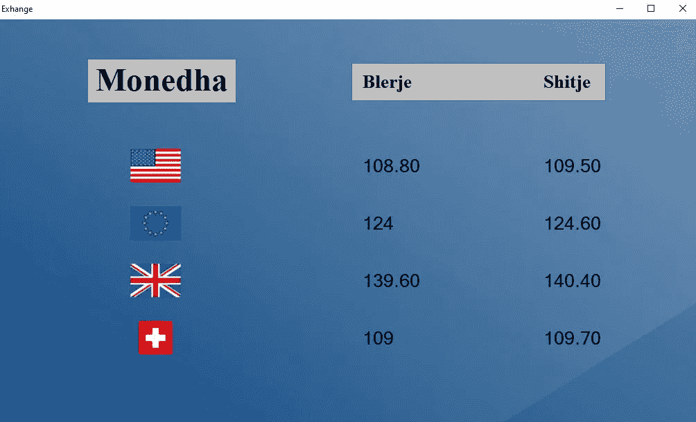
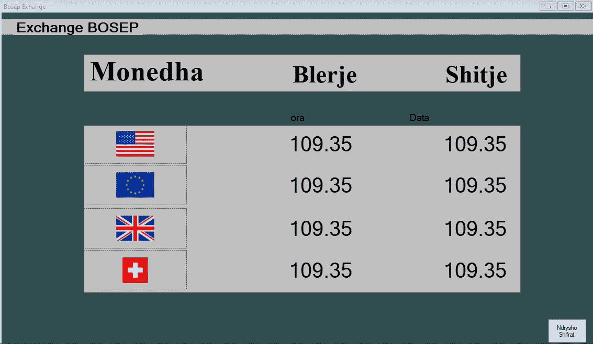
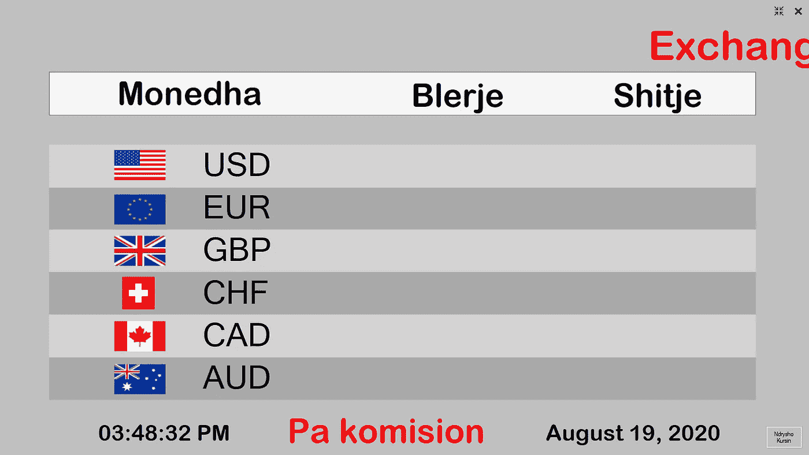
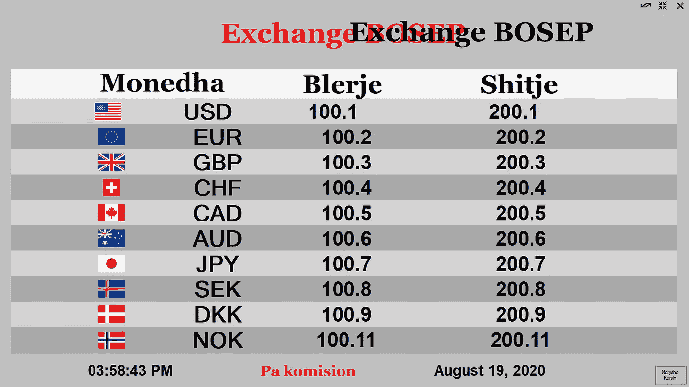
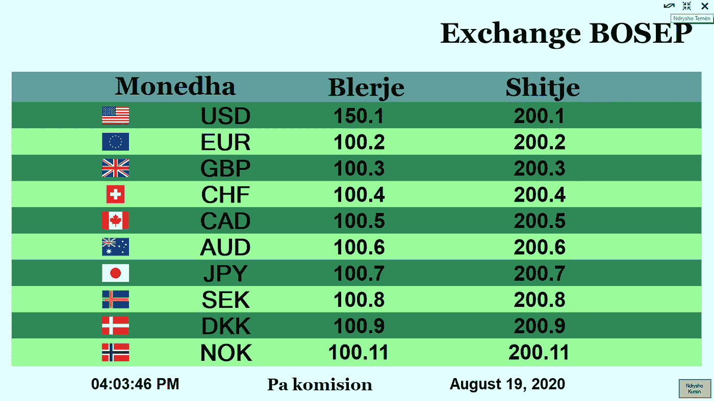
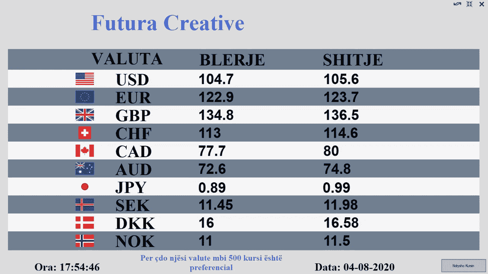

# 我从开发我的第一个应用程序中学到了什么

> 原文：<https://levelup.gitconnected.com/what-i-learned-from-developing-my-first-application-54cc608e58d8>

当我有了想开发一个应用程序的想法时，我还在读学士学位的最后一年，而且我还在做兼职。我在学校的最后一个项目是创建一个应用程序，我认为我有一个完美的机会来一举两得。我的意思是，我希望我的应用程序可以在世界范围内销售，并帮助我在最终项目中取得好成绩。我在 it 部门的工作是营销我的应用程序的完美媒介，当我向他们提出这个想法时，很明显我们都会从中受益。

潘卡杰·帕特尔在 [Unsplash](https://unsplash.com?utm_source=medium&utm_medium=referral) 上的照片

# 保持承诺，不要退缩。

我开始着手这个项目，我有一个我想要它看起来怎么样的想法，但是任何技术上的东西对我来说都还没有。不管怎样，我做了我认为正确的事情，完成了一个又一个任务。这是我第一次做这种工作，我被问题和要做的事情压得喘不过气来，很多时候，我很难信守承诺。有好几次感觉自己想放弃了，开始怀疑自己是不是完成不了。

从事这项工作的第一个月是最糟糕的，因为我在学校有太多的东西要学，没有太多的时间来做这个项目，当我做的时候，我面临着困难的问题，我不知道如何解决。我做的最好的事情就是不断尝试，并且永不放弃。我建议每一个新的开发者，不管你有多努力，有多少疑虑，你还是要去尝试，去学习如何完成你的项目。关键因素是时间，随着时间的推移，你可以学到任何东西，克服问题。

# 巧妙解决问题

我第一次创建应用程序时遇到的大部分问题都已经解决了。几年前，很多人一定和我一样，在不同的论坛和流行的编码网站上询问解决方案，大多数人都得到了答案。谷歌甚至对一些与代码无关的小事情也有很大的帮助，并且有很强的搜索能力也有很大的好处。

比如 Stack Overflow 就是我那段时间最好的朋友。我在那里找到了很多最终帮助我完成项目的解决方案，我感谢所有帮助我们提问的更有经验的开发人员。当我说我找到了解决方案时，我的意思是它们是针对提出问题的人的代码的，但重要的是它背后的逻辑。就我所知，将它应用到我的应用程序中是最简单的部分。当然，我也为我的代码提出了一些问题，但很少。

# 不要满足于少。

当我第一次得到我的 application.exe 文件时，我不得不安装几个先决条件，几乎花了半个小时来安装。这些是数据库最需要的，尽管我认为这是一个小小的成就，因为我做了一个可安装的文件，程序在安装后可以正确打开，但我仍然不高兴。我希望有一个双击安装文件，而不是等待半个小时来安装先决条件。

试图解决这个问题花了我几个月的时间，我准备放弃，并说这已经足够好了。然而，我花钱雇了一个自由职业者来帮我解决这个问题，他真的很酷，还向我解释了他在现场做的事情。我学到了很多，我眼中的应用程序现在已经完成了。

# 在运输产品前进行测试

在现实世界中发布产品之前进行测试是一项重要的工作，应该认真对待。你应该总是尽可能多地发现错误和问题。试着找出你的应用程序的错误，并在不同的环境中用不同的变量进行测试。这样，如果你在发布之前解决了它们，你将会为自己节省时间和精力，这来自于经验。我销售的一些早期版本在响应度方面存在一些问题。

# 查看我的应用程序的开发历史

我使用 Visual Studio 构建这个应用程序，我使用的语言是 C#。当时，我也很喜欢学习这门语言，所以这对我很有帮助。这是一个简单的应用程序，显示货币兑换的价值。在我的国家，本地交易所规模庞大，它们展示这些价值观的系统已经过时。我想向市场介绍的是让这些本地交易所看起来更现代的能力，这是通过在电视显示器上显示价值而不是旧的金属表，或者在某些更糟糕的情况下，用 A4 纸来显示价值而获得的。

我称之为应用程序的版本 1。

在这一点上，这是非常基本的，我只是添加了一些元素，没有任何背景。

应用程序的下一个版本有重大变化。

这是事情变得更有趣的地方，我添加了几个功能，并编写了许多代码。添加了日期和时间，以及一个允许用户更改这些值的按钮。

这是你输入密码的表格。

这是应用程序经过几个版本的修改后的样子。

现在我已经为程序的密码和它的功能添加了第二个表单。在这一点上，两个窗体都没有通常的窗口顶部任务栏和按钮，因为我决定让我的看起来更好。我还添加了一个全屏按钮。出于某种原因，这些值没有显示出来，正如你在上面的图片中看到的。

这是一个基本版本，但有一些小缺陷。

此时，我已经得到了修复数据库问题的帮助，并且双击安装已经准备好了。我只需要清理用户界面，修复你在上面的图片中看到的错误。我添加了一个按钮，让标题停止或继续移动，但显然，这是不正确的工作。

这是一个重要的版本，因为我用这个版本来展示我的作品。

我改变了按钮的功能并制作了它，所以它可以实时改变主题。我还修正了移动的标志，使其更加平滑，但是我去掉了停止移动的功能。主题包括三种不同的颜色，你在这里看到的是第二种。这些都随着时间的推移而改变，但这是我过去在工作中展示的。

我在这个表单中添加了另一个按钮来更改密码。

这是更改密码的表格。

这是开始在全国销售的版本。

此时，我们已经在推广它并开始销售。我还在学校演示了这个应用程序，同时还有一个我开发的游戏，我得到了最高分。游戏是另一个时代的故事，所以请保持关注，它可能很快就会到来。

这是该应用程序的最新版本。

在这个应用程序在我的国家销售的最后一年，我得到了反馈，我注意到了人们需要的一些东西，我使这些变化更像生活质量的变化，但真的很重要。现在它完全更名为 [Futura-Creative](http://www.futura-creative.com) 来推广我的“创业项目”改变主题的按钮和全部功能都被删除了，因为没有人使用它。相反，人们想要的是应用程序出现在第二个屏幕上，并且只需点击一个按钮就可以全屏显示。这也是我所做的，可以通过按键来完成，应用程序在另一个显示器上完全显示，当再次按下时，它会返回到标准窗口的主屏幕。

# 关闭思路。

这是我的第一个此类项目，能够说我完成了它，它在现实世界中获得了销售，对我来说是一个巨大的成就。从那以后，我没有停止学习和开发更多的程序，但我总是回来记住这一个。它向我展示了如何自己开发一个应用程序的方法，也展示了一大笔钱。去年我从销售部拿到了大约 2000€，我对它印象深刻。我能给的最好的建议是永远不要怀疑自己，不断学习直到成功。