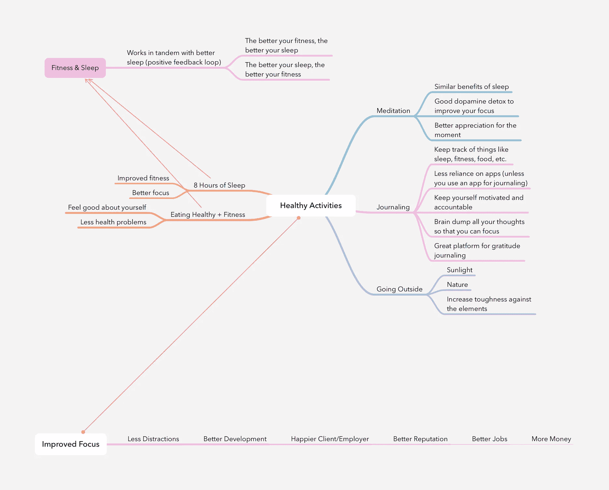

# 我从我的第一个大型全栈开发项目中学到了什么

> 原文：<https://levelup.gitconnected.com/what-i-learned-from-my-first-big-full-stack-development-project-754b278092cc>

软件开发不同于编码/编程。编码或编程只是软件开发项目的组成部分之一。这就像为电子游戏创作音乐一样。尽管音乐可能很好，你仍然需要做其他的事情来使视频游戏正常发展。你需要精力投入到配乐和音频上，你需要其他时间和精力投入到写作上，等等。等。

在最宽松的工作环境中，你会有一个专注于核心组件的团队。但是如果你没有那种奢侈，你必须自己完成整个项目，那么这里有一些我为软件开发(和一般的项目管理)学到的东西，可以让事情不那么痛苦。

## 1.平面图和图表

在写这篇文章之前，我软件开发过程的很大一部分基本上是:

1.  直接进入代码。
2.  ???
3.  利润(？)

这个策略对一些较小的项目有效，但是当事情变得更复杂的时候，我还不如穿着潜水装备跳伞。

事实证明，几乎任何类型的开发(无论是软件还是其他)都必须从以下几点开始:

1.  思考
2.  写作
3.  图画

第三个是绘图，包括图表和设计。你需要与项目的所有利益相关者(客户、你的队友和任何可能对项目有影响的人)交流他们需要知道的所有细节，以确保项目顺利进行。

最终，你的目标是让每一个利益相关者对与他们产品的特定组成部分相关的三件事情有广博的知识和理解:

1.  到底是什么？
2.  它是如何工作的？
3.  为什么会这样？

## 用于可视化软件设计的常见图表包括:

*   线框:所有核心用户界面组件的快速可视化。
*   **模型**:用户界面更深入的可视化。通常出现在线框之后。
*   **原型**:不一定是插图，而是一个尚未绑定到数据库的用户界面。利益相关者可以与它进行交互，并提供关于用户体验的反馈。
*   **实体关系**:意在可视化数据库的模型以及它们之间的关系(例如，一对多、多对多等)。).
*   **用例**:一个可视化，其中你有多个简笔画代表用户。然后你有一个代表产品(或系统)的盒子。在盒子里，你放入各种功能。然后，在用户和特性之间画一条线来表示每个用户如何与特性交互。您还可以在每个特征之间画线来表示它们之间的关系。
*   **流程图**:一种更通用的图表，可以通过可视化“if，else”条件和循环应用于软件开发的编程方面。

## “可是我讨厌画画！”先写后画。

现在，你可能会想，“丹，那些是插图。我去编程学校不是为了画东西。我把这个留给上过艺术学校的人。我喜欢在屏幕上输入文本，然后点击一个按钮，让编译器自动运行。”

很公平，我也不太喜欢艺术。然而，可视化对于项目的主要目的是让涉众理解你的想法。假设我不想画任何东西。我只是把我所有的想法写在一张纸上，交给你。

现在，你的主要目标是权衡三个决定，比较和对比它们，以选出两个最好的。在我的文章中，我试图列出所有的相似之处和不同之处，但都是用项目符号表示的。你觉得如果我把一张清晰的维恩图交给你，破译它会有多容易？

这并不是说你不应该做提纲。事实上，这是你在做任何图表之前应该做的第一件事。视觉化的目的是让别人理解事物。不是对你自己。在你画任何类型的图之前，你必须先理清你的思路。

## 大脑转储

对与项目有关的一切进行一次头脑风暴。见鬼，增加一些与项目无关的事情，但可能会转移你的注意力(例如，我想我让家里的水一直流着)。这应该是你的**第一**优先事项。

一旦你清除了所有在你脑中循环的想法，你必须组织它们。

1.  把所有与项目无关的想法放在另一张纸上。你可以在业余时间解决它们。
2.  把所有与项目相关的想法组织成一个大纲，就像我为了写这篇文章所做的那样。

```
# Dramatic Representation	

- Once you’ve weeded out all the thoughts circulating in your cranium, then you have to organize them.
	1\. Take out anything that’s not related to work or the project. You can tackle them on your off-time.
	2\. Organize it into a simple bulleted outline like what I’m doing in order to write this article.
```

然后，一旦你微调了你的想法，你就可以把它们从你的大纲中提取出来，用你想传达给任何利益相关者的任何图表或纸张来表达它们。到目前为止，唯一的标准是:

1.  你有效地沟通。
2.  您的工作已经备份，因此可以在任何时间点引用。(如果你想减少花费的时间，我建议使用应用程序，因为你可能需要重做工作，复制和粘贴比从一个新的模拟页面开始要快得多。)

## 其他关注点:封装软件开发的项目管理

如果你有项目经理的特权，那么你就不必做软件开发人员的这部分工作，但是如果没有，那么…除了自己计划应用程序，你还必须计划项目如何从开始一直进行到截止日期。

我在大型软件开发项目中的一个大错误是，我没有在开始项目之前缩小范围。我在一个并不重要的功能上花了太多时间，而在真正重要的功能上花的时间不够。这导致时间被浪费，项目被推过了商定的最后期限。

这通常被称为“范围蔓延”当项目的范围以一种破坏团队及时交付的能力的方式被意外地改变时。

## 问问题

在你做任何事情(例如，范围声明)，甚至你自己的大脑转储之前，你必须问这些被称为“问题”的事情看，当我们还是孩子的时候，当我们学习如何说话的时候，问题是我们首先要做的。成年后，我们失去了做题的能力，取而代之的是排出这些被称为“答案”的阴险毒素。

你必须向你内心的孩子伸出手，重拾你提问的热情。你开始的任何项目都需要它。

## 这里有一个关于任何项目以及软件开发项目的可能问题列表:

一般

*   团队在完成工作时有多大的自主权？
*   我们实际交付的是什么？
*   我们没有交付什么？
*   有截止日期吗？
*   成功的基准是什么？
*   客户是谁…真的吗？
*   谁是联系人？
*   谁在做这项工作？
*   谁是这部作品的观众？
*   以前做过吗？
*   什么可能会碍事？
*   如果项目不成功，会有什么影响？
*   关键的里程碑是什么？最重要的日期是什么？
*   谁是关键的利益相关者？谁是所有者/赞助商？谁影响但不拥有？谁有可能成为障碍？
*   这个项目最大的资产是什么？我们如何最好地利用这些资产？
*   我们应该始终关注的最重要的领域是什么？
*   为了实现这个目标，你愿意冒多大的风险？
*   关于这个问题，您过去遇到过哪些障碍？
*   有哪些话题我们没讨论过？你不愿意讨论什么话题？
*   你个人对这个项目的热情是什么？如果我们成功了，这对你来说意味着什么？
*   谁负责流程和交付件的每个部分？
*   团队可以使用什么技术和工具来完成这个项目？
*   项目的时间表是什么？
*   您(利益相关者)希望多久收到一次进度报告？

软件开发

*   软件应用程序对企业的战略目标和期望是什么？
*   软件开发预算是多少？
*   软件产品将为哪个平台开发？
*   未来需要实现的功能列表是什么？
*   产品的核心功能是什么？
*   有没有我们需要集成的第三方产品或工具？
*   数据存储的要求是什么？
*   有多少人会用这个？
*   是否有任何监管限制需要考虑？
*   这个软件产品适合我们(涉众)吗，或者我们应该考虑出售它吗？
*   产品创意将如何得到保护？我们将如何保密？
*   我们能接触到用户进行研究和测试吗？

## 2.测试成为最好的

在这个大项目之前，我从未用 10 英尺长的杆子碰过测试。在浪费了几天通过浏览器进行传统调试的时间后，我对测试的态度彻底改变了。当我做一个测试的时候，我在几分钟内就消灭了那些需要我花几个小时才能解决的错误。我现在完全投身于用某种程度的测试(也称为测试驱动开发)来领导软件开发项目的任何编码部分。

测试的一个重要的附带好处是，你可以获得所有特性和部分应该如何工作的代码文档，最好是在你实现它们之前。

假设我进入史蒂夫的代码库。Steve 花了两周时间编写特性和单元测试。他还没有实现任何东西。我没有图表。我没有轮廓。连个脑残都没有。我只有史蒂夫的代码库和客户自己的话。让我们来看看其中的一个测试。

```
testThatThingWorks() {
  user = getUser(); // Gets the user who is the only one that can run the thing.

  actAsUser(user); // Tells the test to act as if the one doing the thing is the user who can do the thing.

	runThing = runThing(); // The code that hasn't been implemented yet.

  assertTrue(runThing == 'success'); // I want to check that when runThing is run, it returns the string 'success'

  if(runThing == 'success') {
    assertRedirect('successPage'); // After runThing is done, it redirects to the 'successPage'
  }
}
```

从这个简单的测试中，我可以发现 3 件事:

1.  从`getUser`返回的用户可以执行`runThing`功能。
2.  当`runThing`运行时，它应该总是返回字符串“成功”。
3.  当`runThing`运行时，如果返回“成功”,那么它应该转到“成功页面”。

现在，我可以回到我的客户那里，问他们到底想要“运行”怎么做。他们可能会说，“完成后让它进入主页”之类的话。在这种情况下，我现在在软件开发人员的计划实现和项目涉众的预期实现之间有一个明显的矛盾。

这比我没有进行测试，不得不启动软件来检查它是否重定向到适当的页面更容易发现。但是，在这个例子中，我不能检查这个特性，因为它还没有实现。谁知道还会有多少其他的 bug 爬来爬去，让我分心去调试这个特定的特性！？

如果没有测试，Steve 会花上几天，甚至几周的时间，盲目地实现这个特性。然后，当消息传来，客户希望它被重定向到“主页”而不是“成功”页面时，谁知道他要花多长时间才能完成转换？

在软件开发项目中缺乏足够的测试可能是开发人员方面“范围蔓延”的最大原因之一。测试是图表化的，但对于开发人员来说。即使你不能画出维恩图来挽救你的生命，你也必须写测试。

> 测试是图表化的，但对于开发人员来说。

我强烈恳求您在您的存储库的任何其他部分编写一行代码之前，将测试考虑在内。这会节省你很多时间和挫折。

注意:如果你经常要在一周内完成某件事情，这就不适用了。

## 3.睡觉、写日志、冥想、锻炼、健康饮食、外出等。

我将用一些与软件开发没有直接关系，但肯定会影响你在生活的多个领域(包括软件开发)取得成功的东西来结束这篇文章。

> **一切都是相互联系的。**

你的大脑和身体相互配合，如果一部分失灵，另一部分肯定会跟着失灵。

让我们用思维导图来想象一下做上面列出的健康活动的好处。



健康的活动

仅此而已。做得开心！