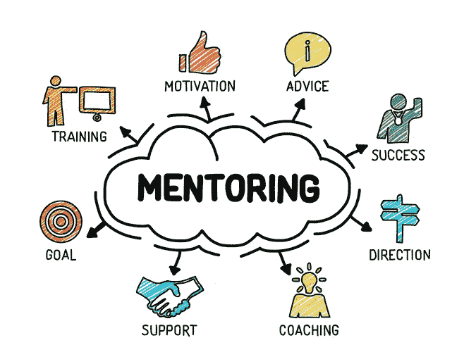

# 我在指导新开发人员时学到了什么

> 原文：<https://levelup.gitconnected.com/what-i-learned-mentoring-new-developers-349cf14bb5d2>

编程指导

老实说，我不知道是怎么发生的:这不是一个正式的安排。我没有要求成为导师，也不打算成为导师。我非常感谢在线技术社区——我从其他开发人员的善意中学到了我所知道的大部分东西，我的大部分项目都是建立在几十年的开源工作之上的。

至少我能做的是通过帮助一些开发者做他们的项目来回报一点。

这些开发人员甚至还没有进入工业界——他们四个还是学生(我也是),还没有接触过真正的技术。他们选择了他们的技术堆栈(任何项目中最有趣的部分)，并打算使用 Springboot 和原生 Android。

我在指导跳羚队，因此只和四个人中的两个人交谈过。他们的目标不是交付一个十亿美元的创业项目，而是学习应用程序编程是什么样的。

## 尽早并经常寻求帮助——尤其是在更广泛的话题上

我们的会面不是预先计划好的。我每天都在校园的同一个地方，他们知道他们可以在那里找到我。我不知道什么时候其中一个成员会向我寻求技术帮助，所以这总是一个惊喜。

有一次，在长时间的沉默之后，他们中的一个人在通常的地点、通常的时间向我打招呼。

“它不起作用……”他们说。

“什么不行？”

“申请。没用的。”

听起来我不会得到比这更多的细节，所以我深入研究了代码，并跟踪了 stacktrace。

有一大堆问题，都源于糟糕的数据库设计——他们试图使用数据库多态性(这是一个相当复杂的主题，尤其是对于第一次开发的人来说),但中途陷入了困境，最终弄得一团糟，hibernate 在启动时会关闭它——因为它没有任何意义。

接下来的一个小时花在了解释数据库多态、实现多态的不同方法，以及如何从现在的状态进入工作状态。

如果在设计数据库之前有一个会议，我可以引导他们远离他们将要进入的问题。多花一个小时计划并解决所有的细节，比在未来花 12 个小时试图解决一个问题要好得多，因为你忘记了解释一个用例，或者没有完全理解主题。

在代码层面上，这并不坏:您可以修改函数，让它做您想要的事情，并修复逻辑错误。但是在更高的规模上，比如数据库设计，撤销整个工作部分变得很困难。通常，数据库设计驱动业务逻辑实现(顺便说一下，我最近实际上一直在与 [Hasura](https://github.com/hasura/) 和[postgrapile](https://github.com/graphile/)一起工作，将大部分业务逻辑委托给数据库，这是多么令人愉快的事情啊！)因此，试图在数据库层做一些不属于数据库层的事情，意味着你最终会做出大量不正确的假设。

在微服务架构层更是如此——幸运的是，他们还没有决定使用微服务……。使用错误的服务意味着你可能会以大量无用的粘合代码而告终，从而使你的工作量增加一倍甚至两倍，因为你没有咨询并试图找出你的方法是否是更好的方法。

## 每个人都会在某些时候犯同样的错误

我几乎立刻就知道了很多问题的解决方案，因为我自己也遇到过同样的问题。为什么你的 SpringBoot 应用程序无法连接到数据库？您没有拆分 application.properties，并且您正在尝试连接到远程数据库，而不是本地主机！我经历过，也做过——当然是 facepalm 时刻，但这是大多数开发人员都经历过的时刻。

有些问题是无法回避的。他们肯定会被碰到，而不再犯这些错误的唯一方法是*更多的经验。我很容易就能看出这个问题，因为我有做这件事的经验。我以前处理过中断的 CI，也处理过服务器连接问题。*

我倾向于依赖我的前辈，并尽早和经常问问题——因为他们知道的比我多，当他们可以轻松地为我指出正确的方向时，我没有多少理由浪费时间走上错误的道路。也许有一天我会达到大师级别！

## 开发人员喜欢学习

老实说，这是一种现象。我不确定为什么会发生这种情况，但是总的来说，开发人员比普通人更容易犯错，更容易自我完善。也许我花在与非开发人员交谈上的时间更少了，这已经扭曲了我的世界观，但在很多情况下，我会找到解决方法，实施它，然后说:“我可以解决它，但在我不得不离开之前，我们的时间快用完了——你是希望我解决它，还是我们可以留到以后，我可以解释解决方法？”许多人倾向于走第一条路。如果你能挥动魔杖解决问题，为什么不呢？

因为挥舞魔杖学不到任何东西。

第二条路线是我们最常走的一条，我从很多人身上看不到这一点。许多人只是希望他们的 excel 表格能够正常工作——我可以让它正常工作，但是给一个人一条鱼…

## 许多有经验的开发人员认为理所当然的事情

作为一名开发人员，你可能不会*觉得*你知道很多——编程的世界很大很可怕，有成千上万的东西要学。很容易陷入向前看的模式:总是寻找新的东西去学习，从不反思你所知道的。

想象一下，当我被问及为什么跳羚路线没有被触发时，我有多惊讶。这一个难倒了我:一切*看起来*正确。我不知道为什么邮递员的请求得到了 404:路径是正确的，主机名是正确的…*哦。咄。*这是一个 GET 请求，路由被定义为 POST。

我已经开始在自动驾驶仪上做的一些小细节开始浮出水面:如果一个请求有一个主体，它就是一个 POST——如果我们只是获取一些东西，它就是一个 GET。我们应该返回 JSON，而不是 POJO，这是我们的第二天性。

这是对基础知识的一个很好的强化，让我回到了我现在认为理所当然的事情上——而且，更有益的是，我可以让我大脑中隐含的东西显化，这样 TTOD(是时候“哦，咄！”)减少了，以防我遇到类似的问题。

## 好好玩啊！

也许是一个观点的缩影，但我觉得我应该在这里补充一下。回想一下我们成为程序员的原因:编写能帮助人们的代码，并且能够工作和解决问题。

在项目中工作和破解很有趣，调试小问题也很有趣。尤其是当你个人没有截止日期，而且游戏中没有皮肤的时候！解决 bug，获得知识奖励，帮助别人。我真的很喜欢这学期的辅导，这也是我未来所期待的。

编程很好玩，帮忙很好玩，看进度也一直很好玩。

在担任开发人员导师期间，我主要是一名架构师、调试器和教师。

我也正处于人生的学习阶段——如果你认为我应该从我的经历中吸取什么，请在评论中告诉我！