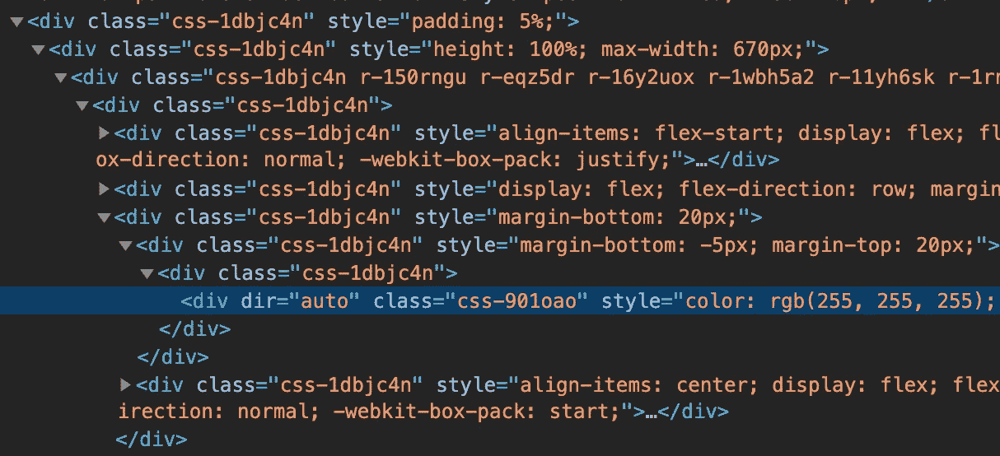
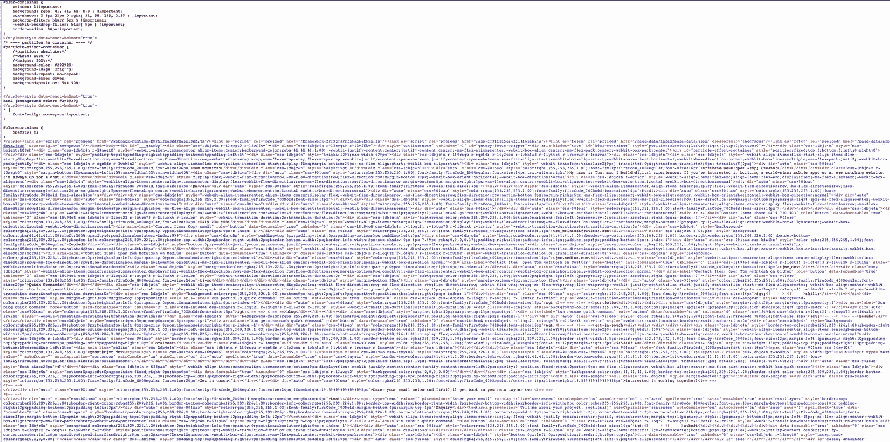
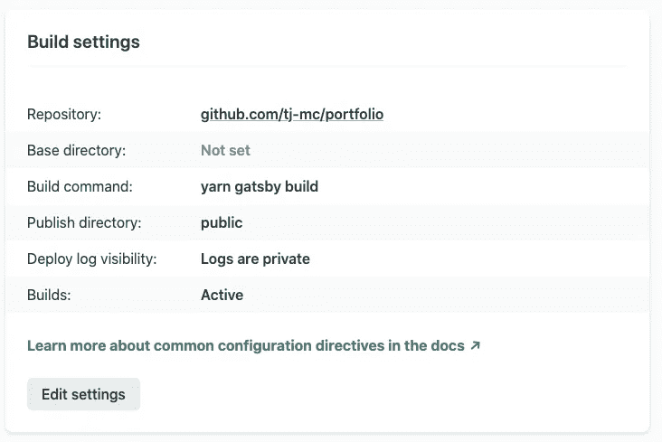

# 我从 React Native Web 重建我的投资组合中学到了什么

> 原文：<https://levelup.gitconnected.com/what-i-learned-rebuilding-my-portfolio-with-react-native-web-d26514246b01>

是时候构建通用应用了。

[Unsplash](https://unsplash.com/s/photos/gradient?utm_source=unsplash&utm_medium=referral&utm_content=creditCopyText) 上的 [Gradienta](https://unsplash.com/@gradienta?utm_source=unsplash&utm_medium=referral&utm_content=creditCopyText) 渐变/Unsplash[上的](https://unsplash.com/s/photos/laptop?utm_source=unsplash&utm_medium=referral&utm_content=creditCopyText) [Giordano Rossoni](https://unsplash.com/@reddgio?utm_source=unsplash&utm_medium=referral&utm_content=creditCopyText) 笔记本

在过去的几个月里，我一直觉得我的基于模板的简历页面缺少一点活力，所以我开始头脑风暴我应该把它放在什么地方。毕竟，几乎任何东西都比 10 美元的模板和一些简单的拷贝要好。

事实证明，这是一个绝佳的机会，让我投入到一件从我第一次听说就令我着迷的事情中去:[**React Native Web**](https://necolas.github.io/react-native-web/docs/)**(RNW)。**赌注很低，预算是我想投入的时间。完美。

RNW 真正让我着迷的是，它似乎实现了最初 React Native 的承诺:

> 学一次，随处写。

如果你认为“任何地方”只是 iOS 和 Android，这已经是事实了，但网络是一个强大而成熟的平台，许多令人印象深刻的应用程序在这里感觉就像在家里一样。此外，大多数流行的应用程序都有 web 和移动版本，有时会结合使用 React Native 和 React。如果 React Native 可以做到这一切，为什么不向前一步呢？

在这篇文章中，我分解了在 RNW 重建我的投资组合应用程序的关键收获，并试图将这些经验推广到一些更大问题的答案中。

# 关于项目

在我们深入讨论之前，让我们先来简要了解一下 RNW 的由来。

React Native Web 最初是由尼古拉斯·加拉格尔于 2015 年在 Twitter 开发的，他仍然是主要的维护者。现在推特、优步和许多其他人都在制作《T21》中使用它。从 Nicolas 谈论这个项目的方式来看，很明显他将 React Native platform 设想为一个真正的*平台无关的声明式 UI 解决方案:*

> React Native 的发展现在涉及到为 Android、iOS、Web、Windows 和 macOS 开发 React Native 的开发人员。我们的目标是通过共享的、平台无关的 React APIs 帮助设计人员和开发人员缩短高质量、多平台产品的上市时间。
> 
> —尼古拉斯·加拉格尔

这是一个充满希望的基础，尽管没有得到脸书的直接支持，但仍有一些大公司依赖于 RNW 的健康。

现在，我们走吧！

# 1.你在掌控之中。

我发现在整个 RNW 普遍适用的一点是，拿走东西永远不会让你的生活变得更艰难。

同样，我们可以在移动设备上编写原生 Java 或 Objective C，你也可以随时开始编写普通的 React 和使用 React-only 包。

现在，如果你计划用你的项目瞄准移动*和*网络，这将是一个可怕的想法。更好的解决方案是编写不包含任何平台特定元素或 API 的**通用组件**。这些组件应该在所有平台上呈现和行为相同。

然后，如果你真的需要一些特定于平台的行为，给任何组件添加`.web.jsx`来标记它为 web 专用。在我的例子中，我计划只针对 web，所以一些组件确实包含浏览器特定的工具，如 React 头盔。

要解决的最常见的特定于平台的问题是路由。网络路由从根本上来说是不同的，因为我们有“后退”、“刷新”和 URL。常见的建议是为网络和移动使用不同的路由解决方案。不过也没那么糟糕，因为所有实际的屏幕仍然可以共享。

# 2.它很快。

程序员的直觉是，更多的抽象层通常意味着更慢、更臃肿的结果。当然 Python 如果是用 C 写*的*也不可能比 C 快。

这一逻辑不适用于 RNW。这不是运行时兼容层，而是构建时。另外，将它视为额外的抽象层是不正确的。只是最终调用`React.createElement`的另一种方式。我从未觉得 RNW 的 DOM 输出比我使用普通 React 时更“臃肿”或冗长。

如果您特别关注性能，那么研究 React 的内部工作方式以及是什么导致组件重新呈现会更有价值。这些规则同样适用于 RNW，因为它仍然是反动的。

RNW 产量

# 3.小心搬运包裹。

如果你是一个把遇到的每个问题都打包的人，那么在使用 RNW 时，你可能会感到有点压抑。如前所述，您可以只编写特定于平台的组件，但是我觉得过度使用这种方法从根本上破坏了 React Native 的意义。

大量的包都能很好地工作，但是包含本机模块的包会有问题。这些项目中有许多不包括对 RNW 的支持。不幸的是，没有一个可靠的方法可以从 ReadMe 中知道一个包是否包含本机模块，但是在包的安装说明中有一个提示。如果您需要在添加包后运行`pod install`，这表明您正在处理本机模块。

您将非常幸运地找到标记为*与 Expo* 一起工作的包，这表明没有本地模块，并且该包支持 web。文档还提供了一个链接，指向对 [React 本地目录](https://reactnative.directory/?web=true)的过滤搜索，但是请记住，这里并没有添加每个包。

出于我的目的，所有的 UI 都是从头开始创建的，所以这不是太大的问题，但它确实值得记住。

# 4.工装很容易。

任何玩过 Webpack 配置和定制构建过程的人都会同意，像`create-react-app`这样的工具有一席之地。当你需要的时候，拥有细粒度的控制是很重要的，但是默认的设置通常可以满足你的所有需求。

幸运的是，集成 React Native Web 比您想象的要容易得多。如果你正在开始一个新项目，你最好的选择是使用 Expo[Expo](https://expo.io/)，它包括对 iOS、Android 和 Web 的现成支持。

只需运行`npx expo-cli init my-app`，Expo 将为您处理所有设置。如果你有一个现有的项目或者不想使用 Expo，你也可以用 `[create-react-app](https://necolas.github.io/react-native-web/docs/installation/)`来[设置它，尽管 Expo 是推荐的解决方案。](https://necolas.github.io/react-native-web/docs/installation/)

构建过程使用别名将导入从`react-native`转换到`react-native-web`。这意味着即使使用 RNW，您仍然将您的导入写成`import { View } from '**react-native**';`。整洁！

# 5.是 SSR 友好的。

为了让事情更有趣一点，我决定用盖茨比来做一些额外的预渲染表演。原来真的没那么难！

> **盖茨比是什么？** *一个普通的 React 应用自带一个很轻的 index.html，加载 React，然后用* `*React.*createElement`创建所有元素。如果你有一个大的 JS 包，这会让你的初始页面加载感觉慢很多，并且在某些情况下会阻止内容被网络爬虫理解。
> 
> *Gatsby 通过提前将 React 布局转换为普通 HTML 和 CSS* 解决了这个问题*。当浏览器点击一个预先呈现的页面时，它已经拥有了直接绘制内容所需的一切，然后使用* [*再水合*](https://www.gatsbyjs.com/docs/conceptual/react-hydration/) *使您的 DOM 在需要的地方做出反应。*

Expo 有一些关于与 Gatsby 整合的很棒的文档，虽然标记为实验性的，但我在使用中没有遇到任何问题。从开发人员的角度来看，主要的变化是将构建步骤与您的部署相集成，并使用`gatsby`而不是`expo`命令。

强壮的 index.html！

# 6.没有免费的东西。

致力于这种平台不可知方法的一部分是放弃一些在网络上免费提供的东西。比如链接。

React Native 中没有`a`标签，RNW 也没有合理的方法来推断它需要创建一个`a`标签。因此，即使是链接上简单的悬停效果也需要手动创建。

效果是这样的:

简单…对吧？😬

这里有令人惊讶的代码量需要使其可重用。(92 行)。

> *同样，我们可以在这里使用一个特定于 web 的* `*a*` *标签，但是我要求自己尽可能少地使用特定于平台的代码。*

虽然重新设计简单的`a`标签看起来很愚蠢，但这实际上是一种给 UX 意想不到的角落注入个性的令人耳目一新的方式。线条的粗细，淡入淡出的方式，线条在文字下浮动的方式；这些小事造就了个性。

# 7.11y 赢了。

在上面这一点上，我们重新创建了`a`标签，但是这有一些严重的可访问性问题。

对于这样的功能，**包含适当的可访问性标签是至关重要的，否则你的网站对很多人来说可能完全无法使用。**

RNW 无障碍网站上的[优秀文档页面](https://necolas.github.io/react-native-web/docs/accessibility/)突出了大量制作无障碍应用的有用道具和模式。

`accessibilityRole`特别有趣，因为它允许你暗示元素的底层 HTML 表示应该是什么，比如`heading`或`article`。这种风格的语义 HTML 可以使文档更容易被工具解析和导航。

在通过[WAVE accessibility checker](https://wave.webaim.org/)运行 [tjmc.dev](https://tjmc.dev) 之后，只发现了一些错误。文档很容易通过 tab 导航，标签在需要时使用，但我仍然需要添加一些结构元素和表单标签来使一切符合规范。

# 8.部署幸福🚀

因为 RNW 的一切都是构建时的，所以您的部署解决方案不需要考虑额外的复杂性。然后最终生成普通的 JS、HTML 和 CSS，可以在几秒钟内部署到任何提供商。您唯一需要设置的是您的构建命令，它将是`expo build:web`或`yarn gatsby build`，这取决于您是否添加了 Gatsby。

我喜欢我的 CI 配置，简单！

# 世博会建筑:结论

新的 [tjmc.dev](https://tjmc.dev)

承担这样一个项目对于揭示 React Native Web 的优缺点来说是一个很好的试验平台，我鼓励你也这样做并形成自己的观点。

在我看来，React Native Web 是 React Native for Web 平台的忠实、可靠和一致的实现。如果你正在创建一个带有移动和网络应用的新产品，使用 RNW 创建**通用组件**将是一个以最小的努力降低开发成本和复杂性的极好方法。即使你正在开发一个现有的应用程序，也要考虑逐步采用 RNW。

使用 RNW 迫使你认为你的输出“应用程序”是真正的平台无关的东西。你不是在做一个*网络*应用。你不是在做一个*移动*应用。你只是在做一个 App。这似乎是一个毫无意义的断言，但这是用户对程序进行推理的方式。

对于外行来说，电脑上的 Twitter 和手机上的 Twitter 是同一个东西:Twitter。将这种概括引入实际实现是一种强大的前瞻性方法，它将使开发人员能够以前所未有的速度交付一致的原生体验。

我们去做一些通用的应用吧！