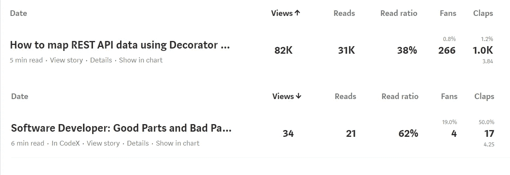
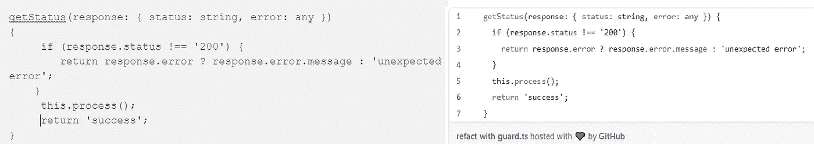
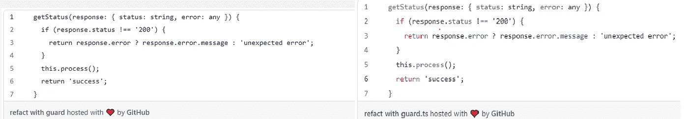
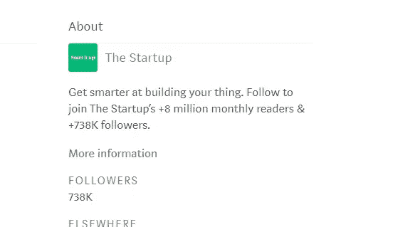

# 我从写技术博客中学到了什么

> 原文：<https://levelup.gitconnected.com/what-i-learnt-from-writing-technical-blogs-d4e9163ff24c>

## 为什么我的点击率最高的文章是点击率最低的文章的 2400 倍

凯瑟琳·拉威利在 [Unsplash](https://unsplash.com/s/photos/writing-different?utm_source=unsplash&utm_medium=referral&utm_content=creditCopyText) 上拍摄的照片

一个开发者写博文有很多好处。写作可以建立你的投资组合，加深你的知识，并产生一点被动收入。甚至可以在你申请新工作的时候加分。

但是，写作需要的技巧和编码是不一样的。对于一个开发者来说，像专业作家一样写作并不是一件容易的事情。对于许多开发人员来说，用简单的英语解释一个复杂的问题及其解决方案比解决一个编码问题更难。

写作和其他技能一样可以学习。在我的媒介博客之旅中，我学到了很多。

让我与你分享一些技巧和窍门。

## 独特的内容才是王道

技术博客的读者知道他们想要什么。他们寻找解决问题的方法，以及可以应用到日常工作中的知识。他们希望阅读原创内容。

在写作过程中，我不断问自己的一个问题是:是什么让这篇文章与同一领域的其他文章不同？差异因素可以是新的视角、更完整的流程、不同的方法或更深刻的见解。独特的内容和实质是你文章的真正价值。

到目前为止，我已经在 Medium 上写了 36 篇博文。点击率最高的 3 篇文章占据了全部 36 篇文章总点击率的一半以上。这 3 篇文章在一个利基领域有原创内容。它们为常见问题提供了切实可行的解决方案。

下面是我浏览次数最多和最少的文章的统计比较。

我点击率最高的文章与点击率最低的文章

两者有什么区别？[第一篇文章](https://medium.com/p/5e826ef832b6)讲述了一个处理 Restful API 响应数据的独特解决方案。这是独一无二的，我没有从其他博客文章中读到过类似的解决方案。第二篇是根据我的个人经历对软件开发人员职业生涯的概述。和同类帖子相比并没有太多独到之处。不幸的是，“富者愈富，贫者愈贫”。由于每天都有大量的内容发布，一般的文章不会受到关注。

谷歌搜索亮点

独特和原创的内容将在谷歌搜索亮点中脱颖而出。上面的文章仍然每天从谷歌搜索中获得超过一百次的浏览。虽然那些外部的观点并没有直接带来收益，但是我很高兴也很满意我的知识与许多其他开发者分享。

## 标题和导言事项

典型的读者在决定是否继续详细阅读之前会快速浏览文章。如果你的文章没有在第一轮扫描中抓住读者的注意力，他们就会离开。所以标题和简介很重要。

我不喜欢点击诱饵标题。引人注目的标题通过突出你的内容来吸引读者的注意力，而不是夸大其词。字幕同样重要。一个强有力的副标题可以提高读者的兴趣和好奇心。花尽可能多的时间一遍又一遍地复习题目是值得的。

我把引言部分作为标题的延续。介绍应该简短。它的作用是解释文章的背景，并为读者继续阅读设定期望。

在标题和介绍中反复使用关键词对于 [SEO](https://en.wikipedia.org/wiki/Search_engine_optimization) 来说很重要。谷歌在文章开头会给这些关键词更多的权重。这将有助于你的文章在谷歌搜索中脱颖而出。

## 代码格式化的技巧

技术贴的核心是代码片段。一个好的代码片段格式非常重要。

Medium 中的默认代码格式只适用于一个 liner。对于更多的代码片段，我推荐使用 [Gist](https://gist.github.com/) 。

中等代码格式与要点

创建要点时，为名称指定一个文件扩展名。有了正确的文件扩展名，Gist 将突出显示代码片段的语法。你可以看到下面的区别。

带文件扩展名(右)与不带文件扩展名(左)

对于行内代码字符，使用“反斜杠”(`)突出显示它们。如果你不知道，你可以在媒体编辑器中使用下面的快捷键。

1.  选择(突出显示)文本
2.  按(`)，步骤 1)中的文本将变成`text`

## 引用

如果你在文章中引用了书籍或互联网资源，别忘了在结尾处加上引文。引用参考文献最常见的格式是[哈佛参考样式](https://en.wikipedia.org/wiki/Wikipedia:Harvard_citation_template_examples)。我发现下面的网站对你产生参考很有用。

 [## 使用排名第一的引用工具 CiteThisForMe 节省时间并提高您的分数

### 欢迎为我引用这个关于为我引用这个是当今最流行的引用工具之一…

www.citethisforme.com](https://www.citethisforme.com/) 

添加引文给了原作者他们应得的荣誉，也让你看起来可信。

## 假设读者一无所知

一个技术写作者最重要的能力就是用简洁明了的英语解释复杂的问题。我们希望我们的文章易于理解，即使对于大多数新手读者也是如此。

通常，我们倾向于假设读者能够理解代码的基础或部分，然后我们跳过对那些部分的解释。对你来说显而易见的东西对你的读者来说可能完全是一个神话。总是假设你正在为一个对主题一无所知的读者写作。将一个复杂的问题分解成多个步骤，并逐一解释。

在某些情况下，你可能会觉得读者很可能有基本的概念，然后提供这些概念的链接，这样你就可以避免过多的解释。

## 促进

我试图通过包括 LinkedIn 和 Twitter 在内的社交媒体来推广我的文章。老实说，从我的经验来看，这不值得努力。虽然收集了很多赞。来自社交媒体的流量可以忽略不计。

更有效的方法是让你的文章通过一个受欢迎的出版物发表。大的出版物在推广你的文章上有很大的不同。你的文章不仅可以接触到它的追随者，而且它可以快速跟踪你的文章在媒体中自动策划。

出版物受欢迎程度的最佳指标是其追随者的数量。但是这一关键的统计数据在许多出版物的主屏幕上都不见了。我发现最简单的方法是去出版物隐藏的“最新”页面。例如，“启动”出版物的最新页面是“[https://medium.com/swlh/latest](https://medium.com/swlh/latest)”。在页面上，将有一个“关于”的追随者的统计部分。

## 摘要

在本文中，我们讨论了撰写技术博客的几个重要事项:

*   独特和原创的内容
*   吸引人/有趣的标题和介绍
*   不错的代码片段格式
*   引用你的参考文献
*   详细解释你的代码
*   通过大型出版物推广你的文章

希望你能从这篇文章中学到一两件事。如果你对写技术博客有自己的建议，请在评论中与我们分享。

快乐写作！

*如果您还不是 Medium 的付费会员，* [***您可以通过访问此链接***](https://sunnysun-5694.medium.com/membership) *进行注册。你可以无限制地阅读媒体上的所有报道。我会收你一部分会员费作为介绍费。*