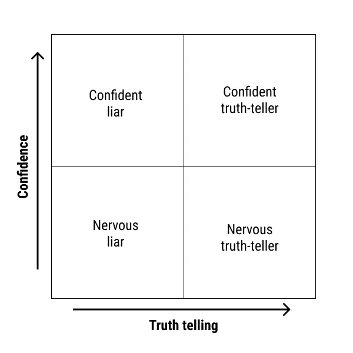

# 我在面试软件工程师时看到的错误

> 原文：<https://levelup.gitconnected.com/what-i-look-for-when-interviewing-software-engineers-5acec61bafd>

## 有人在玩一个隐藏的游戏

> 作为一名候选人，对你的方法做一些简单的改变就能让一切变得不同。

作为一家快速发展的初创公司的早期员工，我有机会采访许多软件工程师。在这些面试过程中，我总结出了一些简单的判断面试是否成功的方法。

对于有抱负的软件工程师来说，听听桌子对面(或放大屏幕)的人在想什么可能是有用的。

# 面试(可能)毫无意义

让我在整篇文章的开头说，采访可能完全没有意义。

有大量证据表明，通过面试挑选候选人并不比随机选择好多少。抛硬币可能是决定雇佣谁的更好方法。

 [## 为什么求职面试毫无意义

### 统计学经常听起来像一个枯燥的主题，但日常生活中的许多判断和决定将通过一个…

www.theguardian.com](https://www.theguardian.com/lifeandstyle/2015/nov/22/why-job-interviews-are-pointless)  [## 观点|求职面试完全无用(2017 年发布)

### 情况变得更糟。在我们的受试者不知情的情况下，我们指示一些受访者随机回答他们的…

www.nytimes.com](https://www.nytimes.com/2017/04/08/opinion/sunday/the-utter-uselessness-of-job-interviews.html) 

承认这一点不太好，但作为一名面试官，当我与应聘者交谈时，我知道这一点。与候选人 30 分钟的谈话不太可能帮助我确定他们是否会成为一名优秀的软件工程师。

事实上，面试可能会误导我。如果一个候选人特别能言善辩或讨人喜欢，我可能会忽略或忽略他们候选人的危险信号。

然而，面试仍然是我们在企业界选择候选人的方式。我们还没有开发出更好的系统，我们也不喜欢抛硬币来决定是或不是的想法。

考虑到这一点，候选人能做些什么来扭转局势呢？

# 1.微笑

你会惊讶地发现很少有软件工程师在面试中微笑。

我明白了。参加面试很伤脑筋，你可能不想笑。

但至少在我进行的采访中，我努力保持轻松愉快的气氛。我希望你过得舒适，我希望你成功。

我一直认为对于一个开发者来说，[社交技能比技术技能](https://blog.usejournal.com/developers-social-skills-are-more-important-than-technical-skills-f36742f0a04c)更重要。如果候选人在微笑、好奇或匹配我的能量方面有困难，我很难想象和他们一起工作。

 [## 开发者:社交能力比技术能力更重要

### 不要误解我，你需要能够编码！但是你的职业发展和生活幸福取决于你的…

blog.usejournal.com](https://blog.usejournal.com/developers-social-skills-are-more-important-than-technical-skills-f36742f0a04c) 

# 2.提问

在面试结束时，通常会有这样一个时刻，面试官会说:“你有什么问题要问我吗？”

*我说的不是那一刻。*

当我说你应该在开发人员的面试中提问时，我的意思是整个面试应该像是一次有很多交流的对话。

如果我正在进行一次面试，而候选人给出了一个深思熟虑的回答，我会印象深刻。然后我进入下一个问题。

如果候选人给出了一个很好的回答，然后是一个深思熟虑的问题，那么我们就有话可说了。我们可以更深入地研究理论、例子、我们在我的公司是如何做事的，以及我们为什么做出这些选择。

问好问题会让你看起来像一个同事，而不是下属。

## 关于长篇大论的候选人的说明

有时候，我会遇到面试中啰嗦的候选人。他们用过于详细的回答或无关的题外话来主导谈话。

作为一名面试官，当他们不给我发言的机会时，我很难与这些候选人保持接触。我可以通过打断来转移话题(我经常这么做)。然而，这种方法可能相当唐突，有时候选人仍然啰嗦，只是在一个新的话题上！

可能是紧张导致了候选人长篇大论的回答。他们想确保涵盖一切！我能感同身受。

我的建议是:记住提问是确保你在面试中不会啰嗦的最好方法。把面试官的问题变成谈话话题。试着更多地了解这家公司，以及为什么这些问题首先是重要的。

# 3.项目信心

在马尔科姆·格拉德威尔的书*与陌生人交谈*中，有一节是关于我们相信和信任谁的隐性偏见。

格拉德威尔分享了一项设计出色的研究，该研究将普通人置于一个要么撒谎要么说真话的境地。(为了简洁起见，我在这里省略了研究的细节。)

这项研究中的一些研究对象很自信，并强烈表达了他们的立场。其他人在研究过程中很紧张，表现得很焦虑，不管他们是在说谎还是在说真话。

该组可分为四个象限:

然后，研究人员将这些说谎者/说真话者的视频给另一组人看。他们能准确地发现谁在撒谎吗？

当然不是！

这项研究非常明确地表明，我们不善于辨别一个人是否在说谎。具体来说，我们不擅长两件事:

*   我们倾向于相信自信的说谎者
*   我们倾向于不相信神经质的说真话的人

作为人类，我们把自信作为能力的标志(至少在西方世界是这样)。

这对你的面试意味着什么？

展现自信是与面试官建立融洽关系的最佳方式。这是一种人性的偏见，即使你在说实话，如果你紧张，人们会认为你有所隐瞒。

即使你没有感觉到，也要练习坚定地给出答案，并假设自信的肢体语言。你的面试官会更信任你。

# 4.你的需求量很大

让我感到困惑的是，大多数公司把面试过程变成了求职者需要克服的一系列障碍。

软件工程师的需求量非常大。为我们的团队雇佣足够的工程师非常困难。有些职位需要几个月的时间来填补，我们的大多数候选人都在多个地方面试。

作为考生，你应该知道！在面试过程中利用这些信息。觉得自己有权力向面试官提出关于流程和文化的难题。

如果一家公司的面试结构很糟糕，或者要求你做不合理的带回家的作业，说不！有趣的是，面试过程中公司对你的了解相对较少，也不知道你会有多擅长这份工作。然而，它可以告诉你一个关于公司的*很多*，他们的过程，以及他们如何对待工程师。

# 观点:技术技能不太重要

在一次面试中，我要求应聘者说出一个问题的解决方案。虽然有些是技术性的，但我主要是在寻找候选人是否有好奇心和内在动力去寻找解决方案。

我认为在面试中，技术技能远没有社交技能重要。

如果你不知道某项技术或概念，我们可以教给你。但是如果你对学习它不感兴趣，那是一个很难解决的更深层次的问题。

有时候，候选人表现出令人难以置信的技术实力，但他们表现得好像无所不知，或者不愿意回答新问题。我拒绝了技术上合格的候选人，仅仅是因为无法想象和他们一起工作。

另一方面，我对那些不知道所有技术答案但表现出学习意愿的考生竖起了大拇指。

也许不是所有的公司都是这样的——为了愿意学习而愿意雇用训练较少的开发人员。然而，那些是你可能不想工作的团队。当好奇心和协作精神消失时，软件工程的工作变得极其无聊和孤独。

# 一点点观点

我希望这篇文章能对面试过程有所启发。也许它甚至挑战了你对面试及其有效性的一些假设。

概括一下:

*   面试是决定一个人是否擅长一份工作的糟糕方式。因此，不要把它想成一次考试，而要把它想成一次谈话。
*   微笑着问问题。不要在回答中长篇大论。再说一次，这是一次对话，而不是一次测试。
*   面试官对自信有偏见。练习用自信的肢体语言给出肯定的回答。
*   作为一名开发人员，你的需求量很大。你可以对你面试的人和加入的团队进行甄别和选择。在很多方面，你在面试中占有很大的优势。

有问题吗？评论？我大错特错了吗？欢迎在下面的评论中留下你的反馈，或者给我发邮件告诉我你的想法:[bennettgarner.com](http://bennettgarner.com)

# 免费访问 WebDevSprint

*获得一个为期两周的 web 开发内容的预定冲刺&电子邮件访问我作为你的工程导师…*

[加入我的免费电子邮件导师计划中的 500 名其他开发人员。](https://sunny-architect-5371.ck.page/0a60026a5d)