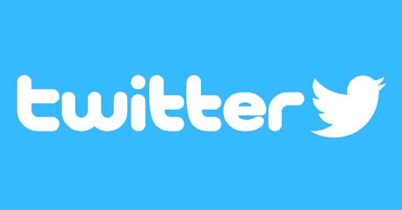
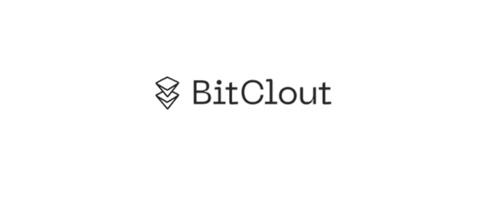
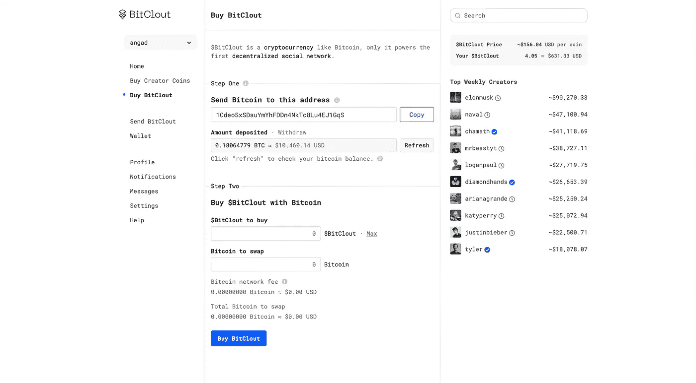
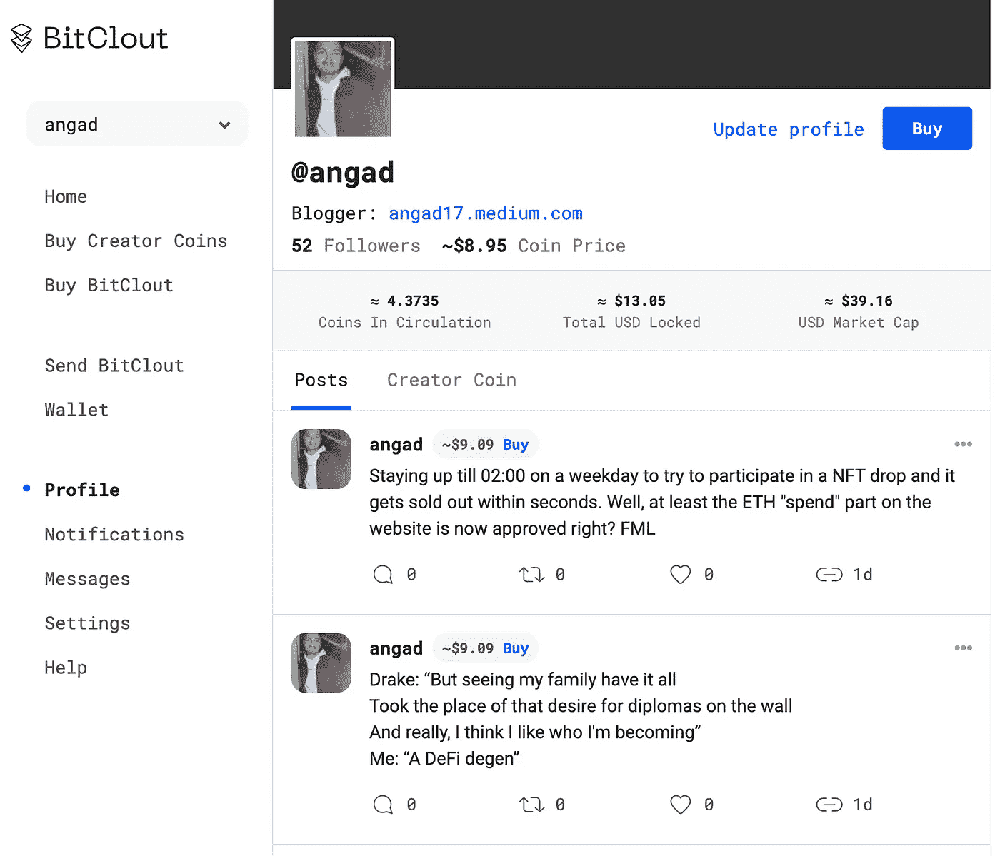

# 如果你可以免费投资新的 Twitter/Instagram 会怎么样？

> 原文：<https://levelup.gitconnected.com/what-if-you-could-invest-in-the-new-twitter-instagram-for-free-8f0dbc350851>

## 集成社交媒体的加密货币

社交媒体占据了 Y/Z 一代一天中很大一部分时间。我知道因为我就是其中之一。我的弟弟就是其中之一。我的女朋友是一个，我的大多数朋友也是，我只希望这种趋势会发展得更快。大多数人都有一个 Instagram 或脸书，如果你精通技术，你一定有一个 Twitter 所有的开发人员和加密人员都在那里。有些人依靠社交媒体谋生。但是一个典型的社交媒体影响者是如何赚钱的呢？他们从社交媒体开始，增加他们的追随者，然后如果他们变得足够大，他们就会找到赚钱的方法。

我敢肯定，如果你有一个 Instagram/Twitter 个人资料，你不仅会关注你的朋友，还可能会关注一些有影响力的人/艺人/名人。这些人在某种程度上给你的生活带来了价值，这就是你追随他们的原因。但是他们没有报酬。只有一小部分人做到了，那些真正“成功”的人能够通过品牌赞助/广告赚钱，或者通过他们自己网站上的广告产生广告收入。

我的问题是，如果你是一个社交媒体影响者，你可以仅仅因为你发布的内容而获得报酬，那会怎么样？你不必乞求公司赞助你？那该有多棒。你的追随者可以直接支持你，他们也不必花很多钱来支持你。此外，你不必乞求你的追随者购买你的 patreon 或 OnlyFans。相反，你的追随者会*希望*投资你的创建者页面，因为这将给他们带来资金回报。听起来好得难以置信？让我给你介绍一下 Bitclout。

# Bitclout 是如何工作的？

Bitclout 是一个社交媒体，它让内容创作者仅仅因为他们为其追随者提供的价值而获得回报，而不是他们可以获得多少产品赞助。**它的运作方式是，每个开设 Bitclout 账户的人都会获得一种分配到他们名下的加密货币。一个人提供的价值越多，也就是他们能够娱乐或教育他们的追随者的程度；越多的人会买他们的硬币。随着越来越多的人购买创造者的硬币，他们的硬币的价格也会上涨，这是一种叫做**结合曲线**的模型。**

# 为什么这是革命性的？

传统社交媒体的互动有一个模型，内容创作者必须向他们的用户出售一些东西，这是一个零和游戏。观众从创作者那里购买一些东西，钱从观众那里转移到创作者那里。这是一个双赢的局面。

但 Bitclout 对内容创作者来说非常棒，因为他们只需专注于创作内容，而不必考虑如何获得公司的赞助，然后乞求观众购买。在这里，观众会*希望*投资好的内容创作者，因为早期投资他们的硬币将意味着他们以后会更值钱。通过这种方式，创造者可以通过代币销售来赚钱，而投资者在最终选择出售创造者的硬币时可以获得投资回报。这为观众和创作者创造了一个双赢的局面。

# 通过自由市场模式实现社会公正

网上有成千上万的人卖“如何快速致富方案”。这些人 99%都是诈骗犯。他们试图向你推销一门毫无价值的课程。他们假装是“企业家”，而他们的业务只是假装卖给你一个商业“秘密”。完全胡扯。这些人赚了几千，有时几十万，直到他们最终被发现是骗子。但是他们的行为几乎没有任何影响。有了 Bitclout，所有这些都将掌握在更多人的手中。一个创造者帮助你，教育你还是让你笑？买他们的硬币。增加他们硬币的价值。一个创造者对你撒谎？扔掉他们的硬币。此外，由于一切都在区块链上，所有这些信息都是透明的。

# 如何在 Bitclout 赚钱？

通过 Bitclout 赚钱主要有三种方式。让我引导您从最简单/风险最低的开始:

## 1.投资于“安全”的创造者

如果你只是想在这个平台上投入尽可能少的时间，但仍然想从社交媒体平台的增长中赚些钱。你可以在他们的网站上购买他们的令牌。然而，要购买他们的硬币，你需要比特币。如果你不知道在哪里购买比特币，我建议你使用名为 [Swissborg](https://join.swissborg.com/r/angadNLD2) 的移动应用，因为他们的费用最低。然后，你可以简单地将这些比特币发送到你的比特币账户，并兑换一些比特币。

一旦你有了比特币，你就可以把它花在任何“大型”创造者身上，这是一种安全、低风险的赚钱方式。目前，bitclout 上的用户不到 100 万；这是一个巨大的机会。这意味着，即便是 Bitclout 上的一些“大型”或“安全”内容创作者也被低估了。你现在真的可以投资一个拥有大量追随者的创造者，你知道他们长期来看会做得很好，比如贾斯汀比伯、爱莉安娜·格兰德或埃隆马斯克。你能想象拥有一部分美国 DJ 史蒂夫·青木的推特吗？这还是在他开始被 800 多万人关注之前的早期阶段。当我写这篇文章时，他的账号只有 678 人关注。当 Bitclout 变得只有 Twitter 一半受欢迎时，这项投资会有多疯狂？你会因为早到而得到奖励。另外，你冒的风险很小，因为像史蒂夫·青木这样的大人物肯定会出名，因为他在 EDM 社区有很多追随者。

**文章标题中的“免费”部分从何而来？**

因此，Bitclout 平台的一大好处是，如果你创建了一个帐户，你将简单地收到一些免费的 Bitclout 令牌。因此，你没有理由不创建一个帐户，因为你没有什么可以失去的，有些东西可以得到。如果你真的创建了一个账户，请确保你关注[我](https://bitclout.com/u/angad)，并在下面评论一个链接到你的个人资料，我会跟你回来。

链接到我的 Bitclout

## 2.投资于“成长中的”创作者

也许你有评估社交媒体影响者的诀窍。也许你很擅长在其他人发现他们之前找到小 YouTubers 或 SoundCloud 艺术家，然后他们就出名了。也许你可以发掘人才，并在他们真正做到之前知道他们会“成功”。如果是这样的话，Bitclout 正是你要找的地方。如果你的年龄在 18 到 26 岁之间，你可能在贾斯汀比伯成为国际名人之前就发现了他的 YouTube 频道。但是除了和朋友分享，你还能在他的 YouTube 频道上做些什么呢？有了 Bitclout，事情就不一样了。如果你在 Bitclout 上找到一个注定要“做大”的人，你可以通过他们的创造者币投资他们，成为旅程的一部分。因此，这种方法的好处比第一种方法高得多，但你显然冒着那个人不能成名的更大风险，所以只有当你真的擅长判断年轻人才时才这么做。

## 3.推广您自己的帐户

你可能超级有趣，但你已经错过了有趣的人开始 YouTube 频道的浪潮。你可能很擅长拍摄世界各地的地标，或者是一个很棒的模特，但已经错过了 Instagram 上的浪潮，现在这个市场已经饱和了

如果你认为你擅长社交媒体，这是你的绝佳机会。你错过了 Twitter、Instagram、Twitch 和 OnlyFans 上的炒作(开个玩笑)。但你对 Bitclout 来说太早了，你可以简单地创建一个个人资料并开始发帖，就像你在 Twitter 或 Instagram 上做的那样。这也是你获得声望和创建一个“@你的姓氏”账户的机会，就像我对@angad 所做的那样。在你的小型社交媒体领域拥有先发优势，当 Bitclout 变大时，真的会有回报。老实说，我也应该在这上面多花些时间…😅而不是不停地发微博却一点报酬都没有。

# 为什么我如此看好 Bitclout

因为这就是 Twitter 的全部。它的特点是观众能够以一种完全分散的方式来评价内容创作者的创作。加密货币已经通过 DeFi 彻底改变了金融，区块链也通过 NFT 彻底改变了艺术(阅读更多信息[这里](/what-are-nfts-and-why-do-billionaires-love-them-153cb199ff89))，社交媒体也被加密货币彻底改变只是时间问题。这就是为什么我确信 Bitclout 的成功是不可避免的。

*本文仅供参考，不应视为财务或法律建议。在做任何重大财务决定之前，先咨询财务专家。*