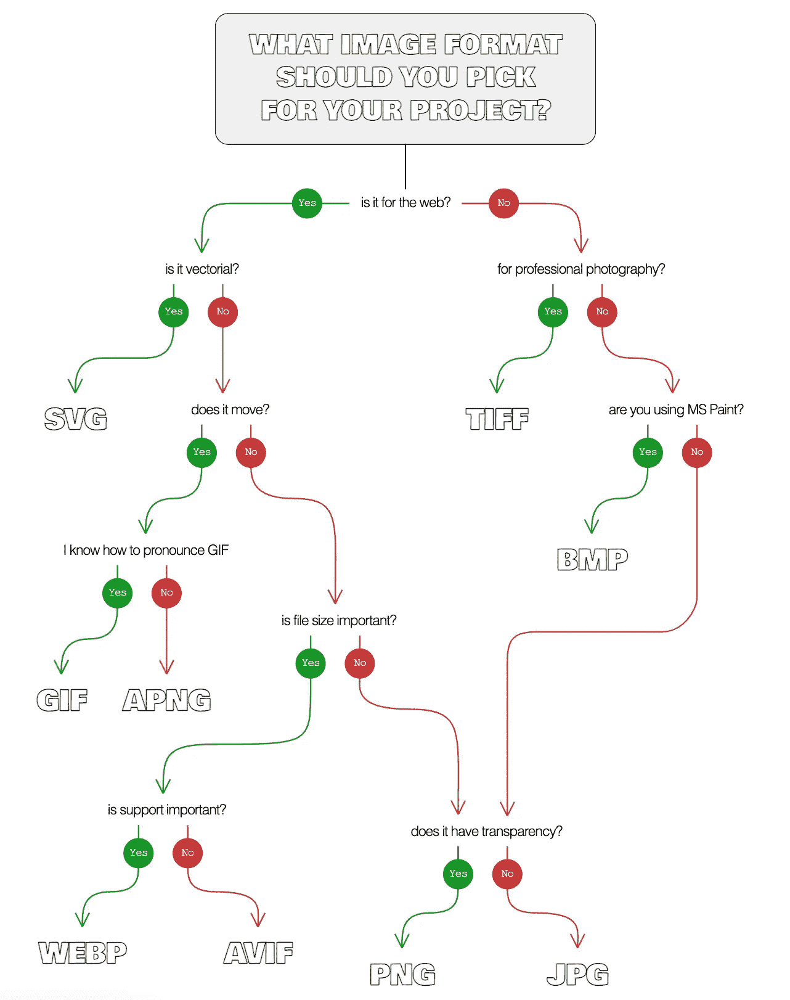
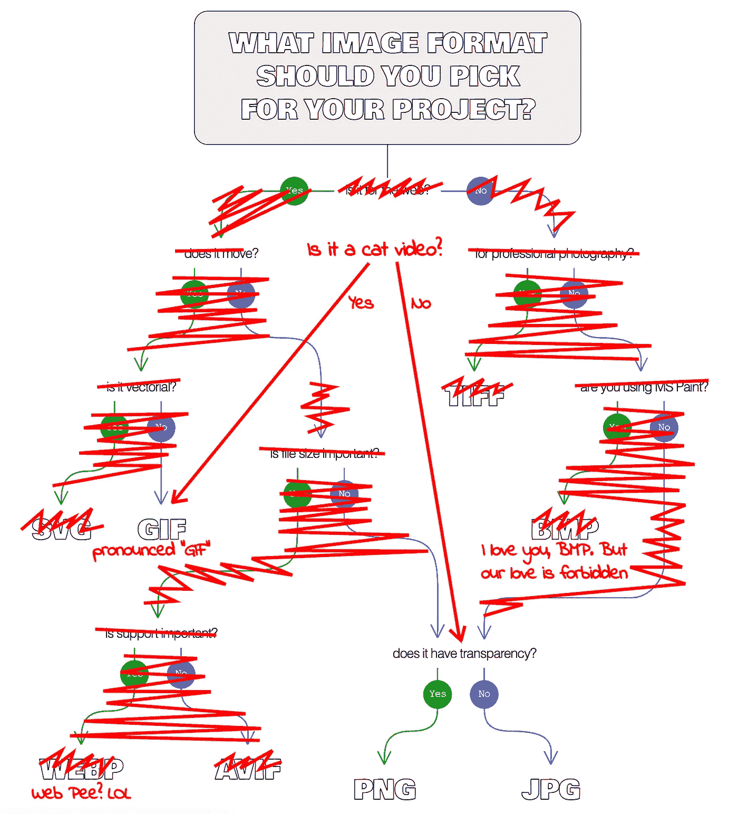

# 在你的下一个项目中，你应该使用什么样的图像格式？

> 原文：<https://levelup.gitconnected.com/what-image-format-should-you-use-in-your-next-project-55a4a3f9afd2>

## 帮助选择图像格式的决策树

几年前，我画了一个[决策树](https://en.wikipedia.org/wiki/Decision_tree)来简化根据项目选择使用的[图像格式。它有一种怀旧/幽默的感觉，同时保持了图表的简单和一定程度的准确性(最终决定可能是任意的。)](https://alvaromontoro.com/blog/67956/file-format-decision-tree)

几年过去了，新的图像格式不断涌现，对一些现有格式的支持也得到了扩展，使得一些“经典”格式变得不那么重要。所以，我决定更新决策树(包括内容和可视化):



新的图表优先考虑矢量图像的 SVG，引入 APNG 作为 GIF 的替代(稍后将详细介绍)，即使 BMP 对于图表来说不是一个可行的选项，也保留它。

此时，有必要添加一些说明，因为有些格式可能根本不应该出现在树中。

# 新的 HTML 现实:

这个决策树可能很刺激很好看(我有偏见😅)，但现在已经没那么需要了。HTML 也在发展，现在有了像`[<picture>](https://developer.mozilla.org/en-US/docs/Web/HTML/Element/picture)`这样的标签，允许开发人员以不同的格式提供多个来源，让浏览器负责选择第一个支持的格式:

```
<picture>
  <source srcset="picture.avif" type="image/avif" />
  <source srcset="picture.webp" type="image/webp" />
  <source srcset="picture.apng" type="image/apng" />
  
</picture>
```

这让上面的决策树有点不着边际(尤其是关于支持的问题。)尽管如此，它仍然很有趣，因为浏览器会选择第一个受支持的来源，而忽略其他来源，这并不意味着它最适合这项工作。

将资源按效率或功能从高到低排序至关重要。从这个意义上说，这个决策树仍然是有用的。

# 动画和视频

动画科有个傻问题:“*你知道 GIF 怎么发音吗？*”。这是一个故意幽默和恶作剧的问题，因为尽管我们都认为我们知道如何正确地读 GIF，但没有人知道(不管你读“GIF”还是“GIF”，你都错了。)

实际上， **GIF 是一种腐朽的格式** : [APNG 在任何地方都受支持](https://caniuse.com/?search=apng)(动画网页也是如此)，比 GIF 更轻，颜色深度更好。然而，即使 APNG 有这么多好处，GIF 仍然是网上最受欢迎的图片……但是这种情况会持续多久呢？

这个问题的答案可能并不相关，因为互联网正朝着不同的方向发展: [HTML 极大地方便了视频的使用](https://developer.mozilla.org/en-US/docs/Web/HTML/Element/video)，以至于**使用动画图像而不是视频几乎可以被认为是一种不好的做法**。视频在很多方面都更好:

*   它们允许控制播放状态(这提高了可访问性)
*   他们可以在满载前玩
*   它们的尺寸很小
*   它们可以在加载时显示静态图像(海报)
*   他们有更多的颜色选择

这就是常见的用 [GIFV](https://www.computerhope.com/jargon/g/gifv.htm) 格式定义实际上是视频(WebM 或 H.264 格式)的动画图像的方式……由于它是视频而不是图片，所以不包括在决策树中。如果你到达那个分支，知道有比 GIF 或 APNG 更好的选择。

# …和一个笑话

几个月前，我开始出版一个关于 CSS (和网络开发)的每周[网络漫画。本周，我用这个决策树的一个版本重写了几年前我画的一个(愚蠢的)笑话。](https://comicss.art/)

上面的决策树在理论上很好，但在日常项目的现实中，格式选择过程略有不同:



我希望你喜欢这篇文章(和这个愚蠢的笑话)。请留下您的意见，包括更改建议，或者您是否想在决策树中加入或删除某种格式。感谢阅读！