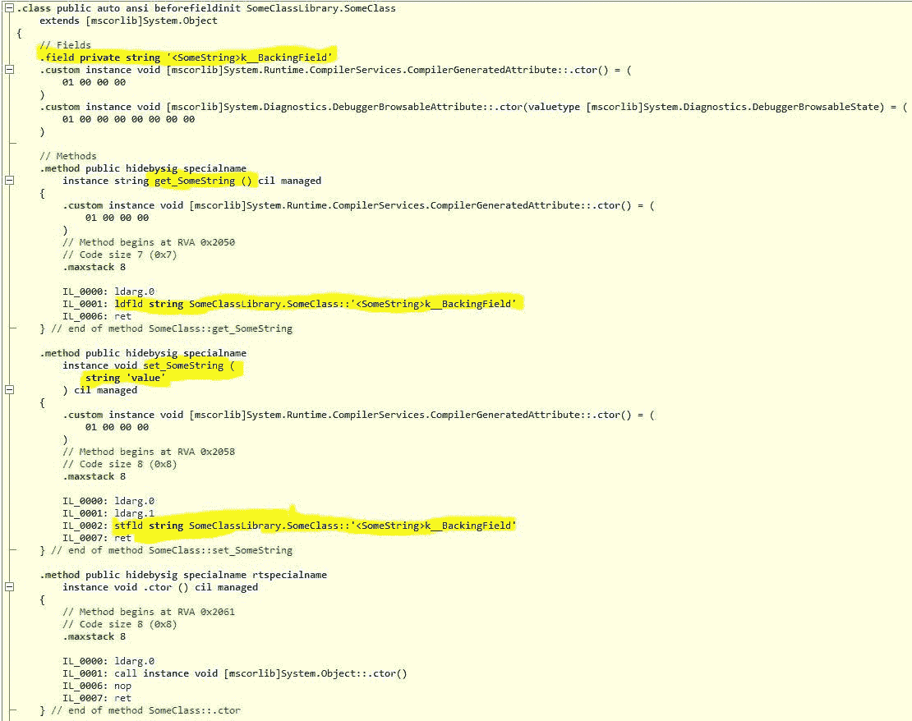

# 什么是二进制突变？

> 原文：<https://levelup.gitconnected.com/what-is-a-binary-breaking-change-7ca6fc0f3875>

## 以及为什么应该使用属性而不是公共字段

马库斯·斯皮斯克在 [Unsplash](https://unsplash.com/s/photos/binary) 上的照片

# 字段和属性

你可能总是被告知应该使用公共属性而不是公共字段，对吗？

原因是属性可以提供控制设置什么值的功能，例如，您可能有一个名为 NumberOfUsers 的 Int32 类型的字段，并希望确保值集> = 0，此逻辑可以在属性中设置，但不能在字段中设置。

但是大多数时候你没有任何这样的逻辑，你只有一个带有 get/set 而没有逻辑的 auto 属性，这不是和有一个字段一样好吗？

**如果有一天你需要逻辑来控制值的设置，你能不能把公共字段改成属性？**

# 二元突变

您可以将字段更改为属性。但是，如果您的代码被其他开发人员用作类库，您将引入二进制突破性的变化。我们一会儿就会知道这意味着什么。

# 示例项目

让我们建立一个示例项目，看看当我们将一个字段更改为一个属性时，在幕后发生了什么。

## 类库

创建一个非常简单的。NET 类库项目，如下所示，并编译它:

下面是生成的 [CIL](https://en.wikipedia.org/wiki/Common_Intermediate_Language) :

如您所料，编译器生成了一个名为 SomeString 的字符串字段。

## 呼叫代码

设置以下控制台应用程序项目，该项目访问 SomeClass 库中的字段并将其写入控制台。

您需要添加一个对 SomeClassLibrary dll 的引用，该 dll 应该位于 SomeClassLibrary\bin\Debug 文件夹中。

记下生成的 CIL:

## 运行控制台应用程序

导航到 CallingLibrary\bin\Debug，双击 CallingLibrary.exe 运行应用程序:

## 突破性的变化

现在让我们将 SomeClass 中的字段更改为属性。

这是新的 CIL 电码。请注意，在后台创建了一个支持字段和两个方法，一个用于 get，一个用于 set。

现在将 SomeClassLibrary dll 复制到控制台应用程序的 debug 文件夹中:

现在导航到 CallingLibrary\bin\Debug，双击 CallingLibrary.exe 运行应用程序:

它找不到场地！C#代码没有问题，因为访问字段的语法与访问属性的语法相同。然而，正如你在上面看到的，CIL 代码非常不同，它在幕后使用方法。

这就是我所说的突破性变化，你的源代码是兼容的，但你的 CIL 与新的 dll 不兼容。

## 修复

要解决这个问题，您只需要重新编译您的控制台应用程序，以便它生成对 CIL 属性的正确调用。

继续编译您的控制台应用程序，看看新的 CIL 代码:

正如您所看到的，新的 CIL 代码正确地从某个类调用了 get/set 方法，而不是试图访问该字段。

# 结论

我希望您现在能更好地理解什么是二进制突破性变化，以及为什么使用公共属性比使用字段更好。

如果您正在创建类库，并且希望您的用户能够覆盖旧的 dll 而不必重新编译，这才是真正的问题。

## 源代码和二进制兼容更改

您可能想知道是否有这样一种情况，您可以更改代码，而不必告诉您的用户重新编译。这被称为源代码和二进制兼容的更改。

例如，如果您更改了公共方法的实现，但保留了方法签名不变。这会更改您的源代码，因此您需要提供新的 dll，但是因为您的方法的公共接口没有更改，只有实现更改了，所以您的用户能够复制新的 dll，而不必重新编译！

## 使用属性的原因

使用属性而不是字段还有其他原因。数据绑定需要属性，您可以在 setter 中放置一个断点来跟踪值的变化，这对于字段是不可能的。