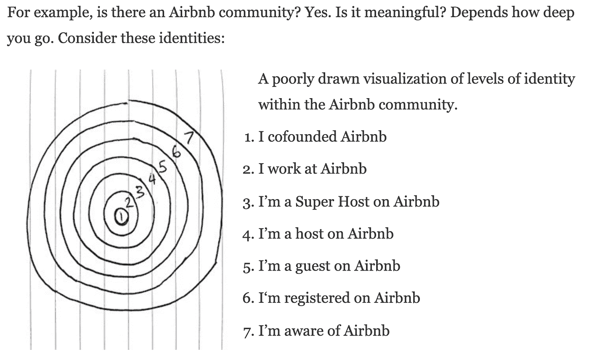
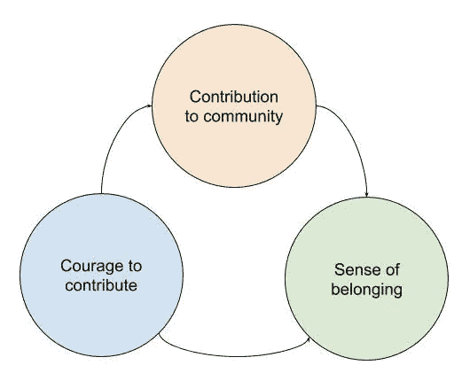
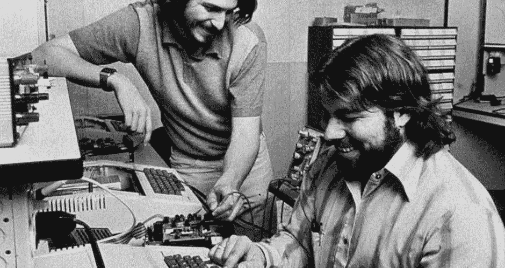
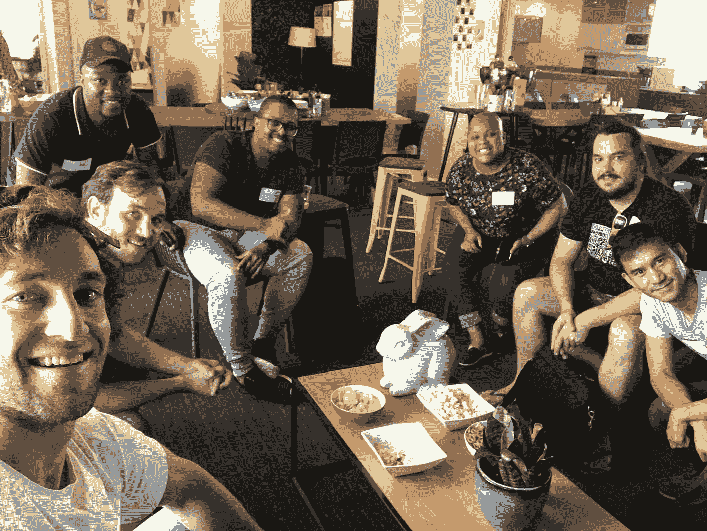
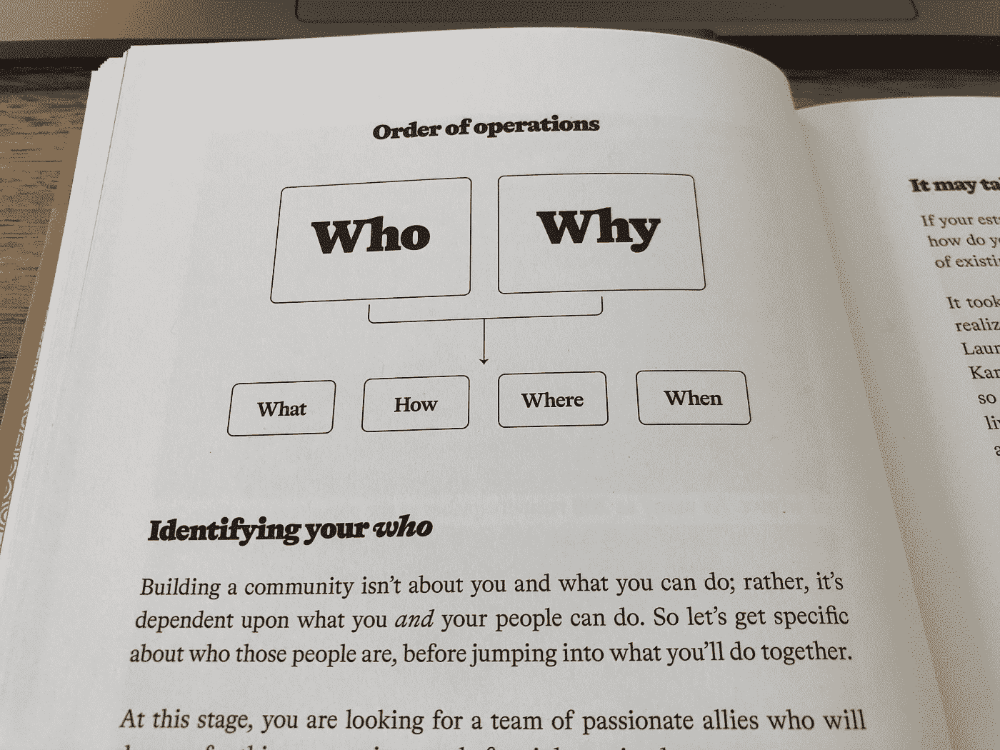

# 什么是社区工程师？

> 原文：<https://levelup.gitconnected.com/what-is-a-community-engineer-c175ce2e0a98>

免责声明:我真的不知道，但我正在慢慢形成自己的观点。另外:我已经解释了我的许多来源，所以如果我错了，请平我:)

社区工程师是指发明、设计、分析、建造和测试支持社区运作和发展的材料、机器、系统和结构的人。

运筹学

> 工程学就是弄清楚如何用你实际拥有的东西做你想做的事情。——[约翰·卡马克在乔·罗根秀上](https://youtu.be/udlMSe5-zP8?t=3203)。

因此，社区工程师是想出如何帮助一个社区的人们用他们所拥有的做他们想做的事情的人。

*首先，我想带你了解一下大卫·斯宾克斯关于社区的概念……*

# 社区的定义

社区是具有共同身份的一群人。身份越具体，成员资格就变得越有意义。

举例来说:一个“周六早上在桌山骑山地车的人”的社区比一个“骑山地车的人”的社区对成员更有意义

成员们将会有更多的话题可以谈论和分享。越接近核心，认同和意义就变得越强。

摘自《大卫·斯宾克斯对社区的定义》

## 社区感觉

根据阿尔弗雷德·阿德勒的说法，在不牺牲自己的情况下，为帮助他人做出贡献是最大的快乐——⁴.将“我们”的福祉置于仅“我”之上，让人们超越自身的存在，插入到一个更大的网络中。

阿德勒称之为“⁵”或“社区感觉”。这种感觉让人们克服了被忽视的恐惧，给了他们不断做出贡献的勇气，创造了一个良性循环。

贡献的良性循环

我想恳求你读一读⁴的《不被喜欢的勇气》和古贺文武的《快乐的勇气》⁶。它们是深入阿德勒思维方式的苏格拉底式对话，在我看来，这是为你自己和你的社区建立幸福的基础。

# 蓬勃发展的工程社区

社区在混乱的世界中有机地成长、运作和消亡。如果你想帮助一个社区蓬勃发展，成为一个有弹性的网络，你需要设计它。

我想举一个来自《社会 Architecture⁷》的例子，作者是已故的彼得·欣金斯。

已故的世界级社区工程师 Pieter Hintjens

在 Pieter 的 ZeroMQ 在线开源社区中，他发现老用户变成了主题专家。专家们被赋予了审核新投稿的权力:除非他们达到了很高的标准，否则他们通常会拒绝这些投稿。这听起来不错——但结果是它打破了贡献的良性循环，吓跑了新成员。

为了应对这种情况，Pieter 编写了《Contract⁸集体代码建设》,其高级目标是:

> 为开源软件项目提供一个可重用的最佳协作模型。

为确保新成员有能力做出贡献，社区合同的规则之一是:

> *根据本合同条款，每个人都应享有成为出资人的平等权利，不得有任何区别或歧视。*

新成员的贡献因此受到保护，专家需要帮助新手修正他们的贡献。另一方面，糟糕的稿件投入生产并引发问题，因此根据价值而非“专家意见”被拒绝。

## 连接、创造和改变(世界)

当人们相互联系时，他们创造新事物，改变世界。全世界有数百万个社区每天都在以大大小小的方式这样做。

一个著名的例子是自制电脑 Club⁹，它容纳了史蒂夫·乔布斯和史蒂夫·沃兹尼亚克，并帮助他们开发和推出苹果电脑。

*社区工程师开始搭建舞台，激发社区成员之间的联系。*

史蒂夫·乔布斯和史蒂夫·沃兹尼亚克在家酿电脑俱乐部创造苹果电脑

# 成为一名社区工程师

要成为一名社区工程师，你需要找到或创建一个社区来为之做出贡献。

也许有一个蓬勃发展的社区，你可以加入并从中学习？也许有一个苦苦挣扎的社区需要你的帮助？也许有一群人正等着作为一个团体被领导。

你甚至可能已经是某种社区工程师——你只需要认识到这一点，并加倍努力让你的人团结起来！

我，左下角，有一个项目茁壮成长果酱

## 确定一个社区开始//开始工程设计

我所知道的关于建立社区的最好的书是《聚在一起⁰.》识别要加入或开始的社区的起点是决定“谁”和“为什么”人们是这个社区的一部分。

1.  你在乎谁；分享兴趣、身份或空间；想帮忙吗？*回答完这些问题后，你需要能够回答…*
2.  为什么成员们想要走到一起？

然后你就可以开始担心什么，什么时候，在哪里，怎么做。

聚书

## 感谢阅读…

*和快乐社区工程！如果你想和我聊天，请发邮件至*[*benblaine@gmail.com*](mailto:benblaine@gmail.com)*或发微博给我@benjiblaine*

*我正忙于为两个社区做贡献:*

1.  [*Investec 可编程银行测试社区，与 OfferZen 合作*](https://www.offerzen.com/community/investec/)
2.  [*OfferZen 基金会项目茁壮成长社区*](https://foundation.offerzen.com/)

*干杯，本*

[1]“工程师——维基百科。”[https://en.wikipedia.org/wiki/Engineer](https://en.wikipedia.org/wiki/Engineer)。于 2020 年 2 月 23 日访问。

[2]“社群”的定义——大卫·斯平克斯——媒介。”2018 年 1 月 11 日，[https://medium . com/@ davidspinks/the-definition-of-community-9fc 17312811 f](https://medium.com/@davidspinks/the-definition-of-community-9fc17312811f)。于 2020 年 2 月 23 日访问。

[3]“阿尔弗雷德·阿德勒——维基百科。”[https://en.wikipedia.org/wiki/Alfred_Adler](https://en.wikipedia.org/wiki/Alfred_Adler)。于 2020 年 2 月 23 日访问。

[4]“快乐的勇气:真正的满足是……—好的读物。”[https://www . goodreads . com/book/show/43599070-快乐的勇气](https://www.goodreads.com/book/show/43599070-the-courage-to-be-happy)。于 2020 年 2 月 23 日访问。

[5]“gemeinschaftsgefuhl——维基百科。”https://en.wiktionary.org/wiki/gemeinschaftsgefuhl。于 2020 年 2 月 23 日访问。

[6]“不被喜欢的勇气:如何解放自己，改变…”[https://www . goodreads . com/book/show/43306206-不喜欢的勇气](https://www.goodreads.com/book/show/43306206-the-courage-to-be-disliked)。于 2020 年 2 月 23 日访问。

[7]“社会架构:构建在线社区”，作者:彼得…[https://www . goodreads . com/book/show/30121783-social-architecture](https://www.goodreads.com/book/show/30121783-social-architecture)。于 2020 年 2 月 23 日访问。

[8]“42/C4 | ZeroMQ RFC。”[https://rfc.zeromq.org/spec/42/](https://rfc.zeromq.org/spec/42/)。于 2020 年 2 月 23 日访问。

[9]“家酿计算机俱乐部——维基百科。”[https://en.wikipedia.org/wiki/Homebrew_Computer_Club](https://en.wikipedia.org/wiki/Homebrew_Computer_Club)。于 2020 年 2 月 23 日访问。

[10]“聚在一起的书|如何与你的……建立一个社区”[https://gettogetherbook.com/](https://gettogetherbook.com/)。于 2020 年 2 月 23 日访问。