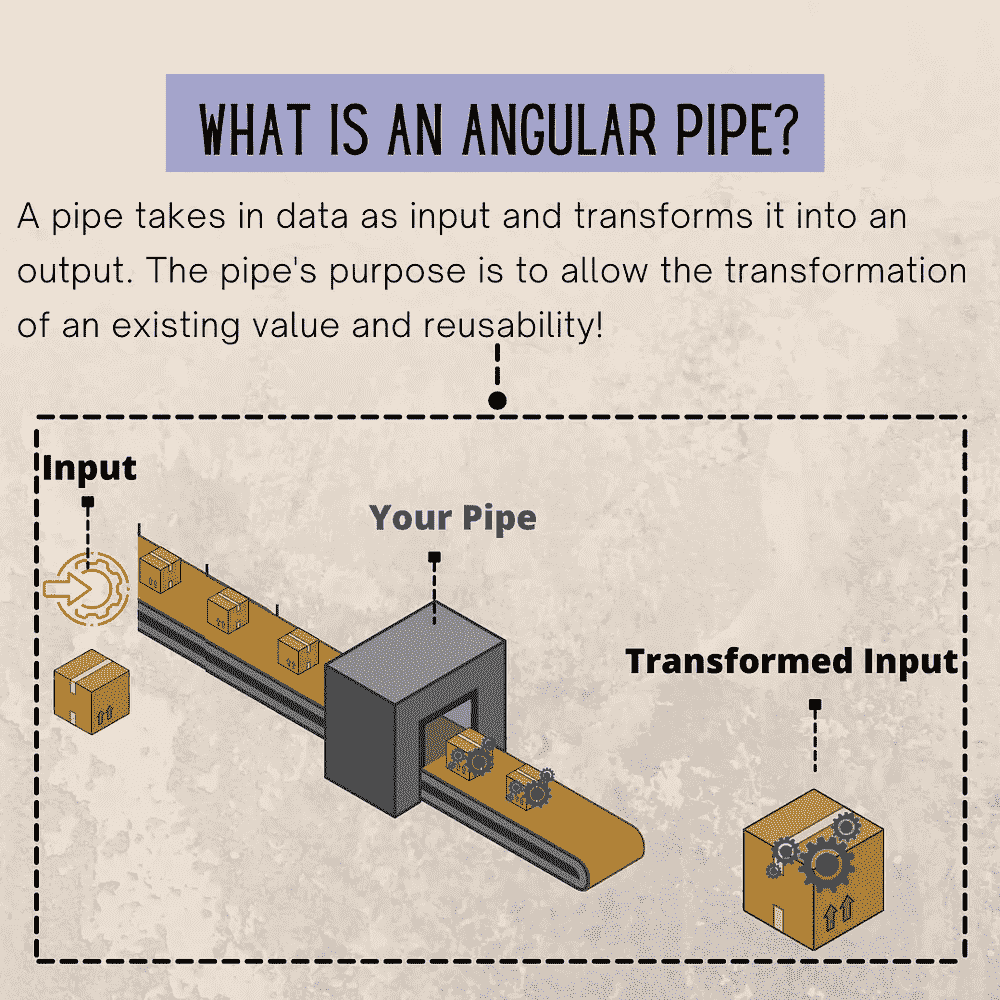
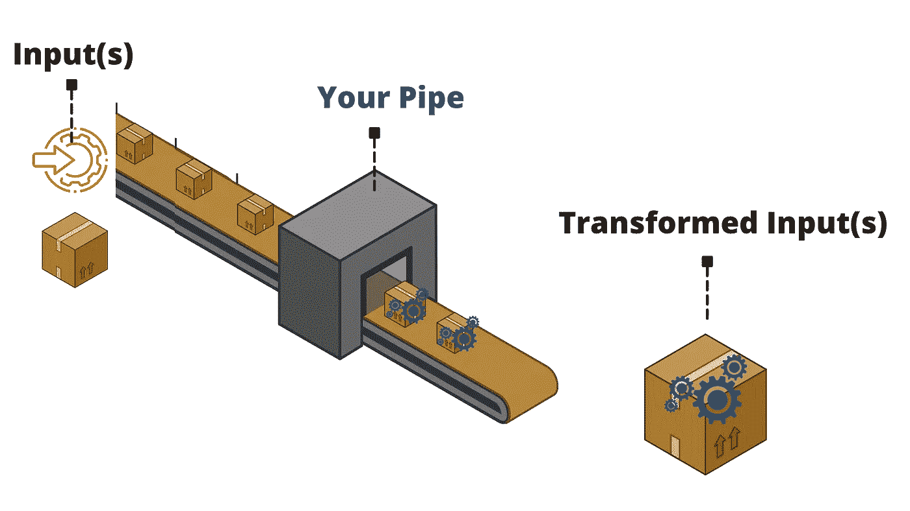
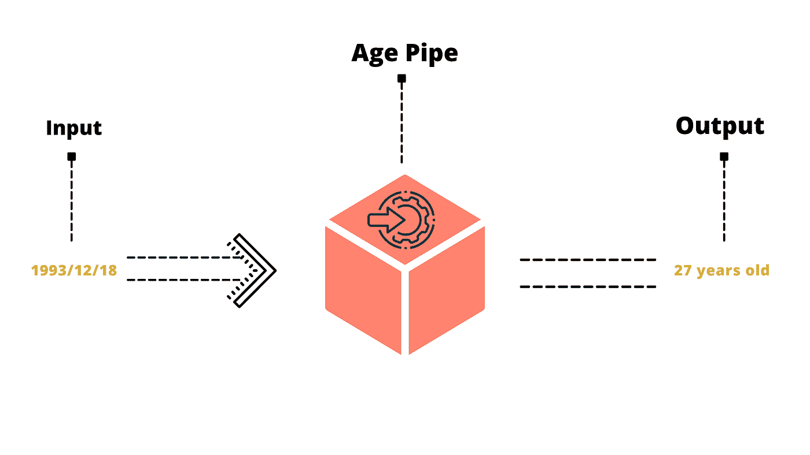
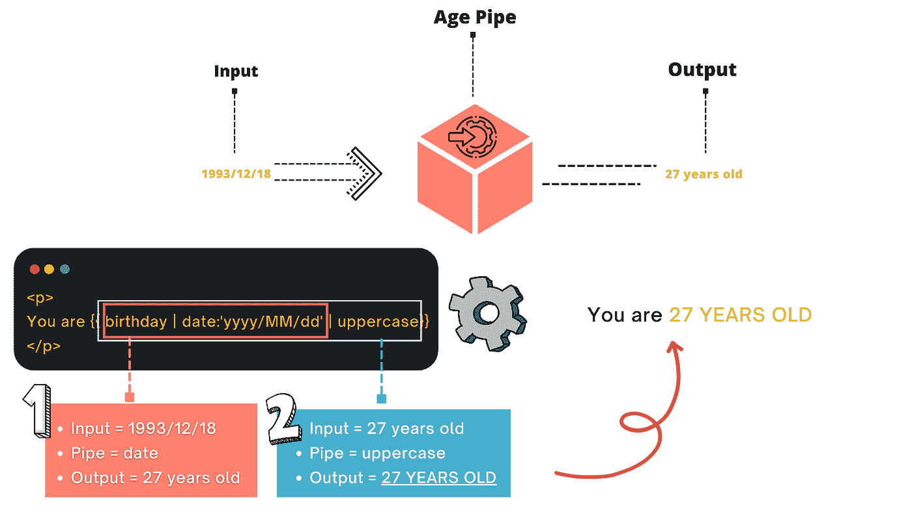
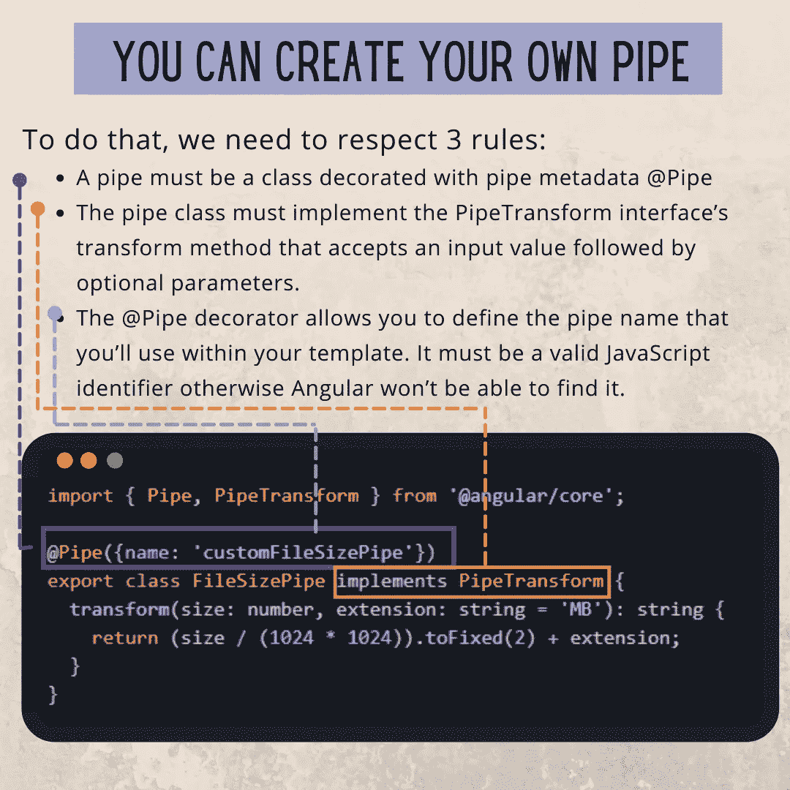

# 什么是有角的管道？你如何使用角管？

> 原文：<https://levelup.gitconnected.com/what-is-a-pipe-in-angular-how-do-you-use-angular-pipes-650d7ff6d103>

## 在不到 5 分钟的时间内学会所有示例！



作者:FAM

这篇文章是一个快速指南，帮助你了解所有关于管道的知识，并在你的 Angular 应用中使用它们。

这是我们攻击管道的计划！

*   **关于棱角分明的管道，你需要知道的一切！**
*   **自定义管道规则+示例！**

# **什么是管道？**

管道是一种数据转换器，如下图所示:



弯管

管道接受 ***数据作为输入*** 并将其转换为 ***输出*** 。管道的目的是**允许现有值的转换**和**的可重用性**！

这里有一个例子:



管道示例

上面，我们有一个从给定的日期输入计算年龄的管道。我们已经可以立即使用内置的角管道，比如`date`管道和您为定制转换创建的其他定制管道。

这里有一个关于`date`管道的例子:

如您所见，通过使用以下语法，在模板中使用了管道:

```
{{ input **|** **pipeName** }}
```

这里的输入是我们传递给管道的数据。它必须是现有值！

***/！\如果您有多个参数，您想知道该怎么办吗？***

嗯，不用担心，您可以使用尽可能多的 params，并且它们的类型可以是您想要的任何类型。你需要记住的唯一特别的事情是语法。开始的时候有点奇怪，但是一旦你熟悉了，你会发现很容易:

```
{{ input**| pipeName** : param1: param2: ...}}
```

**举例？**

`date`管道可与可选的*参数*一起使用，其格式如下:

具有多个参数的管道示例

***/！\如果我需要大写的出生日期呢？***

值得庆幸的是*中的管道都是可链的，所以你可以这样想:*

**

*成角度链接管道*

*代码如下:*

*角形链条管*

# *现在，让我们制作我们的定制管道吧！*

## *1-自定义管道规则*

*   *管道必须是用*管道元数据* `**@Pipe**`修饰的类*

```
*@Pipe({name: 'myCustomPipe'})*
```

*   *管道类必须实现`**PipeTransform**`接口的转换方法，该方法接受一个 ***输入*** 值，后跟 ***可选参数。****

```
*interface **PipeTransform** {
  **transform**(value: any, ...args: any[]): any
}*
```

*   *`**@Pipe**`装饰器允许您定义将在模板中使用的管道名。**它必须是有效的 JavaScript 标识符。不然 Angular 就找不到了。***

```
*template: `{{someInputValue **| myCustomPipe**: someOtherValue}}`*
```

## *2-自定义管道示例*

*正如您在示例中看到的，所有规则都得到遵守。然后，我们可以在 HTML 模板中使用我们的自定义管道:*

*自定义管道使用*

**

*定制弯管*

# *回顾一下？*

*在不到 5 分钟的时间内学会角管*

***永远享受！**亲爱的读者，我希望这是清晰和有用的。我希望你和你的家人无论在哪里都安全！坚持住。明天会更好！*

***让我们接触一下** [**中**](https://medium.com/@famzil/)**[**Linkedin**](https://www.linkedin.com/in/fatima-amzil-9031ba95/)**[**【脸书】**](https://www.facebook.com/The-Front-End-World)**[**insta gram**](https://www.instagram.com/the_frontend_world/)**，或者**[**Twitter**](https://twitter.com/FatimaAMZIL9)**。*********

*****[www.fam-front.com](http://www.fam-front.com/)*****