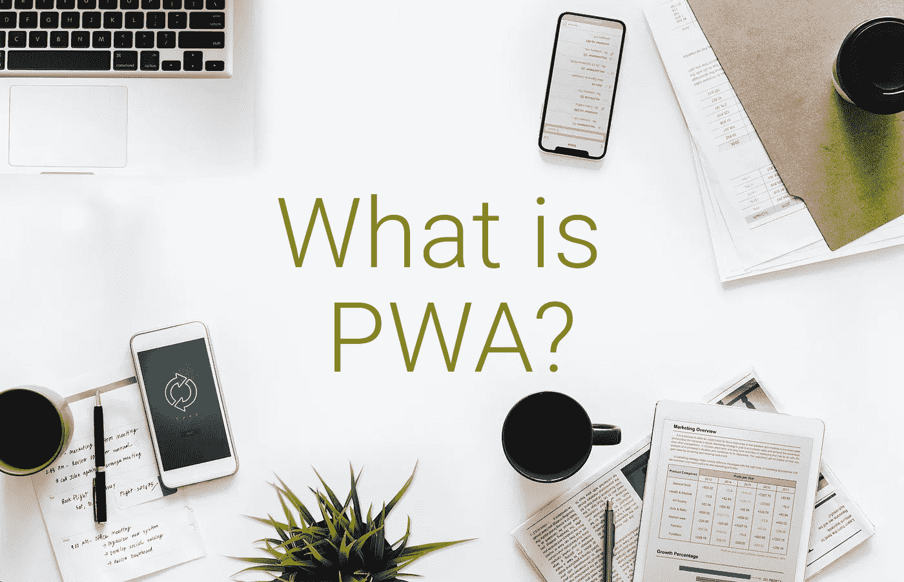
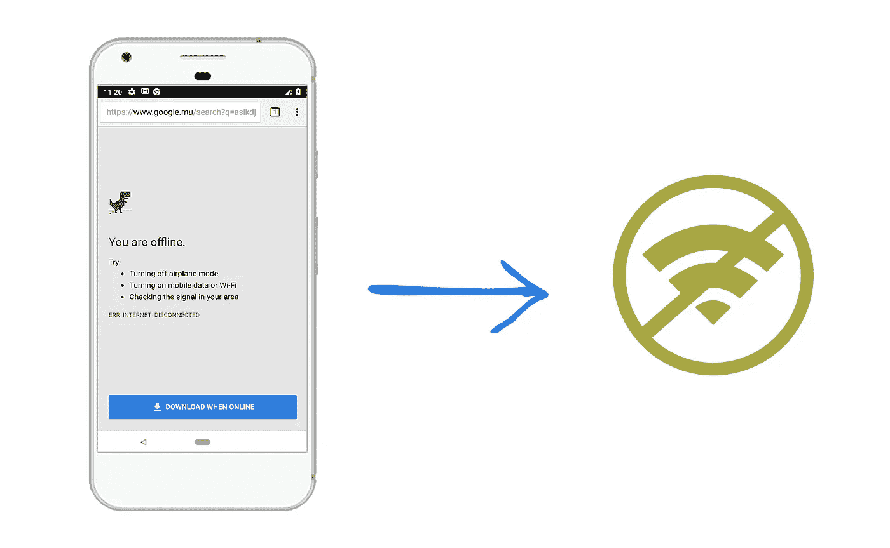
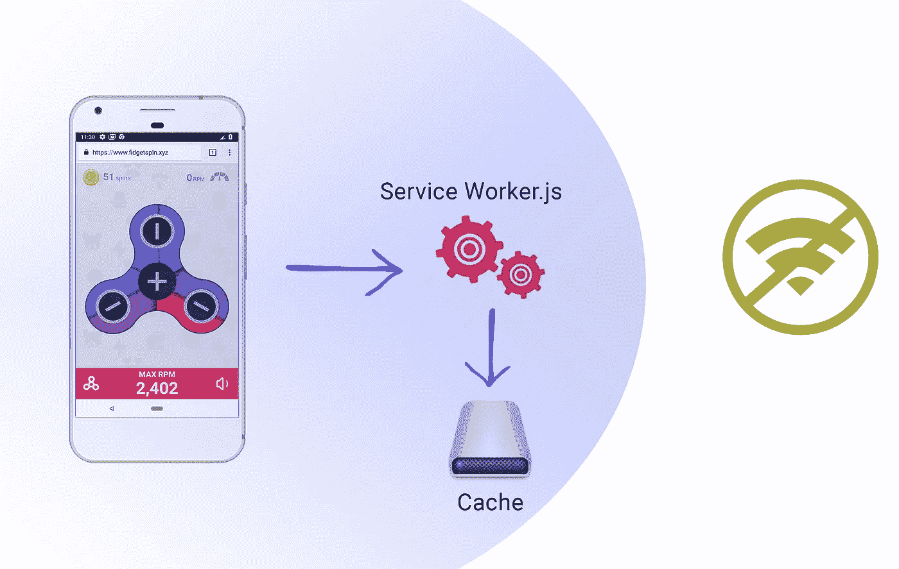
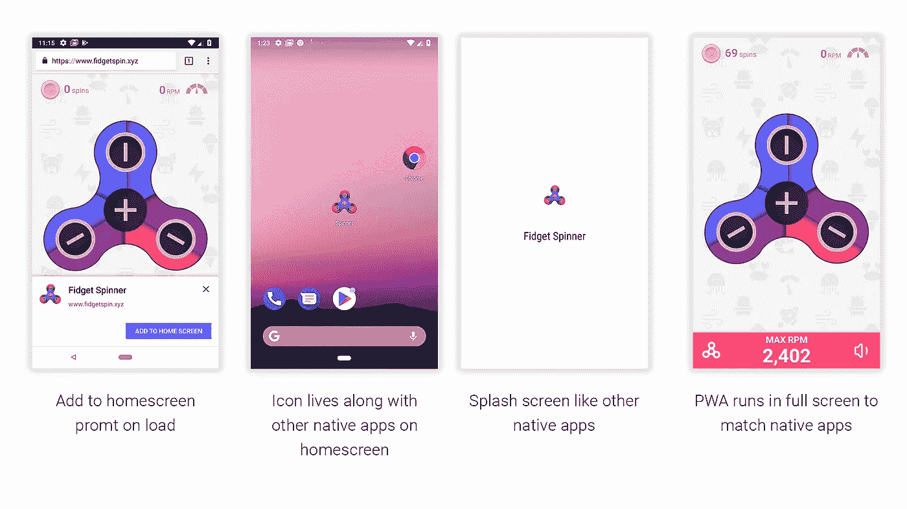
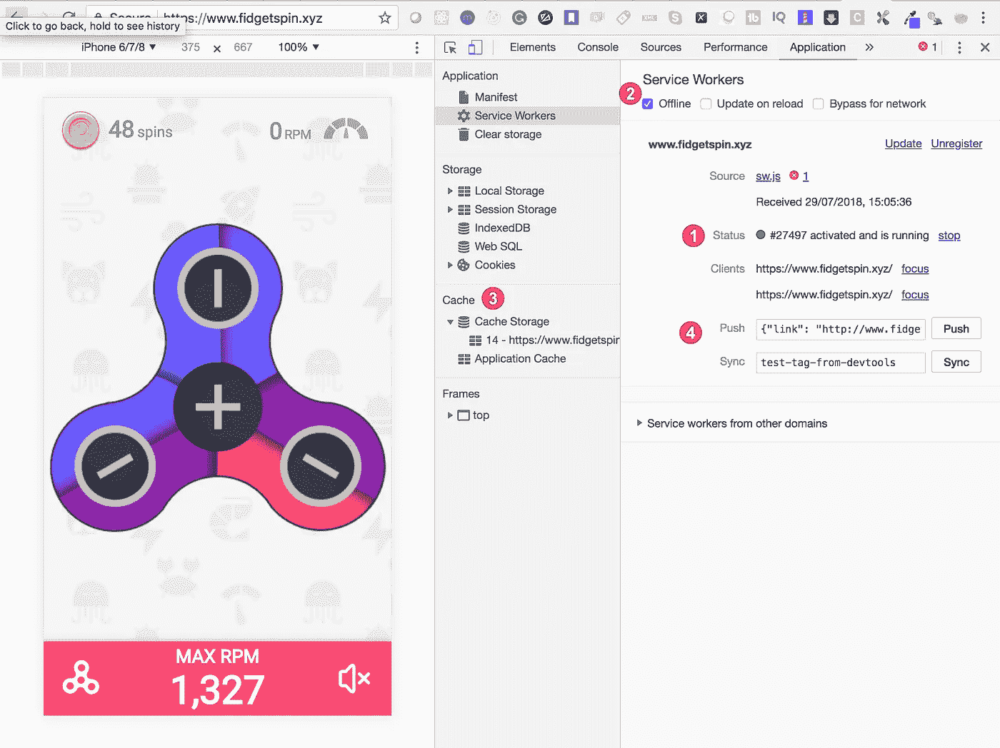

# 什么是 PWA，为什么要关注它？

> 原文：<https://levelup.gitconnected.com/what-is-a-pwa-and-why-should-you-care-3c8e2fd47f9e>

## 既然可以构建渐进式 web 应用程序，为什么还要构建 native 呢？



渐进式 web 应用程序(PWAs)解决了当今许多移动开发问题

在过去的几年里，手机用户的数量呈指数级增长。今天，超过 60%的互联网总使用量是通过手机进行的。

很明显，原因包括便携性、廉价的硬件、容易访问互联网以及互联网上服务的增加。随着越来越多的用户使用手机，手机用户体验的优化至关重要。

对于较小的公司来说，由于成本或时间限制，它们通常没有本地应用程序，web 应用程序是通过提供最佳体验来赢得客户的关键机会。

如果公司有一个专用的本地移动应用程序，有可能许多用户仍然会更喜欢他们的网络版本，以避免在他们的手机上下载和安装应用程序。这可能是由于硬件和内存限制或其他个人偏好。

如果一家公司致力于并希望获得最大数量的参与客户，web 应用程序的体验必须接近原生应用程序。

如今，人们对我们网站的期望非常高。大约 25 年前，当网站被发明时，它的目的主要是分享信息。

今天，网站是一个杂货店，社交网络，聊天场所等。该网站预计将搜索房屋，并持有世界地图。该网站预计将提供 PowerPoint 和 Excel 的所有功能。

# 认识进步的网络应用

我们以手机上的 WhatsApp 为例。当没有网络时，您仍然可以打开应用程序，查看过去的消息，甚至回复某人。当手机接入互联网时，信息会在后台自动发送。

这就是 PWA 承诺在网络应用中提供的功能。它使 web 应用程序能够在没有网络的情况下加载，在后台同步，无缝地执行操作，同时为您的用户提供类似本机的体验。

# 为什么我们需要公共福利援助，它们有什么特点？

让我们讨论一些常见的非渐进式 web 应用程序所缺少的核心属性。

1.  **可靠** 该应用程序在加载时应该快如闪电——它应该接近即时，并且应该在没有网络或 2G 等相当低速的网络时打开。谷歌发现，如果网页加载时间超过三秒，53%的用户会放弃网站。
2.  当用户与 web 应用程序交互时，滚动和页面转换应该非常平滑。每个人都讨厌蹩脚的卷轴。
3.  **响应式** 这款应用应该适合所有不同尺寸的设备。完美的 web 应用应该像液体一样，呈现出容器的形状。
4.  如果我们想让 web 应用程序更接近本地应用程序，它们必须是可安装的，并且应该与其他本地应用程序一起驻留在主屏幕上，这样用户就可以一键访问 PWA。
5.  **闪屏**
    PWAs 在 app 启动时增加闪屏。这让 PWA 感觉更像一个原生应用。
6.  **高参与度** 应用程序应该保持用户的参与度。PWA 提供了推送通知、主屏幕图标、全屏功能和离线优先应用程序等功能，以提高用户参与度。

上述所有特征在 PWAs 中都是可能的。

PWA 只是一个普通的网络应用，上过最好的大学，掌握了用户体验。

## PWA 和现代 UI 框架

很少有人认为 PWA 与 React.js、Angular 6 或 Vue.js 等最新的 UI 框架相结合。

嗯，不一定。

PWA 与您正在使用的框架无关——它只需要必需的组件。

## PWA 如何使网站离线可用？

这正是我想到 PWAs 的第一个想法。没有互联网，web 应用程序究竟如何打开？

我们都知道本地应用可以在没有互联网连接的情况下打开，因为当我们下载并安装它们时，UI 组件和一些数据等关键资源都存储在设备中。这也正是 PWA 中发生的事情。

PWA 在浏览器缓存中存储 HTML 文件、CSS 文件和图像，开发人员可以完全控制网络调用。所有这些都是由服务人员实现的。

## PWA 的技术组成部分是什么？

PWAs 有一些重要的技术组件，它们协同工作，为常规的 web 应用程序注入活力。开发良好的 PWA 需要以下组件。


让我们对其中的每一个进行概述。

## 服务行业人员

我们的 web 应用程序直接与网络对话，如果没有网络，屏幕就会显示著名的恐龙。



当我们的普通网站无法连接到互联网时屏幕

这里有一个优化这一过程的机会。对于第一次加载，服务工作者将所需的资源存储在浏览器缓存中。当用户下次访问应用程序时，服务人员会检查缓存，并在检查网络之前将响应返回给用户。

一个*服务工作者*只是 JavaScript 代码的一个组件，作为浏览器和网络之间的代理。服务人员管理推送通知，并使用浏览器的缓存 API 帮助构建离线优先的 web 应用程序。



这就是服务人员如何履行其职责，以授权正规网站

无论设备是否连接到互联网，这都可以提高应用的性能。

开发人员可以完全控制应用程序的行为，以及它在各种情况下应该如何响应。服务工作者有自己的生命周期事件。


一旦缓存完成并为离线访问做好准备，您也可以选择通过显示一条说明来吹嘘它，说明缓存已完成，用户也可以离线访问它。

## 清单文件

manifest 文件是一个 config JSON 文件，它包含应用程序的信息，比如安装时在主屏幕上显示的图标、应用程序的短名称、背景颜色和主题。

如果清单文件存在，Chrome 浏览器将自动触发 web 应用程序安装横幅。如果用户同意，这将在主屏幕上添加图标，并且安装 PWA。这不是霸道吗？

以下是示例清单文件:

```
{
  "short_name": "Spinner",
  "name": "Fidget spinner",
  "icons": [
    {
      "src": "/images/icons-192.png",
      "type": "image/png",
      "sizes": "192x192"
    },
    {
      "src": "/images/icons-512.png",
      "type": "image/png",
      "sizes": "512x512"
    }
  ],
  "start_url": "/home/#3367D6",
  "display": "standalone",
  "scope": "/home/",
  "theme_color": "#3367D6"
}
```

在下面的截图中查看清单文件。



## HTTPS

服务人员能够拦截网络请求并修改响应。服务人员在客户端执行所有操作。因此，PWAs 需要安全协议 HTTPS。

服务人员能够接收推送通知和后台同步，这无疑会提升用户体验并保持客户参与。推送通知和后台同步是可选的，但建议提供更像本机的体验。

# 演示时间

今天，有许多 pwa 可供使用。如果你想玩玩 PWA，想看看服务人员的工作情况，请访问[stiggy spin . XYZ](https://www.fidgetspin.xyz/)，并切换到 Chrome 的 DevTools 中的应用程序选项卡。



1.  **状态**:告诉我们服务人员已被激活并正在运行。
2.  **离线**:通过勾选这个选项，Chrome 会在应用程序离线时对其进行处理。刷新选项卡，它将模拟 PWA 在没有网络时的响应方式。您也可以关闭 WiFi 或数据来测试 PWA。
3.  **缓存**:这个部分显示服务人员将哪些文件存储在缓存中。
4.  **推送&同步**:这些部分在开发过程中用于测试推送通知和后台同步。

你可以去 https://pwa.rocks/[看看，那里有很多 PWA 应用程序。](https://pwa.rocks/)

# 工具和库

很少有开源工具可以增强并简化 PWAs 的开发。

1.  [**light house**](https://developers.google.com/web/tools/lighthouse/)**是一款审计工具，可以针对任何公共或个人网页运行，并生成一份带有 PWA 所需清单的报告。这可以在你的 PWA 开发过程中用于交叉检查，并获得进一步改善体验的建议。**
2.  **[**Workbox**](https://developers.google.com/web/tools/workbox/)**是一个库的集合，由 Google 开源，可以用来生成 service-worker 文件。Workbox 还附带了各种图像和其他资源的缓存策略。****

# ****艾滋病毒感染者的成功故事****

****谷歌公布了实施 PWAs 的公司的成功案例。访问[该](https://developers.google.com/web/showcase/)页面，了解更多关于公司如何解决处理慢速网络的问题，如何优化用户体验，以及如何将转化率和 SEO 性能提高 80%的信息。****

****这展示了全球各公司面临的各种问题，以及他们如何使用 PWAs 解决这些问题。我很确定你会得到如何证明 PWA 对你有帮助的指导。****