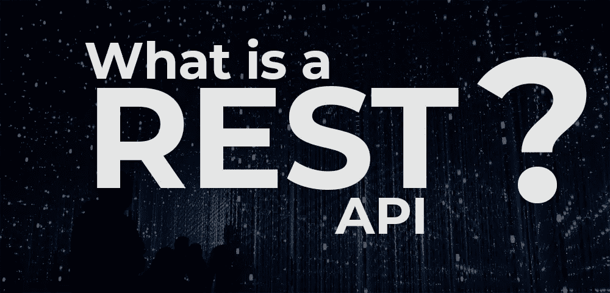

# 什么是 REST API？

> 原文：<https://levelup.gitconnected.com/what-is-a-rest-api-6471b08eb575>

## 并快速浏览一下 HTTP 动词的语义

Robynne Hu 在 [Unsplash](https://unsplash.com/s/photos/network?utm_source=unsplash&utm_medium=referral&utm_content=creditCopyText) 上的照片

什么是 REST API？这个问题可以分成三个独立的问题:
1/什么是 API，在**概述**？
2/什么是 **web API** ，我们如何使用它？这是为了什么？
3/什么是 **REST API** ？RESTfull APIs 是如何组织的？

今天，我们将步入一位全栈开发人员的舞台，他必须为一家书店建立一个网站。由于我们想象中的开发人员想要做好他的工作，他将建立一个 API。什么是 API？为什么我们的开发者想要创造一个？

# 一般概念:什么是 API？

API 代表“应用程序编程接口”。这包括两个部分:一方面是应用程序编程，另一方面是界面。首先，**什么是“接口”**？

嗯，很简单。名字说明了一切。“接口”这个词就是 inter / face。它是在两个相对的事物之间的东西。例如，海面是水和空气的界面。

通常当我们谈论界面时，我们指的是屏幕上解释软件正在做什么并允许用户与之交互的东西。在这种情况下，界面是连接用户和软件的东西。这就是为什么我们谈论用户界面或 UI，它是人和软件之间的“表面”。

在 API 的情况下，交互的两个实体是*段代码*。当提到软件库提供的公共函数列表时，我们称之为 API。这包括它们的签名，也就是说:这些函数接受的参数类型以及它们返回的内容。

但最常见的是，今天，当我们谈论 API 时，我们指的是通过互联网、通过 Web 的通信。我们最熟悉的 web 通信发生在浏览器请求一个网页时，服务器向该网页发回大量 HTML 和 CSS。

这里，在 API 的情况下，一段代码(例如 Javascript)向服务器发送一个请求。并且服务器以计算机可以理解的格式回答。现在我们更喜欢 JSON 返回，因为它们也可以被我们这些有限的人阅读。

但是起初，计算机会用 XML 来响应。XML 是曾经风靡一时但现在已经淡出舞台的技术的“X ”: AJAX。但是值得一提的是为什么这项技术如此流行。这背后隐藏着一个问题:web APIs 的目的是什么？

# Web APIs 是用来做什么的？

Web APIs 是 Angular、Vue 和 React 以及一切所谓的 Web 2.0 工作的基础。在 Web 1.0 中，用户请求一个页面，服务器发送回页面，页面被刷新。

在 Web 2.0 中，通常在前端框架中，我们不再需要刷新页面来访问新信息，这是我们站点的新状态。因为下载到我们浏览器的代码自己调用服务器，更新显示，不需要换页面。

例如，如果你点击这篇文章右边的“关注”按钮，它不会重新加载页面。它更新按钮的状态，而不需要重新加载页面。自己试试看吧！

如您所见，调用 web API 允许动态内容，而没有等待页面加载的痛苦经历。我们举个简单的例子。假设你想知道去哪个城市过周末。您在搜索栏中输入一个城市名称。你开始输入 l。

搜索栏会更新为一个下拉列表。它包含城市名称和当前天气:伦敦，多雨，20。利物浦，阳光，10，里昂，利兹…等等。

简而言之，下载到你浏览器的代码可以直接引导你。这一切都是因为代码向服务器发送了一条 web 消息。上面写着:“嘿，给我以 L 开头的城市名称，以及它们当前的天气”。服务器响应一个 JSON 文档，提供您需要的所有信息。

这就是 web APIs 的意义所在。

这里值得一提的是有不同的 web API 格式。有一个默认的参考格式，可以说是一个包中之王。这种格式在很多教程和公共 API 中都有使用。这有助于解释和理解。这种格式是 REST(代表表述性状态转移)。

脸书创建了另一种更流行的 web API 格式，叫做 GraphQL。GraphQL 在如何操作上有一个完全不同的哲学，但是那值得一篇单独的文章。不过现在，让我们来看看 REST APIs 的结构，以及它们是如何构建的。

# 什么是 REST API？

首先，您应该知道 HTTP 动作(或动词)有关联的含义。当你打开一个网页时，你的浏览器实际上发出了一个“获取”请求。当您提交表单时，您的浏览器通常会发送一个“POST”请求，或者在某些情况下发送一个“PUT”请求。当你要求删除某些东西时，你的浏览器可能会发送一个删除请求。

那些意义是什么？嗯，HTTP GET 请求意味着一个 **read** 请求。POST 请求是一个**资源创建**请求。PUT 请求是一个 r **资源修改**请求。并且删除请求是…资源**删除**请求。我们一直在谈论资源，但什么是资源呢？

如果您知道关系数据库是如何工作的，那么资源非常类似于表中的一行，即我的数据库中的一项。让我们回到书店网站。我的数据库里有书和作者。这两者都是资源集合。因此，我将把入口点(即 URL)与这些资源中的每一个关联起来。假设我的 API 在“/api”(比如在 localhost:8000/api 或者在 yourserver.com/api)。所以书的入口点会是“/api/books/”。对于作者，它将是“/api/authors/”，因此我将根据我想要做的事情与这些入口点进行交互。

先从读取数据开始。所以我们会发出 GET 请求。例如，假设我想检索数据库中的所有作者。在这种情况下，我将向 authors 端点“/api/authors”发出 GET 请求。这是最简单的请求，它检索整个集合。

现在，让我们假设我知道我感兴趣的作者(比如说……道格拉斯·亚当斯)在数据库中的 id 是 42。为了检索他的信息，我向“/api/authors/42”发送一个 GET 请求。添加了 id 的这个路径标识了我感兴趣的作者资源。

我们甚至可以想象想要检索某个作者的特定信息，比如他的名字。在这种情况下，我们可以向“/api/authors/42/lastname”发送一个 GET 请求来检索名称(所以在这里是 Adams)。

如果我们想更进一步，我们可以想象想要检索我们作者写的书的集合。在这种情况下，我们将向“/api/authors/42/books”发送一个 GET 请求。

# 简单介绍一下 REST 和 GraphQL 之间的区别

现在，顺便提两个小细节来比较 REST 和 graphQL。

首先，访问“/api/authors/{id}”的“books”字段是遵循 REST 标准的一种方式。但是 API 创建者可能已经做出了不同的架构选择。对其他野生的蜜蜂来说也是如此。API 或多或少可以是 RESTful 的。不仅仅是非黑即白。

因此，*知道*实现了什么的唯一方法是阅读文档——如果有的话！—或者代码。GraphQL 的优势在于它本质上是自文档化的:您可以向返回文档的 graphQL API 发送查询。(就是所谓的“自省”)。这允许做很多事情，比如带有自动完成功能的操场。

另一个区别是，使用 REST，您可以检索所有字段，也可以只检索一个字段。没有中间环节，如果您只想从 50 个字段中指定 3 个要检索的字段，您不能这样做。这是 GraphQL 的另一个优势:它允许您定义想要检索的数据的形状。

但是让我们回到我们休息的 API。

# 更多高级查询

假设我们想创作一本新书。我们所要做的就是向“/api/books”入口点发送一个 POST 请求，并填写所有字段。如果我们想要创建一个作者，我们会将相关的请求数据发送到“/api/authors”。

现在，如果我们想要更新我们的作者，我们向“属于”作者的路径发送一个 PUT 请求(即，在末尾有 id ),其中包含新的数据。如果已经实现了，我们可以想象向资源的单个字段发送一个 PUT 请求。例如:“/api/authors/42/date_of_birth”

当然，如果我们想要删除数据，我们在入口点发送一个删除请求，这个请求对应于我们想要删除的内容。

# 最后

还有更多的内容需要讨论，比如“幂等性”、认证和授权以及 HTTP 响应代码，但这将是一篇很长的文章。同时，我希望这篇文章对你有用。如果你需要帮助，如果你有任何问题，请在评论中告诉我。