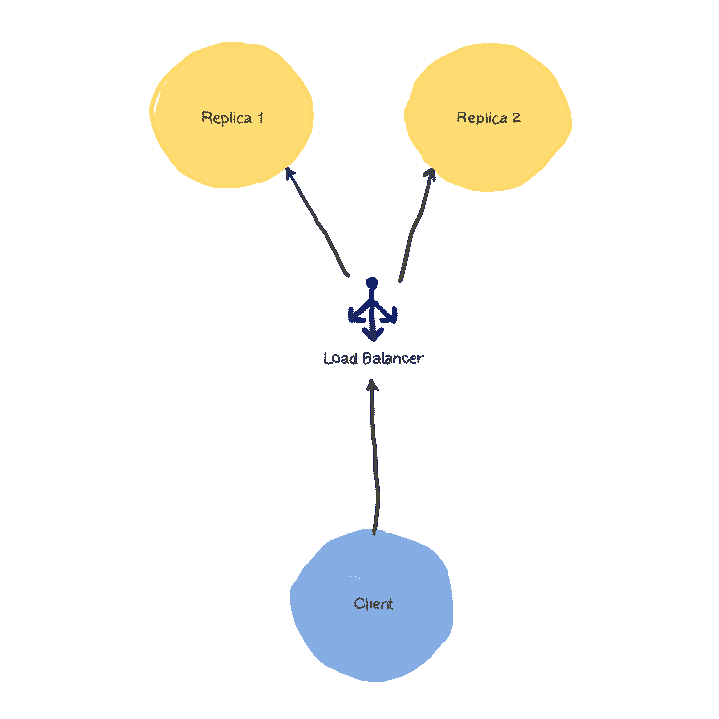
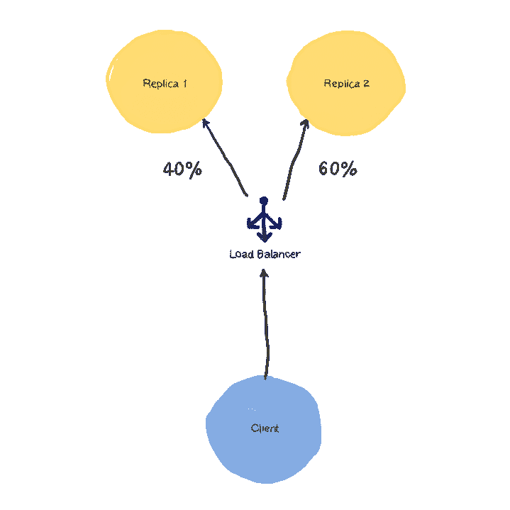
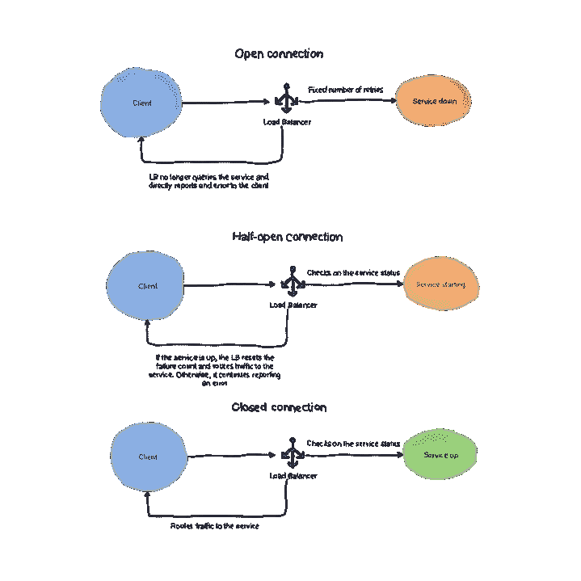
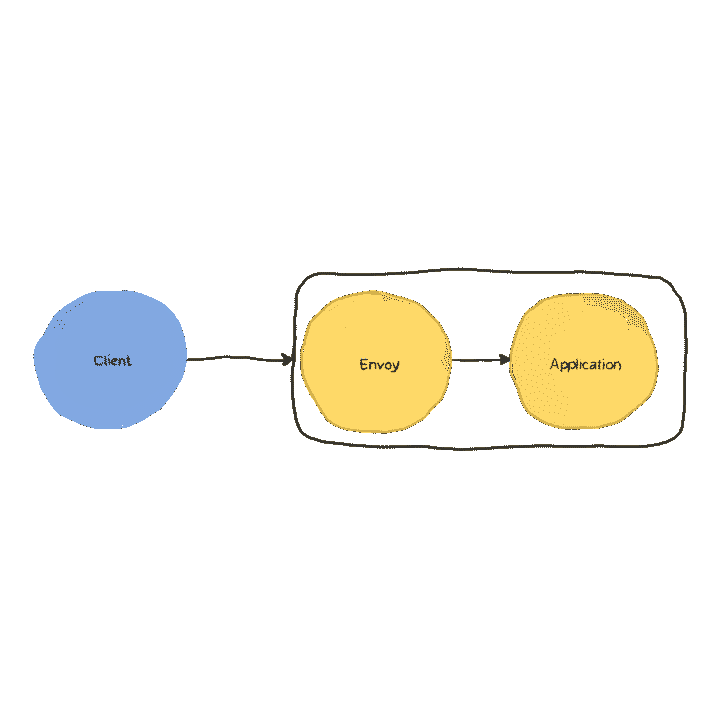

# 什么是服务网格？

> 原文：<https://levelup.gitconnected.com/what-is-a-service-mesh-ee7d6291478b>

*本文最初发表于 https://www.magalix.com/blog/what-is-a-service-mesh*

为了理解一种工具或技术是如何或为什么出现的，你可以从它试图解决的问题的起源开始，看看如果没有这种新技术，世界会是什么样子。微服务已经存在了一段时间——这是一种旨在将大型单片应用程序分解为通过 HTTP 协议相互通信的小单元的架构。它也是为解决可伸缩性和可用性问题而创建的模型。

微服务应用程序比单片应用程序更具可伸缩性，因为您可以轻松地选择负载较重的服务，并创建它们的更多副本，而不是创建整个庞大系统的副本。类似地，通过相同的机制，微服务应用程序更容易获得，因为我们可以拥有同一服务的多个副本。像 Kubernetes 这样的容器化和容器编排系统使得微服务更加健壮。容器是非常轻量级的，启动只需要几毫秒。使用像 Kubernetes 这样的系统，容器也可以很容易地从一个节点(机器)移动到另一个节点(机器)。这本身就很棒，然而，随着越来越多的环境采用微服务，新的挑战也出现了。让我们来看看。

# 微服务挑战

**负载平衡的需求:**因为将有多个副本负责同一服务，所以必须有一个负载平衡器来接收来自客户端的初始请求，并将其路由到一个健康的*后端服务。*

**对智能负载平衡的需求:**在现代微服务和期望服务在几分之一秒内响应的客户端世界中，[循环负载平衡](https://www.nginx.com/resources/glossary/round-robin-load-balancing/)已经不够了。负载平衡器应该足够智能，以便向高延迟的服务发送较少的流量。在极端情况下，它应该停止路由到过载的服务，这样它就不会在负载增加的情况下崩溃。此外，智能负载平衡可用于高级路由场景，如[金丝雀测试](https://whatis.techtarget.com/definition/canary-canary-testing)，其中流量应根据特定条件(如自定义 HTTP 报头)路由至特定后端。

**断路模式:**假设我们有一个应用需要用户登录。前端页面由 webserver 服务显示。一旦用户输入他们的凭据，web 服务器就会联系身份验证 API(位于另一个服务上)来验证这些凭据，并将用户路由到仪表板，或者显示“拒绝访问”消息。

现在，如果身份验证服务负担过重，并且在处理请求时遇到一些困难，该怎么办呢？该请求将通过网络传输，并等待身份验证 API 做出响应。由于后者不能正常工作，请求将一直等到 I/O 超时，然后抛出服务不可用的错误。在服务恢复之前，每个身份验证请求都会发生这种情况。然而，至少可以说，无所事事地等待请求超时提供了糟糕的用户体验。断路模式旨在通过将连接分为三种状态来消除故障报告延迟:

*   **关闭:**连接正常。在我们的示例中，身份验证 API 返回了一个有效的响应。
*   **打开:**请求失败多次。在我们的示例中，如果设置的数量是 3，那么在 3 次请求失败后，服务将不再尝试与身份验证服务通信。相反，它会立即报告后端服务没有响应，或者有问题。
*   **半开:**在指定的持续时间之后，服务重新检查目标。如果仍然不可达(或不按预期工作)，连接状态保持*打开*。否则，故障计数被重置，连接返回到*关闭*状态。

**HTTPS 通信要求:**尽管在内部隔离网络中运行，微服务应始终使用 HTTPS 进行内部通信。然而，HTTPS 带来了自己的运营负担。容器中的应用程序需要实现证书、终止 TLS 流量等等。

**安全策略要到位:**微服务在内部网络中与外部互联网隔离，并不意味着它们不能被攻破。如果入侵者能够侵入应用程序的薄弱部分，比如说一个与数据库没有通信业务的服务，他们不应该能够通过损害这个服务来连接到数据库。

这些只是现代微服务架构今天面临的众多挑战的一部分，服务网格是一种旨在解决这些问题的技术。

# 但我认为 Kubernetes 服务已经做到了这一点？

第一次研究服务网格时，脑海中最常见的问题之一是:我已经知道 Kubernetes，它有处理这些需求的组件，如[服务](https://kubernetes.io/docs/concepts/services-networking/service/)、[活性探测器](https://kubernetes.io/docs/tasks/configure-pod-container/configure-liveness-readiness-startup-probes/)和[就绪探测器](https://kubernetes.io/docs/tasks/configure-pod-container/configure-liveness-readiness-startup-probes/)。那是部分正确的。Kubernetes 通过其服务组件提供了自己的基本服务网络。服务提供循环负载平衡和服务发现。然而，它只能让你走这么远。服务无法实现智能负载平衡、回退逻辑(在满足特定条件时停止向后端 pod 发送流量)以及服务网格提供的其他高级功能。事实上，服务网格被认为是容器编排系统的扩展。把它想象成类固醇上的 Kubernetes。

# 服务网格部署模式

部署服务网格框架时，通常有两种选择:

*   **每台主机:**工具在主机上的部署位置。如果我们使用 Kubernetes，它可以通过 Daemonset 部署。这种方法的优点是，您可以通过部署更少的代理来节省资源。然而，缺点是其中一个代理的故障会影响在该节点上运行的所有容器。
*   **每个集装箱:**其中代理被部署为每个集装箱的边车。pod 定义包含应用程序容器和代理容器(sidecar)——这样，sidecar 容器与应用程序紧密耦合。它们可以通过环回接口相互通信。

# 实践示例:使用 Envoy 实现 Sidecar 代理

在本实验中，我们将演示服务网格技术提供的功能之一，即流量控制。在这个实验中，我们将使用一个用 Go 编写的非常简单的 API。API 期望 POST 请求的主体中包含用户的生日。它会回应“你好，用户名。如果当前日期与用户的生日匹配，则为“生日快乐”，或者只是“你好，用户名”。让我们来试驾一下:

> **docker run-d-p 8080:8080 magalixcorp/birthday greeter**

现在，让我们发送一个 POST 请求:

> **$ curl-XPOST—data ' { " dateOfBirth ":" 2020–01–25 " } ' localhost:8080/Hello/abohmeed
> { " message ":"你好，abohmeed！生日快乐" }**

既然它似乎正在工作，那么让我们将它部署到一个正在运行的 Kubernetes 集群:

> **apiVersion: apps/v1
> 种类:部署
> 元数据:
> 名称:bdgreeter
> 标签:
> app: bdgreeter
> 规格:
> 副本:1
> 选择器:
> matchLabels:
> app:BD greeter
> 模板:
> 元数据:
> 标签:
> app: bdgreeter
> 规格:
> 容器:
> —名称:app**

该定义包含一个部署和一个 NodePort 类型的服务，用于将外部请求路由到 Pod。让我们针对集群重新运行请求:

> **$ curl-XPOST—data ' { " dateOfBirth ":" 2020–01–25 " } ' 35.188.81.116:32000/hello/abohmeed
> { " message ":"你好，阿布米德！生日快乐" }**

这里，35.188.81.116 是我们的一个 Kubernetes 节点的外部 IP 地址。

现在，让我们修改部署以包括一个运行 Envoy 的 sidecar 容器。

# 特使是什么？

根据文档，Envoy 代理可以定义为“为大型现代面向服务架构设计的 L7 代理和通信总线。”该项目的主要目标是明确区分应用程序和它所运行的网络。当问题发生时，根本原因应该很简单。用 C++编写的 Envoy 利用了本地语言的速度和可靠性。它工作在 HTTP 第 7 层，执行通常委托给 Nginx 等 web 服务器的任务，即路由、速率限制等。它还在较低的 L3 和 L4 层运行，在那里可以对 IP 地址和端口做出明智的决定。Envoy 还提供了应用程序的统计可见性和报告。它非常受欢迎，现在每当需要实现应用程序 sidecar 时，它都是首选的解决方案。让我们看看特使是如何工作的。其核心包括以下组件:

*   **TCP 监听器:**这是 Envoy 接受流量的地方。一个特使实例可以有多个侦听器。它只接受 TCP 流量。
*   **滤镜:**这是系统的肉和土豆。Envoy 收到的消息可能会通过一个或多个过滤器，经历多次操作，直到最终被路由到应用程序。每个听众可以有自己的一套过滤器，形成一个*过滤器链*。Envoy 提供了许多可以在其配置中使用的本机过滤器。例如:
*   侦听器过滤器:在建立通信的早期阶段调用。例如， [HTTP inspector 过滤器](https://www.envoyproxy.io/docs/envoy/latest/api-v2/config/filter/listener/http_inspector/v2/http_inspector.proto)用于检测连接中使用的协议是否是 HTTP。另一个例子是 [TLS 检查过滤器](https://www.envoyproxy.io/docs/envoy/latest/configuration/listeners/listener_filters/tls_inspector#config-listener-filters-tls-inspector)，它检测连接是使用 TLS 还是纯文本。如果使用 TLS，它会提取重要信息，如[服务器名称指示](https://en.wikipedia.org/wiki/Server_Name_Indication)。
*   网络过滤器:一旦连接建立，这些过滤器就应用于 TCP 消息。他们可以执行一些与应用程序相关的任务，如速率限制、身份验证和授权。还有一些特定于应用程序的过滤器，如 Mongo Proxy、MySQL proxy 和 Kafka proxy，它们提供了特定于这些系统的特性。
*   HTTP 过滤器:它们有各种各样的工具来处理 HTTP 消息。例如，CSRF 保护，gRPC 到 JSON 的转换，健康检查，gzip 压缩等等。
*   **集群:**集群代表 Envoy 连接到的一个或多个上游服务。这些服务可以直接添加到配置文件中。它们也可以由 Envoy 通过服务发现机制自动检测到。

理论到此为止，让我们看看特使的行动。

# 在本地部署特使

Envoy 有不同的风格:它可以作为二进制文件在本地机器上编译和运行，也可以直接通过 Docker 容器运行。因为我们的最终目标是将它作为边车部署在 Kubernetes 上，所以我们将采用第二种方法。为了演示它是如何工作的，我们将在本地机器上部署 Envoy 容器。新建一个名为 envoy.yaml 的文件(名字无所谓)，粘贴以下内容:

> **static _ resources:
> listeners:
> —address:
> socket _ address:
> address:0 . 0 . 0 . 0
> port _ value:80
> filter _ chains:
> —filters:
> —name:envoy . http _ connection _ manager
> typed _ config:
> “@ type”:type . Google APIs . com/envoy . config . filter . network . http _ connection _ manager . v2 . httpconnection manager
> codec _ codec
> 集群:
> —名称:local _ service
> connect _ time out:0.25s
> 类型:strict _ DNS
> lb _ policy:round _ robin
> load _ assignment:
> 集群名称:local_service
> 端点:
> — lb_endpoints:
> —端点:
> 地址:
> socket_address:
> 地址:172 . 17 . 0 . 1
> port _ 端口**

既然我们已经有了 Envoy 配置，我们可以使用以下命令启动容器:

> **$ docker run-d-v $(pwd)/envoy . YAML:/envoy-config/envoy . YAML-p 80:80-p 8081:8081 envoy proxy/envoy-alpine-c/envoy-config/envoy . YAML**

请注意，我们为流量公开了端口 80，为管理仪表板公开了端口 8081。让我们尝试建立 HTTP 请求，以确认一切按预期运行:

> **$ curl-XPOST—data ' { " dateOfBirth ":" 2020–01–25 " } ' localhost/Hello/abohmeed
> { " message ":"你好，abohmeed！生日快乐" }**

好了，这证明系统工作正常。现在，让我们看看当应用程序关闭时会发生什么:

> **$ docker 容器 ls
> 容器 ID 镜像命令创建状态端口名称
> dc5f 22 befa 84 magalixcorp/birthday greeter "。/app" 25 分钟前 Up 25 分钟 0 . 0 . 0:3000->3000/TCP recursing _ sino ussi
> 35559394 d244 envoy proxy/envoy-alpine "/docker-entry point…"46 分钟前涨 46 分钟 0.0.0:80- > 80/tcp，0.0.0:8081- > 8081/tcp，10000/TCP laughing _ wes coff
> $ docker RM-f DC 5f 22 befa 84
> DC 5f 22 befa 84
> $ curl-XPOST—data ' { " dateOfBirth ":" 2020–01–201 复位原因:连接失败**

正如您所看到的，一旦应用程序关闭，Envoy 就会报告一个重要的错误消息，即上游服务在响应请求时遇到了问题。客户端不必等到连接超时，消息会立即显示。

在将 sidecar 部署到我们的 Kubernetes 集群之前，让我们花点时间看看配置文件。

*   listeners 部分包含 Envoy 监听传入连接的地址(第 5 行)。
*   过滤器部分在第 7 层运行，它使用 HTTP 过滤器。注意，由于它运行在第 7 层，它可以检测请求的 URL。这里，我们将任何以“/hello”为目标的请求定向到一个名为“local_service”的服务(第 17–24 行)。
*   为了定义“local_service ”,我们使用集群部分(从第 29 行开始)。我们可以在集群中添加多个上游服务，并选择负载平衡机制。在我们的例子中，它是 round_robin(第 34 行)。
*   集群需要知道上游服务在网络上的位置。由于我们通过 Docker 在本地机器上运行这个实验，所以我们不能声明 127.0.0.1，因为它被转换为容器上的环回接口。相反，我们需要编写网桥接口 172.17.0.1，这是容器用来访问主机环回接口的网关。
*   管理部分(从第 42 行开始)定义了管理界面设置。除了统计数据，管理界面还提供了许多有用的工具。可以通过端口 8081 访问它。在我们的实验室中，这将是 http://127.0.0.1:8081。

我们实验室的最后一部分是将上述设置应用到一个真实的 Kubernetes 集群。我们首先要做一些改变:

*   创建一个配置图来保存特使配置。这可以通过几种方式来实现，我们选择了声明方式，这样我们可以将资源置于版本控制之下。创建一个 YAML 文件，并添加以下内容:

> **API version:v1
> kind:config map
> metadata:
> name:envoyconfig
> namespace:default
> data:
> envoy . YAML:|-
> static _ resources:
> listeners:
> —address:
> socket _ address:
> address:0 . 0 . 0 . 0
> port _ value:80
> filter _ chains:
> —filters:
> —name:envoy . http cluster:local _ service
> http _ filters:
> —name:envoy . router
> typed _ config:{ }
> clusters:
> —name:local _ service
> connect _ time out:0.25s
> type:strict _ DNS
> lb _ policy:round _ robin
> load _ assignment:
> cluster _ name:local _ service
> endpoints:
> —lb _ endpoints:
> —endpoints:【T46**

*   我们对 Envoy 配置所做的唯一更改是将上游服务的 socket_address 切换到 127.0.0.1，而不是 Docker 桥地址。原因是因为特使现在是作为一个边车集装箱；它可以访问本地主机上的应用程序容器。
*   我们需要做的第三个更改是在部署文件中；我们需要把边车集装箱加到豆荚里。此外，我们需要配置我们的服务，以连接到 sidecar 容器作为其后端，而不是应用程序容器。最后，我们将第二条路由添加到端口 8081 上的管理接口。我们的部署文件应该如下所示:

> **apiVersion: apps/v1
> 种类:部署
> 元数据:
> 名称:bdgreeter
> 标签:
> app: bdgreeter
> 规格:
> 副本:1
> 选择器:
> matchLabels:
> app:BD greeter
> 模板:
> 元数据:
> 标签:
> app: bdgreeter
> 规格:
> 容器:
> —名称:app
> 名称:envoyconfig
> —
> API version:v1
> 种类:服务
> 元数据:
> 名称:bdgreeter-svc
> 规格:
> 选择器:
> app: bdgreeter
> 端口:
> 名称:http
> 端口:80
> 目标端口:80
> 协议:TCP
> 名称:admin
> 端口:8081**

现在，我们需要将这两个文件应用到我们的集群:

> **$ kube CTL apply-f config map . yml
> $ kube CTL apply-f bdaygreeter . YAML**

这次我们使用负载平衡器作为服务类型，让我们获取外部 IP:

> **$ kubectl get SVC
> NAME TYPE CLUSTER-IP EXTERNAL-IP PORT AGE
> BD greeter-SVC load balancer 10 . 0 . 26 . 74 20.185.12.166 80:30652/TCP，8081:30957/TCP 24m
> kubernetes CLUSTER IP 10 . 0 . 0 . 1<none>443/TCP 86m**

现在，让我们测试我们的工作:

> **$ curl-XPOST—data ' { " dateOfBirth ":" 2020–01–26 " } ' 20.185.12.166/hello/abohmeed
> { " message ":"你好，阿布米德！生日快乐" }**

您也可以在[http://20.185.12.166:8081/](http://20.185.12.166:8081/)查看管理仪表板

# TL；速度三角形定位法(dead reckoning)

服务网格是当今一些最新、最热门的技术话题。在本文中，我们讨论了什么是服务网格的概述，以及它们通常是如何使用的。我们还有一个实际动手实验室，在那里我们使用了非常流行的 sidecar 软件:Envoy。通过实验室，我们将 Envoy 作为独立容器部署在本地环境中，并将 sidecar 容器部署到 Kubernetes Pod 部署中。特使是用 C++写的，所以它非常快，并提供了无数的功能。在其核心部分，Envoy 使用过滤器在 TCP 消息到达时对其应用各种操作，并且它能够使用多种负载平衡协议将流量分配给多个上游服务。

我们推出了“为云原生而写”计划，与快速增长的云原生社区分享您的经验和知识。我们每天都有成千上万的读者。我们还为每篇发表的文章提供一笔奖金。

*原载于 2020 年 3 月 10 日 https://www.magalix.com***。**