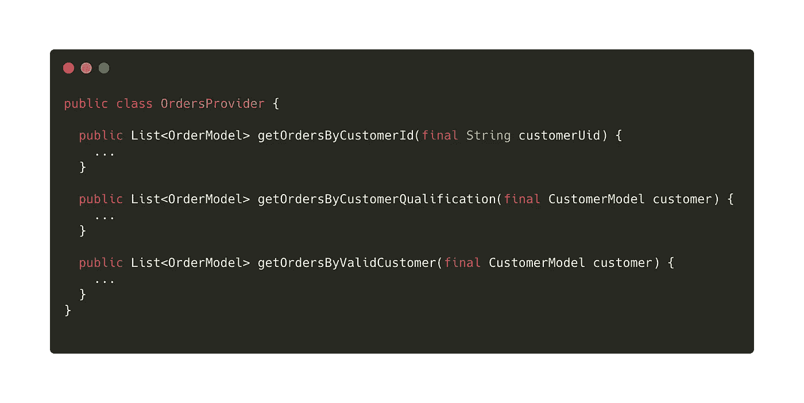
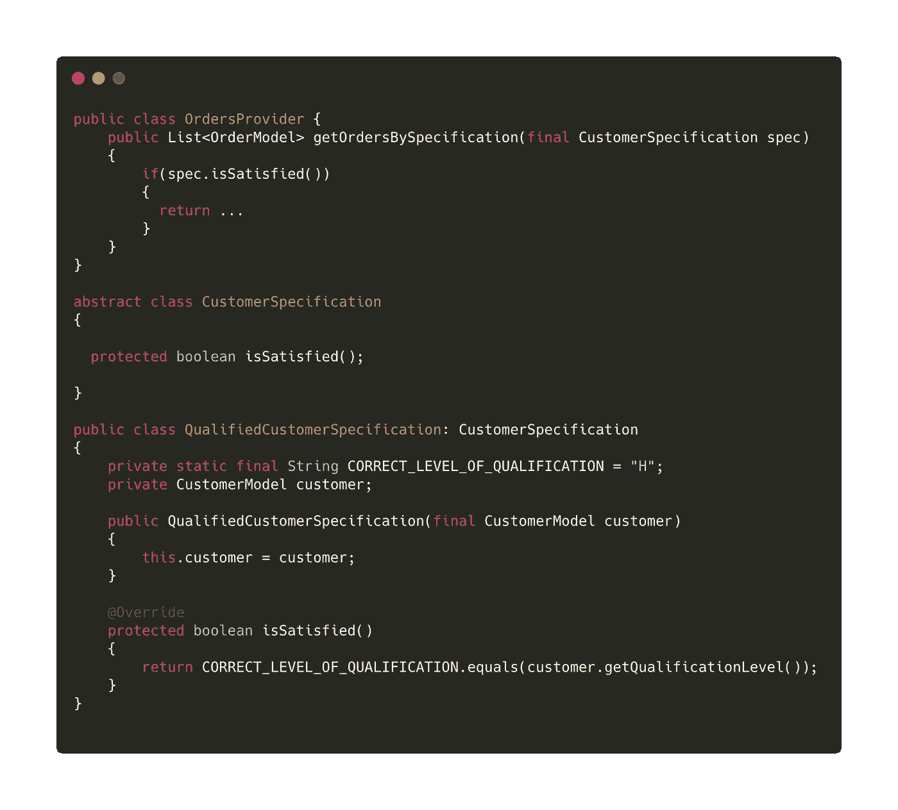
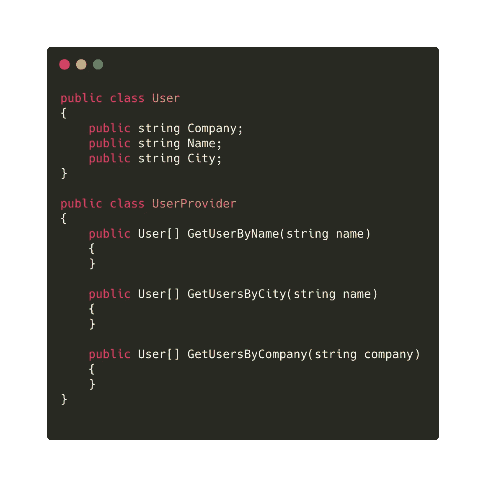
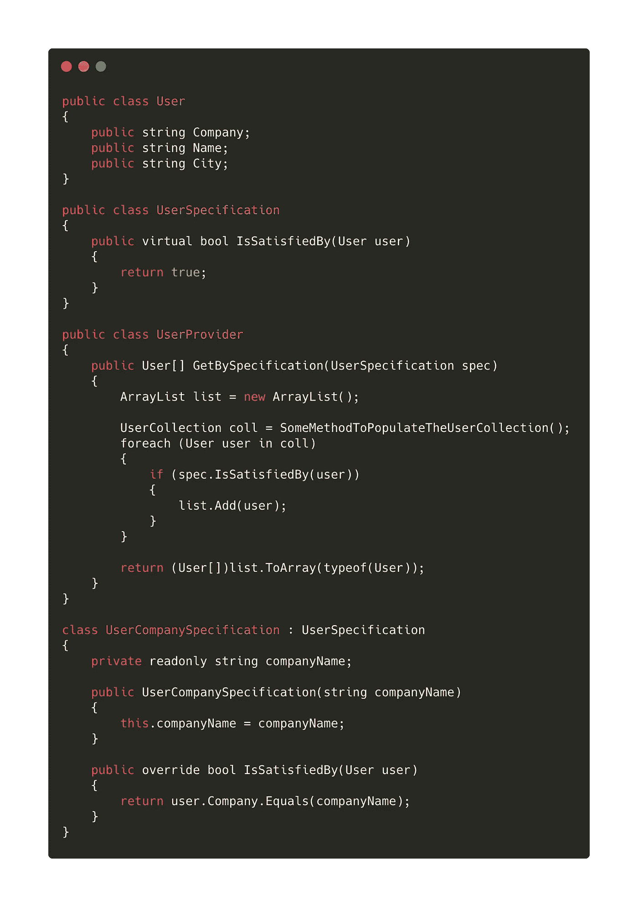
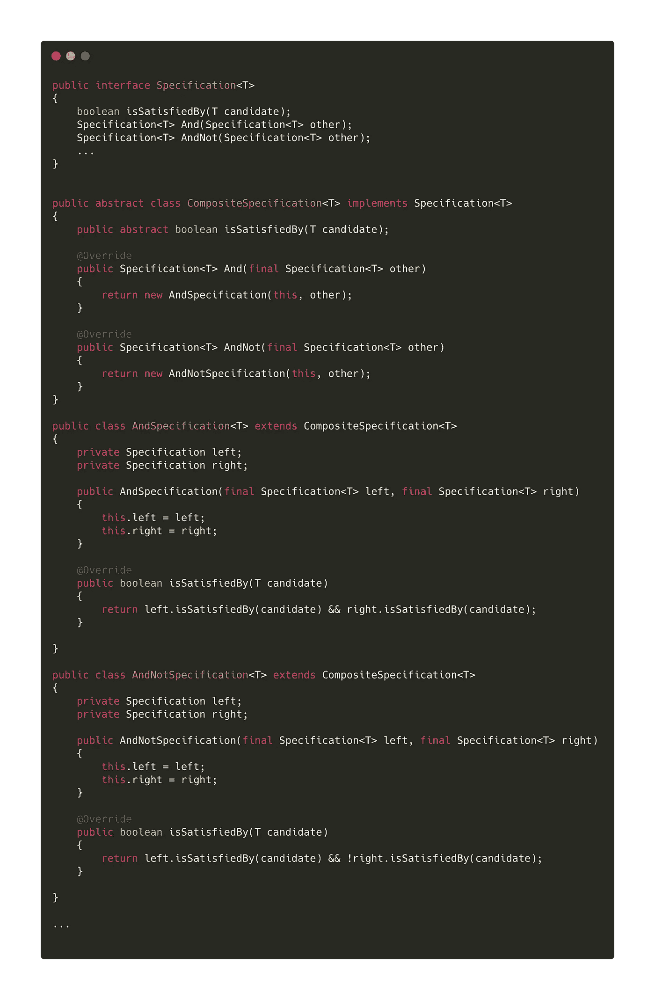
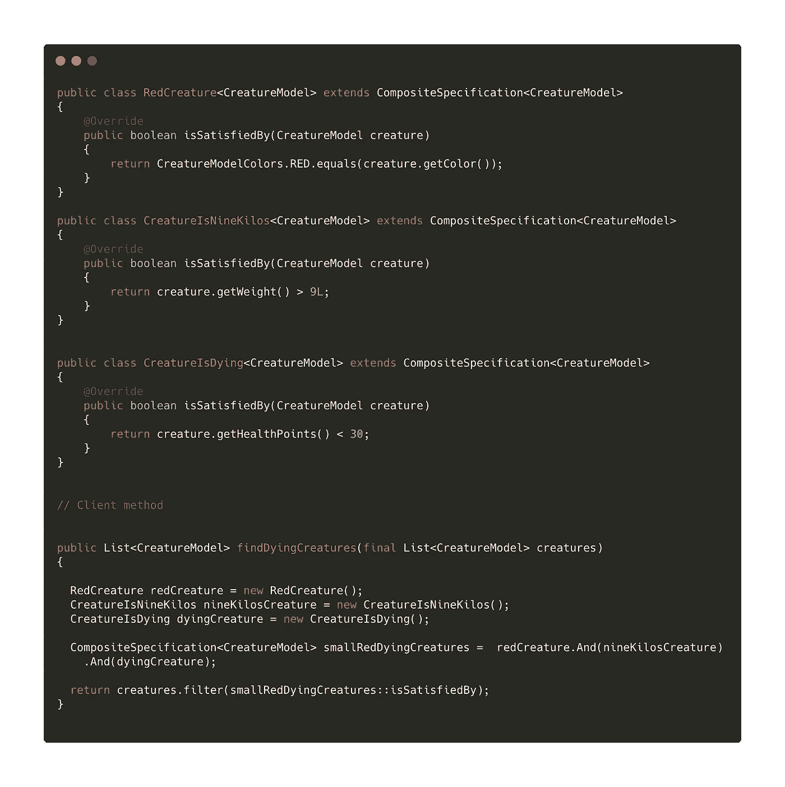

# 什么是规格模式

> 原文：<https://levelup.gitconnected.com/what-is-a-specification-pattern-460b32bfbf7b>

## 用规格模式解开代码

谢尔盖·佐尔金在 [Unsplash](https://unsplash.com?utm_source=medium&utm_medium=referral) 上拍摄的照片

您需要选择、验证或向您的域添加约束。规范模式以一种清晰的面向对象的方式完成了前面提到的工作。

我们来详细说说。接下来，Java 中的规范模式。

# 问题

> 选择:您需要根据某些标准选择对象的子集，并在不同的时间刷新选择
> 
> 验证:您需要检查只有合适的对象被用于特定的目的
> 
> 按单生产:你需要描述一个对象可能会做什么，而不需要解释这个对象如何做的细节，但是要以这样一种方式，一个候选对象可能会被制造出来以满足需求——[埃里克·艾文斯](https://www.martinfowler.com/apsupp/spec.pdf)

# 规格版本

## 硬编码规范

被污染的代码—作者编写的代码

你已经看过这段代码了。您需要根据参数选择数据。这是你在大多数代码库中看到的。调试是痛苦的，测试是困难的，重复的代码是非常多的。

> 你能在这里改进什么？

这个班知道的比它应该知道的多。你应该始终遵循最小惊讶原则。你可以看到，验证规则污染了代码，所以你需要提取它们。

您可以使用规范模式提取它们。让我们来看看规范的方法来分离前面的代码。

规范模式代码—作者代码

显示文档([第 2 页。](https://www.martinfowler.com/apsupp/spec.pdf))上的规格图样。这就是*“硬编码规范”*。

## 参数化规格

我们也可以将参数放入我们的规范中。这些规格是*“参数化规格”*。

[参数化规范—污染代码— Matt Berther](https://matt.berther.io/2005/03/25/the-specification-pattern-a-primer/)

你现在也有类似的情况。这一次我们需要检查动态条件。然后我们也传入用户。客户端代码需要传入用户，选择规则在规范中。

[参数化规范—干净代码— Matt Berther](https://matt.berther.io/2005/03/25/the-specification-pattern-a-primer/)

## 复合规格

复合规范在一系列规范中非常有用。客户端代码可以链接规范，并基于布尔条件进行评估。

作者的 Java 复合规范模式

假设我们需要根据几个条件来选择数据。我们可以用它来链接条件，包装成规范。

举个例子，我们使用游戏中的物体。我们有生物，我们需要根据三个要求来选择它们:

*   寻找红色生物
*   寻找体重超过 9 公斤的生物
*   寻找生命值低的生物——低于 30 点

Java 中的复合规范模式——作者实现

从代码中可以看出，`findDyingCreatures`方法没有污染。人们可以使用这种方法来提取所有的验证逻辑。

添加新的规范，但不要修改现有的代码。我们保留了[开闭原则](https://stackify.com/solid-design-open-closed-principle/)，获得了更清晰的代码，并且测试起来更加容易。

## 今天就加入 Medium！

这篇文章是中等冰山的[一角。](https://zivce.medium.com/membership)[订阅 Medium](https://zivce.medium.com/membership) 提高你的生产力，成为更好的开发者，获得实用的小技巧。

*免责声明:5$中的 2$将直接支持我和我的文章。*

# 结论

我希望你在开发这个模式的过程中获得了乐趣。到目前为止，我还没有使用过这种模式，但是我将使用这个文档作为参考。如果你喜欢，你也可以把它作为参考。

任何项目都有这个问题。条件和逻辑交织在一起。每次更改条件，都会破坏测试或特性。

该规范有几个好处。您可以添加新的规格。让现有代码像以前一样工作。以简洁的 OOP 方式满足业务需求。

# 资源:

[埃里克·埃文斯—规格](https://www.martinfowler.com/apsupp/spec.pdf)

Matt Berther 的 S [规格模式](https://matt.berther.io/2005/03/25/the-specification-pattern-a-primer/)

 [## 规格模式

### 在计算机编程中，规范模式是一种特殊的软件设计模式，业务规则可以通过它来设计软件

en.wikipedia.org](https://en.wikipedia.org/wiki/Specification_pattern) 

[堆叠交换相关问题](https://softwareengineering.stackexchange.com/questions/148849/style-for-control-flow-with-validation-checks)