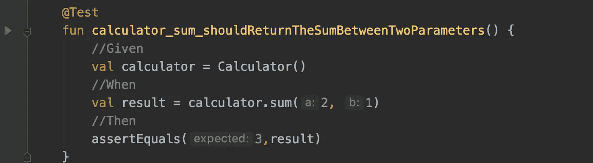

# 什么是单元测试

> 原文：<https://levelup.gitconnected.com/what-is-a-unit-test-9fc191028be1>

汉斯·雷尼尔斯在 [Unsplash](https://unsplash.com/@gvetri/likes?utm_source=unsplash&utm_medium=referral&utm_content=creditCopyText) 拍摄的照片

你可能在工作邀请中见过——“测试和 TDD 经验”如果你像我一样，你可能对考试一无所知。您听说过它们，并且知道优秀的开发人员正在使用它，但是它们是什么呢？它们是如何工作的？

# 🤔让我们从测试开始

当一个 QA 来问我是否对我的代码应该做什么有信心时，我总是回答没有，因为我知道我可能会搞砸。并不是因为不相信自己的编码技术。因为我是人，我们都会犯错。这就是我开始学习测试的原因，因为一个优秀的测试套件可以帮助你发现你将要引入的错误。

一次测试决定了一些事情；在我们的例子中，我们想知道我们的代码是否如我们计划的那样工作。用我含糊的话来说，测试是您编写的代码，用来验证“生产”代码正在做应该做的事情，并且出错的概率较低。

# 👩‍💼👨‍💼单位

> 被认为是单一和完整的个体事物或个人，但也可以构成一个更大或更复杂整体的个体成分。——摘自[词典](https://www.lexico.com/en/definition/unit)。

在我们的例子中，一个单元可以是一个类或一个函数，它们可以组合起来创建一个应用程序。我们可以测试我们的单元，以确保每个单元都做了它应该做的事情，如果我们这样做了，我们就是在做单元测试。

# 👩‍💼👨‍💼测试设备

假设我们正在构建一个闪亮的、前所未有的、独一无二的名为计算器的应用程序。在这个 app 里，我们有一个函数叫做`sum()`，它把两个数相加。在科特林，会的。

然后我们开始制作我们的 UI，因为 UI 太棒了，我喜欢制作 UI，当我们运行应用程序并开始测试时，我们很惊讶，因为 sum 不起作用。为什么这不起作用？参数为`a`和`b`。相信我，这是常有的事。

如果你的构建需要一段时间才能完成，那就有问题了。您可能知道完整的编译时间会影响您的工作效率。我希望你不要像我一样容易分心，忘记我在做什么。单元测试可以帮助我们解决这两个问题，因为测试验证了代码正在做它应该做的事情。单元测试比编译应用程序和手动测试要快，所以让我们创建我们的第一个测试。

几乎每种语言都有自己的单元测试框架。你可以在这里查看你的语言单元测试框架[。在本例中，我使用的是 Kotlin，所以我们将使用 JUnit。](https://en.wikipedia.org/wiki/List_of_unit_testing_framework)

单元测试如下所示，默认情况下，它位于您的测试文件夹中。

分析这些测试的解剖，我们可以观察到接下来的事情:

*   表示这是一个测试的`@Test`注释。
*   表示[Unit _ WhatWeAreTesting _ expected behavior]的函数的名称。
*   测试的正文。

测试应该遵循 Arrange-Act-Assert 或 Given-When-Then 模式。我喜欢 given，when，then 模式，因为它让我想起了用户故事。当你很容易分心的时候，这对你很有帮助！先说那个格局！

*   给定:在这一部分，我们将需要的对象被创建。
*   When:在这里，我们调用方法进行测试。
*   然后:最后，在最后一部分，我们做断言。

我用的是 Intellij Idea，所以那个测试旁边有一个 play 按钮。我们点击它，会有一条消息表明测试失败。

我们的测试失败了，因为我们的函数返回了第一个参数🤦‍♂.现在我们可以改变我们的函数如下，它会通过！

太神奇了。我必须承认，现在绿色已经成为我最喜欢的颜色之一，因为它是测试通过时显示的颜色！

**Kotlin 注意**:在 Kotlin 中，我们可以使用反勾来包装测试的名称，这样更容易阅读！

# 🔺测试的金字塔

我们已经看到了什么是单元测试，但是还有更多类型:

*   单元测试，正如我们在此之前提到的测试只有主题。
*   集成测试验证两个或更多的单元是否像它们应该的那样一起工作。
*   端到端测试验证了所有单元都按照应有的方式协同工作。Android 情况下的端到端测试包括 UI 测试。

由于我们有三种类型的测试，我们需要合理地划分它们。所有的集成测试都不能是端到端的测试。幸运的是，有一张图片很好地解释了我们应该如何分配我们的测试，它被称为测试金字塔。

测试金字塔是由 Mike Cohn 在他的书《敏捷成功》中创建的。他指出，单元测试应该是基础，然后是集成测试，最后是端到端测试。

# 🤓测试的更多好处

当您拥有一个测试套件时，它就像一个后备网络，可以帮助您在创建新功能或重构代码时避免引入新的错误。此外，您的测试可以帮助您之后的未来开发人员更好地理解一个特性在做什么，因为测试是最好的文档。

暂时就这样吧！我希望你喜欢这篇文章。如果你喜欢它，别忘了与你的朋友和同事分享，这样他们就能更多地了解测试。

# 取得联系

与我在以下位置聊天:

🐦 [**推特**](http://www.twitter.com/coding__pizza)

📘[T5【脸书】T6](http://www.facebook.com/codingpizza)

📷 [**Instagram**](http://www.instagram.com/codingpizza)

*原载于 2020 年 1 月 21 日 https://www.codingpizza.com***。**