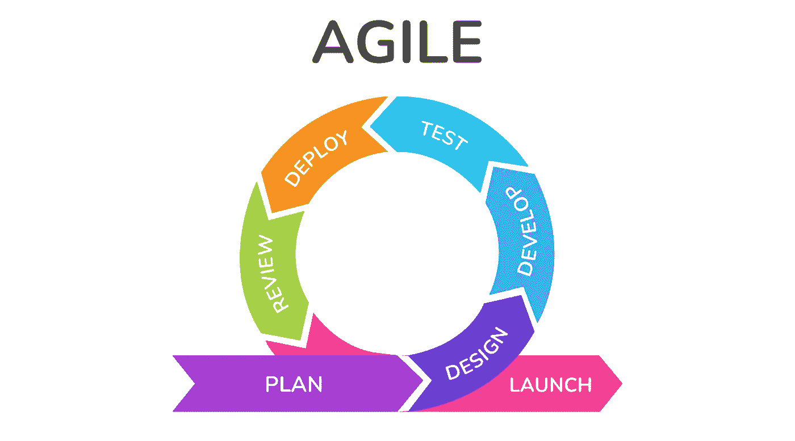
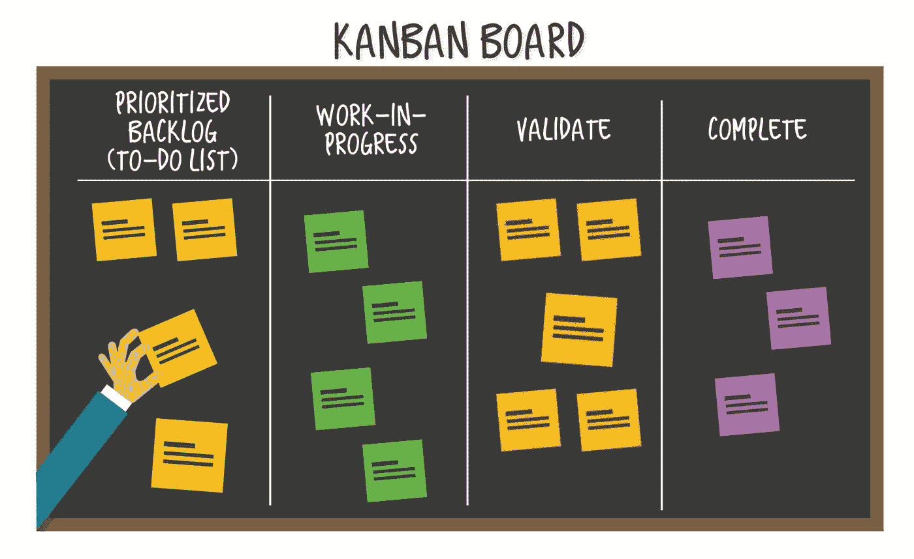

# 什么是敏捷，它对团队有什么好处

> 原文：<https://levelup.gitconnected.com/what-is-agile-and-how-does-it-benefit-teams-311204a5fe9>

# 介绍

敏捷是一套原则和价值观，在团队处理工作的方式中优先考虑灵活性、协作和适应性。这一切都是为了通过拥抱变化和持续改进来帮助团队更高效、更有效地工作。

但是你可能会想，这整个敏捷是从哪里来的呢？嗯，它植根于软件开发行业。在 21 世纪初，一群软件开发人员一起创建了敏捷宣言，概述了敏捷的核心价值和原则。从那以后，敏捷已经被广泛应用于软件开发以外的领域。

所以，这是敏捷是什么以及它来自哪里的一个快速概述。在这篇文章的剩余部分，我们将更深入地探究敏捷的细节，以及它如何让团队受益。留下来，我们将探索所有有趣的东西！

# 什么是敏捷？

既然我们对什么是敏捷有了一个基本的了解，让我们更深入地研究一下细节。敏捷就是拥抱变化，不断改进团队的工作方式。为了向客户提供高质量的产品和服务，它需要具有灵活性、响应性和适应性。

敏捷宣言是由一群软件开发人员在 21 世纪初创建的，概述了敏捷的核心价值和原则。这些包括以下内容:

*   过程和工具之上的个人和交互
*   综合文档之上的工作软件
*   合同谈判中的客户协作
*   响应变化而不是遵循计划

在实践中，团队可以通过使用各种敏捷框架，比如 Scrum 和看板，来采纳这些价值观和原则。

Scrum 是一个管理和完成复杂项目的框架。它包括被称为“冲刺”的短而频繁的工作周期，在这个周期中，团队一起工作以完成特定的目标。在每个冲刺阶段结束时，团队回顾他们的进展，并为下一个计划。

看板是一种在流程中可视化和管理工作的方法。它包括创建一个“看板”,上面的列代表不同的工作阶段，并使用卡片或贴纸来代表单独的任务。随着任务在流程中移动，它们会从一列移动到下一列。

这些只是一些常见敏捷框架的例子，团队可以用它们将敏捷原则付诸实践。还有许多其他的工具，每个都有自己独特的工具和技术。

所以，总结一下:敏捷是一套原则和价值观，在团队处理工作的方式中优先考虑灵活性、协作和适应性。团队可以通过使用各种敏捷框架来采用这些原则，比如 Scrum 和看板。

# 敏捷如何让团队受益？

到目前为止，我们已经讨论了什么是敏捷，以及它在实践中是如何工作的。但是团队为什么要首先考虑敏捷呢？采用敏捷方法的好处是什么？

嗯，敏捷对于团队来说有很多潜在的好处。以下是几个关键的例子:

*   增加灵活性和适应性:通过拥抱变化和持续改进，敏捷团队能够更好地响应变化的需求和客户需求。这在快节奏的行业或环境不断变化的情况下尤为重要。
*   更好的协作和沟通:敏捷强调团队成员之间，以及与客户和利益相关者之间的密切协作和沟通。这可以导致一个更有凝聚力和更有效的团队，能够更好地合作实现共同的目标。
*   增强的客户满意度:因为敏捷团队对客户需求的响应更快，交付高质量产品的速度更快，所以他们往往有更高的客户满意度。这对于依赖客户忠诚度和回头客的企业尤其有价值。
*   更快地交付高质量的产品:通过将工作分解成小的、可管理的块，并关注持续的改进，敏捷团队通常能够比使用传统方法的团队更快地交付高质量的产品。对于需要快速将产品推向市场的企业来说，这可能是一个巨大的竞争优势。

因此，正如你所看到的，团队采用敏捷方法有很多潜在的好处。它可以提高灵活性和适应性，改善协作和沟通，提高客户满意度，更快地交付高质量的产品。难怪近年来敏捷变得如此流行！

# 敏捷实践的例子

到目前为止，我们已经讨论了什么是敏捷，以及它如何给团队带来好处。但是，看看敏捷在实际中的一些真实例子会有助于更好地理解它在实践中是如何工作的。

团队成功实施敏捷的一个例子是大型技术公司的软件开发团队。这个团队正努力应对长交付周期、低生产率和高水平的客户不满意度。他们决定采用敏捷的方法，使用 Scrum 框架，结果令人印象深刻。

通过将工作分解为短时间、频繁的冲刺并专注于持续改进，团队能够显著提高他们的生产力，并向客户交付更高质量的产品。他们还看到了客户满意度的提高，因为团队能够更快、更有效地响应客户需求。

除了像这样的案例研究之外，看看敏捷概念在实践中的可视化例子也会有所帮助。例如，这里有一个简单的看板来说明工作如何在流程中流动:

如你所见，看板有代表不同工作阶段的栏(如“待办事项”、“进行中”、“已完成”)和代表单个任务的卡片。随着任务在流程中移动，它们会从一列移动到下一列。对于希望采用敏捷方法的团队来说，这种可视化的工作表示是一个有用的工具。

所以，这些只是敏捷如何在现实世界中付诸实施的几个例子。无论您是软件开发团队、营销团队，还是任何其他行业的团队，都可能有敏捷框架和技术可以帮助您更高效地工作。

# 结论

我们在这篇文章中已经讨论了很多内容，所以让我们花点时间来回顾一下要点:

*   敏捷是一套原则和价值观，在团队处理工作的方式中优先考虑灵活性、协作和适应性。
*   敏捷框架，比如 Scrum 和看板，可以帮助团队将这些原则付诸行动。
*   团队采用敏捷方法有许多潜在的好处，包括增加灵活性和适应性，更好的协作和交流，增强客户满意度，以及更快地交付高质量的产品。
*   有很多团队成功实施敏捷并从中获益的真实例子。

如果你现在还和我们在一起，很有可能你有兴趣了解更多关于敏捷的知识，以及它如何让你的团队受益。如果是这样的话，我们鼓励你试一试！适应新的工作方式可能需要一些时间，但潜在的好处是值得的。

有很多资源可以帮助团队开始使用敏捷，包括书籍、文章、在线课程等等。我们建议做一些研究，找到最适合你和你的团队的资源。

至此，我们将结束这篇关于敏捷的文章。我们希望它对你有所帮助，并且激发你尝试敏捷的兴趣。祝您在敏捷之旅中好运！

**不要错过我即将推出的内容和技术指南:**

 [## 每当 Nic Chong 发布时收到电子邮件。

### 每当 Nic Chong 发布时收到电子邮件。通过注册，您将创建一个中型帐户，如果您还没有…

medium.com](https://medium.com/@nicchong/subscribe) 

如果你有什么问题，我在这里帮忙，在评论区等你:)