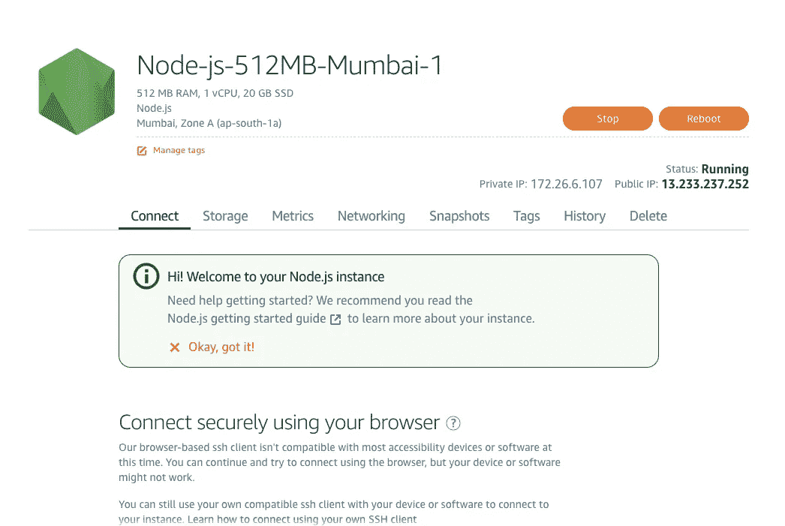

# 亚马逊 Lightsail 是什么？

> 原文：<https://levelup.gitconnected.com/what-is-amazon-lightsail-beaef47dd64e>

亚马逊 Lightsail 标志

如果您是 AWS 的新手，并希望为您的应用程序部署一些服务器，那么 AWS Lightsail 可能是您的最佳起点。

与 Amazon EC2 不同，它提供了一个很好的界面，您可以在其中选择预配置的计划，这些计划可能涵盖了您的大多数用例。

只需点击 3-4 次，你就可以启动一个运行在 Linux 服务器上的 WordPress 网站。

你也不必担心确定成本，因为成本是固定的每月。

除了服务器，您还可以在 Lightsail 上创建数据库、负载平衡器和存储。

现在让我们实际一点，用 Lightsail 快速推出一个节点服务器！

# 启动实例

1.  首先，登录你的 AWS 控制台，在**计算**下的**所有服务**选项卡中，你会找到 Lightsail。点击它，它将在一个新的选项卡中打开 Lightsail 仪表板。

Lightsail 创建实例页

2.现在，您可以选择要在其中创建实例(服务器)的区域。通常，实例离用户越近，延迟越低，连接越快。在这里，我选择了孟买地区，因为它离我的位置最近。

选择操作系统和应用

3.下一步是选择实例映像(操作系统和应用程序)。对于 Linux 平台，您可以只选择操作系统，可以从 Ubuntu、OpenSUSE、CentOS 或 Amazon Linux 中选择。

或者您可以选择一个应用程序和操作系统。当您选择一个应用程序时，AWS 会自动安装使用该应用程序所需的所有必需的包和文件，因此您不必自己安装它们。

对于 Windows Server，目前唯一可用的应用程序是 SQL server。

对于应用程序，我将在这里选择 Node.js，如果您喜欢，您可以选择任何其他内容。

Lightsail 实例定价

4.在上面的可选部分中，您可以添加一个启动脚本，这是一个 shell 脚本，将在实例第一次启动时运行。如果您过去部署过 EC2 实例，那么您可能会想起它与那里的**用户数据**很相似。

您可以使用这个脚本在实例上进行一些配置。

默认情况下，Lightsail 为您的 Linux 实例使用默认的 ssh 密钥对。您可以使用这个 ssh 密钥通过命令行使用 SSH 连接到您的实例。

现在，是选择实例计划的时候了。您可以看到不同的固定价格可用计划。如果你是第一次尝试，那么你可以免费使用价值 3.5 美元的第一个计划一个月。

命名并标记您的实例

5.如果愿意，您可以给实例一个唯一的名称。

您还可以为实例添加标签，以便轻松过滤或组织它们，用于计费和分析目的。

现在点击**创建实例**按钮来创建你的第一个 Lightsail 实例！

Lightsail 实例仪表板

在几分钟内，您的服务器将被部署，您将看到类似上面的内容。单击它以查看更多详细信息。

节点实例详细信息

您可以看到状态为正在运行，在其下方可以看到实例的公共 IP。如果你把它粘贴到浏览器的地址栏，它会显示一个类似的页面，如下所示。

使用实例的公共 IP 访问网站

现在，您可以 SSH 到您的实例并部署您的代码。

如果不再使用实例，不要忘记终止它。您可以通过上图中的 **Delete** 选项卡来终止实例。

如果你想学习如何 SSH 到你的实例并上传你的代码，你可以看看下面这篇文章 [**在亚马逊 EC2**](https://hackernoon.com/deploying-a-node-app-on-amazon-ec2-d2fb9a6757eb) **上部署一个节点应用。**

如有疑问，请在下方评论。

感谢阅读这篇文章。如果你喜欢它，请给它一些掌声，让更多的人喜欢它！