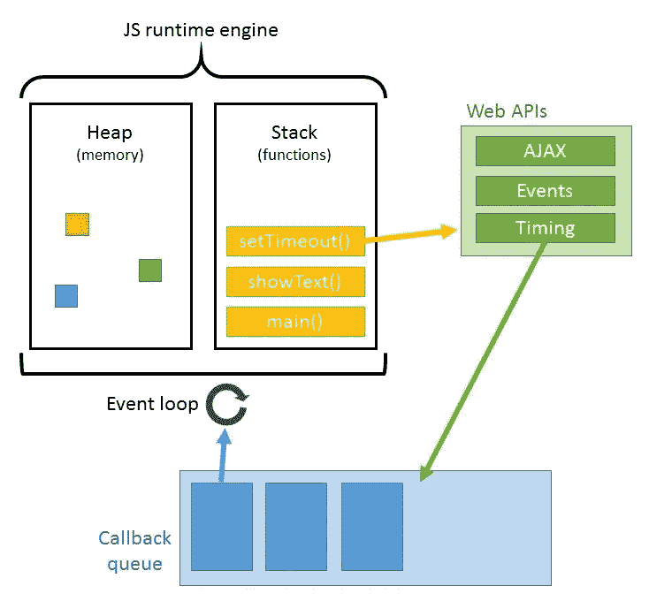
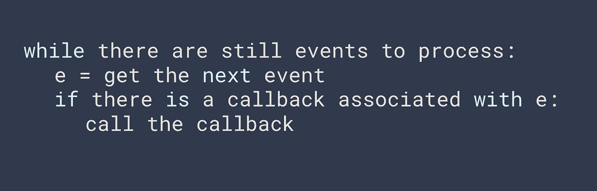

# JavaScript 中的事件循环是什么

> 原文：<https://levelup.gitconnected.com/what-is-an-event-loop-69e1581ecdcc>

Javascript 是一种单线程语言。被各种引擎解读，最著名的是 Chrome 和 Node 用的 V8。

然而，引擎实际上只做了几件事。它逐行运行代码，并将函数添加到调用堆栈中。

那么如果你发送一个这样的递归函数会发生什么呢？

引擎会将每个调用添加到堆栈中，直到堆栈过载。您可能见过一两次“最大调用堆栈超出错误”，对吗？

非常明确地说，事件循环不会修复您的错误递归。

但是，如果你想在一个 app 上使用一个执行极其复杂的图像变换的拉票库呢？您肯定不希望用户在页面呈现之前等待这种情况发生。否则，他们可能会离开你的应用程序。多亏了 Javascript 中处理异步函数的一些特性，我们能够在调用每个先前的函数之前看到事情。这些函数由事件循环管理。

事件循环具体做什么:

*   等待和调度事件的代码
*   处理其环境的事件
*   监控调用堆栈和回调队列
*   将异步代码分解成节拍

什么是滴答——滴答是事件循环的一次迭代，由处理非常具体的事情的阶段组成。

## 事件循环阶段

计时器—指定执行回调之前的阈值

待定回调—执行系统操作回调

空闲/准备—仅供内部使用

轮询—检索新事件，执行 I/O 回调和计时器

检查— `setImmediate()`调用的回调

结束回访—任何特定的“结束”回访

事件循环代码是用 C 编写的，由几家公司管理。Libuv (Node)和 Libevent (Google Chrome，Tor)是目前使用的两个主要工具。下面是一个应用于特定环境的 Libuv 事件循环源代码的例子，比如 Node.js，它就是为这个环境开发的。

传入的上下文是环境，传入的循环是 libuv 事件循环。

那么上面的代码实际上在做什么呢？让我们来看看伪代码。

这实际上是一个由一些出色的代码处理的简单过程，这些代码改变了我们编写应用程序的方式。如果没有事件循环，应用程序要么非常慢，要么非常无聊。

那么 Libuv 又是什么呢？

*   Libuv 是利用 Libev 和微软 IOCP 的想法为 Node.js 开发的，因为 Libev 不支持微软，而 Node 希望所有机器的循环处理都有一个单一的依赖

独角兽迅猛龙库—又名 Libuv