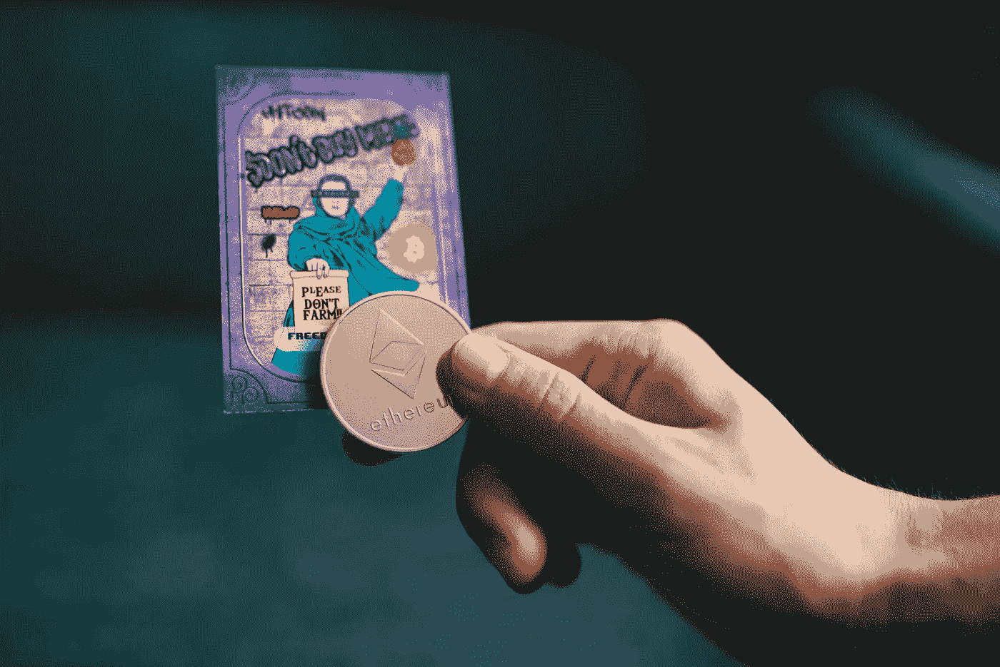
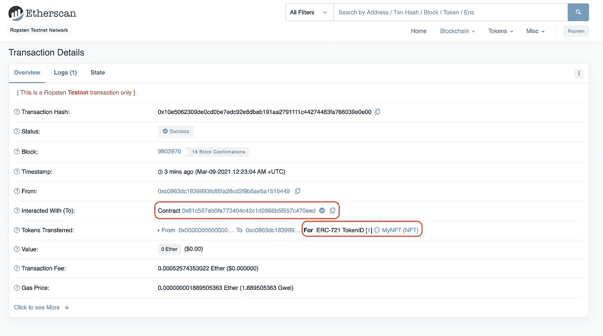

# 什么是 NFT？

> 原文：<https://levelup.gitconnected.com/what-is-an-nft-b8445c975005>

NFT 的作品售价不菲，但大多数人都不知道它们是什么。

[老钱](https://unsplash.com/@moneyphotos?utm_source=unsplash&utm_medium=referral&utm_content=creditCopyText)在 [Unsplash](https://unsplash.com/s/photos/nfts?utm_source=unsplash&utm_medium=referral&utm_content=creditCopyText) 上的照片

2021 年初，一位名为 Beeple 的艺术家以 6900 万美元的价格出售了一件数字艺术品。在这次拍卖之前，Beeple 并不是什么非常受欢迎和流行的艺术家；他在社交媒体上积累了超过 200 万的粉丝，但这并没有转化为巨额支出。据 The Verge 报道，在 2020 年末之前，人们卖出一张照片的最高价格是 100 美元。皮普尔的真名是迈克·温克尔曼，14 年来，他每天都在自己的电脑上创作一幅新的数字艺术作品，这个项目名为“Everydays”。他和妻子孩子住在一个“普通”的社区，从播客上听他说，艺术似乎一直是他的热情所在，但不是一个大的赚钱机器。然而，在他 6900 万美元的销售后，Beeple 现在是在世的最有价值的三位艺术家之一。

数字艺术总是很难赚钱，这并不奇怪，尤其是没有直接为企业签约的创造性数字艺术——比如标志设计。物理绘画可能非常有价值，因为它们是独特的和有限的。虽然他们需要一套类似的独特技能来创作，但数字艺术品是无限的，因为任何人都可以通过文件无休止地复制它。因此，一个大问题是，一个拥有相对大量在线追随者的艺术家是如何突然开始以惊人的价格出售数字艺术品的？简而言之，这是一种叫做 NFTs 的技术，即不可替代令牌。NFT 有点像真实性证书，证明个人实际上拥有数字商品的“原始”或“真实”版本。在这篇文章中，我将讨论什么是非功能性金融交易，它们是如何运作的，以及区块链是如何创造出这种有着大量资金流动的新经济的。

# 什么是 NFT？

## 可替代性

那么什么是不可替换的令牌呢？NFT 是一种完全独特的数字资产，使用区块链技术创建。单一比特币是我们所说的可替代物；我可以把一个比特币换成另一个比特币、美元、以太坊或者任何其他可替代的资产。尽管两张美钞在物理上不同，但它们的价值是一样的。因为 NFT 是不可替代的，所以没有一样东西是完全相同的，比如一幅画或者一个家。我不能简单地用蒙娜丽莎换另一幅名画；相反，为了便于两幅画的交换，双方通常会商定可互换资产的价值，如美元。

交换绘画等实物不可替代的物品通常很简单，然而，对于数字资产来说，这就变得相当困难了。跟踪数字资产的真正所有者几乎是不可能的，因为很可能不止一个人最终会拥有同一文件的副本。然而，使用区块链铸造一个独特的令牌来跟踪数字资产的原始和后续所有者可以帮助解决这个问题。虽然文件的副本仍然可以随意下载，但“真正的”所有者可以被跟踪和验证。这使得皮普尔开始以高价出售他的作品；突然，有人可以真正“拥有”一个原始的蜜蜂，甚至在将来以更高的价格转售。

## 进入区块链

区块链是所有加密货币用来发挥作用的技术。它对金融很有用，因为它创建了一个未来不能改变的交易时间表。区块链是我们所说的不变的；一旦一个事务被添加到一个块中，并且该块被添加到链中，它就永远留在那里。因此，用非常简单的话来说，区块链的功能就像一种数据库，形成了一个永久的交易时间表。

然而，NFT 不仅仅是另一种像比特币或以太坊一样的数字货币。NFT 是一种特殊的令牌，在区块链上创建，像任何其他交易一样存储在一个块中，带有一些硬币不会有的额外的关键信息。这些额外的信息，如谁创建了它，它的原始价值，以及更多作为一种手段来验证一个数字资产。

并非所有的加密货币都支持创建 NFT。几乎所有的 NFT 都是在以太坊区块链铸造的，因为以太坊支持 ERC-721 代币的制造，这是完全独一无二的。我们买卖的以太币是使用 ERC-20 令牌创建的，这是以太币区块链上可替换资产使用的技术标准。这就是为什么我们没有看到 NFT 市场像比特币一样从其他区块链涌现出来，只支持创造他们用作数字货币的硬币。比特币正在努力实现未来将存在的 NFTs 版本，但它目前不支持不可替代的资产。

这意味着，如果我在以太坊区块链上铸造了一个 NFT，我实际上可以在我的钱包中看到它，支持 NFTs，如 Metamask。这里有一个 2021 年 3 月铸造的 NFT 的例子:

来源:Ethereum.org

在这里，我们可以看到 NFT，包括智能合同地址、ERC-721 令牌 ID、其价值以及在以太坊区块链铸造令牌的成本。

## **迷茫？**

我已经加入了很多读者可能不熟悉的技术术语，比如智能合约和 ERC-721 令牌，这完全没问题！到目前为止，主要的收获是以太坊支持创建一个特殊的令牌，代表完全独特的东西——不可替代的。因为区块链技术可以用来永久存储信息，所以我们可以使用这些不可替代的令牌来表示现实或数字世界中的独特事物。由于这些代币可以追踪所有权和价值，它们特别适合作为永久的真实性证书，允许买卖这些独特的资产。

# NFT 的用途是什么？

所以我们已经讨论了什么是 NFT，我们知道艺术家如何使用它们作为销售数字艺术品的手段。然而，数字艺术只是这项技术的一种应用方式。虽然数字艺术家使用 NFT 来销售他们的作品真的很酷，但许多人认为当前的市场是超级富人的游乐场。最重要的是，即使有人拥有与毕普的作品相关的 NFT，也没有什么能阻止其他人在网上随意下载它们。并不是所有高价出售的艺术品都是“杰作”；有很多简单的像素艺术作品的售价远远高于许多人认为的价值。

在现代社会中，NFT 还有很多其他的用处，我将在下面讨论。有可能在未来有很多其他的方法可以和其他还没有被开发的技术结合起来使用。

## 真实世界所有权

尽管目前 NFT 市场的绝大部分都聚焦于数字资产，但我相信，这项技术在现实世界的资产中还有更多实际用途，今天可能会有用。像汽车和房屋契约这样的物品可以被铸造成 NFT，这样在出售时可以安全有效地转移所有权。

我以前的一个房东在商业地产领域工作，在那里，房产的原始契约非常有价值，通常会被律师和公证人确认为合法的原始契约。

有一次，他很难找到一份财产契约的原始文件，而在出售财产之前，要对其副本进行适当的核实将是一项昂贵而耗时的考验。他不得不驱车数小时到另一个办公室亲自寻找，幸运的是找到了原始文件。如果这份契约是 NFT 的作品，就不会有人争相寻找一张纸。相反，他可以打开公司的 NFT 钱包，在几秒钟内找到该房产的全部历史记录。

NFT 还能够提供该物品过去的销售价格以及转手次数的历史记录。这种信息对想买二手车的人来说很有用，甚至可以通过建立可靠的通用所有权记录来减少汽车盗窃。

## 元宇宙和电子游戏

2021 年的新流行语之一是“元宇宙”。元宇宙是互联网的一种假设演变，其中三维虚拟空间将成为人们有朝一日通过虚拟和增强现实的力量工作、娱乐和社交的地方。我喜欢认为最终目标是类似于《玩家一号》中描绘的东西，在那里，超现实的虚拟现实已经成为人们生活和工作的默认场所。你可以做任何你想做的事情，戴上耳机和其他刺激你神经系统的特殊装置，让你的身体相信你正在夏威夷冲浪，而你实际上是站在你的客厅里。但是那种元宇宙仍然是一个遥远的梦想。

脸书(Meta)和微软最近都在讨论元宇宙的更近版本。微软设想有一天，高管们将戴上花哨的耳机，围坐在互联网上的会议桌旁，而不是在董事会会议室见面，但对相关人员来说，这看起来是真实的。Meta 已经讨论了类似的数字工作空间，但也深入研究了这种虚拟现实的娱乐方面。

NFT 作为一种建立存在于这些数字世界中的数字资产所有权的手段，与整个元宇宙概念一起发挥作用。如果你想买一些土地，可以铸造一个 NFT 来证明你的所有权；当需要卖掉那块土地并搬家时，你可以卖掉作为你土地契约的 NFT。由于元宇宙应该存在于互联网上，而不是像视频游戏领域那样隶属于一家公司，因此 NFTs 可以提供一种确定商品所有权的可靠方法。虽然这是一个相当假设的 NFT 用例，但我认为这是一个有趣的例子，说明随着我们的数字生活不断扩展，它们是如何有用的。

## 音乐许可

音乐版权是一个传统上很难处理的领域。低效的音乐版权转让和重叠的版税索赔一直是音乐人试图将其作品货币化的大问题。NFTs 提供了一种可靠的方式来促进音乐版权的交换，并建立一个所有权的公共记录，有助于解决重叠的版税索赔。

艺术家也有可能让粉丝投资他们音乐的版权，这是目前保留给音乐唱片公司和出版商的事情。NFT 也可以被构造成在被买卖的任何时候向创作者支付版税。因此，如果一名歌手以 NFT 的身份出售一张专辑的版权，他们就可以在任何时候将 NFT 卖给新的团体时赚钱。总的来说，NFTs 为音乐人提供了新的潜在的赚钱途径，并有助于解决当今行业中存在的一些法律难题。

# 包扎

NFT 是 2021 年加密货币热潮中更有趣的发展之一。看到精通 photoshop 的孩子从一年前零收入的艺术品中赚到数千美元，是一件令人兴奋的事情。甚至一条杰克·多西亲笔签名的推文不知何故也卖到了近 300 万美元！尽管似乎有源源不断的报道说 NFT 的繁荣即将结束，但它似乎并没有结束。

然而，让我对 NFTs 感到兴奋的并不是古怪的数字艺术市场。我很高兴看到它们既能改善我们当前生活中存在的低效系统，又能在未来开发的一些更模糊的数字世界中发挥重要作用。随着越来越多的人开始谈论元宇宙，似乎许多大型科技公司都在接受未来存在的某种数字现实的想法，加密货币和 NFT 经常参与这些计划。

# 资源

*   [以太坊基金会 NFT 信息](https://ethereum.org/en/nft/)
*   [毕普的个人网站](https://www.beeple-crap.com/)
*   [公海——NFT 最大的市场](https://opensea.io/)

**注意:**如果你喜欢在 Medium 上阅读我和其他人的内容，可以考虑订阅支持这样的内容创作，并解锁无限的故事！

 [## 用我的推荐链接加入媒体-威尔·诺里斯

### 作为一个媒体会员，你的会员费的一部分会给你阅读的作家，你可以完全接触到每一个故事…

medium.com](https://medium.com/@willmnorris/membership)