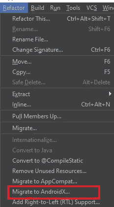

# AndroidX 是什么？

> 原文：<https://levelup.gitconnected.com/what-is-androidx-81bd4484c1d2>

## Google 组织支持库的新方法

## Android 支持库的新时代

> 天赋和运气可能会碰巧发生在你身上，但学习是一种技能和实践，任何人都可以通过勤奋来完成。

AndroidX 是 Google 推出的一种组织支持库的新方法。基本上，`AndroidX.`是和 [Android Jetpack](https://developer.android.com/jetpack) 一起引入的，因为 Jetpack 包含了`androidx.*`包库。

就像你在 Android Studio 上构建的每一个 Android 项目一样，你一定在你的以`com.android.support` *开始的`build.gradle`文件中看到过这些支持库。*

*   `com.android.support:appcompat-v7`
*   `com.android.support:recyclerview-v7`

但是 AndroidX 出现之后，这些库都有了类似`androidx.` 的首发包，而不是`com.android.support` *。*

*   `androidx.appcompat:appcompat`
*   `androidx.recyclerview:recyclerview`

他们看起来不简单吗？

你可以在这里找到所有支持库[的完整映射。](https://developer.android.com/jetpack/androidx/migrate/artifact-mappings)

看完以上，你大概产生了这些疑问。

*   如果您将现有的项目转换成 AndroidX 以便兼容，会怎么样？
*   如何将现有项目转换成 AndroidX？

**Q1** :如果你把你现有的项目转换成 Android，那会和早期版本的 Android 兼容吗？

**回答**:是的。所有的支持库都是为了向后兼容而构建的，所以 AndroidX 是一种表示支持库的现代方式。如果我没看错的话，AndroidX 只是一个直观的命名约定。你可以说 AndroidX 是 Android 支持库的延续。

Q2: 我如何将一个现有的项目转换成 AndroidX？

**回答**:首先，你需要把你的 Android Studio 更新到最新版本——在我写这篇文章的时候，是 Studio 3.5 版本。

必须有 Android Studio 3.2+以上版本。

在 Android Studio 的最新版本中——我说的是 3。+版本——移植到 AndroidX 非常容易。

你需要做的只是打开你的 Android 工作室。

1.  转到*重构>迁移到 AndroidX*

Android Studio 菜单示例

2.选择此选项后，Android Studio 会询问您是否想在一个. *zip* 文件中保存项目的备份副本——这只是为了让您的生活更轻松。万一有什么问题，你可以拿回你的项目。

根据 [*文档*](https://developer.android.com/jetpack/androidx/migrate) *、*这两个标志在你的`gradle.properties` *中重构后自动设置为真。*

`* android.useAndroidX=true`:这将确保 Android 插件使用合适的 AndroidX 库，而不是支持库。

`* android.enableJetifier=true`:这将自动转换第三方库到 AndroidX。

谢谢你的时间。我希望你有新的消息。😉

觉得这篇文章有用？跟着我，穆斯塔法·安萨里。看看下面我读得最多的文章。

*   [想成为安卓开发者？遵循这个路线图！！](https://medium.com/better-programming/android-free-courses-3b550ce388e6)
*   [如何使用 TextView 在 android 中实现复制/粘贴功能？](https://medium.com/better-programming/android-copy-paste-7dd60ad47d0)
*   [如何使 RecyclerView 项目可扩展？](https://medium.com/better-programming/recyclerview-expanded-1c1be424282c)
*   [想要制作更多选项的动画浮动动作按钮？](https://medium.com/better-programming/animated-fab-button-with-more-options-2dcf7118fff6)
*   用漂亮的动画制作 RecyclerView！