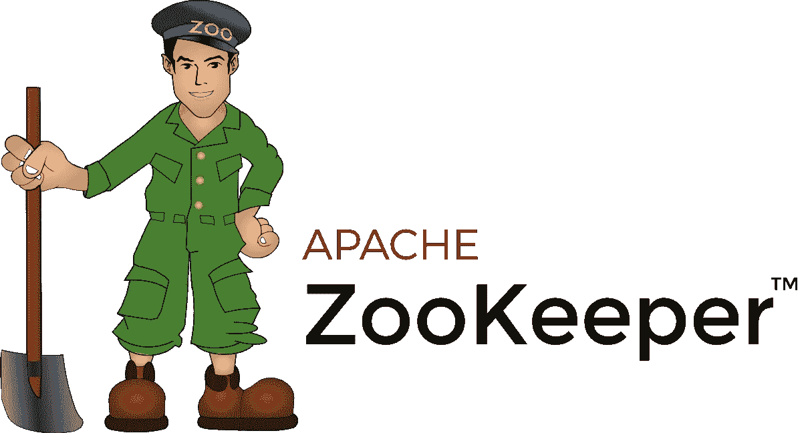
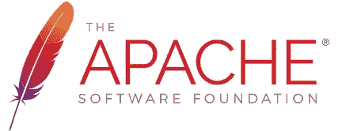
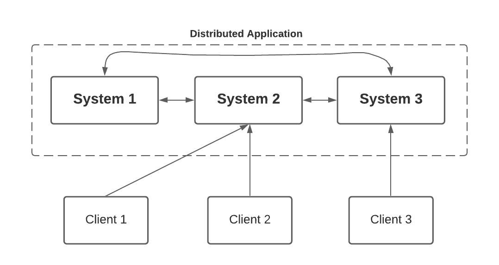
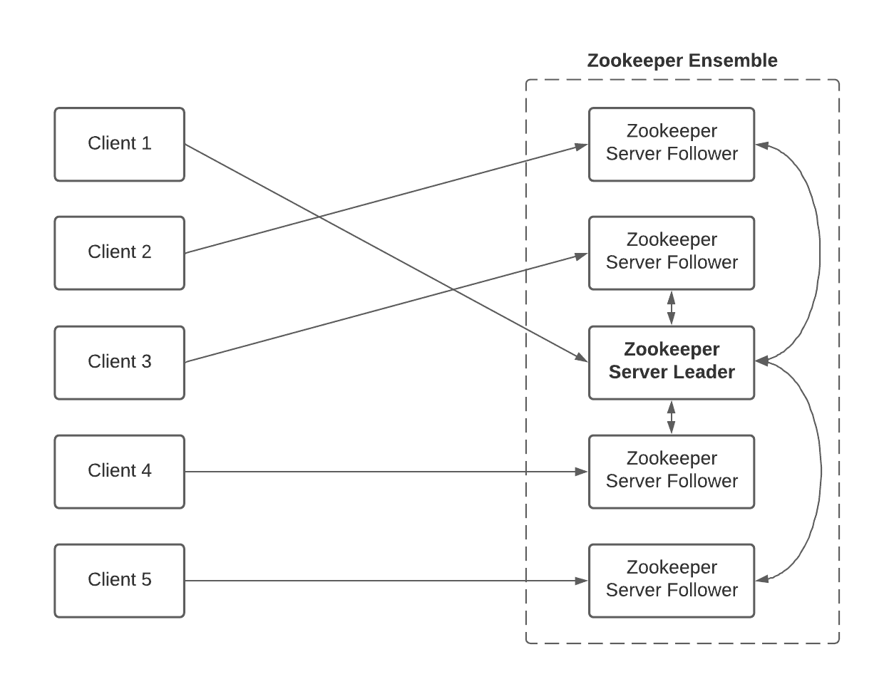
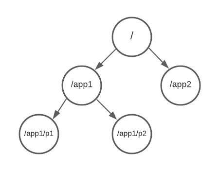

# 什么是阿帕奇动物园管理员？

> 原文：<https://levelup.gitconnected.com/what-is-apache-zookeeper-540cdff6d45f>

## Apache Zookeeper 简介，其背后的关键概念和用例

> Apache ZooKeeper 致力于开发和维护一个开放源码服务器，它支持高度可靠的分布式协作。

很久以后，我将在我的博客中加入我的一段经历，在这段经历中，我开始从事一些分布式计算的工作。这是我第一次使用分布式系统，并用 Apache Zookeeper 完成上个月做的一些有趣的任务。所以我想在 Zookeeper 上做一些挖掘，并认为这将对我和开始使用 Apache Zookeeper 的人有益，以某种记录的方式做出这些发现。

# 介绍

首先，我们简单看一下什么是动物园管理员。ZooKeeper 是一个为分布式环境中的大量主机提供协调和管理的服务。ZooKeeper 通过其简单的架构和 API 来完成这项任务。为了正确理解 Apache Zookeeper 的角色，最好对分布式应用程序有一些了解。

## 什么是分布式应用？

分布式应用程序是一种可以在网络中的多个系统上运行的应用程序，它通过在这些系统之间进行协调，以快速有效的方式完成一项任务。运行分布式应用程序的一组系统称为**集群**，集群中运行的每台机器称为**节点**。

一个分布式应用有两个部分，**服务器**和**客户端**。服务器应用程序有一个公共接口，这样客户端可以连接到集群中的任何服务器，并获得相同的结果。客户端应用程序是与分布式应用程序交互的工具。

分布式系统是**可靠的**，**可扩展的**并且隐藏了系统的复杂性，作为一个单一的实体(**透明性)**。分布式应用也有一些挑战。需要处理**竞争情况**两台或多台机器试图执行一项特定任务，而实际上在任何给定时间都只需要一台机器来完成。**死锁**是在两个或多个操作无限期等待对方完成的情况下也是可能的。**不一致**是应该处理数据的局部失效的地方。

## 动物园管理员的角色

在这种情况下，Apache ZooKeeper 是集群使用的一种服务，用于在集群之间进行协调，并使用健壮的同步技术维护共享数据。

# 体系结构

接下来，我们来讨论一下 Zookeeper 的**客户端-服务器架构**。

**客户机**是分布式应用集群中的节点，它从服务器访问信息。

每个客户端在特定的时间间隔向服务器发送一条消息，以告知客户端处于活动状态，当客户端连接时，服务器会发送一条确认消息。如果连接的服务器没有响应，客户端会自动将消息重定向到另一个服务器。

一个**群**是一组动物园管理员服务器。它需要至少 3 个节点来形成集合。**服务器**是集群中的一个节点，为客户端提供服务。

**领导者**在服务启动时被选出，如果任何连接的节点失败，它将执行自动恢复。**追随者**听从领导者的指示。

## 动物园管理员数据模型

Zookeeper 使用分层名称空间来表示其文件系统的内存。ZooKeeper 节点简称 **znode** 。每个 znode 都由一个名称标识，并用“/”分隔。名称空间看起来类似于 Unix 文件系统。ZooKeeper 数据模型中的每个 znode 都维护一个 **stat** 结构。

## 锌电极的类型

**持续 znode —** 即使在创建该特定 znode 的客户端断开连接后仍保持活动状态。默认情况下，除非指定，否则所有 znodes 都是持久的。

**短暂 znode —** 活动，直到客户端存活。如果客户端与系综断开连接，则该系综会自动删除。由于这个原因，这些 znodes 不允许有孩子。一旦 znode 被删除，那么下一个合适的节点将填充它的位置。短暂的节点在领导人选举中很重要。

**顺序 znode —** 可以是持久的，也可以是短暂的。当创建一个新的 znode 时，ZooKeeper 通过在原始名称上附加一个 10 位数的序列号来设置路径。如果同时创建了两个连续的 znode，那么 ZooKeeper 不会为每个 znode 使用相同的编号。顺序节点在**锁定和同步**中很重要。

## 会议

一旦客户端连接到服务器，ZooKeeper 就会创建一个 ZooKeeper 会话，并为客户端分配一个**会话 id** 。客户端以特定的时间间隔发送 PING 请求，以保持会话活动。如果 ZooKeeper 服务在超过服务启动时指定的会话超时时间内没有接收到来自客户端的 PINGs，则会话将结束。那么在该会话期间创建的短暂节点也会被删除。

## 手表

手表是一种简单的机制，可以通知客户整体的变化。客户可以在读取 znode 时设置手表。Znode 变更是指与 znode 相关的数据修改或 znode 子节点的变更。手表只触发一次。如果客户端再次需要通知，应该通过另一个读取操作来完成。当会话过期时，客户端将断开连接，相关的观察器将被删除。

# 动物园管理员—工作流程

一旦动物园管理员合奏开始，它将等待客户端连接。客户端将连接到 ZooKeeper 集合中的一个节点。它可能是一个领导者或追随者节点。一旦客户端被连接，该节点向特定客户端分配会话 ID，并向客户端发送确认。如果客户端没有得到确认，它会尝试连接 ZooKeeper 集合中的另一个节点。一旦连接到节点，它就可以根据需要执行读取、写入或存储数据等功能。客户端将定期 PING 该节点，以确保连接不会丢失。

# 用例

ZooKeeper 提供的常见服务如下:

*   **命名服务**—通过名称识别集群中的节点。
*   **配置管理**—加入节点的系统最新配置信息。
*   **集群管理**—实时加入/离开集群中的节点和节点状态。
*   **领导者选举**—为协调目的选举一个节点作为领导者。
*   **锁定和同步服务**—在修改数据时锁定数据。这用于连接其他分布式应用程序时的自动故障恢复。
*   **高度可靠的数据注册**—即使一个或几个节点出现故障，数据仍然可用。

我希望您对 Apache Zookeeper 及其在分布式应用程序、架构和用例中的作用有所了解。感谢您的阅读！

## 参考

1.  [阿帕奇动物园管理员文档](https://zookeeper.apache.org/)
2.  动物园管理员教程— [教程要点](https://www.tutorialspoint.com/zookeeper/index.htm)