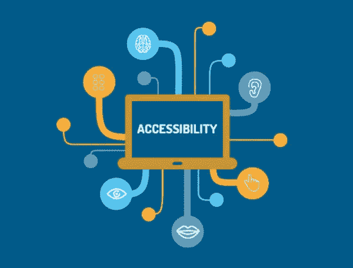

# 什么是咏叹调，为什么它很重要？

> 原文：<https://levelup.gitconnected.com/what-is-aria-and-why-does-it-matter-d9927413af11>

## 精心实现 web 内容比以往任何时候都更加重要



## 艾瑞亚是什么？

ARIA 是“可访问的富互联网应用程序”的别名。ARIA 是一项始于 2006 年的倡议，它是一组我们可以添加到 HTML 中的属性，允许我们让使用 T2 辅助技术的残疾用户更容易访问网页内容。ARIA 允许屏幕阅读器更明确地向用户描述网页的意图。ARIA 属性允许我们描述页面上每个元素的状态、属性和功能。这使得有视觉障碍的用户可以更好地理解页面结构，哪些元素是交互控件，键盘如何与页面交互，动态元素如模态和下拉菜单等等。

所有浏览器都支持某种形式的 ARIA。向用户传达 ARIA 属性最常见的方式是通过浏览器中内置的[API 进行文本到语音转换，或者通过其他屏幕阅读软件。](https://www.levelaccess.com/how-browsers-interact-with-screen-readers-and-where-aria-fits-in-the-mix/#:~:text=All%20browsers%20that%20support%20accessibility,the%20Mac%20and%20iOS%20platforms.&text=This%20is%20like%20a%20hand,browser%20and%20the%20screen%20reader.)

[ARIA 属性](http://web-accessibility.carnegiemuseums.org/foundations/aria/)可以是 [**角色**](https://developer.mozilla.org/en-US/docs/Web/Accessibility/ARIA/Roles) 或 [**状态和属性**](https://www.w3.org/TR/wai-aria-1.0/states_and_properties) :

一个地标[搜索](https://developer.mozilla.org/en-US/docs/Web/Accessibility/ARIA/Roles/Search_role)角色的例子:

```
<form id="search" role="search">
  <label for="search-input">Search this site</label>
  <input type="search" id="search-input" name="search" spellcheck="false">
  <input value="Submit" type="submit">
</form>
```

search 角色为我们的用户提供了关于该部分的语义信息，否则屏幕阅读器无法获得这些信息。

aria 标签是 ARIA 状态和属性之一 **:**

```
<button aria-label=”close”>X<button>
```

这个标签告诉用户，有些模糊的按钮“X”实际上将执行关闭动作。

ARIA 属性的另一个例子是[现场区域](https://developer.mozilla.org/en-US/docs/Web/Accessibility/ARIA/ARIA_Live_Regions):

```
<div aria-live="polite">
  <span>DOGECOIN: $1.00</span>
</div>
```

每当指定的元素改变时，一个活动区域将向用户通知更新。“礼貌的”标记告诉屏幕阅读器等待通知用户，直到他们不再导航或访问其他 ARIA 部分。

了解 ARIA 属性不会修改 DOM 上 HTML 元素的外观或行为是很重要的。

## 为什么重要？

为有辅助需求的人提供一个功能正常的网站，就像实体企业为残疾人提供无障碍环境一样重要。除此之外，患有各种残疾的人也依靠 ARIA 来帮助浏览网页。据 T2 估计，美国有 3.3%的人口(超过 800 万人)有视力障碍。随着今天的网页越来越像成熟的交互式应用程序，而不仅仅是静态标记，对附加辅助信息的需求比以往任何时候都大。

单单 HTML，即使有 HTML 5 带给我们的所有语义改进，也往往不足以满足使用屏幕阅读器的人们的需求。如今，我们比以往任何时候都更依赖 JavaScript 来控制我们的用户体验，从日期选择器日历这样的交互式小部件，到显示和隐藏元素，以及显示实时更新的元素。如果没有实现良好的 ARIA 的帮助，我们页面的意图可能会让一些人迷惑。

说到实现良好的咏叹调…

## 没有咏叹调比糟糕的咏叹调更好

以上是引自 [W3 关于 WAI-ARIA 创作实践的文档](https://www.w3.org/TR/wai-aria-practices/#no_aria_better_bad_aria)。糟糕的 ARIA 实现可能会误导和迷惑用户，使他们在网站上采取错误的操作。如果你点击了一个写着“添加到购物车”的按钮，却没有任何反应，你会感到多么困惑，使用辅助技术的人希望给定的 ARIA 属性能够正确工作。当我们给一个元素一个 ARIA 属性时，我们是在向用户承诺。即使是善意的咏叹调也会误导；因为某些属性实际上可以掩盖或覆盖原始语义。让我们来看一个来自 [W3 文档](https://www.w3.org/TR/wai-aria-practices/#no_aria_better_bad_aria)的例子:

```
<a role=”menuitem”>Assistive tech users perceive this element as an item in a menu, not a link.</a> <a aria-label=”Assistive tech users can only perceive the contents of this aria-label, not the link text”>Link Text</a>
```

## 不要多余

没有必要在每个给定的机会都使用 ARIA。在很多情况下，HTML 实际上可以完成工作，添加 ARIA 属性只是多余的。例如，如果我们使用语义 HTML 5

元素，我们就不需要添加 ARIA role="navigation "。

*如果你可以使用原生 HTML 5 语义元素来传达你的意思，你应该首先这样做，而不是添加 ARIA 属性！！*

## 用屏幕阅读器测试你的网站

用屏幕阅读器设置你的浏览器来测试你自己的站点是非常容易的！大多数移动设备都有内置的屏幕阅读器。如果你使用的是苹果设备，点击阅读更多[。安卓阅读更多](https://support.apple.com/guide/iphone/turn-on-and-practice-voiceover-iph3e2e415f/ios)[点击](https://support.google.com/accounts/answer/7177379?co=GENIE.Platform%3DAndroid&hl=en)。Firefox 和 Safari 可以使用苹果的[画外音](https://webaim.org/articles/voiceover/)。对火狐浏览器的支持可以在这里找到。

为自己使用软件是一个很好的方式，不仅可以了解你的语义和属性如何影响用户，还可以了解你的网站整体 UX 如何影响交互。

## 使用屏幕阅读器浏览网站:

观看 UCSF IT Web 服务部门的 Mark Sutton(他从小就使用辅助技术)使用屏幕阅读器浏览网站的视频:

该视频还演示了辅助技术如何允许只使用键盘来导航网站，这很有帮助，因为一些身体残疾的人可能无法操作鼠标。

观看确实有助于巩固*为什么*深思熟虑地实现网站的可访问性是如此重要。

以下链接指向所有使用的信息资源:

[](https://www.w3.org/TR/wai-aria/#intro_ria_accessibility) [## 可访问的富互联网应用程序(WAI-ARIA) 1.1

### web 内容的可访问性需要关于小部件、结构和行为的语义信息，以便允许…

www.w3.org](https://www.w3.org/TR/wai-aria/#intro_ria_accessibility)  [## WAI-ARIA 创作实践 1.1

### 本文档为读者提供了如何使用 WAI-ARIA 1.1 [WAI-ARIA]创建可访问的丰富…

www.w3.org](https://www.w3.org/TR/wai-aria-practices/#intro) [](https://css-tricks.com/why-how-and-when-to-use-semantic-html-and-aria/) [## 为什么、如何以及何时使用语义 HTML 和 ARIA | CSS-Tricks

### 语义 HTML 和可访问的富互联网应用程序(ARIA)有助于创建适用于所有人的界面…

css-tricks.com](https://css-tricks.com/why-how-and-when-to-use-semantic-html-and-aria/) [](https://webaim.org/techniques/aria/) [## ARIA 可访问的富互联网应用简介

### WAI-ARIA(Accessible Rich Internet Applications，简称 ARIA)是一个 W3C 规范，用于以多种方式增强可访问性…

webaim.org](https://webaim.org/techniques/aria/) [](https://developers.google.com/web/fundamentals/accessibility/semantics-aria) [## ARIA 简介|网络基础| Google 开发者

### " type": "thumb-down "，" id ":" missingtheinformationneed "，" label ":"缺少我需要的信息" }，{ "type"…

developers.google.com](https://developers.google.com/web/fundamentals/accessibility/semantics-aria) [](https://www.oreilly.com/library/view/javascript-cookbook/9781449390211/ch14.html) [## JavaScript 食谱

### 第十四章。使用 JavaScript、CSS 和 ARIA 14.0 创建交互式和可访问的效果。介绍使用…

www.oreilly.com](https://www.oreilly.com/library/view/javascript-cookbook/9781449390211/ch14.html) [](https://torquemag.io/2021/01/aria-5-best-practices-for-screen-readers-and-other-assistive-devices/) [## ARIA:屏幕阅读器和其他辅助设备的 5 个最佳实践

### 这是我撰写的关于无障碍网络体验系列文章的第三篇。在第一篇文章“ADA 和通用…

扭矩传感器. io](https://torquemag.io/2021/01/aria-5-best-practices-for-screen-readers-and-other-assistive-devices/) [](https://interactiveaccessibility.com/accessibility-statistics) [## 无障碍统计

### 根据人口普查局 2012 年 7 月 25 日发布的新数据，5670 万美国人(占美国总人口的 18.7%)

interactiveaccessibility.com](https://interactiveaccessibility.com/accessibility-statistics)  [## ARIA |可访问性指南

### ARIA(辅助富互联网应用程序)是万维网联盟(W3C)的一个规范，它的创建是为了…

web-accessibility.carnegiemuseums.org](http://web-accessibility.carnegiemuseums.org/foundations/aria/)  [## WAI-ARIA 角色-可访问性| MDN

### 本页列出了涵盖 MDN 上讨论的所有 WAI-ARIA 角色的参考页面。有关角色的完整列表，请参见使用…

developer.mozilla.org](https://developer.mozilla.org/en-US/docs/Web/Accessibility/ARIA/Roles) [](https://www.levelaccess.com/how-not-to-misuse-aria-states-properties-and-roles/) [## 如何不滥用 ARIA 状态、属性和角色级访问

### 许多内容作者将 ARIA 属性放在内容上，试图满足可访问性标准，并使他们的…

www.levelaccess.com](https://www.levelaccess.com/how-not-to-misuse-aria-states-properties-and-roles/) 

一如既往，感谢阅读。欢迎在 LinkedIn 上与我联系！